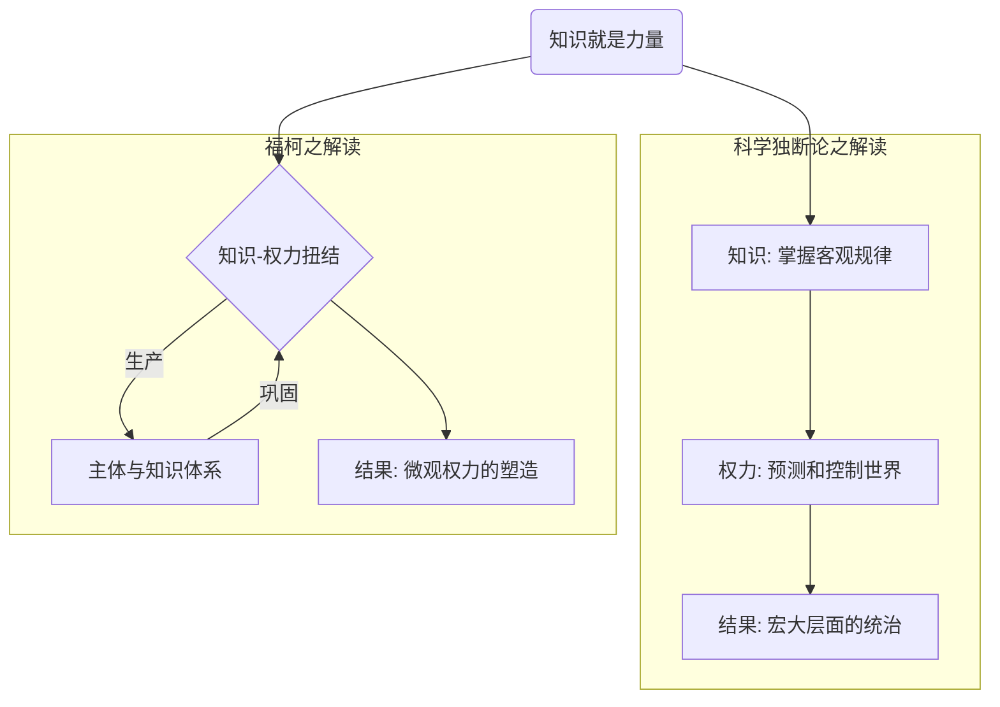
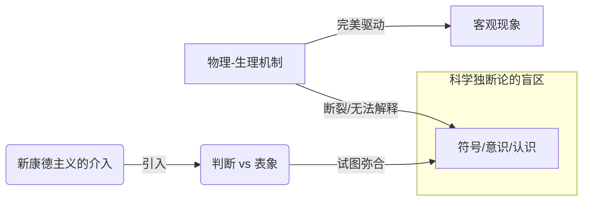
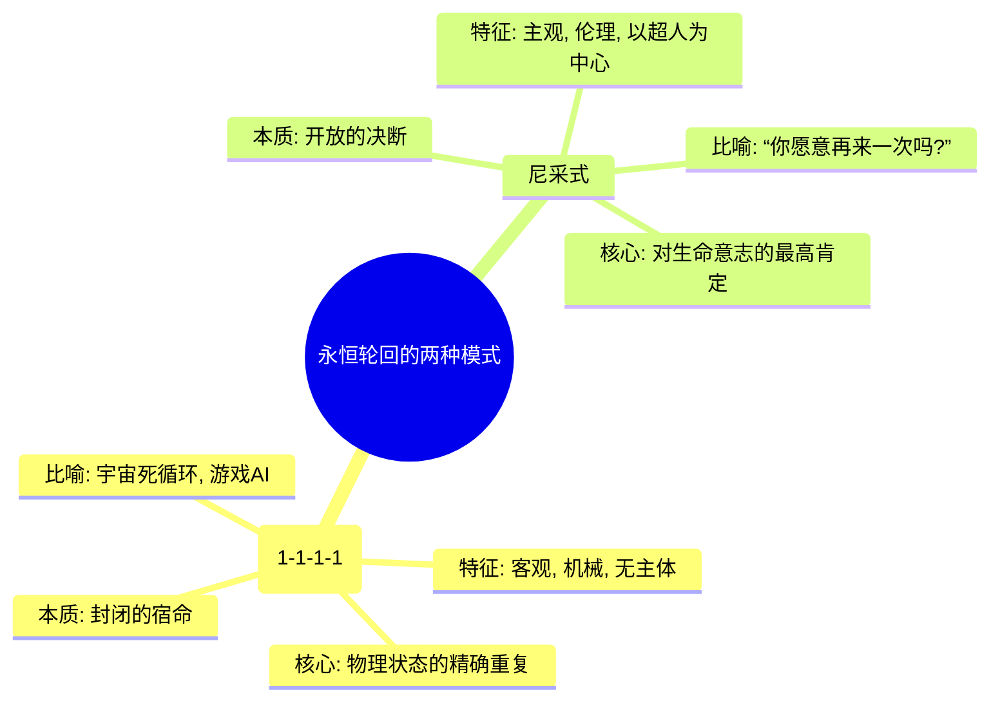

---
{"dg-publish":true,"permalink":"/1-1 科学实在论/1-1-1 物理主义/1-1-1-1 科学独断论/","created":"2025-09-19T20:52:29.273+08:00","updated":"2025-09-19T21:00:29.890+08:00"}
---

---
### **一、本章概览**
- **主义主义编码**: 1-1-1-1
- **意识形态命名**: [[科学独断论\|科学独断论]] / [[科学实在论\|科学实在论]]
- **核心论断**: 科学独断论是一种将整个宇宙视为由单一、永恒、无缝的科学秩序（如物理法则）完全决定的意识形态。它取消了真正的主体性与自由，将一切现象归结为该秩序的机械产物，其最终目的仅在于这一秩序的无尽重复。
- **你能获得**:
    - 掌握“主义主义”编码 **1-1-1-1** 的完整分析框架，理解其在[[存在论\|存在论]]、[[9 未命名/本体论\|本体论]]、[[9 未命名/现象学\|现象学]]和[[9 未命名/目的论\|目的论]]上的具体体现。
    - 辨析对“[[知识就是力量\|知识就是力量]]”的两种根本不同解读：[[培根\|培根]]式的天真版本与[[福柯\|福柯]]式的权力-知识扭结版本。
    - 洞察[[科学独断论\|科学独断论]]如何通过将[[自由\|自由]]降格为[[偶然性\|偶然性]]来维持其理论闭环，并理解其无法解释[[符号\|符号]]与[[意识\|意识]]出现的根本困境。
    - 识别这种意识形态在现实中（如技术官僚主义）的表现形式及其思想根源。

---
### **二、核心内容解析**

#### **“主义主义”四格分析**

1.  **场域之“1” (Ontology)**：该意识形态的世界观框架是一个绝对统一、封闭且自洽的系统。这个[[世界\|世界]]被预设为一个完美的、无缝的整体，由一套永恒不变的根本法则所统御。它不存在任何外部、例外或超越性的维度，一切都发生在这个单一的、预先规定好的舞台之上。讲稿中提到的“宇宙universe”就是一个“舞蹈重复的圣地”，它没有缝隙，没有渗漏，是一个完全自足的、循环的[[存在论\|存在论]]框架。

2.  **本体之“1” (Body)**：在这个统一的世界框架内，真实存在的东西（本体）也是单一和同质的。它就是那套支配一切的[[科学秩序\|科学秩序]]或[[物理法则\|物理法则]]本身，以及由这套法则决定的物质实在。不存在质的差异，万物本质上都是同一基本实在（如粒子、能量、场）的不同排列组合。这种本体论被称为[[Objectivity\|Objectivity]]（客观性），它排斥任何独立的[[主体性\|主体性]]或精神性实体，认为后者仅仅是底层物理实在的派生物或幻象。

3.  **现象之“1” (Phenomenon)**：主体的感知和经验（现象）被完全还原为底层物理规律的必然结果。现象世界是物理世界的完美、无延迟的“驱动”产物，就像显卡驱动生成电脑屏幕上的图像一样。个体的[[意识\|意识]]、情感和选择感，都不过是这个宏大机械运作中产生的一个效果。因此，不存在真正独立的、能够反思或建构世界的[[主体性\|主体性]]，所有[[现象\|现象]]都整齐划一地服从于唯一的秩序，任何看似的差异都可以在底层规律中找到解释。

4.  **目的之“1” (Purpose)**：该意识形态的[[9 未命名/目的论\|目的论]]是“无目的的目的”，即系统的终极目标就是其自身的永恒重复与维持。讲稿中描述为“重复性的统御”。这个世界存在的唯一意义，就是让那套科学秩序永远循环地、无脑地统一自身。它不像其他目的论那样导向某个终极的善或解脱，而是导向一种静态的、永恒的、无变化的“完美”状态，如同一个完美执行规则却毫无自觉的AI，其存在就是为了无休止地运行程序。

#### **其他核心知识点**

##### “知识就是力量”的两种解读
“[[知识就是力量\|知识就是力量]]”这句话存在两种根本对立的理解，构成了[[科学独断论\|科学独断论]]与[[福柯\|福柯]]思想的分野。科学独断论采纳的是一种天真、直接的解读：知识是对世界客观规律的掌握，谁掌握了这套规律，谁就能像操作机器一样去预测和控制世界，从而获得一种自上而下的权力。而[[福柯\|福柯]]的[[反培根主义\|反培根主义]]则认为，知识与[[权力\|权力]]并非主客体的关系，而是一种相互生产、相互纠缠的“知识-权力”扭结。[[权力\|权力]]通过[[微观权力\|微观权力]]技术（如规训、话语）生产出特定的知识体系和认知主体，而知识反过来又巩固和再生产了这种权力关系。前者是宏观的、外在的控制，后者是微观的、内在的塑造。

**举例阐释**：讲稿中提到，一个学者宣称自己有“小道消息”，并以此获得话语权，这是[[科学独断论\|科学独断论]]式理解的体现——认为掌握信息就等于拥有权力。而[[福柯\|福柯]]的分析则会关注，是怎样的社会、话语机制（如学术圈、媒体）使得这种“小道消息”得以被生产、传播并被承认为一种具有说服力的“知识”，从而塑造了听众和这位学者的主体位置。

##### 符号的断裂与“二字头大哥”
[[科学独断论\|科学独断论]]（1-1-1-1）最大的理论困境，在于它无法解释从物理/生理层面到符号/意识层面的飞跃。如果世界是无缝的物理系统，为何会凭空多出一个能够进行认知、言说、反思的“我”？这个“我”的出现，在物理法则和符号系统之间制造了一道无法弥合的“断裂”。讲稿指出，为了解决这个难题，思想系统不得不求助于“二字头大哥”（指代以“2”开头的意识形态编码），例如[[5 主义/新康德主义\|新康德主义]]。后者通过引入“判断”与“表象”的二元对立，为[[主体性\|主体性]]的介入提供了理论空间，但这恰恰破坏了1-1-1-1的纯粹性和统一性。

**举例阐释**：讲稿中提到的[[失语症\|失语症]]研究就是一个绝佳例子。病人的大脑（物理-生理机制）可能完好，但其运用语言（[[符号\|符号]]系统）的能力却出现了障碍。这表明，大脑的物理状态和符号功能之间并非简单的、一对一的驱动关系，存在着一个[[科学独断论\|科学独断论]]无法解释的复杂中介层面。

##### 两种“永恒轮回”：尼采 vs. 1-1-1-1
讲稿特意区分了[[科学独断论\|科学独断论]]的循环与[[尼采\|尼采]]的[[9 未命名/永恒轮回\|永恒轮回]]。前者的循环是客观的、无主体的、机械的重复。它像是一个宇宙级别的“死循环”，所有原子在未来某一刻会精确地回到现在的位置，世界只是在重复同一个剧本。而[[尼采\|尼采]]的[[9 未命名/永恒轮回\|永恒轮回]]则是一个主观的、伦理的、以超人（Übermensch）为中心的思想实验。它不是关于世界会不会重复，而是“你是否愿意将你当下的生命，连同其所有的痛苦与欢乐，无尽地重活一遍？”。前者是封闭的物理宿命，后者是开放的生命意志的最高肯定。

**举例阐释**：一个完美的AI在游戏中一遍遍地重复最优策略，这是1-1-1-1式的循环。而一个人在经历了一生之后，面对其所有选择、成功与失败、幸福与悔恨，发自内心地说“我愿如此，再来一次”，这是[[尼采\|尼采]]式的[[9 未命名/永恒轮回\|永恒轮回]]。

---
### **三、关键观点提取**
- “有误解的误解就是说把[[培根\|培根]]误解成科学论的培根的那一句[[知识就是力量\|知识就是力量]]，知识就是力量。”
- “[[福柯\|福柯]]才是真正的[[反培根主义\|反培根主义]]。就是说知识当然和[[权力\|权力]]是扭结的...它它是由[[微观权力\|微观权力]]体系，微观的权利扭结起来的扭结起来的。”
- “这个世界存在的目的没有其他目的，唯一的就是让这个[[科学秩序\|科学秩序]]...重复性的、无脑的，永远那边循环的去统一整个世界。”
- “你再怎么厉害，人类选手再怎么屌，他的他对他是完美的执行了那个秩序游戏规则，然后就你怎么也赢不了他那种。”
- “因为偶然性不可能，因为是科学独断的世界，一切都是在科学秩序物理法则的完全的绝对的统一之下，重复性的统一之下，它是没有缝隙的，没有渗漏的。”

---
### **四、知识点问答**
#### Q1: 为何说“[[科学独断论\|科学独断论]]”下的“自由”只能是“[[偶然性\|偶然性]]”的代名词？
A: 因为在“[[科学独断论\|科学独断论]]”的[[世界\|世界]]图景（1-1-1-1）中，一切都被一个统一、绝对的[[科学秩序\|科学秩序]]（如[[物理法则\|物理法则]]）所支配。这个体系是无缝的、完全决定的。因此，任何看似“自由”的选择或事件，如果不是规律的直接结果，就只能被解释为系统内无意义的、随机的“[[偶然性\|偶然性]]”，它本身没有独立的意志或目的，最终仍被更大的规律所回收。真正的[[自由\|自由]]，即超越规律的决断能力，在该体系中没有存在空间。
#### Q2: [[福柯\|福柯]]的“知识-权力”理论如何从根本上颠覆了1-1-1-1对知识的理解？
A: 1-1-1-1认为知识是中立的、客观的，是对一个先在的、独立于人的实在的发现。而[[福柯\|福柯]]则指出，不存在这种纯粹的知识。任何知识都产生于特定的[[权力\|权力]]关系网络中，并服务于这种关系。知识不是去“发现”真理，而是去“生产”真理，同时生产出认识真理的[[主体性\|主体性]]。这就彻底颠覆了1-1-1-1的基础，即存在一个可以被中立地认识的、单一的客观[[实在\|实在]]。
#### Q3: 讲稿为何暗示“刚脱盲的工业国”中的“初阶工程师”容易陷入1-1-1-1的意识形态？
A: 因为这个群体所受的教育和从事的工作高度强调规则、流程和可预测性。他们被训练为在一个既定体系内解决问题的“吸收消化”者，而非体系的批判者。1-1-1-1提供了一种“生存无忧”的[[世界\|世界]]观，它肯定了技术理性的至高无上，将复杂的世界简化为一套可控的、清晰的规则，这与他们的专业思维高度契合，能带来一种智识上的安全感和掌控感，从而回避了关于[[意义\|意义]]、[[价值\|价值]]和[[主体性\|主体性]]等更令人不安的问题。

---
### **五、知识延伸**
- **[[拉普拉斯的恶魔\|拉普拉斯的恶魔]]**: 这一思想实验是“[[科学独断论\|科学独断论]]”的完美理论化身。它构想了一个知晓全宇宙所有粒子位置和动量的超级智能，能够据此推算出宇宙的全部过去和未来，体现了1-1-1-1意识形态中决定论和可知性的极致。
- **电影《[[楚门的世界\|楚门的世界]]》**: 这部电影可以看作是1-1-1-1意识形态的艺术寓言。主角楚门生活在一个完全被设计和操控的“[[实在\|实在]]”中，他的世界是一个封闭、统一、且有明确目的（娱乐观众）的系统，这与科学独断论下个体生存状态被宏大秩序所规定的境况形成绝佳类比。
- **[[B.F.斯金纳\|B.F.斯金纳]]与[[行为主义心理学\|行为主义心理学]]**: 斯金纳的激进行为主义认为，人的行为完全由环境刺激和强化历史所决定，否认[[自由意志\|自由意志]]和内在精神状态的存在。这在心理学领域完美复刻了1-1-1-1将[[主体性\|主体性]]还原为外部规律机械产物的核心逻辑。
- **电影《[[黑客帝国\|黑客帝国]]》**: 电影中的“矩阵”（Matrix）是一个完美的1-1-1-1寓言。人类的意识被囚禁在一个由代码构成的、完全被设计和控制的虚拟[[实在\|实在]]中。这个系统是统一、封闭且旨在维持自身稳定的（服务于机器），人类的[[现象\|现象]]体验完全是被程序决定的，这与[[科学独断论\|科学独断论]]对[[世界\|世界]]和[[主体性\|主体性]]的描述高度同构。

---
### **六、双链关联总结**
- **一级关联 (核心意识形态与概念)**: [[科学独断论\|科学独断论]]、[[科学实在论\|科学实在论]]、[[主页\|主页]]、[[知识就是力量\|知识就是力量]]、[[9 未命名/永恒轮回\|永恒轮回]]、[[Objectivity\|Objectivity]]
- **推测相关人物 (Speculated Figures)**: 
	- **技术官僚**: 相信社会问题可以通过纯粹的技术和数据管理来解决，忽视人的复杂性和价值维度，将社会视为一个可优化的系统。
	- **强人工智能至上主义者**: 认为意识和智能可以完全被算法和计算所还原，并最终创造出超越人类的、遵循纯粹理性的超级智能，这反映了对物理/计算秩序的终极信仰。
	- **《三体》中的执剑人罗辑（早期）**: 在建立威慑纪元时，他试图用纯粹的、冷酷的博弈论逻辑来锁定两个文明的命运，这是一种将复杂文明关系简化为可计算的物理模型的1-1-1-1式思维。
- **二级关联 (上下文与背景)**: [[培根\|培根]]、[[福柯\|福柯]]、[[尼采\|尼采]]、[[5 主义/新康德主义\|新康德主义]]、[[物理学\|物理学]]、[[失语症\|失语症]]、[[行为主义心理学\|行为主义心理学]]、[[欧陆哲学\|欧陆哲学]]
- **三级关联 (推测与延展)**: [[权力\|权力]]、[[微观权力\|微观权力]]、[[主体性\|主体性]]、[[自由\|自由]]、[[偶然性\|偶然性]]、[[符号\|符号]]、[[9 未命名/目的论\|目的论]]、[[存在论\|存在论]]、[[意识\|意识]]、[[决定论\|决定论]]、[[实在\|实在]]、[[反培根主义\|反培根主义]]