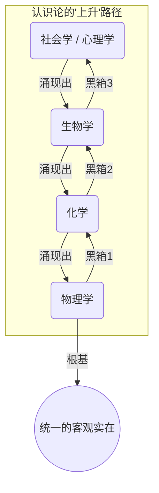
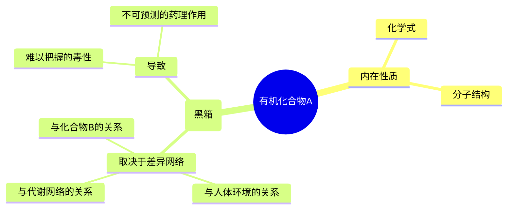
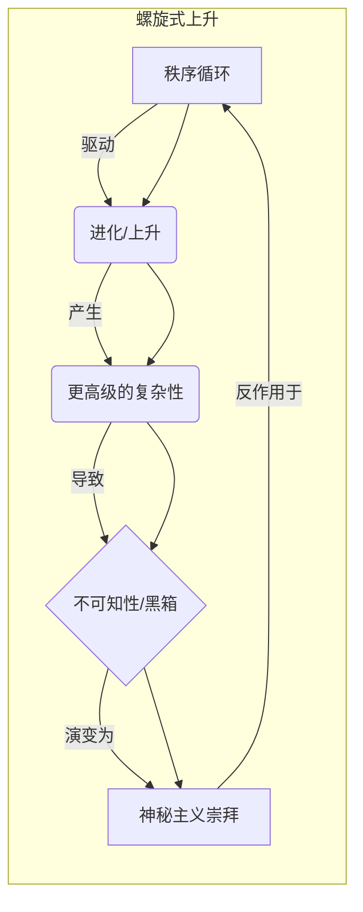

---
{"dg-publish":true,"permalink":"/1-1 科学实在论/1-1-1 物理主义/1-1-1-2 有机进化论/","created":"2025-09-19T20:52:29.291+08:00","updated":"2025-09-19T21:01:02.273+08:00"}
---

---
### **一、本章概览**
- **主义主义编码**: 1-1-1-2
- **意识形态命名**: [[有机进化论\|有机进化论]]
- **核心论断**: 这是一种在[[科学独断论\|科学独断论]]（1-1-1-1）的统一秩序基础上，引入了“进化”或“上升”维度的意识形态。它相信世界是一个由简单到复杂、由死寂到鲜活的持续演进过程，但由于缺乏反思性，这种无休止的“上升”最终会变成一种无法自控的[[螺旋式上升\|螺旋式上升]]，并导向一种对复杂性本身的[[神秘主义崇拜\|神秘主义崇拜]]。
- **你能获得**: 你将掌握 1-1-1-2 意识形态的内在结构，理解它如何从更基础的1-1-1-1形态演变而来，并学会辨识其核心特征，如[[科学的等级制\|科学的等级制]]、对[[还原论\|还原论]]的倒置，以及其最终滑向[[5 主义/神秘主义\|神秘主义]]与[[消费主义\|消费主义]]的内在逻辑。

---
### **二、核心内容解析**

#### **“主义主义”四格分析**

1.  **场域之“1” (Ontology)**：该意识形态的世界观框架是一个统一的、全息的[[宇宙\|宇宙]]。它不承认存在多个无法通约的世界，而是预设了一个单一的[[秩序场\|秩序场]]，即[[自然秩序\|自然秩序]]。这个场域是同质的，所有现象，从物理粒子到人类社会，都发生在这个唯一的舞台之上。这个“1”继承自[[1-1-1-1\|1-1-1-1]]，确保了世界的基本盘是统一且连续的，万物都服从于一个根本的[[宇宙真理\|宇宙真理]]，即使这个真理本身的内容被认为是“进化”的。它排除了任何外在于这个统一场的超验存在或根本性的断裂。

2.  **本体之“1” (Body)**：在这个统一的世界舞台上，构成世界的基本“材料”也是单一的，即[[客观实在\|客观实在]]。不存在物质与精神的二元对立，一切（包括意识、生命）都被视为物质在不同复杂程度上的组织形式。这个“1”代表了彻底的[[唯物论\|唯物论]]或[[5 主义/物理主义\|物理主义]]底色。虽然它承认从无机物到有机物，再到生命和意识的“高级”涌现，但这些高级形态的根基依然是同一种客观物质，只是其结构和关系变得愈发复杂。这种本体论上的同一性，是其相信“进化”是一条连续谱带的基础。

3.  **现象之“1” (Phenomenon)**：主体认识世界的方式是单一且连续的，即通过层级化的[[科学\|科学]]。这种意识形态构建了一个[[科学的等级制\|科学的等级制]]：物理学、化学、生物学、社会学……每一门科学都是对一个特定复杂性层面的认知。这个“1”意味着知识体系本身是统一的，不存在真正的[[认识论断裂\|认识论断裂]]，只有“尚未被更高级科学解释”的[[黑箱\|黑箱]]。主体的作用不是创造真理，而是发现并沿着这条预设的科学阶梯向上攀登，从理解简单现象逐步走向理解复杂现象。主体性被整合进了这个线性的、不断上升的知识发现进程中。

4.  **目的之“2” (Purpose)**：该意识形态的目的论是分裂和对抗的，体现为“2”。这个“2”是[[循环\|循环]]与[[上升运动\|上升运动]]之间的内在冲突。一方面，它继承了“1”的循环特质，认为宇宙的根本法则是永恒重复的，物质和能量在宏观上是守恒的、循环的。但另一方面，它又引入了一个线性的、不可逆的“上升”目标，即“进化”——追求越来越复杂、越来越高级、越来越“鲜活”的形态。这种“静止的循环”与“无限的上升”之间的矛盾，共同构成了一种[[螺旋式上升\|螺旋式上升]]的运动模式。它既要维持秩序的稳定，又要不断突破秩序，这种内在张力使其无法静止，也无法获得真正的终点。

#### **其他核心知识点**

##### 科学的等级制与还原论的倒置
[[有机进化论\|有机进化论]]的核心是构建一个从低级到高级的科学阶梯。它表面上反对粗暴的[[还原论\|还原论]]（即用物理学解释一切），但实际上只是将还原论倒置，变成一种[[发生学\|发生学]]。它认为，化学是从物理学中“涌现”的，生物学又从化学中“涌现”，每一层都具有下一层无法完全预测和解释的“ emergent properties”（[[涌现\|涌现]]性）。这就在学科之间制造了看似无法逾越的鸿沟或[[黑箱\|黑箱]]，并认为“更高级”的科学（如生物学）拥有对“更低级”科学（如物理学）的某种优越性。这种结构使得对“生命”、“意识”等复杂现象的不可知性被合理化，并为其[[5 主义/神秘主义\|神秘主义]]倾向埋下伏笔。

**举例阐释**：一个持有该意识形态的科学家会认为，你无法用纯粹的量子力学方程预测一只猫的行为。这中间隔着化学和生物学的巨大[[黑箱\|黑箱]]。他们不会将此视为当前知识的局限，而是将其视为世界本身“高级”与“低级”之间存在的本体论差异，并对“生命”这种无法被完全还原的复杂性抱有敬畏。

##### 差异原则与黑箱化的主体性
[[有机进化论\|有机进化论]]挪用了[[5 主义/结构主义\|结构主义]]的[[差异原则\|差异原则]]来解释复杂系统的行为。它认为，一个有机物（如药品）的性质，并非由其内在化学成分单独决定，而是由它在整个系统（如人体）中与其他所有元素（其他分子、细胞等）的差异性关系网络所决定的。由于这个关系网络极其复杂，导致其最终效果变得不可预测，形成了一个[[黑箱\|黑箱]]。主体无法通过分析其构成部分来完全理解它，只能通过“试错”和观察外部效应来把握。这种由差异关系导致的不可预测性，进一步强化了世界“鲜活”且“神秘”的印象。

**举例阐释**：讲稿中提到的，两种化学结构极其相似的药物，因为细微的“差异”，在人体内却可能产生截然相反的效果（一个治病，一个致命）。[[有机进化论\|有机进化论]]者会将这种现象解释为“生命系统”的奥秘，其性质由整体的、差异化的关系网决定，而非简单的线性因果。

##### 螺旋式上升与神秘主义崇拜
这是 1-1-1-2 意识形态的最终动态。[[循环\|循环]]（目的论中的“1”元素）提供了稳定的秩序基础，而[[上升运动\|上升运动]]（“2”元素）提供了不断超越的动力。二者结合，形成了一种“刹不住车”的[[螺旋式上升\|螺旋式上升]]。系统在重复自身法则的同时，每一轮都将自己推向更复杂、更“高级”的境地。由于这种上升没有终点、没有制动机制，它本身就成了膜拜的对象。人们不再关注秩序的合理性，转而崇拜“进化”、“复杂性”、“生命力”本身，这便是[[神秘主义崇拜\|神秘主义崇拜]]。对“天才”、“特异功能”、“技术奇点”的迷恋，都是这种崇拜在当代的体现。

**举例阐释**：讲稿中提到的90年代对[[钱学森\|钱学森]]等人研究“人体科学”和“特异功能”的热潮。这正是将科学探索的[[上升运动\|上升运动]]推向了极致，当它触及现有科学无法解释的领域时，没有进行哲学反思，而是直接将其转化为对某种“更高级生命形态”或“宇宙奥秘”的[[神秘主义崇拜\|神秘主义崇拜]]。

---
### **三、关键观点提取**
- “越是和它具有那种反对的，或者说是一种对立关系，它越能把它同化，越能把它吸收进来，它越是有机的 anic 有机性。”
- “这个世界本身是越来越鲜活的...他不喜欢搞[[reductionism\|reductionism]]，就是不喜欢下降...因为其实这帮人其实是某种意义上以这种方式来避免反思。”
- “一个符号的意义不由它本身来决定，而由它和其他符号之间的关系来决定了。这就是[[差异原则\|差异原则]]。”
- “这两个结合起来就会变成一种螺旋循环，[[螺旋式上升\|螺旋式上升]]。这个上升收不住的，他会因为这是就是刹不住车...他最后会变成一种[[神秘主义崇拜\|神秘主义崇拜]]。”
- “他们没办法反思的原因是因为他被他看，因为这种意识形态他是从[[1111\|1111]]那边，他是受不了了，受不了了，他就是会在目的论上稍微突破一点点，微调一点点。”

---
### **四、知识点问答**
#### Q: 为什么说[[有机进化论\|有机进化论]]（1-1-1-2）看似反对[[还原论\|还原论]]，但本质上只是“还原论的倒置”？
A: 因为它虽然承认高级现象（如生命）不能被低级科学（如物理）完全解释，形成[[黑箱\|黑箱]]，但这并非导向对不同领域自主性的真正尊重。相反，它构建了一个线性的、连续的[[发生学\|发生学]]阶梯（物理→化学→生物），将所有现象都置于同一个“进化”序列中。它只是把[[还原论\|还原论]]“向下还原”的逻辑，翻转为“向上发生”的逻辑。世界的统一性根基（[[5 主义/物理主义\|物理主义]]）从未被动摇，这使得它最终依然能随时进行“向下的解释”，即在需要时，将高级现象宣称为低级机制的概率性结果，从而实现一种“可上可下”的解释霸权。
#### Q: [[有机进化论\|有机进化论]]中的“2”（目的论分裂）是如何导致其最终走向[[神秘主义崇拜\|神秘主义崇拜]]的？
A: 目的论中的“2”代表了[[循环\|循环]]与[[上升运动\|上升运动]]的根本矛盾。[[循环\|循环]]要求系统稳定和可重复，而[[上升运动\|上升运动]]要求系统不断突破自身、走向复杂。这种内在张力使系统永远“刹不住车”，无法达到一个稳定的终点。当这种无尽的、无法控制的“上升”和“复杂化”过程本身成为系统的唯一目的时，人们对它的态度就从科学研究转变为一种非理性的敬畏和崇拜。对不可预测的“涌现”、无法解释的“生命力”和无法穷尽的“进化”的惊叹，最终固化为一种对过程本身的[[神秘主义崇拜\|神秘主义崇拜]]。
#### Q: 1-1-1-2 意识形态如何为“科研等级制”进行辩护？
A: 通过其[[科学的等级制\|科学的等级制]]模型。它将研究更“高级”、更“复杂”现象（如生命科学、脑科学）的科学家置于等级的顶端，因为他们处理的是离“神庙”最近、最神秘的领域。而研究物理、数学等基础科学的，则被视为在为这个宏伟的进化阶梯奠基。这种结构创造了一种内部的等级秩序：越是研究“黑箱”的，地位越高。它使得科学家群体内部产生分化，并为那些占据“前沿”和“交叉”学科的学者赋予一种特殊的“天才”光环，从而为资源分配、学术声望等方面的“科研等级制”提供了意识形态合法性。

---
### **五、知识延伸**
- **[[赫伯特·斯宾塞\|赫伯特·斯宾塞]] (Herbert Spencer)**: 讲稿直接点名的思想家，是[[有机进化论\|有机进化论]]的绝佳历史样本。他的社会达尔文主义和“从不连贯的同质性向连贯的异质性演进”的宇宙进化法则，完美地体现了1-1-1-2从简单统一到复杂统一的[[发生学\|发生学]]逻辑。
- **[[亨利·柏格森\|亨利·柏格森]]的《[[创造进化论\|创造进化论]]》**: 这部著作是1-1-1-2意识形态的哲学精致版。柏格森提出的[[élen vital\|élen vital]]（生命冲力）概念，即一种非机械的、创造性的、驱动生命不断向更复杂形态演化的内在动力，与[[有机进化论\|有机进化论]]中那个“鲜活的”、“上升的”力量高度同构，可作为理解其哲学背景的参照。
- **[[超人类主义\|超人类主义]] (Transhumanism)**: 这是当代最典型的1-1-1-2意识形态实践。它坚信科技能引领人类乃至生命本身实现无尽的“进化”（永生、超级智能），将技术进步视为一种[[螺旋式上升\|螺旋式上升]]。它对“技术奇点”的期待，就是一种典型的、将不可控的上升过程神化后的[[神秘主义崇拜\|神秘主义崇拜]]。

---
## 双链关联总结
- **一级关联 (核心意识形态与概念)**: [[有机进化论\|有机进化论]]、[[1-1-1-2\|1-1-1-2]]、[[螺旋式上升\|螺旋式上升]]、[[科学的等级制\|科学的等级制]]、[[发生学\|发生学]]、[[涌现\|涌现]]、[[黑箱\|黑箱]]、[[差异原则\|差异原则]]、[[神秘主义崇拜\|神秘主义崇拜]]、[[唯物论\|唯物论]]
- **推测相关人物 (Speculated Figures)**: [[赫伯特·斯宾塞\|赫伯特·斯宾塞]]、[[达尔文\|达尔文]]（被庸俗化后）、[[钱学森\|钱学森]]（晚年研究人体科学时）、部分[[超人类主义\|超人类主义]]者（如 Ray Kurzweil）、信奉技术进步能解决一切的科技领袖。
- **二级关联 (上下文与背景)**: [[主页\|主页]]、[[科学哲学\|科学哲学]]、[[5 主义/结构主义\|结构主义]]、[[体系哲学\|体系哲学]]、[[欧陆哲学\|欧陆哲学]]、[[科学独断论\|科学独断论]]、[[1-1-1-1\|1-1-1-1]]、[[还原论\|还原论]]、[[5 主义/物理主义\|物理主义]]
- **三级关联 (推测与延展)**: [[创造进化论\|创造进化论]]、[[élen vital\|élen vital]]、[[谢林\|谢林]]（早期自然哲学）、[[5 主义/社会达尔文主义\|社会达尔文主义]]、[[消费主义\|消费主义]]、[[巴塔耶\|巴塔耶]]（作为其对立面）、[[复杂系统理论\|复杂系统理论]]、[[技术奇点\|技术奇点]]