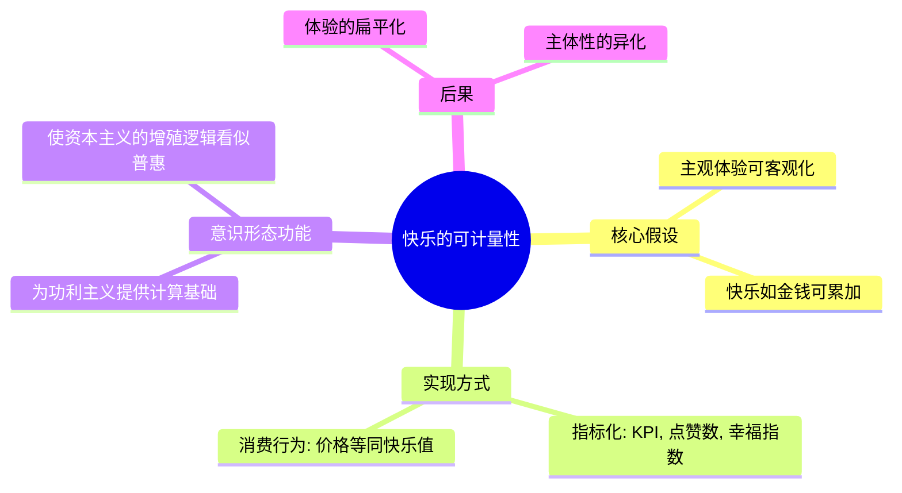
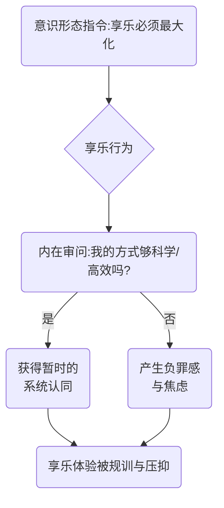

---
{"dg-publish":true,"permalink":"/1-1 科学实在论/1-1-1 物理主义/1-1-1-3 科学消费主义/","created":"2025-09-19T20:52:29.294+08:00","updated":"2025-09-19T21:01:05.342+08:00"}
---

---
### **一、本章概览**
- **主义主义编码**: 1-1-1-3
- **意识形态命名**: [[科学消费主义\|科学消费主义]]
- **核心论断**: [[科学消费主义\|科学消费主义]]是一种将[[享乐\|享乐]]或[[幸福\|幸福]]彻底量化，并将其无限积累作为世界终极目的的意识形态。它看似推崇个体体验，实则通过一套伪科学的“[[快乐计量\|快乐计量]]”体系，将[[主体性\|主体性]]工具化，最终服务于一个中心化的[[5 主义/资本主义\|资本主义]]增殖逻辑，其本质是一种压抑性的、为布尔乔亚秩序辩护的[[大学话语\|大学话语]]。
- **你能获得**: 你将掌握[[科学消费主义\|科学消费主义]] (1-1-1-3) 的完整内在结构，理解其如何将[[世界\|世界]]视为一个“[[享乐\|享乐]]记账本”。你还能学会分辨其在现实生活中的变体（如过度量化的 KPI 文化、消费主义的幸福叙事），并掌握一种重要的批判性视角——[[底线的比例原则\|底线的比例原则]]，即一个文明的标志并非幸福总量的最大化，而是对底层痛苦的有效规避。

---
### **二、核心内容解析**

#### **“主义主义”四格分析**

1.  **场域之“1” (Ontology)**：该意识形态在[[存在论\|存在论]]上预设了一个完全同质化、可计算的[[世界\|世界]]。这个世界的唯一框架是一个巨大的、统一的“[[享乐\|享乐]]积攒场”或“幸福总量池”。在这个场域中，无论是物理现象、历史进程还是文化创造，其存在的根本意义都被还原为同一个标准：能否为这个总账本贡献正值的“幸福度”。这里的“1”代表了场域的封闭性和单一标尺性，万事万物都被强制纳入同一个价值衡量的[[世界\|世界]]图景之下，不存在无法被“幸福”这一终极单位所度量的领域。

2.  **本体之“1” (Body)**：在此场域中，所有存在的实体（Body）都被视为实现[[享乐\|享乐]]的同质化工具或原料。无论是奢侈品、自然资源，还是人类的身体与技能，其[[实在\|实在]]性都被抽空，仅剩下“作为[[享乐\|享乐]]工具”的单一属性。这里的“1”意味着本体论上的彻底工具化和物质化，即“你这个人太物质了”的庸俗含义。知识、艺术、人际关系等，其价值不再内在于自身，而被统一还原为可供消费的“[[享乐\|享乐]]用具”，其差异仅在于能产生多少计量的[[快乐\|快乐]]。

3.  **现象之“1” (Phenomenon)**：该意识形态将主体的感知经验（Phenomenon）整合进一个无缝的、线性的生产-消费链条中。[[主体性\|主体性]]被彻底压扁，成为这个链条上一个被动、统一的环节。这个链条从“自然界”开始，经由“[[科学话语\|科学话语]]”的透视、“工业”的加工，到“市场”的分配，最终抵达“消费者体验”。这里的“1”代表了[[现象\|现象]]体验的非主体性和统一性。个体不再是自由体验的[[主体\|主体]]，而是一个“[[享乐\|享乐]]发生的条件”或“忠诚的体验记录仪”，其任务是高效、无差地完成系统预设的[[享乐\|享乐]]流程。

4.  **目的之“3” (Purpose)**：该意识形态的最终[[9 未命名/目的论\|目的论]]（Telos）在于将积累的[[享乐\|享乐]]总量导向一个中心，实现体系的“增殖”。与1-1-1-1的无尽循环不同，这里的“3”代表了一个核心中介者或受益者，它调和了“积累”这一行为，并赋予其方向。这个中心可以是抽象的“人类文明总幸福度”，也可以是具体的“[[布尔乔亚\|布尔乔亚]]阶级的剩余价值”，或是游戏《文明》中玩家追求的“笑脸”总数。这个“3”使得整个系统从盲目循环变为有目的的中心化运动，一切[[享乐\|享乐]]的量化与积累，最终都是为了这个中心的巩固与发展服务，这正是其为[[5 主义/资本主义\|资本主义]]秩序辩护的核心机制。

#### **其他核心知识点**

##### 快乐的可计量性 (Quantifiability of Pleasure)
这套意识形态的基石在于一个核心假设：[[快乐\|快乐]]、[[幸福\|幸福]]乃至[[享乐\|享乐]]等主观体验，可以像物理量一样被客观地测量、分割、比较和累加。它将复杂的精神状态简化为可以录入账本的数字，从而为“幸福最大化”这一功利主义目标提供了看似科学的计算可能。这种思想将[[世界\|世界]]变成一个巨大的“幸福资产负债表”，所有行为的价值都由其能否为“幸福净值”带来增长来评判。这直接关联到[[科学消费主义\|科学消费主义]]的目的论（3），因为只有可计量的东西才能被系统地、中心化地积累。

**举例阐释**：游戏《文明》中，城市的“笑脸”数量直接代表了人民的幸福度，玩家通过建造娱乐设施、提供奢侈品等方式增加“笑脸”，从而提升城市产能和稳定。这就是将[[幸福\|幸福]]彻底符号化、可计量的完美模型。

##### 享乐的压抑性与负罪感
在[[科学消费主义\|科学消费主义]]的规训下，[[享乐\|享乐]]本身 paradoxically 变得充满压抑和负罪感。因为当[[享乐\|享乐]]成为一种必须“最大化”和“高效完成”的任务时，它就不再是自由的解放，而是一种被严格规训的表演。布尔乔亚在消费时，其焦虑并非来自道德上的“为富不仁”，而是来自一种意识形态内部的压力：“我是否以最‘科学’、最‘高效’的方式实现了[[享乐\|享乐]]的最大化？我有没有浪费这份[[享乐\|享乐]]的潜力？” 这种内在的监督机制，使得[[享乐\|享乐]]从一种自发体验，异化为一种需要向系统（[[9 未命名/大他者\|大他者]]）交差的功课。

**举例阐释**：讲稿中提到的“1000块钱买鱼子酱”的例子。消费者不是单纯地享受美味，而是要用一套繁琐、“地道”的布尔乔亚美学（配什么、怎么吃）来证明自己没有“浪费”这1000块钱所代表的“[[享乐\|享乐]]值”，整个过程充满了表演性和焦虑感。

##### 底线的比例原则 (Principle of the Bottom-Line Proportionality)
作为对[[科学消费主义\|科学消费主义]]的批判，未明子提出了“[[底线的比例原则\|底线的比例原则]]”。该原则认为，一个文明、公正的社会标志，不在于其“幸福总量”有多高，而在于其社会安全网的“底线”有多牢固。它主张社会资源应优先用于规避和消除那些能轻易摧毁个体生活根基的“无意义的痛苦”（如饥饿、疾病、寒冷），而非用于无限拔高一个抽象的“幸福上限”。这一原则将焦点从功利主义的“最大化”逻辑，转向了基于底线正义的“最小化伤害”逻辑。

**举例阐释**：一个国家即使人均GDP很高，但如果每年都有人因为交不起暖气费而冻死，按照[[底线的比例原则\|底线的比例原则]]，这个社会依然是野蛮的。相反，一个社会即使没那么富裕，但能通过公共服务体系确保无人因基础病或意外陷入绝境，它就是更文明的。

---
### **三、关键观点提取**
- “[[科学消费主义\|科学消费主义]]的核心意涵就是人类的[[快乐\|快乐]]可以计数。”
- “这个宇宙变成一个计量它的这个[[享乐\|享乐]]总量，人类[[享乐\|享乐]]总量的一个数量池，或者一个奖金池。”
- “在[[科学消费主义\|科学消费主义]]里面...人不会被看成[[享乐\|享乐]]主体，人会被看成是什么？[[享乐\|享乐]]发生的条件之一。”
- “你真的相信[[享乐\|享乐]]这种东西是可以积攒的，是可以最大化的，而没有意识到[[享乐\|享乐]]本身是一种开放性的姿态，是一种创伤性的敞开。”
- “与其说是把这个[[布尔乔亚\|布尔乔亚]]意识形态用一个什么积累[[快乐\|快乐]]...来做边幅，不如反过来，我们需要一个社会公共服务体系，它能够帮我们至少要帮我们规避那些非常荒谬的...人间的美好，却摧毁的很重大。”

---
### **四、知识点问答**
#### Q: 在1-1-1-3的[[科学消费主义\|科学消费主义]]中，为何说最终“是宇宙在享乐”，而不是人在享乐？
A: 因为在该体系中，个体（人）的[[主体性\|主体性]]被掏空，沦为实现[[享乐\|享乐]]量化和积累的工具。人只是一个“使得快乐生产出来的原材料之一”，其体验必须忠诚于系统设定的“最大化”目标。真正的行动者是那个追求总量增长的系统本身，即[[拉康\|拉康]]意义上的[[9 未命名/大他者\|大他者]]。就像游戏玩家看着屏幕上不断上涨的“幸福”分数而感到满足，真正获得满足感的不是游戏里的市民，而是操控全局的玩家（系统）。因此，是这个抽象的宇宙秩序或[[5 主义/资本主义\|资本主义]]逻辑本身在享受其自我增殖的过程。

#### Q: “目的之‘3’”相比于1-1-1-1中的“目的之‘1’”在结构上带来了什么根本性变化？
A: 在1-1-1-1（如[[科学独断论\|科学独断论]]）中，“目的之‘1’”代表一种无目的的、永恒的、封闭的循环。系统运行的唯一目的就是维持自身的循环，没有方向和终点。而1-1-1-3中的“目的之‘3’”引入了一个**中心化的目的论**。它为系统设定了一个“积累”和“增值”的方向，并指向一个核心受益者（如[[布尔乔亚\|布尔乔亚]]阶级或“文明”本身）。这个“3”打破了“1”的纯粹重复，赋予了系统一种线性的“进步”叙事，使得整个意识形态更具欺骗性和动员能力，因为它能将剥削和积累包装成一种为“共同福祉”做贡献的崇高事业。

#### Q: [[底线的比例原则\|底线的比例原则]]为何能有效对抗[[科学消费主义\|科学消费主义]]的逻辑？
A: 它通过转移议题和重设价值标尺来对抗。[[科学消费主义\|科学消费主义]]建立在“加法”逻辑上（如何让幸福+1, +10, +100），而[[底线的比例原则\|底线的比例原则]]则建立在“减法”或“预防”逻辑上（如何避免人生归零或变为负数）。它不与对方在“幸福能否量化”上做过多纠缠，而是直接指出一个更具优先级的伦理议题：一个人的极端痛苦，其负面价值远大于另一个人的锦上添花。它用具体的、可感知的“痛苦的规避”替换了抽象的、不可靠的“[[幸福\|幸福]]的积累”，从而瓦解了[[科学消费主义\|科学消费主义]]伪科学计算的根基。

---
### **五、知识延伸**
- **[[5 主义/功利主义\|功利主义]] (Utilitarianism)**: 特别是边沁的“幸福计算法”，是[[科学消费主义\|科学消费主义]]的直接哲学源头。它最早系统性地提出道德和立法的标准应是“最大化最大多数人的幸福”，为将[[幸福\|幸福]]量化提供了理论基础。
- **[[黑镜\|黑镜]] S03E01《急转直下》(Nosedive)**: 这部剧集是1-1-1-3意识形态的绝佳寓言。社会中的每个人都被一个评分系统所量化，这个分数决定了其社会地位和资源获取能力。人们的一切行为都旨在“积累”更高的分数，个体[[主体性\|主体性]]完全被服务于这个中心化评分系统的逻辑所吞噬。
- **[[阿多诺\|阿多诺]] & [[霍克海默\|霍克海默]]《[[启蒙辩证法\|启蒙辩证法]]》**: 此书中的“[[文化工业\|文化工业]]”一章，深刻批判了[[5 主义/资本主义\|资本主义]]社会如何将文化和艺术标准化、商品化，以制造出可控的、用以麻痹大众的“[[享乐\|享乐]]”。这与[[科学消费主义\|科学消费主义]]中[[享乐\|享乐]]被系统规训和生产的逻辑高度一致，揭示了其背后深层的社会控制功能。

---
### **六、双链关联总结**
- **一级关联 (核心意识形态与概念)**: [[科学消费主义\|科学消费主义]]、[[享乐\|享乐]]、[[幸福\|幸福]]、[[快乐计量\|快乐计量]]、[[主体性\|主体性]]、[[9 未命名/大他者\|大他者]]、[[底线的比例原则\|底线的比例原则]]
- **推测相关人物 (Speculated Figures)**: **追求“用户增长”和“活跃度”的科技巨头CEO**，他们将复杂的人类行为简化为可量化的数据指标（DAU, MAU, 留存率），并以此为中心调动一切资源，其运作逻辑与[[科学消费主义\|科学消费主义]]最大化“幸福总量”的模式如出一辙。
- **二级关联 (上下文与背景)**: [[拉康\|拉康]]、[[9 未命名/精神分析\|精神分析]]、[[大学话语\|大学话语]]、[[5 主义/资本主义\|资本主义]]、[[5 主义/功利主义\|功利主义]]、[[布尔乔亚\|布尔乔亚]]、[[5 主义/物理主义\|物理主义]]
- **三级关联 (推测与延展)**: [[异化\|异化]]、[[奶头乐\|奶头乐]]、[[文化工业\|文化工业]]、[[启蒙辩证法\|启蒙辩证法]]、[[黑镜\|黑镜]]、[[文明系列游戏\|文明系列游戏]]