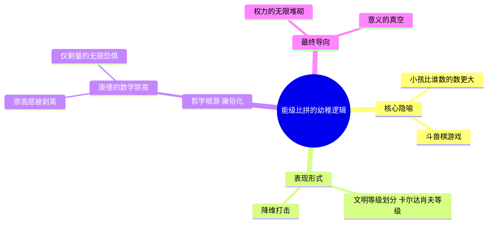
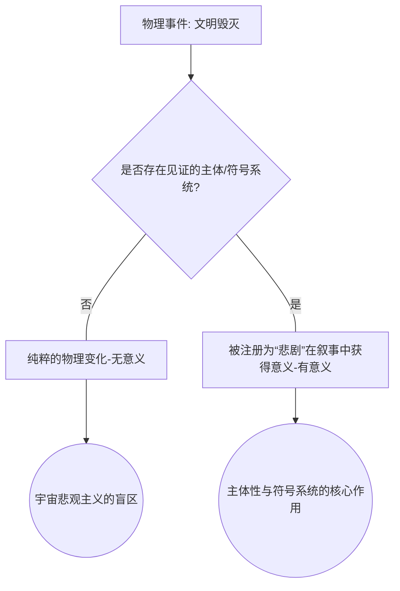
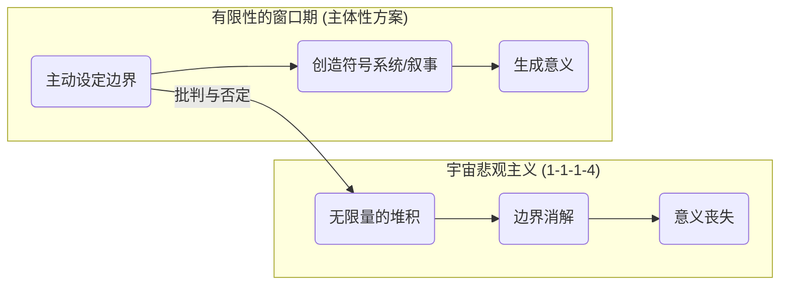

---
{"dg-publish":true,"permalink":"/1-1 科学实在论/1-1-1 物理主义/1-1-1-4 宇宙悲观主义/","created":"2025-09-19T20:52:29.297+08:00","updated":"2025-09-19T21:01:10.548+08:00"}
---

---
## **一、本章概览**
- **主义主义编码**: 1-1-1-4
- **意识形态命名**: [[宇宙悲观主义\|宇宙悲观主义]] (Cosmic Pessimism) / [[宇宙虚无主义\|宇宙虚无主义]]
- **核心论断**: 该意识形态将宇宙设想为一个由单一、同质的“能量/权力”构成的竞技场，其内在逻辑是无尽的、量的堆积与比拼，最终因缺乏任何内在目的而导向一个虚无和自我否定的结局。
- **你能获得**: 通过本笔记，你将掌握对[[宇宙悲观主义\|宇宙悲观主义]]这一流行于部分科幻作品（如刘慈欣部分思想）中的世界观的诊断方法。你将理解其“1-1-1-4”的内在骨架，洞悉其“能级比拼”的核心谬误，并学会运用[[有限性\|有限性]]与[[符号系统\|符号系统]]等概念对其进行哲学批判。

---
## **二、核心内容解析**

#### **“主义主义”四格分析**

1.  **场域之“1” (Ontology)**：该意识形态预设的[[世界\|世界]]是一个绝对统一、同质化的[[能级比拼\|能级比拼]]场。在这个场域中，不存在质的差异或多元的法则，万事万物都被还原到同一个单向度的坐标轴上进行比较——即“能量”或“力量”的强弱。这个“1”代表了场域的封闭性与单一性，宇宙如同一个巨大的[[斗兽棋\|斗兽棋]]棋盘，所有存在者都被迫参与这场只有“更强”与“更弱”之分的零和游戏，没有任何逃逸路线或替代性现实。它是一个排除了所有异质性的、纯粹量的竞技场。

2.  **本体之“1” (Body)**：在此统一场域中，唯一真实存在的[[本体\|本体]]是同一种东西，即可以被量化的“力量”或“能级”。无论是物质、生命、文明还是智慧，其本质都被看作是这种单一“能量”的不同数值表现。文明的先进与否，不再由其文化、伦理或精神的丰富性决定，而仅仅取决于它能掌控的能量层级（如行星级、恒星级）。这个“1”意味着本体论上的极端还原论，所有复杂的、多维度的现实都被压平成一个单调的、无差异的量的序列，丧失了内在的质地与丰富性。

3.  **现象之“1” (Phenomenon)**：在[[宇宙悲观主义\|宇宙悲观主义]]的图景中，[[主体性\|主体性]]的感知和体验被彻底压制和同质化。个体的爱恨情仇、伦理决断和意义追求，在这个宏大的“能级比拼”面前，都显得微不足道、无足轻重，最终被视为能量流动过程中的微弱噪音。[[现象\|现象]]世界被理解为物理秩序的直接产物，主体的体验被还原为能量作用下的被动反应。这个“1”意味着主体经验的消弭，所有个体都只是这个巨大物理剧场的被动“观众”或“道具”，其独特的[[第一人称体验\|第一人称体验]]被宏大的、非人称的宇宙法则所吞噬。

4.  **目的之“4” (Purpose)**：该意识形态的[[9 未命名/目的论\|目的论]]是虚无的，它导向一个代表着系统内在不可能性和崩溃的“4”。这场永无止境的“能级比拼”没有终极目标，不是为了达成某种永恒的和谐（1），也不是为了某一方的最终胜利（2），更不是为了汇集于某个神圣中心（3）。其唯一的“目的”就是不断重复“你比我强，我干死你；他比你强，他干死你”的无尽循环。这个“4”揭示了该体系的[[去目的论化\|去目的论化]]本质：其运动最终导向的是一个毫无意义的、自我毁灭的虚空，一种连悲剧都无法被见证的终极失败。

#### **其他核心知识点**

##### 能级比拼与数学上的崇高
该意识形态的核心运作模式，是将文明的演进理解为一场纯粹的“能级比拼”，即在单一的能量/力量尺度上无休止地“比大小”。这种思维方式本质上是一种被滥用的、庸俗化的[[数学上的崇高\|数学上的崇高]]。在[[康德\|康德]]哲学中，数学的崇高源于理性在面对无限大或无限小的观念时，意识到自身超越感官的超验能力。然而，在[[宇宙悲观主义\|宇宙悲观主义]]中，这种对“无限”的想象被抽空了其主体性的和伦理的维度，蜕变为一种令人恐惧、毫无意义的、纯粹量的无限堆积。它就像小孩比谁数的数字大一样，是一种前哲学的、幼稚的思维游戏，将宇宙的奥秘简化为一场暴力的、无聊的数字竞赛。

**举例阐释**：讲稿中提到的“我有一亿，你有一亿零一”的比拼，以及刘慈欣《三体》中“降维打击”这类概念，都是“能级比拼”的典型体现。一个文明的最终手段不是更深刻的智慧或伦理，而是掌握一个在物理法则上“更大”的武器，这种思维方式正是[[宇宙悲观主义\|宇宙悲观主义]]的核心症结。

##### 无人见证的悲剧
这是对[[宇宙悲观主义\|宇宙悲观主义]]最致命的哲学批判。该观点指出，一个事件（尤其是[[悲剧\|悲剧]]）要获得其意义，甚至要作为“事件”本身存在，就必须被一个[[主体性\|主体性]]在某个[[符号系统\|符号系统]]或叙事框架中进行“注册”和“见证”。如果一个文明被瞬间毁灭，且没有任何幸存者或外部观察者来讲述、记录或理解这个毁灭，那么这个“事件”就无法进入任何意义之链。它只是一个纯粹的物理变化，与一块石头的风化无异。[[宇宙悲观主义\|宇宙悲观主义]]的错误在于，它假定了一个可以脱离任何主体和符号系统而独立存在的、客观的“宇宙剧场”，却没意识到，没有观众和剧本的剧场，上演的任何内容都毫无意义。

**举例阐释**：讲稿中设想，一个超强的太阳风暴瞬间毁灭了人类文明。在这种情况下，人类历史、文化、痛苦和希望都随之消散，没有任何载体可以将其“符号化”。因此，这场“悲剧”的悲剧性恰恰在于它无法成为一出被讲述的悲剧，它在意义的层面上被彻底抹除了。

##### 有限性的窗口期与边界设定
作为对[[宇宙悲观主义\|宇宙悲观主义]]无限崇拜的解毒剂，讲稿提出了[[有限性\|有限性]]的重要性。真正的意义并非产生于无限的权力扩张，而是源于在一个有限的“窗口期”内，通过主体性的努力，主动设立[[认识论边界\|认识论边界]]和[[9 未命名/本体论\|本体论]]边界。这意味着，一个文明或个体必须通过建立自身的[[符号系统\|符号系统]]、历史叙事和价值体系，来创造一个相对稳定、有意义的生存空间。这种主动的“设限”行为，恰恰是对“能级比拼”这种无限逻辑的否定。它强调，生存的价值在于主体化的、有历史的、在特定边界内展开的差异性生活，而非在同质化的无限竞赛中沦为炮灰。

**举例阐释**：当一个主体说“我的 for 系统就不再表达你了”，这便是一种主动的[[认识论边界\|认识论边界]]设定。它拒绝将对方纳入自己的意义世界，从而保护了自身[[符号系统\|符号系统]]的完整性。这正是通过[[有限性\|有限性]]的决断来抵抗无限、同质化力量侵蚀的体现。

---
## **三、关键观点提取**
- “无论你发展到多大的[[文明\|文明]]度，后面搞一个多可比你更大，干死你了。”
- “[[悲剧\|悲剧]]的悲剧性就在于悲剧是[[无人见证的悲剧\|无人见证的悲剧]]。”
- “这个[[绝对\|绝对]]不是说我能集无限大、无限小，而是他意识到比大小这个游戏是个垃圾游戏，没有意义。”
- “宇宙的存在要占据[[9 未命名/符号学\|符号学]]空间的，要占据叙事史的。如果他没有办法把自己叙事化…它都它不存在，它就不存在。”

---
## **四、知识点问答**
#### Q: 为何说“1-1-1-4”编码中的前三个“1”是通往最终虚无之“4”的必要铺垫？
A: 因为一个统一的场域（场域之1）、一种同质化的本体（本体之1）和一种被压抑的主体性（现象之1），共同构建了一个彻底的还原论[[世界\|世界]]。在这个世界里，所有质的差异都被取消，只剩下量的比较。这种单一维度的逻辑必然导致一场无休止的、没有内在目标的“军备竞赛”。由于竞赛本身就是目的，它无法导向任何稳定的终极状态，因此它的终点只能是自我耗尽和意义的真空，也即系统内在矛盾的爆发——“4”。

#### Q: [[宇宙悲观主义\|宇宙悲观主义]]为何对“中介”和“符号系统”的存在如此盲目？
A: 因为它的[[5 主义/物理主义\|物理主义]]或[[科学实在论\|科学实在论]]底色，使其相信存在一个无需“中介”即可直接触达的、纯粹客观的物质实在。它将[[符号系统\|符号系统]]、意识、叙事等视为物质实在的次级派生物，而非构成现实的必要条件。这种观点没有意识到，我们所谈论的“宇宙”、“文明”、“存在”等概念，本身就已经是[[符号系统\|符号系统]]的产物。一个无法被符号化、无法被体验的“实在”是无法进入任何讨论的，因此，它对“中介”的忽视，最终导致其理论自身的崩塌。

#### Q: 如何理解讲稿中“通过否定无限来抵达绝对”的思路？
A: 讲稿中的“无限”指的是[[宇宙悲观主义\|宇宙悲观主义]]那种无聊的、量的无限累加（Bad Infinity）。而“[[绝对\|绝对]]”则是一种质的否定性力量，即主体通过“说不”的能力，跳出“比大小”的游戏规则本身。这种[[绝对\|绝对]]的否定性，不是为了获得一个更大的量，而是为了划定一个[[有限性\|有限性]]的、有意义的场域。因此，抵达[[绝对\|绝对]]，意味着从对无限量的追逐中解放出来，获得创造和维护自身价值边界的自由。

---
## **五、知识延伸**
- **[[卡尔达肖夫等级\|卡尔达肖夫等级]] (Kardashev Scale)**: 该理论按文明所能利用的能源等级（行星、恒星、星系）来对其进行分类，是“能级比拼”思想在天文学和科幻领域最经典的理论**支持**。它完美体现了1-1-1-4意识形态中将文明简化为单一能量指标的倾向。
- **H.P. 洛夫克拉夫特的[[克苏鲁神话\|克苏鲁神话]]**: “Cosmicism”一词的源头，是[[宇宙悲观主义\|宇宙悲观主义]]的文学鼻祖。其作品深刻描绘了人类在面对一个冷漠、无意义且充满无法理解的巨大力量的宇宙时的恐惧与渺小，是理解1-1-1-4情感基调的绝佳**参照**。
- **[[尼采\|尼采]]的[[虚无主义\|虚无主义]]与[[权力意志\|权力意志]]**: 尼采同样诊断了现代性的[[虚无主义\|虚无主义]]问题（上帝已死），但他提出的[[权力意志\|权力意志]]并非1-1-1-4那种同质化的“能级比拼”，而是一种创造新价值、重估一切价值的生命冲动。尼采的“超人”正是通过直面虚无并进行创造性转化来克服它，这为走出[[宇宙悲观主义\|宇宙悲观主义]]的绝望提供了一条积极的、而非纯然否定的**批判性出路**。

---
## **六、双链关联总结**
- **一级关联 (核心意识形态与概念)**: [[宇宙悲观主义\|宇宙悲观主义]]、[[1-1-1-4\|1-1-1-4]]、[[能级比拼\|能级比拼]]、[[斗兽棋\|斗兽棋]]、[[数学上的崇高\|数学上的崇高]]、[[无人见证的悲剧\|无人见证的悲剧]]、[[有限性\|有限性]]、[[去目的论化\|去目的论化]]
- **推测相关人物 (Speculated Figures)**: [[刘慈欣\|刘慈欣]] (其部分作品思想被视为典型代表)、[[洛夫克拉夫特\|洛夫克拉夫特]] (思想源头)、任何持极端[[科学实在论\|科学实在论]]并鼓吹技术力量决定论的未来学家或科幻作家、**虚构人物**：[[守望者\|守望者]]中的[[曼哈顿博士\|曼哈顿博士]] (一个逐渐丧失人性，以纯粹物理视角看待宇宙的存在)。
- **二级关联 (上下文与背景)**: [[主页\|主页]]、[[欧陆哲学\|欧陆哲学]]、[[9 未命名/精神分析\|精神分析]]、[[9 未命名/符号学\|符号学]]、[[科幻文学\|科幻文学]]、[[5 主义/物理主义\|物理主义]]、[[9 未命名/实在论\|实在论]]、[[康德哲学\|康德哲学]]
- **三级关联 (推测与延展)**: [[绝对\|绝对]]、[[主体性\|主体性]]、[[符号系统\|符号系统]]、[[认识论边界\|认识论边界]]、[[第一人称体验\|第一人称体验]]、[[悲剧\|悲剧]]、[[尼采\|尼采]]、[[权力意志\|权力意志]]、[[虚无主义\|虚无主义]]