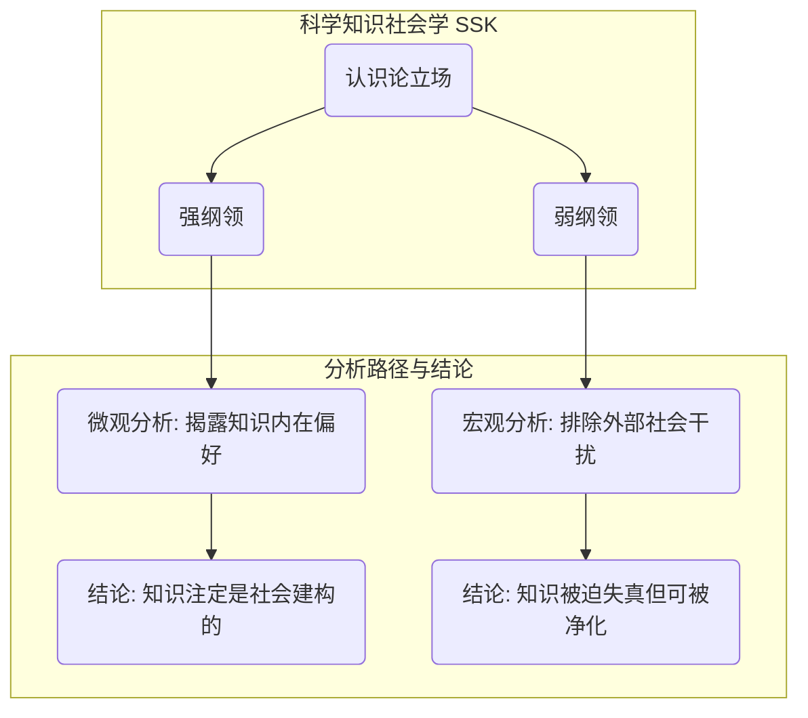
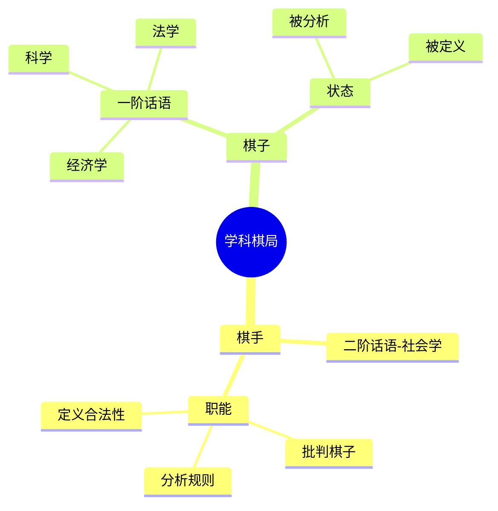
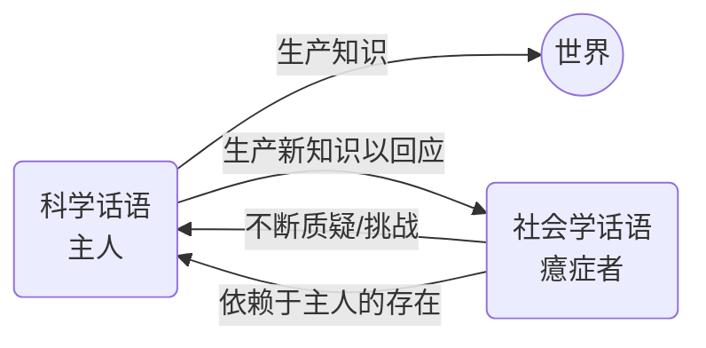

---
{"dg-publish":true,"permalink":"/1-1 科学实在论/1-1-2 构建主义/1-1-2-1 科学知识社会学派/","created":"2025-09-19T20:52:29.304+08:00","updated":"2025-09-19T21:01:14.502+08:00"}
---

---

### **一、本章概览**
- **主义主义编码**: 1-1-2-1
- **意识形态命名**: [[科学知识社会学\|科学知识社会学]] (SSK) / [[爱丁堡学派\|爱丁堡学派]]
- **核心论断**: [[科学知识社会学\|科学知识社会学]]将自身定位为对[[科学话语\|科学话语]]的批判性“二阶话语”，通过揭示科学知识的社会建构性来争夺学术权威。然而，它自身并未突破科学所依赖的[[5 主义/实证主义\|实证主义]]本体论和[[循环\|循环]]式目的论，最终陷入一种依赖于其批判对象的、无法完成[[本体论反思\|本体论反思]]的[[癔症化\|癔症化]]结构。
- **你能获得**: 你将理解[[科学知识社会学\|科学知识社会学]] (SSK) 的核心主张，特别是其[[强纲领\|强纲领]]与[[弱纲领\|弱纲领]]的区别；掌握其作为一种“1-1-2-1”意识形态的内在运作逻辑；并能从“主义主义”视角剖析其为何在批判科学的同时，又无法真正颠覆科学的根本框架。

---
### **二、核心内容解析**
#### **“主义主义”四格分析**

1.  **场域之“1” (Ontology)**：该意识形态在[[存在论\|存在论]]上预设了一个统一且具有潜在可真性的[[世界\|世界]]。这个[[世界\|世界]]的框架是单一的、整全的（“1”）。它相信[[真理\|真理]]是可能存在的，人类的知识活动原则上可以触及真实。然而，这个完美的[[世界\|世界]]图景总是被社会性因素所“污染”和“扭曲”，导致知识的“失真”。所以，其[[场域\|场域]]是一个完整的、但时刻面临失真风险的真理场域，它为[[社会学\|社会学]]的介入（纠偏、批判）提供了永恒的舞台。

2.  **本体之“1” (Body)**：在其[[9 未命名/本体论\|本体论]]层面，[[科学知识社会学\|科学知识社会学]]本质上依然是一种[[5 主义/经验主义\|经验主义]]或[[5 主义/实证主义\|实证主义]]的。它虽然激烈地批判“科学知识”的社会建构性（喻为“周仓”），但从未真正质疑知识背后存在一个坚实的、客观的[[物理实在\|物理实在]]（喻为“关公”）。它相信有一个“硬”的现实世界作为所有话语的基础。这种对底层[[实在\|实在]]的默认，使其批判始终停留在认识论层面，无法深入到[[存在论\|存在论]]的根本变革，本质上共享了其批判对象的[[5 主义/物理主义\|物理主义]]内核。

3.  **现象之“2” (Phenomenon)**：这是该意识形态的核心特征。在[[现象\|现象]]层面，主体的体验被构建为一种持续的[[二元对立\|二元对立]]。一方是声称客观中立的“一阶话语”，即[[科学话语\|科学话语]]；另一方是能洞察其背后社会偏见的“二阶话语”，即[[社会学话语\|社会学话语]]。主体的[[主体性\|主体性]]就体现在这种批判性对抗之中。这种分裂表现为[[强纲领\|强纲领]]（彻底的社会建构论）与[[弱纲领\|弱纲领]]（社会影响论）的张力，主体永远处于揭露、批判和分析的位置，其存在感完全建立在这场永不结束的认识论战争之上。

4.  **目的之“1” (Purpose)**：尽管现象层面充满对抗，但其[[9 未命名/目的论\|目的论]]最终导向的是一个稳定且不断重复的[[循环\|循环]]结构（“1”），即一种[[二阶循环\|二阶循环]]。社会学通过批判科学来确立自身价值，而科学（尤其在弱纲领下）又需要社会学的“净化”来维持其合法性。二者形成了一种相辅相成的寄生关系。最终目的是维持这个“批判-修正”的[[大学话语\|大学话语]]体系的永恒运作，而非真正地颠覆或超越它。这是一种为了循环而循环的结构，确保了社会学家永远有“饭”吃。

#### **其他核心知识点**

##### 强纲领 vs. 弱纲领
这两种纲领是[[科学知识社会学\|科学知识社会学]]内部在现象之“2”的对抗性上的两种不同烈度的体现。[[强纲领\|强纲领]]持彻底的社会建构论，认为一切科学知识，无论真伪，其内容都由社会因素决定，科学知识的客观性被完全消解。它采取的是一种激进的、微观的分析姿态，旨在揭露任何科学话语内在的“原罪”。而[[弱纲领\|弱纲领]]则相对温和，它承认社会、政治、经济等外部因素会“影响”或“扭曲”科学的发现过程，但并不否认科学本身有其内在的客观逻辑。它更倾向于宏观分析，试图为科学“扫清障碍”，扮演一个“净化者”的角色。

**举例阐释**：讲稿中提到，若一个社会学家用[[强纲领\|强纲领]]去研究医药学，直接论证某项药物的研发完全是资本利益和学术偏好合谋的产物，这将直接颠覆整个学科的根基，得罪整个利益共同体。而用[[弱纲领\|弱纲领]]则会说，药物研发大方向是好的，但受到了某些不良的商业赞助或政策压力的影响，导致了一些偏差，我们需要通过社会学监督来纠正它。

##### 二阶话语与学科棋局
[[科学知识社会学\|科学知识社会学]]通过将自身定位为一种“[[二阶话语\|二阶话语]]”或“元话语”，来获得凌驾于其他学科之上的权力地位。它不直接参与具体科学知识（一阶话语）的生产，而是分析和批判这些知识的生产过程、社会条件和内在偏见。这种策略使其仿佛成为了一位“棋手”，而其他所有学科，无论是科学、经济学还是法学，都成了棋盘上的“棋子”。这位“棋手”通过定义游戏规则（即“什么是合法的知识”），来掌握最终的裁决权和话语权威。

**举例阐释**：当物理学家说“我发现了宇宙的真理”，SSK的社会学家会回应：“你所谓的‘发现’，是在何种赞助下、使用了何种修辞、为了巩固哪个学术共同体的地位才被‘建构’为‘真理’的？定义的权力在我这里，而不在你那里。”

##### 癔症化的大学话语
讲稿指出，1-1-2-1意识形态最终形成的是一种[[癔症化\|癔症化]]的大学话语。在[[拉康\|拉康]]的精神分析理论中，“癔症者的辞说”特征是不断地向主人（Master）发问、挑战，质疑其知识的完备性，以此来彰显自身。然而，癔症者本身的存在完全依赖于主人的存在，其目的并非要推翻主人，而是要迫使主人生产出新的知识来填补其欲望。SSK对科学的关系正是如此：它不断地质问、批判科学（主人），但它本身并不生产本体论层面的新知识，其全部的学术生命力都来自于对科学这个“主人”的寄生和挑战。

**举例阐释**：SSK对科学说：“你的理论有漏洞！不客观！” 科学被迫回应、修正或辩护。这个过程让SSK获得了学术声望。但如果科学真的不存在了，SSK也就失去了批判的对象，其自身也就失去了存在的意义。这种“我恨你，但我不能没有你”的结构，就是典型的[[癔症化\|癔症化]]。

---
### **三、关键观点提取**
- “[[爱丁堡学派\|爱丁堡学派]]他直接研究社会化科学话语，甚至科学知识本身它具有社会性...科学知识本身它是屁股歪的。”
- “强纲领就意味着你永远都不干净，所以永远要我帮忙...弱纲领则是可惜你被迫失贞。你不是自愿失真，你是被迫失贞。”
- “他是个我是棋手，你们都是棋盘上棋子，所以掌握来他掌握了，他觉得他掌握了。”
- “他没有能力从社会认识论反思进一步倒向一个[[本体论反思\|本体论反思]]。任何形式[[本体论反思\|本体论反思]]他都抵达不了。”
- “他这个大学话语是[[癔症化\|癔症化]]的大学话语，它是有自反性的...就是寄生在你的权威上，或者我把那权威拿过来。”

---
### **四、知识点问答**
#### Q: 为何说“1-1-2-1”的[[科学知识社会学\|科学知识社会学]]虽然在现象(2)上充满对抗，其目的(1)却依然是循环和维稳？
A: 因为它的对抗性（现象之“2”）完全发生在[[9 未命名/认识论\|认识论]]层面，而非[[存在论\|存在论]]层面。它通过批判[[科学话语\|科学话语]]来确立自己的合法性，但其自身的存在价值恰恰依赖于被批判对象的持续存在。如果它彻底颠覆了科学，它自身也就失去了意义。因此，其最终[[9 未命名/目的论\|目的论]]（目的之“1”）并非革命，而是建立一个[[社会学\|社会学]]与[[科学\|科学]]相互依存、相互定义的[[二阶循环\|二阶循环]]体系，从而维持这种批判关系本身的稳定和永续。

#### Q: [[科学知识社会学\|科学知识社会学]]的“强纲领”和“弱纲领”如何具体体现其意识形态编码中的“2”？
A: 数字“2”代表[[二元对立\|二元对立]]和外部冲突。[[强纲领\|强纲领]]与[[弱纲领\|弱纲领]]正是这一核心冲突的两种策略表达。[[强纲领\|强纲领]]将社会与科学视为彻底的对立面，认为社会性是科学知识的唯一决定因素，这是一种激进的、你死我活的对抗。[[弱纲领\|弱纲领]]则将对立关系描绘为外部干扰（社会）与纯粹内核（科学）的冲突，是一种可调和的对抗。两者都将[[世界\|世界]]的体验构建为“社会学批判”与“科学宣称”之间的战斗，这正是[[现象\|现象]]之“2”的体现。

#### Q: 讲稿中“骂周仓算啥”的比喻，揭示了[[科学知识社会学\|科学知识社会学]]怎样的根本局限？
A: 这个比喻极其精妙。在比喻中，“关公”代表着[[科学实在论\|科学实在论]]所信奉的、不容置疑的客观[[真理\|真理]]或[[物理实在\|物理实在]]（[[9 未命名/本体论\|本体论]]之“1”）。“周仓”则代表着围绕这个真理形成的具体的“[[科学话语\|科学话语]]”或知识体系。[[科学知识社会学\|科学知识社会学]]的全部火力都集中在批判“周仓”（科学知识是社会建构的、有偏见的），却从不敢质疑“关公”（客观真理本身）的存在。这揭示了其根本局限：它所有的批判都停留在[[9 未命名/认识论\|认识论]]层面，而对[[9 未命名/本体论\|本体论]]基础采取了默认和回避的态度，因此其批判是“不彻底”的。

---
### **五、知识延伸**
- **[[托马斯·库恩\|托马斯·库恩]]《[[科学革命的结构\|科学革命的结构]]》**: 此书是[[科学知识社会学\|科学知识社会学]]重要的思想先驱。库恩提出的“[[9 未命名/范式\|范式]]”、“[[9 未命名/不可通约性\|不可通约性]]”等概念，打破了科学线性进步的神话，强调了科学共同体的社会和心理因素，为SSK将科学作为纯粹社会现象来研究打开了大门，构成了支持关系。
- **[[布鲁诺·拉图尔\|布鲁诺·拉图尔]]与[[演员网络理论\|演员网络理论]] (ANT)**: 拉图尔是走出[[爱丁堡学派\|爱丁堡学派]]并对其进行批判的思想家。他认为SSK过度强调“社会”的解释力，陷入了另一种形式的决定论。ANT则主张一种更为激进的对称性，认为人类行动者与非人类行动者（如实验仪器、微生物）应被同等看待。这构成了对SSK的批判性发展和参照。
- **[[索卡尔事件\|索卡尔事件]]**: 1996年，物理学家艾伦·索卡尔向后现代文化研究期刊《社会文本》投稿了一篇布满胡言乱语的“钓鱼”文章并成功发表。此事尖锐地讽刺和打击了包括SSK在内的、对科学进行极端社会建构论批判的学派，是理解SSK所处学术论战背景和其外部批判声浪的绝佳案例。

---
## 双链关联总结
- **一级关联 (核心意识形态与概念)**: [[1-1-2-1\|1-1-2-1]]、[[科学知识社会学\|科学知识社会学]]、[[爱丁堡学派\|爱丁堡学派]]、[[强纲领\|强纲领]]、[[弱纲领\|弱纲领]]、[[二阶话语\|二阶话语]]、[[癔症化\|癔症化]]、[[信用度循环理论\|信用度循环理论]]、[[社会建构论\|社会建构论]]
- **推测相关人物 (Speculated Figures)**:
  - **大卫·布鲁尔 (David Bloor)**: 现实人物，[[爱丁堡学派\|爱丁堡学派]]的代表人物，[[强纲领\|强纲领]]的提出者，是该意识形态的完美化身。
  - **调查记者/舆论监督者**: 现实角色，其工作价值完全建立在对政府、企业等权力机构（一阶话语）的持续批判和揭露上，与SSK对科学的[[癔症化\|癔症化]]关系构成完美类比。
- **二级关联 (上下文与背景)**: [[社会学\|社会学]]、[[科学哲学\|科学哲学]]、[[9 未命名/认识论\|认识论]]、[[5 主义/实证主义\|实证主义]]、[[5 主义/物理主义\|物理主义]]、[[大学话语\|大学话语]]、[[莫顿\|莫顿]]、[[科学共同体\|科学共同体]]、[[5 主义/结构主义\|结构主义]]
- **三级关联 (推测与延展)**: [[1-1-1-1\|1-1-1-1]]、[[科学独断论\|科学独断论]]、[[本体论反思\|本体论反思]]、[[拉康\|拉康]]、[[演员网络理论\|演员网络理论]]、[[托马斯·库恩\|托马斯·库恩]]、[[科学革命的结构\|科学革命的结构]]、[[索卡尔事件\|索卡尔事件]]、[[9 未命名/范式\|范式]]