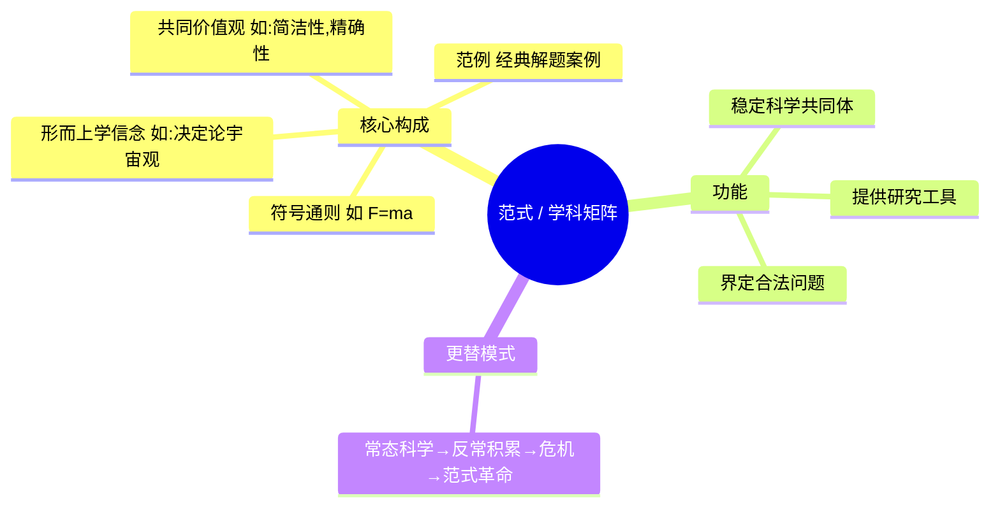
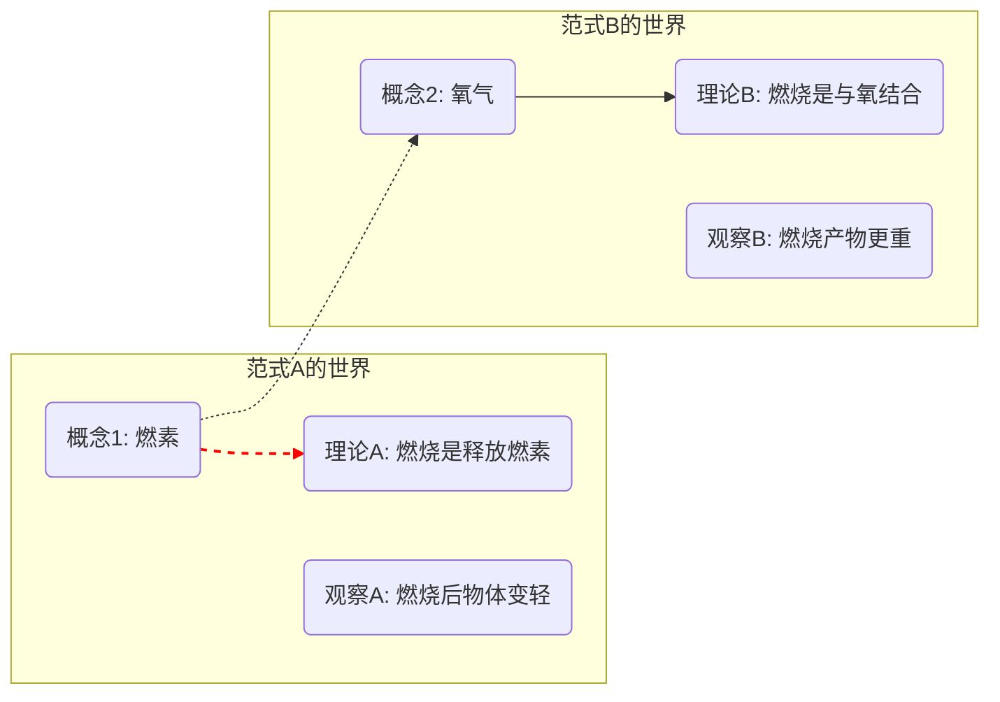
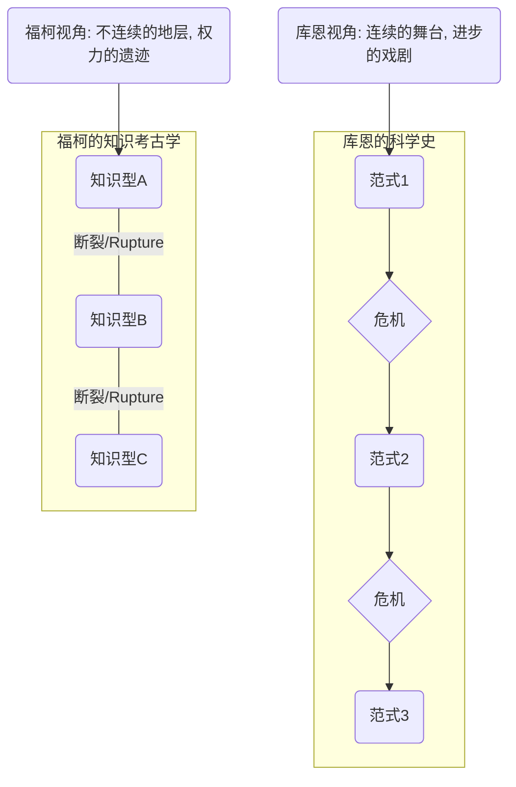

---
{"dg-publish":true,"permalink":"/1-1 科学实在论/1-1-2 构建主义/1-1-2-2 科学革命论/","created":"2025-09-19T20:52:29.307+08:00","updated":"2025-09-22T20:58:09.982+08:00"}
---

---

### **一、本章概览**
- **主义主义编码**: 1-1-2-2
- **意识形态命名**: [[科学革命论\|科学革命论]]
- **核心论断**: 库恩的[[科学革命论\|科学革命论]]将科学发展描绘成一个“[[常态科学\|常态科学]]-危机-革命”的循环过程，但其自身所依赖的[[5 主义/历史主义\|历史主义]]叙事，却被天真地设定为一个连续、统一的[[元叙事\|元叙事]]舞台，从而陷入了一种“用一个未经反思的绝对框架去描述框架更替”的[[唯心主义\|唯心主义]]倒置。
- **你能获得**: 你将掌握用“主义主义”框架拆解[[托马斯·库恩\|托马斯·库恩]]思想的方法，理解其理论中[[现象\|现象]]层面（认识论）和[[9 未命名/目的论\|目的论]]层面的内在对立结构，并能清晰辨析库恩式[[科学史\|科学史]]与[[福柯\|福柯]]式[[9 未命名/知识考古学\|知识考古学]]在根本预设上的差异。

---
### **二、核心内容解析**
#### **“主义主义”四格分析**

1.  **场域之“1” (Ontology)**：该意识形态的[[存在论\|存在论]]舞台是一个统一且连续的[[科学史\|科学史]]。这个“历史”不是断裂、偶然的事件集合，而是一个线性的、无缝的宏大背景（1）。所有的[[9 未命名/范式\|范式]]革命，无论其内容多么颠覆，都被安置在这个单一、稳固的时间流中进行。[[托马斯·库恩\|托马斯·库恩]]无意识地将他自己的历史学家视角绝对化，使其成为一个观察所有科学变革的、自身却永不变革的“神之视点”。这个作为[[场域\|场域]]的[[科学史\|科学史]]本身是整全且不被质疑的。

2.  **本体之“1” (Body)**：在此[[场域\|场域]]中，真实存在的核心内容是单一、客观的[[宇宙\|宇宙]]或[[自然\|自然]]（1）。这个[[自然\|自然]]本身被预设为统一和自洽的。科学理论之所以会发生“危机”，正是因为理论模型与这个单一的、潜在的客观[[实在\|实在]]之间出现了“不一致性”。这个[[宇宙\|宇宙]]虽然是理论无法完全把握的，但它作为引发理论更迭的终极实在，其自身却是统一的。它就像一个沉默的、统一的实体，不断用“反常”来敲打和修正人类的认知。

3.  **现象之“2” (Phenomenon)**：在[[主体性\|主体性]]的认知层面，呈现为一种深刻的二元对立（2）。一方面是[[5 主义/历史主义\|历史主义]]与[[相对主义\|相对主义]]的，认为不同[[9 未命名/范式\|范式]]之间是[[不可通约\|不可通约]]的，知识的有效性被历史阶段所限定，似乎走向一种不可知论。另一方面，其底层又依赖于一种顽固的[[5 主义/基础主义\|基础主义]]（特别是数理[[5 主义/基础主义\|基础主义]]），坚信逻辑的内在一致性和因果律（[[根据律\|根据律]]）。这种分裂体现为：在宏观上看，范式之间是相对的、断裂的；但在微观的“[[常态科学\|常态科学]]”（做题阶段）内部，科学家又必须相信存在唯一的正确答案和逻辑的普适性。

4.  **目的之“2” (Purpose)**：该意识形态的[[9 未命名/目的论\|目的论]]导向一个二元分裂的结局（2）。一方面，[[科学\|科学]]话语被描绘成一个动态的、需要不断自我证明、在“常规”与“革命”之间切换的叙事。另一方面，分析者自身所处的“[[科学史\|科学史]]学”或“社会学”话语，却悄然占据了一个静态的、本真的、用以裁决科学是否“革命”的[[元叙事\|元叙事]]地位。这种结构导致了两种话语权力的斗争：一个是被观察、被分析的动态客体（科学），另一个是自诩为静观全局的、稳定的主体（历史学分析）。最终的目的不是融合，而是维持这种观察者与被观察者之间的等级对立。

#### **其他核心知识点**

##### 范式 (Paradigm) 与学科矩阵 (Disciplinary Matrix)
[[9 未命名/范式\|范式]]是[[托马斯·库恩\|托马斯·库恩]]理论的核心，最初指代一个科学共同体在特定时期共享的一整套信念、价值、技术和形而上学预设。它如同一个思想的“操作系统”，规定了什么是合法的问题、合法的答案以及有效的研究方法。后期库恩为避免歧义，将其细化为“[[学科矩阵\|学科矩阵]]”，指代这个由符号通则、形而上学信念、价值观和“范例”（exemplar）等元素交织构成的、更为结构化的规范总体。它是一个叠床架屋、相互支撑的符号与纪律体系，是[[常态科学\|常态科学]]得以运行的根基。

**举例阐释**：亚里士多德的物理学范式将运动解释为物体回归其“自然位置”的倾向，而牛顿的物理学范式则用惯性定律和万有引力来解释运动。两者不仅是公式不同，其背后的[[世界\|世界]]图景、基本概念（如“力”和“运动”）和研究方法都完全不同，构成两个独立的[[9 未命名/范式\|范式]]。

##### 不可通约性 (Incommensurability)
[[9 未命名/不可通约性\|不可通约性]]是[[9 未命名/范式\|范式]]理论的直接推论，意指不同[[9 未命名/范式\|范式]]之间缺乏一个中立的、共同的衡量标准来进行比较和翻译。因为每个[[9 未命名/范式\|范式]]都有自己独特的概念网络、问题意识和观察语言，一个[[9 未命名/范式\|范式]]中的核心术语在另一个[[9 未命名/范式\|范式]]中可能意义完全不同，甚至不存在。这导致了[[9 未命名/范式\|范式]]之间的对话往往是“鸡同鸭讲”。这并不意味着一方绝对优于另一方，而是在根本上，它们生活在不同的“科学世界”里，无法用对方的标尺来评判自己。

**举例阐释**：讲稿中提到，一位信奉[[林奈\|林奈]]分类学的植物学家，其分类依据是形态学特征和拉丁文命名传统；而一位现代分子生物学家，则依据基因序列和代谢通路来分类。两者对“物种”的定义和划分标准完全不同，无法简单地说谁对谁错，因为他们的理论根植于[[不可通约\|不可通约]]的[[9 未命名/范式\|范式]]之中。

##### 库恩对福柯的“不及”：元叙事的迷梦
讲稿的核心批判在于，[[托马斯·库恩\|托马斯·库恩]]虽然揭示了科学内部的[[9 未命名/范式\|范式]]断裂，但他自己的[[科学史\|科学史]]叙事却是连续、线性和进步的。他仿佛站在历史之外，天真地相信自己能描绘出一个客观的“[[9 未命名/范式\|范式]]更替序列”。而[[福柯\|福柯]]的[[9 未命名/知识考古学\|知识考古学]]则更为彻底，它不仅揭示知识型（Episteme）的断裂，更重要的是，[[福柯\|福柯]]意识到任何历史书写本身都是一种特定时代、特定权力关系下的“话语实践”，不存在一个超然、中立的历史视角。库恩陷入了[[元叙事\|元叙事]]的迷梦，而[[福柯\|福柯]]则致力于揭示一切叙事背后的权力构造。

**举例阐释**：库恩会讲述一个从托勒密地心说到哥白尼日心说的“科学革命”故事，将其视为一个进步。而[[福柯\|福柯]]则会质问：这种将“革命”和“进步”作为叙事框架本身的做法，是在何种权力/知识配置下才成为可能的？为何我们如此执着于讲述一个“进步”的故事？这种提问方式本身就瓦解了[[库恩\|库恩]]的安稳立足点。

---
### **三、关键观点提取**
- “不同[[9 未命名/范式\|范式]]之间它形成了不同的科学...他们[[9 未命名/范式\|范式]]之间具有[[9 未命名/不可通约性\|不可通约性]]。但这[[9 未命名/不可通约性\|不可通约性]]并不意味着谁更高级，因为它是不可通约的。”
- “我们会感受到在[[9 未命名/目的论\|目的论]]上...库恩其实那里预设了另外一种常规状态和这个危机状态...这个二分是隐含在他的自己的社会学内部的...把他历史主义，把它社会学科学社会学当成是一种静态的源语言。”
- “它不如[[福柯\|福柯]]的地方...[[福柯\|福柯]]他的[[9 未命名/知识考古学\|知识考古学]]是断裂的...他时刻意识到一切历史都是当代史，都是回溯性的，回溯性被建构的。而[[库恩\|库恩]]他则是天真的相信有一个[[科学史\|科学史]]，有一个[[9 未命名/范式\|范式]]的一个序列。”
- “你来预设你自己的[[科学史\|科学史]]或者[[5 主义/历史主义\|历史主义]]话语，是一种超话语[[元话语\|元话语]]。然后再去描述什么具有革命性，那这个屁股就是歪的了...这是一种[[唯心主义\|唯心主义]]倒置。”

---
### **四、知识点问答**
#### Q: 为何说库恩的“科学革命论”是一种1-1-**2**-**2**结构，而非更统一的结构？
A: 因为它的[[场域\|场域]]（统一的[[科学史\|科学史]]）和[[本体\|本体]]（统一的[[自然\|自然]]）是整全的（1-1），但在现象和目的层面却充满了内在张力。在[[现象\|现象]]层面（2），它同时依赖于两种对立的认知模式：宏观上承认[[9 未命名/范式\|范式]]间不可逾越的鸿沟（[[相对主义\|相对主义]]），微观上又依赖[[常态科学\|常态科学]]内部对逻辑统一性的信仰（[[5 主义/基础主义\|基础主义]]）。在[[9 未命名/目的论\|目的论]]层面（2），它制造了分析者（历史学家）的静态[[元叙事\|元叙事]]与被分析者（科学家）的动态历史之间的对立，这两种话语处于持续的权力张力中，而非走向统一。

#### Q: 讲稿中提到的“唯心主义倒置”具体指什么？
A: 指[[托马斯·库恩\|托马斯·库恩]]将自己作为历史学家的“意识”（即他所建构的那个线性的、连续的[[科学史\|科学史]]叙事）凌驾于[[实在\|实在]]（即历史本身是断裂、复杂、被权力渗透的偶然过程）之上。他错误地将自己用以观察历史的“观念框架”（一个统一的[[科学史\|科学史]]）当作了历史本身的样子，预设了自己话语的绝对性和优先性。这是一种典型的[[唯心主义\|唯心主义]]操作：不是从杂多的历史材料中发现结构，而是用一个预设的理想结构（线性的、革命性的历史）去裁剪和安排历史材料。

#### Q: 既然范式间是“不可通约”的，那库恩理论中的“进步”是如何可能的？
A: 这是一个[[库恩\|库恩]]理论中的核心矛盾。一方面，[[9 未命名/不可通约性\|不可通约性]]似乎取消了评判“进步”的客观标准，导向[[相对主义\|相对主义]]。但另一方面，[[库恩\|库恩]]又认为科学在总体上是“进步”的。他的解释是，这种进步不体现在“更接近真理”，而是体现在“解决疑难”（puzzle-solving）的能力上。新[[9 未命名/范式\|范式]]之所以能取代旧[[9 未命名/范式\|范式]]，是因为它能解决旧范式无法解决的“反常”问题。这实际上是将“进步”的标准从“符合[[实在\|实在]]”置换为了“工具性的有效”，但这本身也依赖于一个超历史的、关于“问题解决能力”的评判标准，从而再次陷入困境。

---
### **五、知识延伸**
- **书籍《[[科学革命的结构\|科学革命的结构]]》 (The Structure of Scientific Revolutions)**: 作者为[[托马斯·库恩\|托马斯·库恩]]。这是本讲稿分析的直接文本来源，是理解[[9 未命名/范式\|范式]]、[[常态科学\|常态科学]]、[[9 未命名/不可通约性\|不可通约性]]等概念最权威的原始读本。阅读原著可以更深地体会其理论的魅力与内在矛盾。
- **书籍《[[9 未命名/知识考古学\|知识考古学]]》 (The Archaeology of Knowledge)**: 作者为[[6 哲学家/米歇尔·福柯\|米歇尔·福柯]]。这本书是与库恩思想形成尖锐对比的参照系。[[福柯\|福柯]]在此书中系统阐述了他的“考古学”方法，强调知识的“断裂性”、“非连续性”和“话语实践”属性，是批判库恩式线性史观的最强武器。
- **思想家 [[拉卡托斯\|拉卡托斯]] (Imre Lakatos)**: [[拉卡托斯\|拉卡托斯]]的“科学研究纲领方法论”可以视为对[[波普尔\|波普尔]]的证伪主义和[[库恩\|库恩]]的[[9 未命名/范式\|范式]]论的一种综合与修正。他提出的“研究纲领”有“硬核”与“保护带”之分，比[[9 未命名/范式\|范式]]更具韧性，也为科学的“理性”辩护，提供了一个介于绝对否证与非理性革命之间的中间道路。

---
## 双链关联总结
- **一级关联 (核心意识形态与概念)**: [[科学革命论\|科学革命论]]、[[9 未命名/范式\|范式]]、[[学科矩阵\|学科矩阵]]、[[9 未命名/不可通约性\|不可通约性]]、[[常态科学\|常态科学]]
- **推测相关人物 (Speculated Figures)**: [[托马斯·库恩\|托马斯·库恩]]、任何相信存在一个客观、中立、线性进步历史观的史学家。
- **二级关联 (上下文与背景)**: [[科学哲学\|科学哲学]]、[[科学史\|科学史]]、[[5 主义/历史主义\|历史主义]]、[[5 主义/基础主义\|基础主义]]、[[相对主义\|相对主义]]、[[福柯\|福柯]]、[[9 未命名/知识考古学\|知识考古学]]、[[元叙事\|元叙事]]、[[根据律\|根据律]]、[[实在\|实在]]、[[林奈\|林奈]]
- **三级关联 (推测与延展)**: [[拉卡托斯\|拉卡托斯]]、[[5 主义/物理主义\|物理主义]]、[[唯心主义\|唯心主义]]、[[张卜天\|张卜天]]、[[波普尔\|波普尔]]、[[存在论\|存在论]]、[[9 未命名/目的论\|目的论]]、[[主体性\|主体性]]、[[现象\|现象]]、[[世界\|世界]]