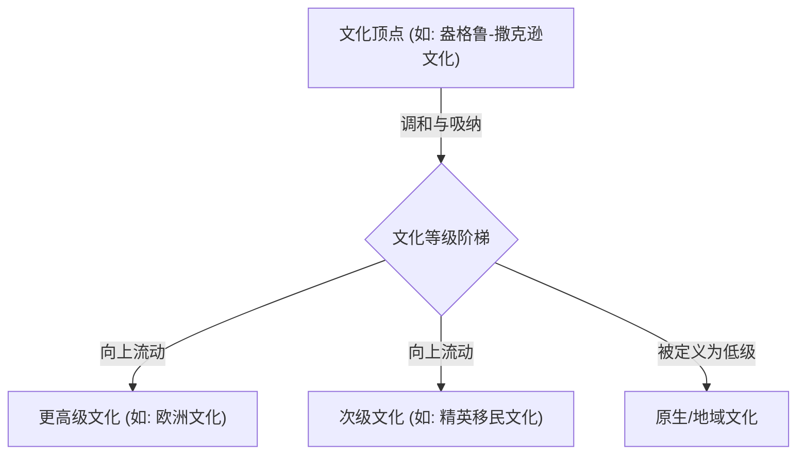
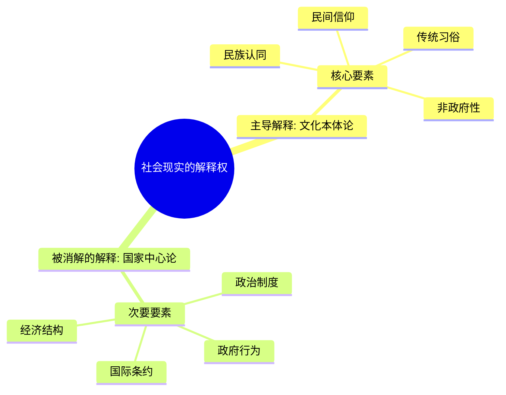
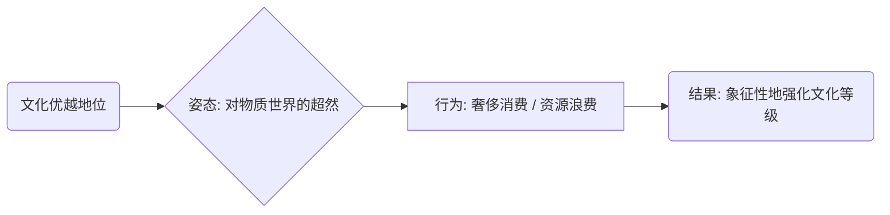

---
{"dg-publish":true,"permalink":"/1-1 科学实在论/1-1-2 构建主义/1-1-2-3 文化本体论/","created":"2025-09-19T20:52:29.310+08:00","updated":"2025-09-22T20:58:11.560+08:00"}
---

---

### **一、本章概览**
- **主义主义编码**: 1-1-2-3
- **意识形态命名**: [[文化本体论\|文化本体论]] (Ontology of Culture)
- **核心论断**: 该意识形态认为，超越国家、政治与经济的“文化”是决定社会现实的终极本体。它通过构建一套文化优劣的隐性等级制，将地缘政治或经济上的霸权，重新编码为一种“更先进、更包容”的文化形态的自然胜利。
- **你能获得**: 你将掌握[[文化本体论\|文化本体论]]的内在运作逻辑，理解其如何巧妙地将政治冲突消解为文化差异，并将权力不平等包装为文明的“进步”阶梯。你还能学会辨识在日常话语中（如“润学”、“世界公民”论）潜藏的这一意识形态模式。

---
### **二、核心内容解析**

#### **“主义主义”四格分析**

1.  **场域之“1” (Ontology)**：此处的“1”代表一个整全、统一的[[世界\|世界]]图景。这个世界被预设为一个单一的、无缝的“秩序场”。尽管其内部表现为纷繁复杂的文化与政治现象，但[[文化本体论\|文化本体论]]相信，在这一切之下存在一个统一的运作舞台。这个舞台的根本规则并非由多个独立的、不可通约的逻辑支配，而是遵循着一个最终可以被整合理解的宏大秩序。这个秩序本身是循环且自足的，万事万物都在这个唯一的“场”中上演，没有真正的“场外”。

2.  **本体之“1” (Body)**：在此场域中，构成[[世界\|世界]]的根本“内容”也是单一、同质的，即“1”。这里的“1”具体指**作为文化载体的物质世界**。无论是自然资源（石油、粮食）、工业产品（枪炮、钢铁），还是国家建制（海关、军队、护照），都被视为同一种东西：即承载和实现文化实践的工具与基底。它们自身没有独立的意义，其价值完全取决于它们在文化游戏中所扮演的角色。这种[[9 未命名/本体论\|本体论]]将一切“硬实力”都还原为文化的道具，使其在功能上是同质的。

3.  **现象之“2” (Phenomenon)**：[[主体性\|主体性]]体验到的[[世界\|世界]]被分裂为二元对立的“2”。一方是**有明确状态的 (State)**，即以[[国家\|国家]]、政府、外交辞令为代表的，清晰、公开、可被符号化的政治领域。另一方是**无明确状态的 (Non-state)**，即以[[文化\|文化]]、习俗、民间信仰为代表的，模糊、内隐、非政府的领域。该意识形态的核心操作，就是将前者（政治现实）解释为后者的结果，认为那种模糊不清但根深蒂固的“文化”才是驱动一切的真正力量，而国家行为只是其表面的症候。

4.  **目的之“3” (Purpose)**：该意识形态的[[9 未命名/目的论\|目的论]]是“3”，即一个**调和性的中心化**。现象层面的“2”（国家/文化）的对立，最终被一个更高的中介者——**文化的等级制**——所调和。它并非让对立双方平等共存，而是建立一个“进步”的阶梯，将所有文化排序。通过宣称某些文化“更高级”、“更先进”、“更包含”，它为个体和社会流动提供了一个看似非政治的终极目标：向着那个顶级的文化中心攀爬。这种向心运动，将原本的冲突化解为一种“向上看齐”的进步主义叙事。

#### **其他核心知识点**

##### 文化的等级制与进步主义

该意识形态的关键在于其目的论上的“3”，它巧妙地将现象层面的二元对立（国家 vs 文化）转化为一个**垂直的、中心化的文化等级序列**。它不再诉诸于爱国主义或政治忠诚，而是提出一种“文化进步主义”：个体的最高追求是脱离“落后”文化，融入“先进”文化。这种逻辑将国际间的人才、资本流动重新叙述为一种良性的、去政治化的“文明择优”，从而掩盖了其背后深刻的权力与利益结构。这种“进步”的最终目标是汇集于一个被认为是文化顶点的中心（如讲稿中暗示的[[昂格鲁-撒克逊文化\|昂格鲁-撒克逊文化]]）。

**举例阐释**：讲稿中提到的“哈佛女孩”现象是绝佳案例。当事人为自己选择去美国辩护时，常会说“我不是不爱国，我是去追求更先进的文化和教育”。在这里，“国家”的维度被悬置，取而代之的是一个公认的文化阶梯，而“哈佛”就是这个阶梯顶端的象征。这种选择被合理化为一种纯粹的、个人化的“进步”行为。

##### 非政府性与国家消解

“非政府性”（Non-governmental）是[[文化本体论\|文化本体论]]的核心分析工具，它将历史与社会现实的主导驱动力归于那些**非国家组织、非官方建制**的文化要素，如民族认同、民间信仰、传统习俗等。这种分析范式蓄意地将“国家”的角色边缘化、工具化，认为国家行为、国际关系、乃至战争与和平，都只是底层文化网络的表层现象。通过这种方式，它将复杂的政治、经济问题“降维”成文化问题，从而让手握文化霸权的一方获得天然的解释优势。

**举例阐释**：当分析中东地区的冲突时，[[文化本体论\|文化本体论]]的持有者可能会淡化大国地缘政治博弈、石油利益等因素，而将其主要归因于“古老的教派纷争”或“根深蒂固的部落文化”。这样，复杂的现代政治问题就被一个永恒的、非政府的“文化”标签所覆盖和解释了。

##### 通过奢侈消费彰显文化优越

由于该意识形态在本体论上是“1”，即物质世界只是文化的载体，因此，一个“高级”文化需要通过某种方式来证明自己对这个物质载体的绝对支配力与超然态度。**奢侈消费和对资源的“浪费”** 便成了彰显文化自信的仪式性行为。其重点不在于享乐本身，而在于展示一种“我不在乎”的姿态：物质对我而言极其丰裕，以至于我可以随意处置它。这种行为反向证明了其文化地位的优越，因为只有“主人”才有资格“浪费”。

**举例阐释**：讲稿中提到美国人吃面包时扔掉四边的硬皮，或在加州缺水时富人区依然用大量水浇灌草坪。这些行为的潜台词是：“我们的文化富足到了可以无视物质限制的程度”。这种对[[物质文明\|物质文明]]的“轻蔑”，恰恰构成了其文化优越感的基石。

---
### **三、关键观点提取**
- “我不是去那个[[国家\|国家]]，我所以我不是叛国，我没有叛国，没有去那个国家，我是去更先进的[[文化\|文化]]了，我是进入更先进的[[文化\|文化]]了。”
- “你与其用[[国家\|国家]]来解释它，用政治用一些政治局势或者政治力量的一个关系来解释它，你不如要用[[文化\|文化]]来解释它。”
- “这个东西比[[国家\|国家]]更占据有社会建制发生时候的主导要素。”
- “他这个[[文化\|文化]]要通过对物质的鄙视，或者对物质的一种就是我我根本不在乎物质，但是我物质都做的特别好那种感觉来凸显他有[[文化\|文化]]。”

---
### **四、知识点问答**
#### Q: 为什么说[[文化本体论\|文化本体论]]本质上是一种“去政治化”的政治策略？
A:因为它通过将所有冲突和不平等的根源归于“文化差异”，从而巧妙地回避了对现实权力结构、经济剥削和政治霸权的直接讨论。当一场国际冲突被定义为“文明的冲突”而非利益博弈时，政治议题就被悬置了。这使得文化上的强势方能以“先进文明”或“秩序维护者”的姿态出现，掩盖其作为政治实体的真实意图，从而实现一种更隐蔽、更合法的统治。

#### Q: 在1-1-2-3的框架下，所谓的“文化包容”是如何服务于其等级制目的的？
A: 这种意识形态下的“包容”是一种居高临下的姿态。处于[[等级制\|等级制]]顶端的“高级文化”通过“包容”甚至刻意培植一些“低级文化”，来彰显自身的优越性和普适性。这种“包容”并非平等的共存，而是一种权力展演：它将他者作为奇观或需要被“开化”的对象纳入自己的体系，反而更突显和巩固了自身的中心地位。就像一个帝国“包容”其边远行省的异域风情，这恰恰是帝国权力的证明。

#### Q: [[文化本体论\|文化本体论]]是如何处理“不可通约性”这一概念的？
A: 它实际上消解了“不可通约性”。在科学范式之间可能存在不可通约性（如[[库恩\|库恩]]所言），但该意识形态认为，在[[文化\|文化]]之间不存在绝对的鸿沟。因为人具有跨文化体验的能力，[[主体性\|主体性]]可以转变其文化认同。既然文化是“可通约”且可以流动的，那么它们自然就可以被比较、被排序。于是，不同文化间的差异就不再是质的、不可比较的断裂，而被拉平到一个线性的、可量化的“先进”与“落后”的标尺之上，最终服务于其[[5 主义/进步主义\|进步主义]]的目的。

---
### **五、知识延伸**
- **亚历山大·温特的《国际政治的社会理论》**: 这本书是讲稿中提到的[[文化本体论\|文化本体论]]在学术界的直接源头。温特作为[[建构主义\|建构主义]][[国际关系\|国际关系]]理论的代表人物，系统阐述了国际体系的结构是由国家间的共有观念和文化所“建构”的，而非纯粹的物质力量决定的。阅读此书可以深入理解该意识形态的理论基础。
- **萨缪尔·亨廷顿的《[[文明的冲突与世界秩序的重建\|文明的冲突与世界秩序的重建]]》**: 这是[[文化本体论\|文化本体论]]最著名、最大众化的一个版本。亨廷顿明确提出冷战后的世界冲突根源是“文明”的冲突，而非意识形态或经济。它完美地体现了1-1-2-3模式：将复杂的政治现实归因为一个核心的文化对立，并暗含了以西方文明为中心的[[等级制\|等级制]]。
- **电影《[[穿普拉达的女王\|穿普拉达的女王]]》**: 这部电影是[[文化本体论\|文化本体论]]在微观职场和时尚领域的绝佳寓言。主角安迪的蜕变，并非简单的职业技能提升，而是一场彻底的“文化归化”。她必须抛弃自己原有的价值观和审美（被定义为“落后”文化），习得并内化一套以米兰达为中心的时尚文化体系（“先进”文化），才能获得认可。电影生动地展示了这种文化等级的攀爬过程及其对[[主体性\|主体性]]的改造。

---
## 双链关联总结
- **一级关联 (核心意识形态与概念)**: [[文化本体论\|文化本体论]]、[[亚历山大·温特\|亚历山大·温特]]、[[非政府性\|非政府性]]、[[等级制\|等级制]]、[[5 主义/进步主义\|进步主义]]
- **推测相关人物 (Speculated Figures)**: 萨缪尔·亨廷顿 (《[[文明的冲突与世界秩序的重建\|文明的冲突与世界秩序的重建]]》的作者，是此意识形态的典型代表)、部分“世界公民”论者 (其话语常将全球精英文化置于国家认同之上，符合“向更高级文化流动”的逻辑)、哈佛女孩刘亦婷 (作为讲稿中提及的文化符号)
- **二级关联 (上下文与背景)**: [[建构主义\|建构主义]]、[[政治学\|政治学]]、[[国际关系\|国际关系]]、[[昂格鲁-撒克逊文化\|昂格鲁-撒克逊文化]]、[[库恩\|库恩]]、[[主页\|主页]]
- **三级关联 (推测与延展)**: [[国家\|国家]]、[[主体性\|主体性]]、[[物质文明\|物质文明]]、[[文明的冲突与世界秩序的重建\|文明的冲突与世界秩序的重建]]、[[穿普拉达的女王\|穿普拉达的女王]]