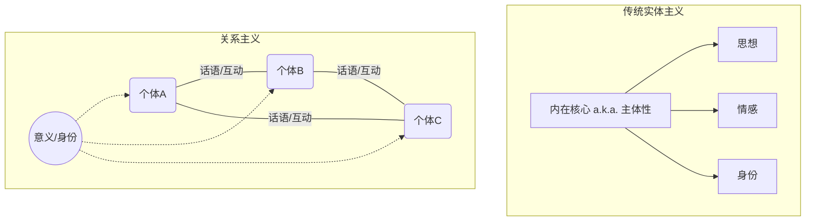
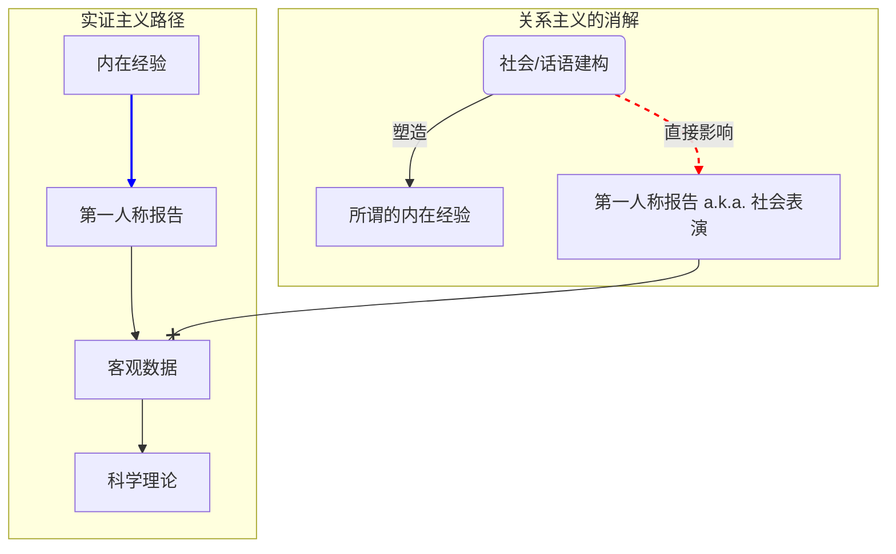
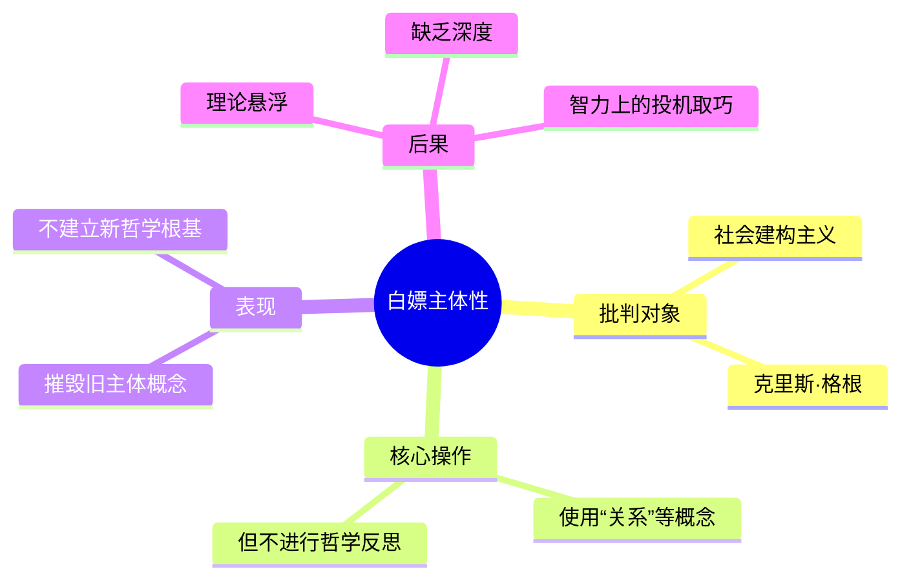

---
{"dg-publish":true,"permalink":"/1-1 科学实在论/1-1-2 构建主义/1-1-2-4 解构建构论/","created":"2025-09-19T20:52:29.311+08:00","updated":"2025-09-22T20:58:12.748+08:00"}
---

---

### **一、本章概览**
- **主义主义编码**: 1-1-2-4
- **意识形态命名**: [[社会建构主义 \|社会建构主义 ]] / [[解构建构论\|解构建构论]]
- **核心论断**: 该主义认为，世界本身是统一的、有客观结构的（1-1），但人类对世界的感知与体验（[[心理现实\|心理现实]]）完全是二元对立的社会话语的产物（2），这导致了一个永无止境、无目的的解构与重构过程，最终通向意义的虚无（4）。其核心问题在于，它用一种未经哲学反思的、扁平化的“[[5 主义/关系主义\|关系主义]]”来消解[[主体性\|主体性]]，是一种智力上的“[[白嫖主体性\|白嫖主体性]]”。
- **你能获得**: 通过本笔记，你将掌握对[[5 主义/社会建构主义\|社会建构主义]]这一特定心理学流派的“主义主义”诊断方法，理解其如何通过强调“关系”来解构“实体”，并洞悉其理论的内在矛盾及其在学术话语中的运作模式。

---
### **二、核心内容解析**
#### **“主义主义”四格分析**

1.  **场域之“1” (Ontology)**：该意识形态的[[存在论\|存在论]]底色，是一个典型的[[科学独断论\|科学独断论]]式的“1”。它预设了一个统一、完整且具备内在功能性结构的[[世界\|世界]]。这个世界是客观的、自在的，是所有社会建构活动发生之前就已经存在的舞台。虽然[[5 主义/社会建构主义\|社会建构主义]] (关系主义)在现象层面大谈话语和关系，但它从未真正质疑过这个作为背景的、唯一的、封闭的[[实在\|实在]]框架。这个“1”的场域是其理论得以展开却又从不言明的沉默前提，它为后续的话语游戏提供了一个看似稳固、实则未经反思的基座。

2.  **本体之“1” (Body)**：在这个统一的[[世界\|世界]]舞台上，其内容物也是同质化的“1”。它认为构成世界[[实在\|实在]]的是某种功能性的结构或客观关系，而非充满内在矛盾或分裂的元素。万物本质上是统一的，没有根本性的断裂。无论是物理定律还是社会运作的底层逻辑，都被看作是一个单一、连续的整体。这种对[[本体\|本体]]的“1”的设定，与[[场域\|场域]]之“1”共同构筑了一个前现代的、朴素实在论的后台，与其在[[现象\|现象]]层面表现出的后现代姿态形成了鲜明对比和深刻的内在矛盾。

3.  **现象之“2” (Phenomenon)**：这是该主义的核心操作所在。在[[现象\|现象]]层面，它引入了彻底的二元对抗“2”。[[主体性\|主体性]]的体验和知识，并非对那个统一世界（1-1）的直接反映，而是社会话语建构的产物。这里的核心对立是：**不可通达的[[实在\|实在]] vs. 作为唯一现实的话语/关系**。个体的[[心理现实\|心理现实]]、情感、身份认同，都被认为是在主体间的、充满张力的话语斗争中生成的。你的“自我”不再是一个内在的、统一的核心，而是不同社会关系和叙事相互冲突、相互定义的战场。

4.  **目的之“4” (Purpose)**：该意识形态的[[9 未命名/目的论\|目的论]]是“4”，即导向一个开放性的虚无。既然[[实在\|实在]]不可通达，而[[现象\|现象]]又只是永恒的话语建构，那么这场游戏就没有终点。其[[目的\|目的]]不是为了无限趋近真理（那会是“3”），也不是为了维持一个稳固的系统（那会是“1”），而是无休止地进行解构和再建构。这种永无宁日的“关系”置换过程，本身就是其全部的意义。这个“4”代表了系统因其内在矛盾（统一的[[实在\|实在]] vs. 对抗的话语）而无法闭合，最终只能导向一种没有根基、没有方向的、不断增殖的意义空洞。

#### **其他核心知识点**

##### 关系主义对实体主义的替代
这种理论的核心策略是用“[[关系\|关系]]”取代“[[实体\|实体]]”。传统的哲学与心理学往往预设了一个“实体性”的自我，即存在一个内在的、稳定的、可以被反思的[[主体性\|主体性]]核心，它拥有私人的思想和情感。而以[[克里斯·格根\|克里斯·格根]]为代表的[[5 主义/社会建构主义\|社会建构主义]] (关系主义)则主张，所谓的“自我”或“意义”并非内在于个体，而是产生于人与人之间的[[9 未命名/主体间性\|主体间性]]互动和话语实践中。你的身份、你的情感，甚至你的[[心理现实\|心理现实]]，都只是这张巨大社会关系网络上的一个节点或效应。这是一种彻底的去中心化、去实体化的视角，旨在将一切心理现象都还原为社会性的、流动的关系建构。

**举例阐释**：按照这种观点，你感到“悲伤”，不是因为你内心有一个私密的“悲伤”情感实体，而是因为你在特定的社会文化框架下，学会了如何识别某些生理反应和情境，并用“悲伤”这个词语在关系中去表达和表演它。你的“悲伤”是在与他人的互动中被定义和塑造的。

##### 对实证主义根基的消解
[[社会建构主义 \|社会建构主义 ]] (关系主义)对心理学领域的[[5 主义/实证主义\|实证主义]]构成了直接的冲击。[[5 主义/实证主义\|实证主义]]科学的合法性，很大程度上依赖于两个基石：第一人称的感性经验报告（例如，实验被试的感受陈述）和逻辑的[[明证性\|明证性]]。而关系主义通过宣称第一人称的[[心理现实\|心理现实]]本身就是社会建构的产物，直接动摇了前一个基石。如果你的报告并非来自一个可靠的“内在经验”，而是一种习得的社会表演，那么以其为基础收集的数据就丧失了客观性。它将科学话语本身也视为一种特定的、并非更优越的“语言游戏”，从而消解了其认识论上的特权地位。

**举例阐释**：一个依赖问卷调查来测量“幸福感”的心理学研究，在关系主义者看来是无效的。因为被试填写的答案并不反映其“真实”的幸福水平，而只是在“回答问卷”这一特定社会情境下，根据他对“幸福”一词的理解和对研究者的期望，进行的一场话语表演。

##### 白嫖主体性：未被反思的主体间性
这是讲稿中提出的核心批判。所谓“[[白嫖主体性\|白嫖主体性]]”，指的是[[克里斯·格根\|克里斯·格根]]等人的理论在摧毁旧的[[主体性\|主体性]]概念后，并未严肃地建立起新的哲学根基。它大量使用“[[关系\|关系]]”、“[[9 未命名/主体间性\|主体间性]]”、“[[他者性\|他者性]]”等源自欧陆哲学的复杂概念，但却完全抽空了这些概念在[[9 未命名/现象学\|现象学]]或[[9 未命名/精神分析\|精神分析]]中的深刻内涵。它只是简单地把“主体”消融进一个模糊不清的“关系”之网中，而对这个“关系”究竟如何可能、“他者”如何显现等根本问题避而不谈。它享受着解构带来的时髦与颠覆快感，却拒绝承担随之而来的、重建认识论根基的艰苦哲学工作，是在智力上“白嫖”了深层哲学概念的成果。

**举例阐释**：这就像一个人宣称“建筑是多余的，我们只需要砖块之间的连接就行了”，但他既不解释“连接”的力学原理，也不说明“砖块”从何而来，只是反复强调“连接”的重要性。[[5 主义/社会建构主义\|社会建构主义]] (关系主义)就是这样，它反复强调“关系”，却对构成关系的“主体”和“他者”以及“[[9 未命名/主体间性\|主体间性]]”本身的结构缺乏真正的洞察。

---
### **三、关键观点提取**
- “第一人称的[[心理现实\|心理现实]]是一种[[社会建构\|社会建构]]产物。”
- “它用[[关系\|关系]]，特别是主体间的话语来替代[[实体\|实体]]，也就是替代那个主体内在的[[明证性\|明证性]]的体验。”
- “这个其实是让你评称为[[白嫖主体性\|白嫖主体性]]，就是它对[[主体性\|主体性]]本身、[[9 未命名/主体间性\|主体间性]]和[[他者性\|他者性]]都是未反思的，无反思的。”
- “你读这本书你就知道这个人，[[克里斯·格根\|克里斯·格根]]这人是根本不懂哲学，我可以给下这个判断。”

---
### **四、知识点问答**
#### Q: 为何1-1-2-4编码下的社会建构主义最终导向一个“虚无”(4)而非一种新的“和谐”(3)？
A: 因为它的内在结构决定了它无法达成任何稳固的综合或调和。其[[场域\|场域]]和[[本体\|本体]]的“1”预设了一个统一的[[实在\|实在]]，但其[[现象\|现象]]的“2”又宣称这个[[实在\|实在]]不可通达，我们只能在二元对立的话语中游戏。这种“[[实在\|实在]]/话语”的根本分裂是无法弥合的。因此，它无法像“3”的结构那样，通过一个中介（如上帝、理性、国家）来调和矛盾、达至和谐。它只能在“解构-重建构”的循环中无限进行下去，每一个建构都注定是暂时的、任意的，从而使整个过程的目的性被悬置，最终指向一个不断生产差异但没有终极意义的[[虚无\|虚无]]。

#### Q: “[[白嫖主体性\|白嫖主体性]]”这一批判，揭示了该理论与真正的[[欧陆哲学\|欧陆哲学]]在处理“关系”问题上有什么根本不同？
A: 根本不同在于哲学反思的深度。像[[胡塞尔\|胡塞尔]]的[[9 未命名/现象学\|现象学]]或[[列维纳斯\|列维纳斯]]的伦理学，它们在谈论“[[关系\|关系]]”或“[[9 未命名/主体间性\|主体间性]]”时，会进行极其严格和细致的分析。它们会追问：另一个主体如何向我显现？我如何能先验地构成一个“他者”的经验？沟通和意义如何可能？而[[5 主义/社会建构主义\|社会建构主义]] (关系主义)则跳过了所有这些奠基性的工作，直接把“关系”当作一个不言自明的、现成的工具来使用。它只关心“关系”的效应，不关心“关系”的可能性条件。因此，它是一种应用的、工具性的理论，而非奠基性的、反思性的哲学。

#### Q: 根据讲稿，为何说[[克里斯·格根\|克里斯·格根]]的理论是一种“宏大叙事鸡汤”？
A: 因为它提供了一种简单、易于理解且看似深刻的“万能解药”叙事。它首先制造焦虑（“你的自我、你的痛苦都是虚假的、被建构的”），然后提供解决方案（“通过改变你的关系和话语，你就能重塑自我”）。这种“危机-疗法”的模式，将复杂的哲学和心理学问题简化为一套操作性的口号和技术，迎合了大众寻求快速解决方案的心理。它用“宏大叙事”（一切皆是社会建构）包装自己，但其内核却是实用主义的、缺乏哲学思辨深度的“心灵鸡汤”。

---
### **五、知识延伸**
- **[[理查德·罗蒂\|理查德·罗蒂]]的[[新实用主义\|新实用主义]]**: 罗蒂在哲学层面呼应了这种思想。他主张放弃对“真理符合实在”的追求，转而寻求“团结”，即在社群的话语中达成共识。他的思想可以看作是“1-1-2-4”意识形态的一个更精致、更具哲学深度的版本，同样强调话语和社群在塑造我们信念中的核心作用，可作为参照。
- **[[6 哲学家/埃德蒙德·胡塞尔\|埃德蒙德·胡塞尔]]的《[[笛卡尔式的沉思\|笛卡尔式的沉思]]》**: 此书是批判“[[白嫖主体性\|白嫖主体性]]”的绝佳理论武器。其中第五沉思详细阐述了先验现象学如何通过“移情”作用在我思（ego）内部构成一个“他我”（alter ego），为[[9 未命名/主体间性\|主体间性]]提供了坚实的哲学基础。阅读此书可以深刻理解[[5 主义/社会建构主义\|社会建构主义]](关系主义)所回避的哲学难题究竟是什么。
- **[[6 哲学家/米歇尔·福柯\|米歇尔·福柯]]的权力理论**: 虽然福柯也强调话语和权力对主体的建构作用，但他与[[克里斯·格根\|克里斯·格根]]有本质区别。[[福柯\|福柯]]的[[权力\|权力]]是[[微观权力\|微观权力]]，是与知识紧密扭结、渗透在社会肌体中的具体实践。他的分析是历史性的、谱系学的，而非提供一种普适性的心理疗法。将福柯与格根对比，能更好地看清后者理论的简化和庸俗化倾向。

---
## 双链关联总结
- **一级关联 (核心意识形态与概念)**: [[5 主义/社会建构主义\|社会建构主义]]、[[解构建构论\|解构建构论]]、[[主页\|主页]]、[[5 主义/关系主义\|关系主义]]、[[实体主义\|实体主义]]、[[心理现实\|心理现实]]、[[白嫖主体性\|白嫖主体性]]、[[实在\|实在]]、[[现象\|现象]]
- **推测相关人物 (Speculated Figures)**: [[克里斯·格根\|克里斯·格根]] (讲稿直接批判的核心人物)、[[理查德·罗蒂\|理查德·罗蒂]] (哲学上的高级同盟，共享相似的放弃真理、拥抱话语的姿态)
- **二级关联 (上下文与背景)**: [[心理学\|心理学]]、[[5 主义/后现代主义\|后现代主义]]、[[5 主义/实证主义\|实证主义]]、[[欧陆哲学\|欧陆哲学]]、[[9 未命名/现象学\|现象学]]、[[观念论\|观念论]]
- **三级关联 (推测与延展)**: [[主体性\|主体性]]、[[9 未命名/主体间性\|主体间性]]、[[他者性\|他者性]]、[[明证性\|明证性]]、[[语言游戏\|语言游戏]] (维特根斯坦)、[[微观权力\|微观权力]]、[[福柯\|福柯]]、[[胡塞尔\|胡塞尔]]