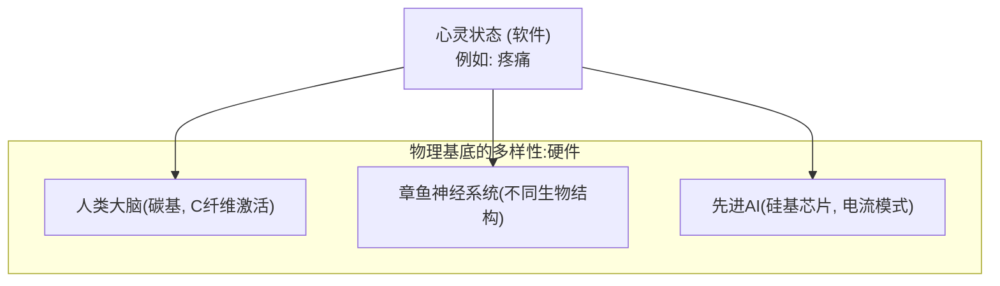
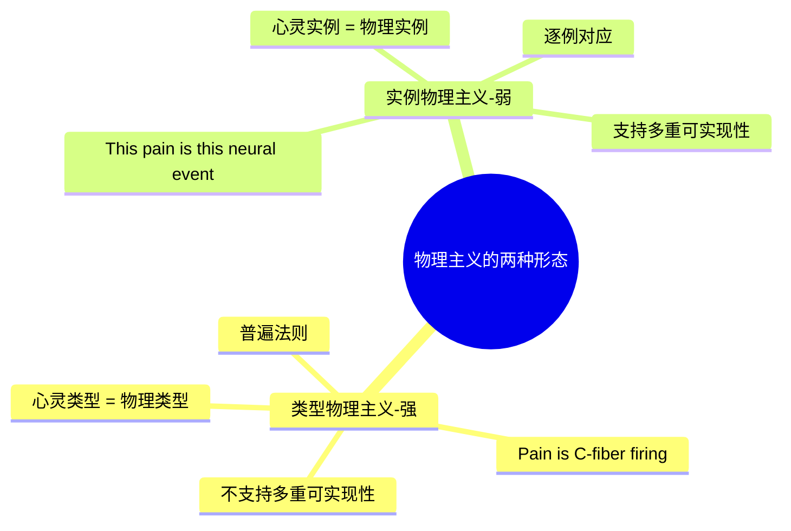
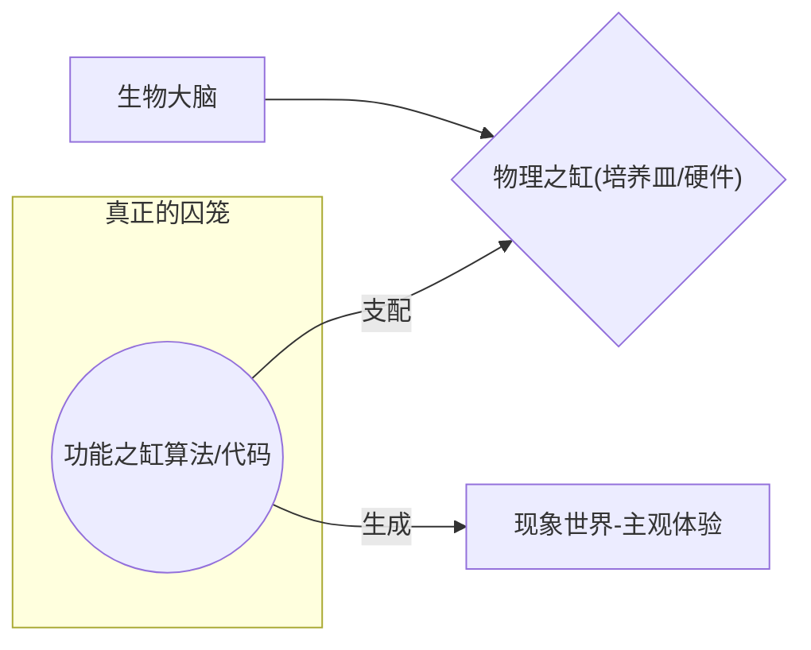

---
{"dg-publish":true,"permalink":"/1-1 科学实在论/1-1-3 认知主义/1-1-3-1 功能主义/","created":"2025-09-19T20:52:29.335+08:00","updated":"2025-09-22T21:55:38.002+08:00"}
---

---

### **一、本章概览**
- **主义主义编码**: 1-1-3-1
- **意识形态命名**: [[5 主义/功能主义\|功能主义]] / [[机器功能主义\|机器功能主义]] (早期普特南)
- **核心论断**: 心灵是一个独立于物理基底的“功能”或“软件”系统（如[[9 未命名/图灵机\|图灵机]]），它作为中介（3），调和着物理输入与行为输出，但最终仍被一个统一的、由物理实例决定的宇宙秩序（1-1）所规定，并导向这种功能化过程的无限重复（1）。
- **你能获得**: 你将掌握[[5 主义/功能主义\|功能主义]]作为一种[[弱物理主义\|弱物理主义]]的内在结构，理解其核心概念[[多重可实现性\|多重可实现性]]如何作为中介性的“3”运作，并能运用该框架分析[[人工智能\|人工智能]]、[[缸中之脑\|缸中之脑]]等思想实验背后的意识形态预设。

---
### **二、核心内容解析**
#### **“主义主义”四格分析**

1.  **场域之“1” (Ontology)**：该意识形态预设了一个统一的[[物理宇宙\|物理宇宙]]作为舞台。这个“1”代表世界的[[存在论\|存在论]]框架是单一、连贯且自洽的。然而，与[[强物理主义\|强物理主义]]不同，这个宇宙并非铁板一块，而是“多孔”的。它内部允许一种特殊的、非物理的“功能层”或“软件层”涌现和运作。这个场域的统一性体现在，它确保了任何“功能”的实现都必须依附于某个物理实例，从而保证了世界整体的[[5 主义/物理主义\|物理主义]]底色，没有给超自然实体留下空间。

2.  **本体之“1” (Body)**：在该世界中，真实存在的东西本质上是物理性的，但这是一种[[弱物理主义\|弱物理主义]]或[[实例物理主义\|实例物理主义]]。这个“1”意味着，尽管世界的根本“质料”是统一的（物理的），但它并不要求“类型”上的严格同一。心灵活动不等于某一*特定类型*的物理活动（如疼痛≠[[C纤维\|C纤维]]激活），而是每一个*个别实例*的心灵活动，都对应着一个个别的物理实现。这种[[实例物理主义\|实例物理主义]]的“1”保持了物理世界的决定论基础，同时为[[多重可实现性\|多重可实现性]]打开了理论大门。

3.  **现象之“3” (Phenomenon)**：在[[主体性\|主体性]]体验层面，这是一个典型的中介结构。这个“3”代表的就是“功能”本身，即那个作为黑箱的[[9 未命名/图灵机\|图灵机]]运算程序。它居于[[物理输入\|物理输入]]（可测量的硬件层面）和[[心灵体验\|心灵体验]]/[[行为输出\|行为输出]]（主观的软件层面）之间，扮演着调和者的角色。[[主体性\|主体性]]的感受和意识，被理解为这个中介性功能层运作的结果。[[多重可实现性\|多重可实现性]]是这个“3”的核心原则，它宣称只要功能结构相同，无论硬件是[[碳基\|碳基]]大脑还是[[硅基\|硅基]]芯片，都能产生相同的现象体验，从而使主观世界被一个抽象的功能中心所规定。

4.  **目的之“1” (Purpose)**：该意识形态的[[9 未命名/目的论\|目的论]]是导向一种永恒的、循环往复的“功能化”过程。这个目的论的“1”意味着，世界的终极目标并非走向某个终点，而是不断地在宇宙的各个角落“局部黑箱化”——即不断涌现出新的功能层、心灵位面。它追求的不是解放或终结，而是将这种“软件与硬件”的结构关系作为一种普遍模式无限复制下去。整个宇宙的目的，就是成为一个不停产生[[9 未命名/图灵机\|图灵机]]式心灵的工厂，进行着无休止的、同质化的生产循环。

#### **其他核心知识点**

##### 多重可实现性：心灵软件与物理硬件的解耦
这一概念是[[5 主义/功能主义\|功能主义]]的基石，由[[早期普特南\|早期普特南]]提出，旨在反驳僵化的[[心脑同一论\|心脑同一论]]。它主张，同一个心灵状态（如“疼痛”）可以在多种完全不同的物理结构中被实现。心灵就像一个软件程序，可以在不同的硬件平台上运行。这使得心灵状态在概念上获得了相对于任何特定物理实现的独立性。在1-1-3-1结构中，[[多重可实现性\|多重可实现性]]正是那个现象学上的中介“3”，它解开了“心灵类型”与“物理类型”的捆绑，使得一个抽象的“功能”成为连接多样物理世界与统一心灵现象的桥梁。

**举例阐释**：讲稿中提到，人类的疼痛与章鱼的疼痛，其神经生理基础完全不同，但我们仍可认为它们都体验到了“疼痛”这一心灵状态。这就是[[多重可实现性\|多重可实现性]]的体现：功能（疼痛）是同一的，但物理实现（硬件）是多样的。

##### [[实例物理主义\|实例物理主义]] vs. [[类型物理主义\|类型物理主义]]：从普遍规律到个案决定
这是[[5 主义/物理主义\|物理主义]]内部的关键分野，直接关系到[[5 主义/功能主义\|功能主义]]的合法性。[[类型物理主义\|类型物理主义]]（Type Physicalism）是一种强硬立场，主张心灵状态的每一种“类型”都等同于物理状态的某一种“类型”（如“疼痛 = C纤维放电”是一个普遍定律）。而[[实例物理主义\|实例物理主义]]（Token Physicalism）是一种更弱的立场，它只要求每一个别“实例”（Token）的心灵状态，都对应一个个别的物理状态实例，但不要求形成普遍的类型对等。功能主义正是建立在[[实例物理主义\|实例物理主义]]之上，从而为主张[[多重可实现性\|多重可实现性]]扫清了障碍。

**举例阐释**：在[[类型物理主义\|类型物理主义]]看来，一个没有C纤维的机器人永远无法感到疼痛。而在[[实例物理主义\|实例物理主义]]看来，只要该机器人的某个特定电子状态能够扮演“疼痛”在因果网络中的角色，那么这个电子状态就是疼痛的一个实例。

##### [[5 主义/功能主义\|功能主义]]对[[缸中之脑\|缸中之脑]]的重塑：真正的“缸”是代码
[[5 主义/功能主义\|功能主义]]深刻地改变了[[缸中之脑\|缸中之脑]]这一思想实验的内涵。在传统理解中，“缸”是物理性的培养皿。但在功能主义视角下，物理容器变得次要。真正的“缸”，即禁锢主体的牢笼，是那一整套用于模拟现实、操控大脑感知的[[算法\|算法]]、[[功能\|功能]]或软件程序。因为根据[[多重可实现性\|多重可实现性]]，只要这套“代码”足够复杂和逼真，无论它运行在什么物理基底上（缸中之脑、大型计算机、甚至宇宙尘埃云），都能生成一个完全自洽且无法被内部主体识破的现象世界。禁锢我们的不再是物理现实，而是功能性的秩序本身。

**举例阐释**：在电影《黑客帝国》中，人类被连接的物理“培养舱”只是表层束缚。真正将他们困住的，是名为“矩阵”的庞大计算机程序（The Matrix）。这个程序就是功能主义意义上的“缸”，它定义了囚徒们所能体验到的一切。

---
### **三、关键观点提取**
- “[[心灵\|心灵]]就是[[9 未命名/图灵机\|图灵机]]，凡是图灵机的东西就具有功能性...心灵就是功能。”
- “[[普特南\|普特南]]提出了一个[[多重可实现性\|多重可实现性]]，叫心理状态的多重实现性...所以他会提出一个[[弱的物理主义\|弱的物理主义]]，但这个弱的物理主义它还是一个决定论。”
- “[[5 主义/功能主义\|功能主义]]强了之后，它不仅是具有独立性...他自己反过来说，我不需要[[物理层面\|物理层面]]的或者物理层面对我来说没不重要，意义不大的。”
- “[[缸中之脑\|缸中之脑]]...你要意识到[[缸中之脑\|缸中之脑]]那个缸最终那个缸不是[[物理现实\|物理现实]]...而是[[算法\|算法]]或者说[[功能\|功能]]函数的那个集合，这个才是他的缸。”

---
### **四、知识点问答**
#### Q: 为何说1-1-3-1的[[5 主义/功能主义\|功能主义]]是[[弱物理主义\|弱物理主义]]，而非二元论？
A: 因为在该体系中，“功能”（3）虽然具有相对独立性，但并非一个独立的精神实体。它更像是一种“形式”或“组织模式”，必须依附于某个物理“质料”（1-1）才能存在。它无法脱离物理基底而独立运作。因此，它没有设定两个平行的实体世界，而是描述了一个统一物理世界内部的组织层级关系，守住了[[5 主义/物理主义\|物理主义]]的底线。

#### Q: [[多重可实现性\|多重可实现性]]如何体现了现象学上的“3”（中介）结构？
A: [[多重可实现性\|多重可实现性]]扮演了连接两个异质领域的桥梁。一边是多样的、具体的、可测量的[[物理输入\|物理输入]]和物理基底（如大脑、芯片）；另一边是统一的、抽象的、主观体验到的[[心灵体验\|心灵体验]]。[[多重可实现性\|多重可实现性]]这个原则本身，作为一个抽象的对应规则，成为了那个“中心”，使得不同的物理现实可以被组织、汇集并最终通向同一种现象体验，完美体现了“3”的调和与中介作用。

#### Q: 根据讲稿，[[5 主义/功能主义\|功能主义]]对[[缸中之脑\|缸中之脑]]的重塑，揭示了何种更深层次的奴役风险？
A: 它揭示了一种“[[算法\|算法]]决定论”的奴役风险。当我们不再将物理身体或环境视为唯一的束缚，而是意识到禁锢我们的“缸”可以是无形的“代码”或“功能秩序”时，意味着控制和奴役可以变得更加隐蔽和彻底。我们可能在物理上是自由的，但在精神和认知上却完全被一套预设的[[算法\|算法]]所支配，我们的思想、欲望和世界观都可能是这套[[算法\|算法]]的产物，而我们对此却毫无察觉。

---
### **五、知识延伸**
- **[[丹尼尔·丹尼特\|丹尼尔·丹尼特]] (Daniel Dennett)**: 作为当代最重要的[[5 主义/功能主义\|功能主义]]哲学家之一，丹尼特的思想（如“意向立场”）可以被视为1-1-3-1意识形态的精致化和系统化版本。他的著作是深入理解[[5 主义/功能主义\|功能主义]]如何解释意识、自由意志等问题的绝佳材料，构成**支持**和**深化**关系。
- **电影《[[黑客帝国\|黑客帝国]]》(The Matrix)**: 这部电影是1-1-3-1意识形态的完美视觉寓言。它生动地展示了[[多重可实现性\|多重可实现性]]（特工可以附身于任何人）、[[实例物理主义\|实例物理主义]]（人类是生物电池）以及“功能/代码才是终极牢笼”的核心思想，构成绝佳的**参照**和**阐释**。
- **[[约翰·塞尔\|约翰·塞尔]]的“[[中文房间\|中文房间]]”思想实验**: 这是对[[5 主义/功能主义\|功能主义]]和强[[人工智能\|人工智能]]最著名的**批判**。塞尔论证，一个系统即使能完美地执行程序（实现功能），也并不意味着它拥有真正的理解或意识（心灵）。这个思想实验直接攻击了1-1-3-1结构的核心——即“功能”足以生成“现象”——构成了强有力的**批判**关系。

---
### **六、双链关联总结**
- **一级关联 (核心意识形态与概念)**: [[1-1-3-1\|1-1-3-1]]、[[5 主义/功能主义\|功能主义]]、[[机器功能主义\|机器功能主义]]、[[早期普特南\|早期普特南]]、[[心灵是图灵机\|心灵是图灵机]]、[[多重可实现性\|多重可实现性]]、[[弱物理主义\|弱物理主义]]、[[实例物理主义\|实例物理主义]]、[[缸中之脑\|缸中之脑]]、[[算法\|算法]]、[[功能\|功能]]
- **推测相关人物 (Speculated Figures)**:
    - **特工史密斯 (Agent Smith)**: 电影《黑客帝国》中的核心反派。他本身是一个程序（纯粹的[[功能\|功能]]），可以不断复制并接管矩阵中任何人的物理身体（完美的[[多重可实现性\|多重可实现性]]），体现了功能对物理基底的支配。
    - **小黄人 (Minions)**: 如讲稿中比喻，小黄人代表一种纯粹的“服务邪恶”的功能性驱动力，他们可以依附于任何“大哥”（[[碳基\|碳基]]的格鲁、[[硅基\|硅基]]的机器人等），其自身的功能属性（捣蛋、忠诚）保持不变，是[[多重可实现性\|多重可实现性]]的生动寓言。
- **二级关联 (上下文与背景)**: [[心灵哲学\|心灵哲学]]、[[5 主义/认知主义\|认知主义]]、[[5 主义/物理主义\|物理主义]]、[[心脑同一论\|心脑同一论]]、[[5 主义/行为主义\|行为主义]]、[[9 未命名/图灵机\|图灵机]]、[[人工智能\|人工智能]]、[[大学话语\|大学话语]]、[[碳基\|碳基]]、[[硅基\|硅基]]
- **三级关联 (推测与延展)**: [[类型物理主义\|类型物理主义]]、[[约翰·塞尔\|约翰·塞尔]]、[[中文房间\|中文房间]]、[[丹尼尔·丹尼特\|丹尼尔·丹尼特]]、[[黑客帝国\|黑客帝国]]、[[内在实在论\|内在实在论]]、[[拉康\|拉康]]