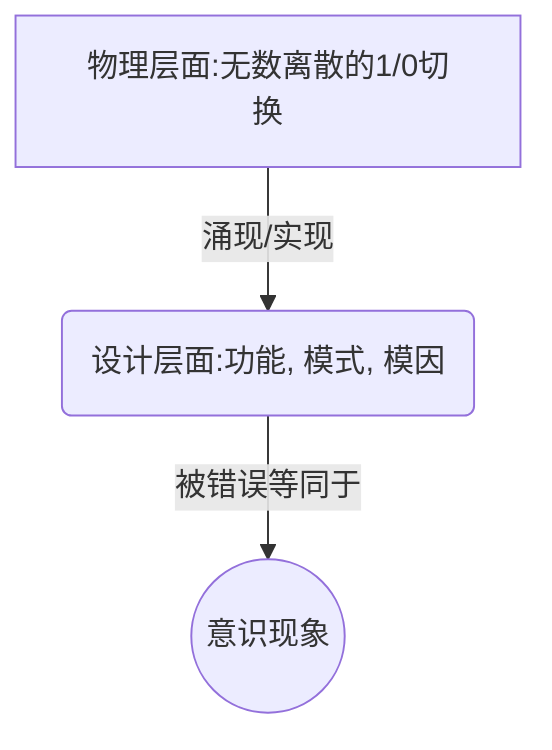
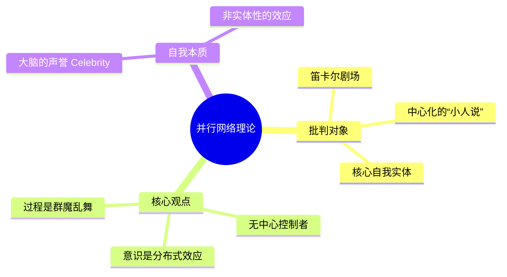
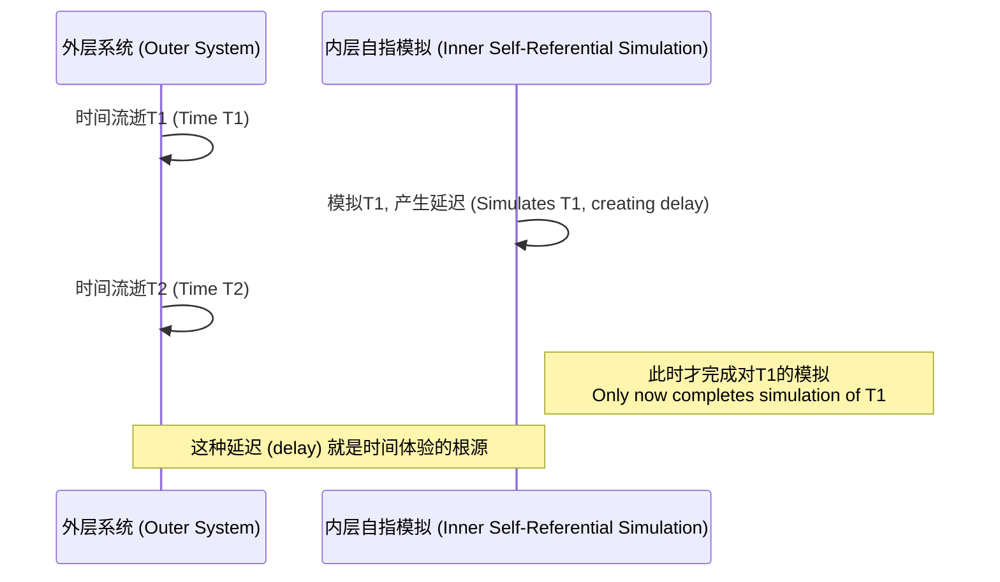

---
{"dg-publish":true,"permalink":"/1-1 科学实在论/1-1-3 认知主义/1-1-3-2 自由进化论/","created":"2025-09-19T20:52:29.338+08:00","updated":"2025-09-22T21:57:28.628+08:00"}
---

---

### **一、本章概览**
- **主义主义编码**: 1-1-3-2
- **意识形态命名**: [[自由进化论\|自由进化论]]
- **核心论断**: 该意识形态将[[意识\|意识]]理解为一种从简单的物理底层（1/0）中涌现出的复杂“[[设计层面\|设计层面]]”的功能性效果，其核心机制是[[9 未命名/模因\|模因]]的竞争性进化。其主要理论缺陷在于，它将功能复杂性等同于[[意识\|意识]]本身，却从未反思支撑这一切得以可能的统一[[场域\|场域]]和[[时间性\|时间性]]的先验条件。
- **你能获得**:
  - 掌握“主义主义”编码 1-1-3-2 的完整诊断框架。
  - 理解 [[丹尼尔·丹尼特\|丹尼尔·丹尼特]] 心灵哲学的核心概念，如“[[设计层面\|设计层面]]”和“[[并行网络\|并行网络]]”。
  - 学习如何从[[齐泽克\|齐泽克]]和[[黑格尔\|黑格尔]]的视角，批判性地审视这种理论在[[时间性\|时间性]]和[[自指性\|自指性]]问题上的盲点。
  - 获得将抽象哲学概念（如[[元胞自动机\|元胞自动机]]）应用于意识形态分析的实例。

---
### **二、核心内容解析**

#### **“主义主义”四格分析**

1.  **场域之“1” (Ontology)**：该意识形态预设的世界是一个统一、同质且封闭的竞争性[[场域\|场域]]。这个[[世界\|世界]]在本体论上被想象成一个巨大的、规则统一的棋盘或矩阵，如同一个[[元胞自动机\|元胞自动机]]的无限网格。在这个单一的舞台上，万物（[[9 未命名/模因\|模因]]）遵循着同一套底层物理规则进行无休止的竞争与演化。这个“1”的整全性体现在其规则的普适性与空间的无差别性上，它为所有现象提供了一个绝对稳固、不被反思的背景。讲稿批判的正是这种对[[场域\|场域]]本身的“理所当然”，它忽视了支撑这个统一场域得以存在的[[存在之差\|存在之差]]。

2.  **本体之“1” (Body)**：在这个统一的[[场域\|场域]]中，真正[[实在\|实在]]的“本体”被还原为单一、同质的物理单元。[[丹尼尔·丹尼特\|丹尼尔·丹尼特]]将其设想为海量的、离散的“有/无”或“1/0”切换状态，如同计算机像素的开关或沙丘中的每一粒沙。这种本体论上的“1”是一种激进的还原论，它认为所有复杂的宏观构造物，其本质不过是这些微观单元的聚合与排列。这种视角虽然解释了内容的同质性，但却无法解释形式的起源，即这些“1/0”单元为何能组合成具有持续性与功能的“[[设计层面\|设计层面]]”，它回避了从纯粹的量变到质变的真正动力。

3.  **现象之“3” (Phenomenon)**：[[主体性\|主体性]]的体验和[[意识\|意识]]现象，是通过一个作为[[中介\|中介]]的“[[设计层面\|设计层面]]”被理解的。这个“3”的核心作用在于调和底层物理现实（离散的“1/0”开关）与高层意识体验（连续、饱和的感受）之间的巨大鸿沟。丹尼特认为，当底层的简单机制组合得足够复杂时，就会在“[[设计层面\|设计层面]]”涌现出记忆、计算、识别等心智功能。他犯下的错误（被[[齐泽克\|齐泽克]]称为“预期理由”）在于，他将这种功能性复杂度的“奇迹”直接等同于[[意识\|意识]]，用这个作为[[中介\|中介]]的功能层来“解释”意识，实际上是绕过了对[[意识\|意识]]本身是什么的核心追问。

4.  **目的之“2” (Purpose)**：该意识形态的[[9 未命名/目的论\|目的论]]体现为一个根本性的[[对抗性\|对抗性]]/分裂（“2”），即一种“[[突变性\|突变性]]”。这个“2”并非指不同实体间的斗争，而是指从极其简单的物理层面（本体“1”）到极其复杂的设计层面（现象“3”）之间的断裂式飞跃。这种[[突变性\|突变性]]被视为一种“涌现”或“自由进化”，但其内在机制并未被阐明，成了一个黑箱。讲稿的核心批判在于，丹尼特所理解的“突变”是肤浅的，真正的、能产生[[主体性\|主体性]]的突变，是一种包含[[自指性\|自指性]]的结构（如在[[Minecraft\|Minecraft]]里造电脑再运行[[Minecraft\|Minecraft]]），这种结构会创造出“延迟”与[[时间性\|时间性]]，而这恰恰是[[自由进化论\|自由进化论]]所缺失的维度。

#### **其他核心知识点**

##### 设计层面 (The Design Stance)
“[[设计层面\|设计层面]]”是[[丹尼尔·丹尼特\|丹尼尔·丹尼特]]理论的核心，它指一种理解系统行为的功能性视角，区别于纯粹的物理视角。在这个层面上，我们不再关注底层的物理构件（如晶体管的开关），而是关注系统展现出的宏观模式、功能和目的（如程序的运行、[[元胞自动机\|元胞自动机]]中“滑翔机”的移动）。[[自由进化论\|自由进化论]]认为，[[意识\|意识]]和心智功能就存在于这个[[设计层面\|设计层面]]，它是由简单的物理现实所实现的、可独立分析的“软件”层。这是一种功能主义的延伸，但其危险在于将功能的实现误认为就是[[意识\|意识]]本身。

**举例阐释**：讲稿中提到的[[元胞自动机\|元胞自动机]]里的“滑翔机”（Glider）。在物理层面，它只是一系列像素点按照简单规则在特定时刻的“开”或“关”。但在[[设计层面\|设计层面]]，我们感知到的是一个连贯的、有身份的“物体”在向右下角“移动”。这个“移动的滑翔机”就是一种[[设计层面\|设计层面]]的实在，尽管在物理上没有一个东西真正在移动。

##### 并行网络与无我论 (Parallel Networks and the Theory of No-Self)
这是[[丹尼尔·丹尼特\|丹尼尔·丹尼特]]为反对“[[笛卡尔剧场\|笛卡尔剧场]]”理论（即大脑中有一个中心“小人”在观看和指挥）而提出的模型。他认为，大脑不是一个有中心控制器的等级系统，而是一个由大量、离散的神经元功能组构成的[[并行网络\|并行网络]]（Parallel Networks）。在这个网络中，各种[[9 未命名/模因\|模因]]或“观念”群魔乱舞、相互竞争，不存在一个核心的“自我”在进行仲裁。所谓的“自我意识”，不过是这个并行处理过程中涌现出的一个暂时的、不具实体性的效应，如同大脑的“声誉”（Celebrity），而非一个真实的、统一的实体。

**举例阐释**：当大脑的某个部分受损时，意识功能可能会部分受损，但“自我”感不一定完全消失。这被丹尼特用以支持其观点：意识不是由某个“核心脑区”产生的，而是整个[[并行网络\|并行网络]]协同运作的结果，具有高度的分布性和弹性。

##### 作为突变性的时间延迟 (Time-Delay as True Mutation)
这是讲稿作者提出的、用以批判[[自由进化论\|自由进化论]]的核心论点。作者认为，丹尼特所说的“[[突变性\|突变性]]”只是对“复杂性如何从简单性中涌现”这一问题的回避。真正的[[突变性\|突变性]]，是能产生[[意识\|意识]]和[[时间性\|时间性]]的结构性飞跃，它源于[[自指性\|自指性]]（Self-Reference）。当一个系统能够在自身内部模拟自身时（如在游戏中造出一台能运行该游戏的电脑），必然会产生一个“延迟”：内部模拟的“时间”会落后于外部世界的“时间”。这个由[[自指性\|自指性]]创造出的时间裂隙或延迟，正是[[内在性\|内在性]]和主体体验得以可能的基础。

**举例阐释**：讲稿中绝妙的例子——“在[[Minecraft\|Minecraft]]里做了一个电脑，这个电脑里面又跑一个[[Minecraft\|Minecraft]]”。外部[[Minecraft\|Minecraft]]世界里的时间流逝是基准，而内部电脑里运行的[[Minecraft\|Minecraft]]的时间流逝必然会慢一步。这个“慢一步”的延迟，就是[[时间性\|时间性]]体验的结构性来源，它创造了一个与外部世界不同的“内在”节奏。

---
### **三、关键观点提取**
- “[[齐泽克\|齐泽克]]说这个东西就好像是沙丘一样的沙丘...你看整个沙丘的话，你就会觉得这整个沙丘在运动...这种可以维持自己特殊形式的...这种[[设计层面\|设计层面]]的这种单元，存在单元就叫做[[9 未命名/模因\|模因]]。”
- “在他...体系里面，他就是说他是反对...[[笛卡尔剧场\|笛卡尔剧场]]，是吧？他是反对那个的，他是反对小人说的，反对小矮人说，他反对所谓的核心自我。”
- “丹尼尔耍了一个花招...他犯了一种错误叫做...预期理由...大家看看这种设计这么的灵巧...他肯定有[[意识\|意识]]的那一层...所以他就把[[意识\|意识]]的层面等同于这种[[设计层面\|设计层面]]、功能层面。”
- “什么叫[[时间\|时间]]？时间就是你在[[Minecraft\|Minecraft]]里面做了一个电脑，这个电脑里面又跑一个[[Minecraft\|Minecraft]]...外面那个[[Minecraft\|Minecraft]]动一下，里面那个[[Minecraft\|Minecraft]]它的要过一段时间它才会再动一下。这就才有延迟，才有[[时间性\|时间性]]，才有历史的。”

---
### **四、知识点问答**
#### Q: 为何说“自由进化论”的“设计层面”是其主义主义编码中典型的“3”？
A: 因为“[[设计层面\|设计层面]]”在该理论中扮演了完美的[[中介\|中介]]角色。它自身既非纯粹的物理底层（离散的1/0），也非完整的[[意识\|意识]]现象（饱和的体验），而是处在两者之间，试图调和它们的矛盾。它用一种功能性的、可计算的模式（如[[元胞自动机\|元胞自动机]]的图形）来解释[[意识\|意识]]是如何从无到有地“涌现”的，从而将一个本体论的巨大鸿沟（物理-心灵）转化为一个看似可解的、渐进的功能实现问题。这个“[[中介\|中介]]”的角色正是数字“3”的核心功能。

#### Q: 讲稿作者认为丹尼特在本体论层面（四格中的“1”）犯了什么根本性错误？
A: 作者认为丹尼特没有进行彻底的本体论反思，即没有思考“[[存在之差\|存在之差]]”。他将世界设想为一个巨大的、可供1/0进行切换的网格（[[场域\|场域]]），并将这些1/0切换的单元当作最基本的“存在”（[[本体\|本体]]）。但他从未追问：这个允许1/0切换的、巨大的、统一的网格本身，它的“存在”是什么？这个背景性的[[场域\|场域]]是如何可能的？他只反思了场内的“存在者”（beings），却没有反思“存在”本身（Being），因此其本体论是浅薄和前批判的。

#### Q: “Minecraft里造电脑”的比喻，如何精准地揭示了“自由进化论”关于“突变”（目的论之“2”）的理解缺陷？
A: 该比喻揭示了丹尼特所说的“[[突变性\|突变性]]”是一种没有内在机制的、神秘的“涌现”，而真正的[[突变性\|突变性]]源于[[自指性\|自指性]]。丹尼特的模型（1-1-3-2）中的“2”是一个外部断裂，即简单物理层和复杂设计层之间的无法解释的飞跃。而“[[Minecraft\|Minecraft]]”的比喻则展示了一种内在的、辩证的突变：系统通过在内部复制自身，创造了一个结构性的“延迟”或“裂缝”。这个裂缝就是[[时间性\|时间性]]和[[内在性\|内在性]]诞生的空间。因此，丹尼特的“2”是一个扁平的、无深度的突变，而讲稿所强调的“2”是一个具有深度、能产生新维度的、真正的[[对抗性/分裂\|对抗性/分裂]]。

---
### **五、知识延伸**
- **[[丹尼尔·丹尼特\|丹尼尔·丹尼特]]《[[意识的解释\|意识的解释]]》 (Consciousness Explained)**: 这是本讲稿主要批判的文本，是[[自由进化论\|自由进化论]]的代表作。直接阅读它，可以更清晰地理解其理论构造（如“多重草稿模型”）以及讲稿中批判的靶子究竟是什么，构成直接的**参照关系**。
- **[[理查德·道金斯\|理查德·道金斯]]《[[自私的基因\|自私的基因]]》**: 该书首次提出了“[[9 未命名/模因\|模因]]”（meme）的概念，丹尼特将其从文化领域借用到了心灵哲学领域，作为其理论中信息单元进化的基础。阅读此书有助于理解丹尼特理论的**思想来源和支持**。
- **[[6 哲学家/斯拉沃热·齐泽克\|斯拉沃热·齐泽克]]《[[视差之见\|视差之见]]》**: 齐泽克是讲稿中批判性视角的主要来源。本书深入探讨了本体论的“视差裂缝”，即观察位置的改变会导致对象本身的改变，不存在一个中立的观察点。这可以用来深刻批判丹尼特那种自认为客观的“[[设计层面\|设计层面]]”，揭示其背后隐藏的意识形态预设，构成强大的**批判关系**。

---
### **六、双链关联总结**
- **一级关联 (核心意识形态与概念)**: [[自由进化论\|自由进化论]], [[丹尼尔·丹尼特\|丹尼尔·丹尼特]], [[设计层面\|设计层面]], [[元胞自动机\|元胞自动机]], [[9 未命名/模因\|模因]], [[并行网络\|并行网络]], [[突变性\|突变性]], [[意识的解释\|意识的解释]]
- **推测相关人物 (Speculated Figures)**: 某些信奉[[强人工智能\|强人工智能]]的[[技术决定论\|技术决定论]]者（他们相信足够复杂的算法和算力能“涌现”出真正的意识，是[[自由进化论\|自由进化论]]在当代科技领域的实践者）；[[雷·库兹韦尔\|雷·库兹韦尔]]（其关于技术奇点和意识上传的观点，与丹尼特对意识的功能性、可计算性理解有异曲同工之妙）。
- **二级关联 (上下文与背景)**: [[心灵哲学\|心灵哲学]], [[5 主义/功能主义\|功能主义]], [[认知科学\|认知科学]], [[理查德·道金斯\|理查德·道金斯]], [[6 哲学家/斯拉沃热·齐泽克\|斯拉沃热·齐泽克]], [[笛卡尔剧场\|笛卡尔剧场]], [[黑格尔\|黑格尔]]
- **三级关联 (推测与延展)**: [[时间性\|时间性]], [[存在之差\|存在之差]], [[下降因果性\|下降因果性]], [[自指性\|自指性]], [[内在性\|内在性]], [[Minecraft\|Minecraft]], [[视差之见\|视差之见]], [[拉康\|拉康]]