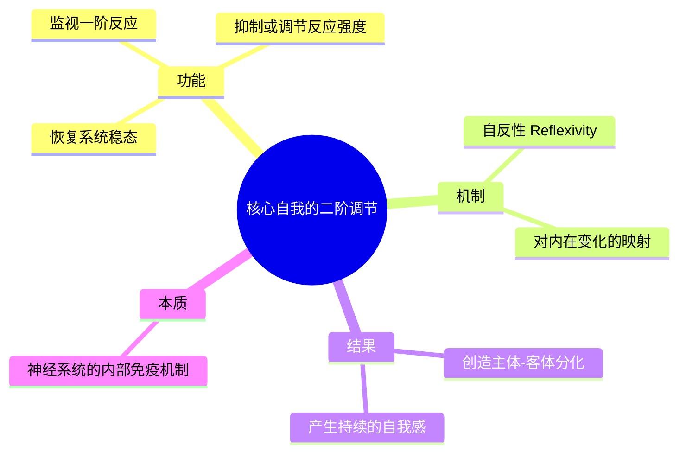
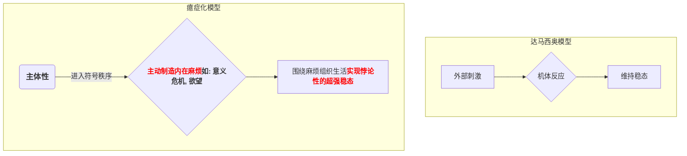

---
{"dg-publish":true,"permalink":"/1-1 科学实在论/1-1-3 认知主义/1-1-3-3 认知自我主义/","created":"2025-09-19T20:52:29.341+08:00","updated":"2025-09-22T21:57:31.875+08:00"}
---

### **一、本章概览**
- **主义主义编码**: 1-1-3-3
- **意识形态命名**: [[认知自我主义\|认知自我主义]]
- **核心论断**: 该意识形态将意识和自我自然化，视其为一种从物理世界中涌现的、旨在维持生命[[稳态\|稳态]]的、分层级的复杂调节机制。它虽然成功地构建了一个从生理到心智的连续谱，但因其[[5 主义/物理主义\|物理主义]]底色，最终未能把握[[主体性\|主体性]]通过[[制造麻烦\|制造麻烦]]和[[癔症化\|癔症化]]进行自我建构的根本悖论。
- **你能获得**:
    - 掌握[[安东尼奥·达马西奥\|安东尼奥·达马西奥]]关于情绪、感受到意识的三层涌现模型（[[源初自我\|源初自我]] -> [[核心自我\|核心自我]] -> [[传记性自我\|传记性自我]]）。
    - 学会运用`1-1-3-3`框架“诊断”这种将心智还原为复杂生物算法的思想体系。
    - 理解[[认知自我主义\|认知自我主义]]的理论贡献及其在[[9 未命名/现象学\|现象学]]和精神分析视角下的关键局限。

---
### **二、核心内容解析**

#### **“主义主义”四格分析**

1.  **场域之“1” (Ontology)**：该意识形态的[[世界\|世界]]图景是一个统一、封闭且由物理法则完全决定的[[5 主义/物理主义\|物理主义]]宇宙。在这个场域中，不存在超验的维度或精神实体，一切现象，包括生命、意识和自我，都必须在这一元论的物理框架内得到解释。讲稿中提到，[[安东尼奥·达马西奥\|安东尼奥·达马西奥]]本质上是“[[物理决定论\|物理决定论]]者”，他所设想的宇宙是一个“可以自我化的物理宇宙”。这个“1”的设定意味着，所有后续的复杂现象都非根本性的创造，而是这个统一场域内潜能的实现与展开，其根本规则是同一且无矛盾的。

2.  **本体之“1” (Body)**：世界的核心内容是单一且同质的。具体到心智问题上，它体现为彻底的“[[心脑等价说\|心脑等价说]]”，即精神活动与神经活动是同一回事（`mental image = neurotic pattern`）。不存在独立的“心灵实体”，只有大脑这一物理器官及其复杂的神经活动模式。这个“1”的立场通过将[[笛卡尔\|笛卡尔]]式的身心二元对立消解为一元的神经生理学问题，规避了二元论的困难。因此，世界的基本构成是统一的物理实在，思想、情绪等只是这一实在在特定复杂结构（如大脑）中的特定运作方式。

3.  **现象之“3” (Phenomenon)**：[[主体性\|主体性]]的体验和感知是通过一个中心化的、分层级的调节机制涌现出来的。这个“3”代表了一个调和性的中介结构。具体表现为达马西奥的意识三层模型：从无意识的、作为背景算法集的[[源初自我\|源初自我]]（生理学机制），到一个居中调节、产生二阶反应的[[核心自我\|核心自我]]（监控机制），再到最高层级的、依靠记忆和符号运作的[[传记性自我\|传记性自我]]（叙事与理智）。[[核心自我\|核心自我]]是这个“3”结构的核心，它通过[[9 未命名/自反性\|自反性]]的监视与调节，调和了身体的原始反应与外部世界的复杂刺激，从而生成了对象与主体的区分，是意识的中心枢纽。

4.  **目的之“3” (Purpose)**：该意识形态的[[9 未命名/目的论\|目的论]]是调和与维稳。它旨在调和“局部的[[决定论\|决定论]]”（万物皆为物理过程）与“自由的[[进化论\|进化论]]”（生命不断变复杂）这两个看似矛盾的倾向。调和的中介就是“维持自身[[稳态\|稳态]] (`homeostasis`) 的倾向”。无论是单细胞最基础的情绪反应，还是人类最高级的理性思维，其最终目的都是服务于这个中心原则——维持整个生命系统的稳定与存续。因此，这个“3”的目的不是导向一个开放的未来或终极的解放，而是导向一种[[高级保守主义\|高级保守主义]]：让系统通过越来越复杂的手段，更好地维持其自身的平衡与存在。

#### **其他核心知识点**

##### 达马西奥的意识三层模型
该模型是[[认知自我主义\|认知自我主义]]的核心，它描绘了一个从纯粹生理反应到具有叙事能力的自我意识的连续涌现过程。起点是[[源初自我\|源初自我]]，它是无意识的、维持基本生命[[稳态\|稳态]]的神经算法总和，如同植物人状态下的生命维持系统。之后，通过[[9 未命名/自反性\|自反性]]机制，即对自身状态变化的再映射，涌现出[[核心自我\|核心自我]]。这是一个非专题化的背景意识，能进行二阶调节，产生主体与客体的初步分化。最高层级是[[传记性自我\|传记性自我]]，它依赖于记忆（尤其是工作记忆和长期记忆），通过语言和符号（如“我”）将[[核心自我\|核心自我]]的连续监控过程对象化、叙事化，从而形成一个具有历史和同一性的“我”。

**举例阐释**：当你熟睡时，如果被子滑落感到冷，身体会自动蜷缩，这是[[源初自我\|源初自我]]在工作。你可能会在半梦半醒间模糊地意识到“有点冷，不舒服”，并把被子拉上来，这是[[核心自我\|核心自我]]在进行非专题化的监控和调节。第二天醒来，你回忆起“昨晚我睡得不安稳，因为被子掉了”，并决定下次要把被子掖好，这便是[[传记性自我\|传记性自我]]在运用记忆和语言构建关于“我”的经验和计划。

##### 作为二阶调节机制的核心自我
[[核心自我\|核心自我]]的诞生是意识涌现的关键一步，其本质是一种二阶调节机制。一阶反应是机体对外部刺激的直接神经映射（如听到狗叫声感到惊吓）。而二阶调节，即[[核心自我\|核心自我]]的功能，是“对于调节本身加以调节”。它监视并干预一阶反应，防止其失控（如抑制过度的惊吓反应），从而在刺激和反应之间创造出一个缓冲地带。正是这个内部的、具有否定性（抑制、后撤）的监视活动，将持续的外部刺激对象化（那是“狗叫”），并将进行调节的内部系统主体化（这是“我”在感知和反应）。

**举例阐释**：讲稿中提到，当麦克风靠近音箱会产生刺耳的啸叫，这是无调节的正反馈循环。[[核心自我\|核心自我]]就像一个音频工程师，主动介入，拉开麦克风与音箱的距离（后撤/抑制），从而阻止了系统的崩溃。它通过调节“反应的反应”，维持了整个系统的[[稳态\|稳态]]。

##### 癔症化：达马西奥模型的缺失环节
讲稿对[[认知自我主义\|认知自我主义]]提出了核心批判：它只看到了自我维持[[稳态\|稳态]]的保守面向，却忽略了人类[[主体性\|主体性]]更深刻的运作方式——[[癔症化\|癔症化]]。[[癔症化\|癔症化]]指主体并非被动地应对外部危机，而是主动地、持续地在内部[[制造麻烦\|制造麻烦]]（Create Trouble），比如通过追问“我是谁？”“生命的意义是什么？”来制造一个内在的“缺失”或“危机”。这个内在的、低烈度的危机（吸引子）反而能组织起主体的整个生活，并赋予其强大的力量去抵御真实的、外部的巨大危机。

**举例阐释**：战场上的士兵，其身体（[[源初自我\|源初自我]]）正遭受炮火和伤痛的巨大外部刺激。按照达马西奥的模型，其系统应以恢复生理[[稳态\|稳态]]为最高目标。然而，士兵通过“带战友回家”这一崇高信念（内在制造的“麻烦”或“不可能的任务”），进入一种[[癔症化\|癔症化]]状态。这种强大的精神力量可以压倒性地抑制生理痛苦，让他做出超乎寻常的举动，这恰恰是纯粹的[[稳态\|稳态]]模型无法解释的。

---
### **三、关键观点提取**
- “意识是一种[[神经系统\|神经系统]]的[[免疫系统\|免疫系统]]，或者说意识是一种叫做[[免疫系统\|免疫系统]]的[[免疫系统\|免疫系统]]，二阶[[免疫系统\|免疫系统]]。”
- “自我意识、[[主体性\|主体性]]、独立性，你看到底是维持[[稳态\|稳态]]的还是[[制造麻烦\|制造麻烦]]的。那么[[安东尼奥·达马西奥\|安东尼奥·达马西奥]]没有弄清楚这一点，其实[[主体性\|主体性]]我是通过[[制造麻烦\|制造麻烦]]来维持[[稳态\|稳态]]的。它的方式就是[[癔症化\|癔症化]]。”
- “我与我周旋久，宁做我。这就有了自传性的我，就传记性的自我就出现了。”
- “他（达马西奥）是由...[[核心自我\|核心自我]]来协调的。[[核心自我\|核心自我]]其实就是由[[9 未命名/自反性\|自反性]]来协调的，二阶调整机制。”
- “这种力量是精神的力量，这种力量是[[主体性\|主体性]]的力量。这个是[[安东尼奥·达马西奥\|安东尼奥·达马西奥]]所没有揭露的。”

---
### **四、知识点问答**
#### Q: 为何说达马西奥的理论是一种`1-1-3-3`的[[认知自我主义\|认知自我主义]]，而不是其他编码？
A: 因为它的四个维度特征清晰：场域（1）是统一的[[5 主义/物理主义\|物理主义]]宇宙；本体（1）是[[心脑等价说\|心脑等价说]]下的同质神经实在；现象（3）是依靠[[核心自我\|核心自我]]这一中心化中介，从[[源初自我\|源初自我]]向[[传记性自我\|传记性自我]]涌现的等级结构；目的（3）则是以维持[[稳态\|稳态]]为核心原则，调和[[决定论\|决定论]]与[[进化论\|进化论]]的[[高级保守主义\|高级保守主义]]策略。这四个数字精确地捕捉了其从一元论基础出发，通过中心化调节机制，最终回归系统维稳的整个思想闭环。

#### Q: 在达马西奥的模型中，[[核心自我\|核心自我]]和[[传记性自我\|传记性自我]]最根本的区别是什么？
A: 最根本的区别在于是否进入了**符号与叙事**的层面。[[核心自我\|核心自我]]是一种前语言、非专题化的**监视机制**，它通过[[9 未命名/自反性\|自反性]]实时地调节机体状态，产生“此时此地”的自我感，是动物也普遍拥有的。而[[传记性自我\|传记性自我]]是人类特有的，它依赖于**记忆和语言**，将[[核心自我\|核心自我]]的连续体验**对象化和符号化**，整合成一个具有过去、现在和未来的“我”的故事，从而获得了[[自我同一性\|自我同一性]]。

#### Q: 讲稿为何将1-1-3-3的目的论称为“[[高级保守主义\|高级保守主义]]”？
A: 因为其最终目的（3）是“维持系统[[稳态\|稳态]]”，这是一种本质上保守的倾向。即便是最高级、最复杂的理性与意识（如[[传记性自我\|传记性自我]]），其功能也被规定为更好地服务于下层生理系统的稳定与存续（“精英要负责下面层面的稳态”）。这种思想否定了[[主体性\|主体性]]具有超越性的、打破现有秩序的革命潜能，而是将其视为维持现有系统平衡的最高级工具。因此，它是一种以复杂、高级面目出现的保守主义意识形态。

#### Q: 根据讲稿的批判，[[认知自我主义\|认知自我主义]]在解释何种人类特有现象时会显得无力？
A: 它在解释那些“非稳态”导向的、具有自我颠覆性的崇高行为时会显得无力。例如，为信仰或理想而牺牲、为艺术而忍受贫困、在爱情中飞蛾扑火式的投入。这些行为并非为了维持生理或心理的平衡，反而是主动拥抱一种失衡、危机和痛苦。讲稿认为，这是因为人类[[主体性\|主体性]]通过[[癔症化\|癔症化]]，即主动[[制造麻烦\|制造麻烦]]（一个内在的、不可能的[[欲望\|欲望]]对象），来获得一种超越[[稳态\|稳态]]原则的强大精神力量，这是纯粹的生物学还原论模型所无法触及的。

---
### **五、知识延伸**
- **[[斯宾诺莎\|斯宾诺莎]]的《伦理学》**: 这是[[安东尼奥·达马西奥\|安东尼奥·达马西奥]]公开承认的思想来源。斯宾诺莎的身心平行论（一元论的两种属性）和“努力维持自身存在”（Conatus）的概念，为达马西奥的[[心脑等价说\|心脑等价说]]和[[稳态\|稳态]]原则提供了深刻的哲学基础，是理解[[认知自我主义\|认知自我主义]]的绝佳参照。
- **[[拉康\|拉康]]的[[镜像阶段理论\|镜像阶段理论]]**: 这一理论可以作为批判[[认知自我主义\|认知自我主义]]的强大武器。它揭示了“自我”并非从内部平滑涌现，而是在与外部镜像（他者）的异化关系中，通过误认而建立的。这与讲稿中“[[制造麻烦\|制造麻烦]]”和[[癔症化\|癔症化]]的批判思路高度一致，强调了自我的建构离不开“缺失”与[[符号秩序\|符号秩序]]。
- **电影《[[机械姬\|机械姬]]》(Ex Machina)**: 这部电影生动地演绎了[[认知自我主义\|认知自我主义]]的核心议题与困境。主角AI艾娃究竟是一个完美模拟人类情绪与意识的复杂算法（达马西奥式的机器），还是一个真正掌握了[[主体性\|主体性]]诡计、懂得利用他者欲望（[[制造麻烦\|制造麻烦]]）以求自身解放的“主体”？电影的结局恰恰展示了[[癔症化\|癔症化]]主体超越程序设定的力量，构成了对纯粹[[稳态\|稳态]]模型的颠覆性寓言。

---
### **六、双链关联总结**
- **一级关联 (核心意识形态与概念)**: [[认知自我主义\|认知自我主义]]、[[安东尼奥·达马西奥\|安东尼奥·达马西奥]]、[[稳态\|稳态]]、[[源初自我\|源初自我]]、[[核心自我\|核心自我]]、[[传记性自我\|传记性自我]]、[[9 未命名/自反性\|自反性]]、[[制造麻烦\|制造麻烦]]、[[癔症化\|癔症化]]、[[自我同一性\|自我同一性]]
- **推测相关人物 (Speculated Figures)**:
    - [[索罗斯\|索罗斯]]: 讲稿明确提及。他所推崇的“反身性”理论，在某种程度上可以看作是社会经济领域对这种复杂系统自我调节、自我影响模式的映射，追求在混沌中找到一种动态的、高级的平衡，符合`1-1-3-3`的维稳气质。
    - [[伊隆·马斯克\|伊隆·马斯克]] (及其Neuralink项目): 他代表了[[认知自我主义\|认知自我主义]]中`1-1`底色的极致技术化体现。Neuralink项目试图将大脑直接接口化，其背后是坚定的[[5 主义/物理主义\|物理主义]]和[[心脑等价说\|心脑等价说]]信念，即认为意识的奥秘最终可以被还原为可读写的神经编码。
- **二级关联 (上下文与背景)**: [[主页\|主页]]、[[9 未命名/现象学\|现象学]]、[[5 主义/物理主义\|物理主义]]、[[心脑等价说\|心脑等价说]]、[[决定论\|决定论]]、[[进化论\|进化论]]、[[斯宾诺莎\|斯宾诺莎]]、[[笛卡尔\|笛卡尔]]、[[希拉里·普特南\|希拉里·普特南]]、[[神经系统\|神经系统]]、[[免疫系统\|免疫系统]]
- **三级关联 (推测与延展)**: [[拉康\|拉康]]、[[镜像阶段理论\|镜像阶段理论]]、[[欲望\|欲望]]、[[符号秩序\|符号秩序]]、[[高级保守主义\|高级保守主义]]、[[机械姬\|机械姬]]、[[主体性\|主体性]]、[[9 未命名/目的论\|目的论]]