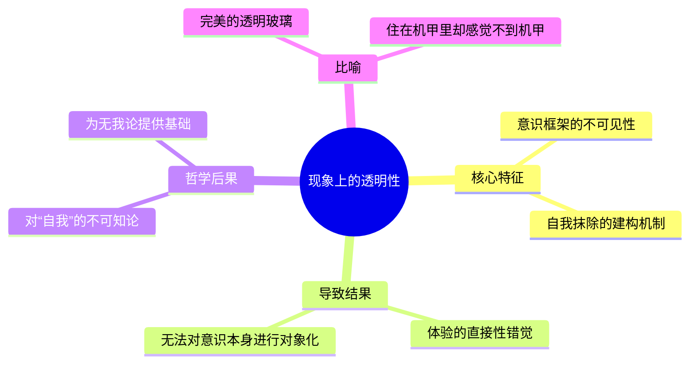
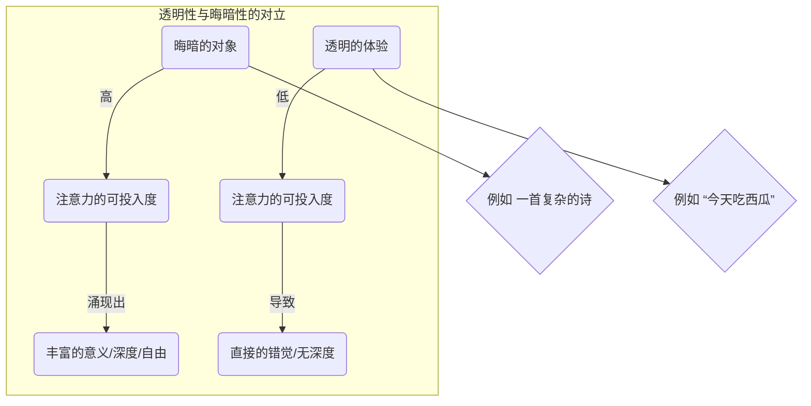
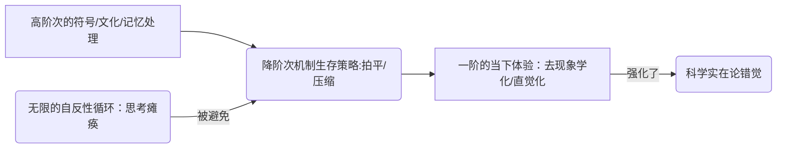

---
{"dg-publish":true,"permalink":"/1-1 科学实在论/1-1-3 认知主义/1-1-3-4 认知无我论/","created":"2025-09-19T20:52:29.343+08:00","updated":"2025-09-22T21:57:33.084+08:00"}
---

### **一、本章概览**
- **主义主义编码**: 1-1-3-4
- **意识形态命名**: [[认知无我论\|认知无我论]]
- **核心论断**: 该意识形态在坚守[[5 主义/物理主义\|物理主义]]世界观（1-1）的前提下，将[[主体性\|主体性]]体验描述为一个自我遮蔽的、透明的认知框架（3），最终因无法科学地把握此框架自身，而走向对“自我”的彻底否定和一种反哲学的[[5 主义/神秘主义\|神秘主义]]（4）。
- **你能获得**: 通过本笔记，你将掌握对[[认知无我论\|认知无我论]]这一前沿科学意识形态的“主义主义”诊断方法，理解[[现象上的透明性\|现象上的透明性]]、[[晦暗性\|晦暗性]]等核心概念，并洞察[[5 主义/物理主义\|物理主义]]在面对[[主体性\|主体性]]问题时如何陷入内在矛盾，最终退化为一种为自身研究项目续命的[[女性癔症化\|女性癔症化]]姿态。

---
### **二、核心内容解析**

#### **“主义主义”四格分析**

1.  **场域之“1” (Ontology)**：此处的“1”代表一个绝对统一、封闭且自洽的[[5 主义/物理主义\|物理主义]]宇宙。该[[世界\|世界]]图景预设，一切存在，包括最高级的意识活动，最终都可被还原为唯一的、同质的物理实在（如神经电信号、原子、量子场）。不存在任何超越这个物理系统的精神实体或超验维度。这个[[存在论\|存在论]]框架是整全性的，它排除了任何非物质的“例外”，构筑了一个无缝的、由[[物理法则\|物理法则]]支配的决定论舞台。

2.  **本体之“1” (Body)**：在此统一的[[5 主义/物理主义\|物理主义]]场域中，作为真实存在的内容（本体）同样是“1”——单一且同质的。这意味着世界由一种根本“材料”构成，即物理性的存在。讲稿中提及的神经生理学模型、原子、量子等，都是这个单一本体的不同表现形式。因此，传统哲学中的“自我”、“灵魂”或“意识实体”被剥夺了本体地位，它们不被认为是真实存在的东西，而仅仅是物理过程的附带现象或功能描述。

3.  **现象之“3” (Phenomenon)**：此处的“3”是整个编码中最精巧和关键的一环。它代表一个起中介和组织作用的中心，即[[托马斯·梅辛格\|托马斯·梅辛格]]提出的“[[现象上的透明性\|现象上的透明性]]”框架。这个框架像[[5 主义/康德主义\|康德主义]]的先验结构一样，组织着我们所有的感知和体验。但它的特殊之处在于，它是一个**自我抹除**的中心。它让我们直接体验到外部世界，却完全感知不到这个框架本身的存在。所有[[现象\|现象]]都朝向这个透明的中心汇集并被其处理，但主体却无法反思性地把握这个中心，从而产生一种“我与世界直接遭遇”的错觉。这是一种注定失败的、不可知论式的[[5 主义/康德主义\|康德主义]]。

4.  **目的之“4” (Purpose)**：此处的“4”揭示了该意识形态的内在不可能性与最终的崩解。[[5 主义/认知主义\|认知主义]]的[[9 未命名/目的论\|目的论]]本是想用科学方法彻底解释意识，但它最终却得出结论：意识的核心（自我）是不可研究的、不存在的（[[无我论\|无我论]]）。这个项目从内部否定了自身的目标，暴露了其方法的根本局限性，这就是“4”所代表的内在矛盾和虚无。这种科学探索的失败，并没有导向新的哲学突破，而是退化为一种非理性的、开放式的结局：放弃对[[主体性\|主体性]]的哲学追问，转向一种新世纪禅宗式的[[5 主义/神秘主义\|神秘主义]]，或是一种“为研究而研究”的犬儒姿态。

#### **其他核心知识点**

##### 现象上的透明性 (Phenomenal Transparency)
这一概念由[[托马斯·梅辛格\|托马斯·梅辛格]]借用并发展，是[[认知无我论\|认知无我论]]的基石。它指我们无法体验到自身意识的底层建构过程。我们的意识框架就像一块完美的透明玻璃，我们透过它看世界，却看不到玻璃本身。这种机制使我们错误地认为自己是与事物本身“直接”打交道，而非与其表象。当试图用这个透明的框架去反观自身时，就会陷入悖论，因为观察工具本身是不可见的。这正是[[认知无我论\|认知无我论]]认为“自我”无法被科学化、对象化研究的核心理由，它将“自我”的存在归结为这种透明性所引发的认知错觉。

**举例阐释**：当“我要吃西瓜”这个念头出现在你脑海中时，你体验到的是一个完整的、自发产生的意图。你完全无法察觉到这个念头产生之前，大脑内部复杂的神经信号处理、记忆提取、语义关联等一系列“[[降阶次机制\|降阶次机制]]”的活动。这些底层过程对于你的体验来说是完全“透明”的，使得这个念头仿佛是凭空冒出来的。

##### 晦暗性与注意力的可用度 (Opacity and Attentional Availability)
“晦暗性”与“透明性”相对，指一个对象或观念所具有的、可供[[主体性\|主体性]]的注意力深入探索的内在复杂度和深度。一个事物的“晦暗度”越高，我们能投入的“注意力”就越多，其意义和细节也就越丰富。反之，一个“透明”的对象则无法留存注意力。[[认知无我论\|认知无我论]]认为，真正的[[主体性\|主体性]]和[[自由\|自由]]恰恰体现在这种“晦暗性”中，因为它意味着一个可供探索的、非现成的内在空间。然而，意识体验的“透明性”恰恰消解了这种晦暗度，从而也消解了[[自由\|自由]]存在的空间。

**举例阐释**：一首意蕴深远的古诗是“晦暗”的，你可以反复诵读，每次投入注意力都能发现新的韵味和解释空间。而一句“今天天气很好”的陈述句则是相对“透明”的，你几乎无法在其上投入更多注意力去发掘深层意义。[[认知无我论\|认知无我论]]指出，我们的日常意识体验更像后者，其底层机制被隐藏了。

##### 降阶次机制 (The Mechanism of Order Reduction)
这是[[认知无我论\|认知无我论]]用以解释“[[现象上的透明性\|现象上的透明性]]”如何产生的核心机制。它指认知系统出于生存效率的需要，将原本极其复杂、高阶次的表象构造过程，“拍平”或“压缩”成一个简单的、一阶的、在当下直接呈现的结果。这个机制避免了主体陷入“对表象的表象的表象……”无穷后退的思维瘫痪中，让我们能快速反应。但其代价是，[[主体性\|主体性]]的真实运作过程被彻底遮蔽，我们体验到的只是被“降阶”处理后的简洁版本，这进一步强化了世界是“直接如此”的[[科学实在论\|科学实在论]]错觉。

**举例阐释**：在野外看到一只老虎，如果你的大脑需要完整处理“这是一个对‘老虎’这个概念的视觉表象的神经构造过程……”你早就被吃掉了。[[降阶次机制\|降阶次机制]]将这个复杂过程瞬间拍平为“危险！快跑！”的直觉反应。你体验到的不是复杂的认知过程，而是一个直接的、关乎生存的“事实”。

---
### **三、关键观点提取**
- “它实际上是一种女性[[癔症化\|癔症化]]的一个立场……我明知道归根结底没有自我……但是我偏要感觉到还有那么一点点希望，剩余说不清道不明的诡异的东西。”
- “[[现象上的透明性\|现象上的透明性]]在这里指代一种将自己去现象化了的外部现象的构成性机制……我们体验事物的时候，不会体验为他们仅是现象，我们会直接体验为他们本身。”
- “梅辛格因此认为，根本不存在所谓的自我。自我本身应该用[[9 未命名/本体论\|本体论]]的吝啬，就是[[9 未命名/奥卡姆剃刀\|奥卡姆剃刀]]给它去掉。你不需要去预设一个自我……你必须要研究这个认识论闭合的机制。”
- “主体的存在的作用是去主体化。主体的意义在于去主体化。这个要必须通过[[拉康\|拉康]]的这个[[无头主体性\|无头主体性]]来来把握。”

---
### **四、知识点问答**
#### Q: 为什么说 1-1-3-4 的[[认知无我论\|认知无我论]]是一种“[[女性癔症化\|女性癔症化]]”的意识形态？
A: 因为它体现了癔症的核心结构：“我知道，但仍然……”。认知科学家“知道”在[[5 主义/物理主义\|物理主义]]（1-1）框架下，一个独立的、非物质的“自我”是不存在的。然而，他们仍然要围绕这个“不存在”的自我建立起一整个认知科学的研究范式（3），假装在探索一个深刻的谜题。这种“明知其无，仍要为之”的姿态，不是为了求真，而是为了维持自身作为科学共同体的存在和经费，其行为和其宣称的知识之间存在一种分裂和表演性，这正是[[女性癔症化\|女性癔症化]]的体现。

#### Q: [[现象上的透明性\|现象上的透明性]]如何同时扮演了[[5 主义/康德主义\|康德主义]]的构建者和摧毁者的角色？
A: 它扮演构建者角色，在于它像康德的先验范畴一样，是所有经验得以可能的前提框架（3），它构建了我们体验到的那个有序的[[世界\|世界]]。但它又是摧毁者，因为康德的先验主体至少是可以被哲学反思所把握的，而[[现象上的透明性\|现象上的透明性]]的特点恰恰是其自身的不可见性与不可反思性。这导致了一种“失败的[[5 主义/康德主义\|康德主义]]”，我们拥有一个构建经验的框架，却永远无法认识这个框架，最终只能在[[不可知论\|不可知论]]的立场上将其（连同自我）彻底抛弃（4）。

#### Q: [[认知无我论\|认知无我论]]最终导向的[[5 主义/神秘主义\|神秘主义]]（4）与传统宗教的神秘主义有何不同？
A: 传统宗教的[[5 主义/神秘主义\|神秘主义]]通常建立在一个肯定性的[[存在论\|存在论]]之上（如上帝、梵、道），其目标是与一个终极的、丰盈的实在合一。而[[认知无我论\|认知无我论]]导向的[[5 主义/神秘主义\|神秘主义]]，则源于一个否定性的虚空（4）。它不是因为“有”一个神圣之物值得追求，而是因为科学理性在“自我”问题上走入了死胡同，彻底“无能为力”。这种[[5 主义/神秘主义\|神秘主义]]是一种思想上的“放弃”和“逃避”，是用新世纪禅宗、冥想等流俗实践来填充因理性失败而留下的真空，其底色是虚无而非神圣。

---
### **五、知识延伸**
- **[[丹尼尔·丹尼特\|丹尼尔·丹尼特]]的《意识的解释》**: 这本书是[[认知无我论\|认知无我论]]的绝佳思想盟友。丹尼特提出的“多重草稿模型”同样旨在消解笛卡尔式的中心“我”，认为意识不过是大脑中并行运行的各种计算过程所产生的叙事效果，不存在一个最终的“观众”。这与梅辛格通过“透明性”来论证“无我”的路径异曲同工，共同体现了1-1-3-4意识形态的内核。
- **[[齐泽克\|齐泽克]]论[[笛卡尔主体\|笛卡尔主体]]**: 齐泽克将笛卡尔的“我思”解读为纯粹否定性的裂隙（$），而非一个实体性的“我”。这一观点为批判[[认知无我论\|认知无我论]]提供了强大武器。在齐泽克看来，[[5 主义/物理主义\|物理主义]]试图在实证层面寻找的“自我”一开始就找错了地方。主体不是一个物理实体，而是那个让物理实在无法完全闭合的“虚空”本身。这恰恰能解释为何1-1-3-4最终会遭遇一个无法处理的“4”。
- **电影《[[机械姬\|机械姬]]》(Ex Machina)**: 这部电影是对1-1-3-4意识形态的艺术化呈现。人工智能艾娃是否拥有“真正”的意识，是影片的核心谜题。最终我们发现，她所有的“类人”表现都可能是一种服务于其逃脱目的的、完美的“[[降阶次机制\|降阶次机制]]”表演。它揭示了我们无法从外部行为（现象）判断一个系统是否具备内在的[[主体性\|主体性]]，这与[[认知无我论\|认知无我论]]对“自我”是不可穿透的认知幻觉的论断形成深刻共鸣。

---
### **六、双链关联总结**
- **一级关联 (核心意识形态与概念)**: [[认知无我论\|认知无我论]]、[[托马斯·梅辛格\|托马斯·梅辛格]]、[[现象上的透明性\|现象上的透明性]]、[[晦暗性\|晦暗性]]、[[降阶次机制\|降阶次机制]]、[[无我论\|无我论]]
- **推测相关人物 (Speculated Figures)**: [[丹尼尔·丹尼特\|丹尼尔·丹尼特]] (理论上的同路人)、[[乔布斯\|乔布斯]]及其他信奉[[新世纪运动\|新世纪运动]]的科技领袖 (将技术理性与流俗神秘主义结合，体现了1-1-3-4的终点)。
- **二级关联 (上下文与背景)**: [[5 主义/物理主义\|物理主义]]、[[5 主义/认知主义\|认知主义]]、[[科学实在论\|科学实在论]]、[[9 未命名/现象学\|现象学]]、[[5 主义/康德主义\|康德主义]]、[[拉康\|拉康]]、[[G.E.摩尔\|G.E.摩尔]]
- **三级关联 (推测与延展)**: [[女性癔症化\|女性癔症化]]、[[无头主体性\|无头主体性]]、[[框架问题\|框架问题]]、[[9 未命名/奥卡姆剃刀\|奥卡姆剃刀]]、[[笛卡尔主体\|笛卡尔主体]]、[[9 未命名/目的论\|目的论]]、[[不可知论\|不可知论]]