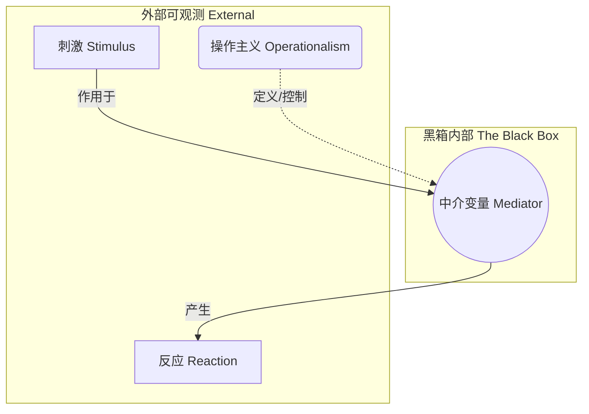
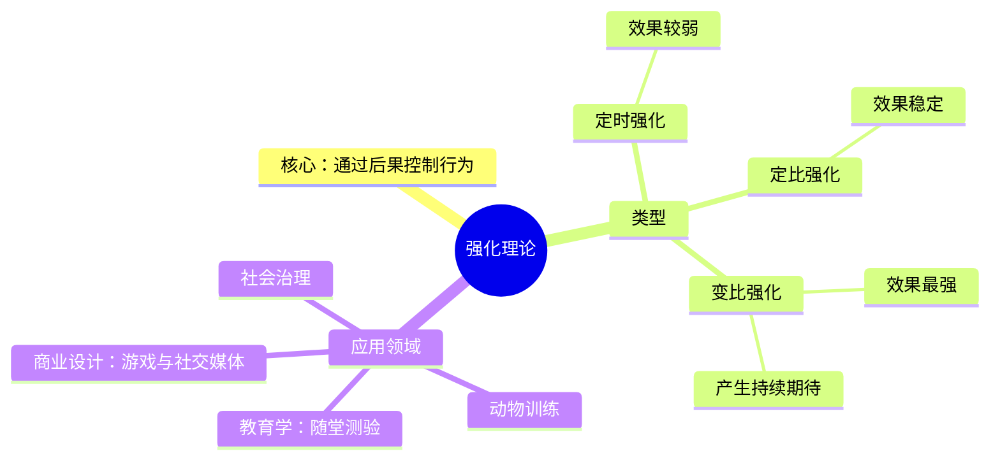
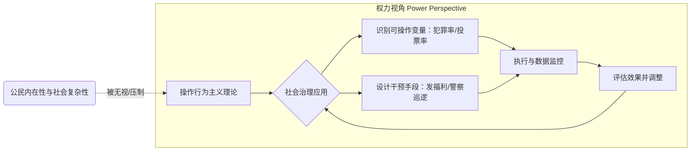

---
{"dg-publish":true,"permalink":"/1-1 科学实在论/1-1-4 行为主义/1-1-4-1 操作行为主义/","created":"2025-09-19T20:52:29.351+08:00","updated":"2025-09-22T21:57:39.488+08:00"}
---

### **一、本章概览**
- **主义主义编码**: 1-1-4-1
- **意识形态命名**: [[5 主义/操作行为主义\|操作行为主义]] / [[新行为主义\|新行为主义]]
- **核心论断**: [[5 主义/操作行为主义\|操作行为主义]]是一种将[[内在性\|内在性]]体验（如欲望、认知）还原为外部可测量、可控制的“[[中间变量\|中间变量]]”的意识形态。它看似承认了心灵的“黑箱”，实则通过[[操作主义\|操作主义]]的逻辑将其彻底虚无化，最终服务于一种技术官僚式的[[社会治理\|社会治理]]与控制。
- **你能获得**: 通过本笔记，你将掌握 1-1-4-1 意识形态的内在结构，理解[[操作主义\|操作主义]]如何成为现代[[5 主义/技术主义\|技术主义]]的心理学变体，并能辨识和批判现实中将人类主体简化为可控变量的各种治理模式。

---
### **二、核心内容解析**

#### **“主义主义”四格分析**

1.  **场域之“1” (Ontology)**：该意识形态预设的世界是一个统一、同质的[[操作场\|操作场]]。在这个[[世界\|世界]]中，万物——无论是外部行为还是内部精神活动——都被同一个[[存在论\|存在论]]逻辑所支配，即“可操作性”原则。世界不再是充满质性差异和矛盾的场所，而是一个无缝的、由[[控制论\|控制论]]逻辑编织起来的巨大实验室。所有现象都被视为这个统一场域内的潜在变量，等待着被强大的观察者（心理学家、治理者）所定义、测量和调控。这个场域是封闭的，它排除了任何无法被其操作逻辑所捕获的真正超越性或[[内在性\|内在性]]。

2.  **本体之“1” (Body)**：在这个[[操作场\|操作场]]中，唯一具有本体论地位的实体是“[[可操作对象\|可操作对象]]”（Operable object）。传统的物质与精神的二元对立被消解了，但并非通过更高阶的综合，而是通过一种粗暴的还原。无论是老鼠的行为、人的欲望，还是社会群体的信仰，只要它能被实验者通过某种技术手段（如药物、问卷、数据监控）进行稳定地测量和控制，它就是“[[实在\|实在]]”的。这种[[5 主义/物理主义\|物理主义]]的本体论是单一且同质的，它不关心对象本身的内涵，只关心其作为变量的可控性。

3.  **现象之“4” (Phenomenon)**：在现象层面，[[主体性\|主体性]]的体验被置于“4”号位，这代表着一种[[虚无\|虚无]]与[[不可能性\|不可能性]]。[[5 主义/操作行为主义\|操作行为主义]]看似通过引入“[[中间变量\|中间变量]]”来处理[[内在性\|内在性]]，但实际上这是一种“承认即消解”的策略。主体的感知、欲望和认知，其丰富、模糊、矛盾的质性维度被彻底掏空，被替换为一系列可量化的、机械的参数。因此，真实的[[现象\|现象]]体验在此体系中是不可能的，它被一个伪装成内在性的、可操作的“假体”所取代。主体在此处经历了自身的空洞化，其[[内在性\|内在性]]的尊严被剥夺，成为一个被外部力量穿透和定义的空壳。

4.  **目的之“1” (Purpose)**：该意识形态的[[9 未命名/目的论\|目的论]]是建立并永恒维持一个僵死的、完全可预测的[[变量网络\|变量网络]]。其终极目标是创造一个没有意外、没有断裂、没有真正主体决断的稳定秩序。这个秩序是一个封闭的[[循环\|循环]]，其中的所有要素都通过数理和统计模型相互关联，一切都在控制之中。这种[[9 未命名/目的论\|目的论]]是极度[[5 主义/保守主义\|保守主义]]的，它致力于消除一切不可控的因素，将历史的动态过程凝固成一个静态的、可供“上帝视角”或“皇帝视角”一览无余的治理模型，其唯一目的就是让这套控制系统无限地自我重复和维系。

#### **其他核心知识点**

##### 操作主义与中间变量
[[操作主义\|操作主义]]是[[新行为主义\|新行为主义]]的核心方法论，它声称只要一个概念能够通过一套明确的、可重复的公共操作来定义，那么这个概念就是科学的、合法的。在心理学中，这意味着即使是像“欲望”或“认知”这样的“[[黑箱\|黑箱]]”内容，只要能找到一种外部手段来控制和测量它（如注射激素并观察行为变化），它就可以被承认为一个合法的“[[中间变量\|中间变量]]”。这一转向看似扩展了研究范围，实则是一种更精巧的还原论，它将[[内在性\|内在性]]的尊严彻底剥离，将其降格为实验者工具箱中的一个可操控的零件，服务于刺激（S）与反应（R）之间的预测和控制。

**举例阐释**：讲稿中提到，要研究老鼠的“欲望”这一[[中间变量\|中间变量]]，[[5 主义/操作行为主义\|操作行为主义]]者不会去探究老鼠的主观感受，而是会给它注射性激素（一种可操作的外部输入），然后测量它与异性接触的频率（一种可测量的外部输出）。“欲望”在此就被操作性地定义为“激素水平与求偶行为之间的函数关系”。

##### 强化理论的学习模型
[[强化理论\|强化理论]]是[[斯金纳\|斯金纳]]的[[5 主义/操作行为主义\|操作行为主义]]中的关键应用技术，其核心思想是通过后果来控制行为。行为之后如果伴随着积极的“强化物”（如食物、奖励），该行为出现的频率就会增加。讲稿中提及了不同类型的强化方案，如“定时强化”（每隔固定时间给予奖励）、“定比强化”（完成固定次数行为后给予奖励）和“变比强化”（随机给予奖励）。研究发现，对于复杂的人类行为，“变比强化”——即不确定性的奖励——能产生最持久、最强烈的行为塑造效果，这恰恰是现代社交媒体、游戏设计等领域广泛应用的心理机制。

**举例阐释**：讲稿中用“随堂测验”来类比。如果老师宣布“每十节课考一次试”（定比强化），学生只会在临近考试时才努力。但如果老师宣布“会不定期抽查考试”（变比强化），学生为了应对不确定性，就必须在大部分时间里保持学习状态，从而达到了更强的控制效果。

##### 技术官僚式社会治理
[[5 主义/操作行为主义\|操作行为主义]]的意识形态在政治层面最终导向一种[[5 主义/技术专制主义\|技术专制主义]]的[[社会治理\|社会治理]]模式。在这种模式下，社会被视为一个巨大的、可进行行为工程改造的系统。管理者（[[技术官僚\|技术官僚]]）如同[[5 主义/操作行为主义\|操作行为主义]]的心理学家，他们只关心那些“可操作”的社会变量（如犯罪率、投票倾向、消费数据），并运用各种技术手段进行干预和调控。这种治理模式完全无视公民的[[内在性\|内在性]]、历史的复杂性和社会的内在矛盾，将活生生的人民简化为统计数据和行为模式，其本质是一种以“科学”和“效率”为名的权力控制与奴役工具。

**举例阐释**：讲稿中提到，美国政府可能会运用这种模型来治理少数族裔社区。他们不会去反思导致犯罪的深层社会结构问题，而是通过一系列“可操作”的手段，如发放福利、增加警力、提供特定服务等，来直接调控“犯罪率”这个[[中间变量\|中间变量]]，从而实现一种表面化的、控制论式的“稳定”。

---
### **三、关键观点提取**
- “在自变量和因变量之间又有一个[[中间变量\|中间变量]]可以讨论的……按照[[操作主义\|操作主义]]，按照[[5 主义/操作行为主义\|操作行为主义]]，只要这东西能操作，它就可以作为[[中间变量\|中间变量]]。”
- “[[5 主义/操作行为主义\|操作行为主义]]实际上是背后是导向了一种[[社会治理\|社会治理]]模式。这种社会治理模式是也是继续无视[[内在性\|内在性]]的。它具有可操作性，什么是它可操作，什么是它可控的，它才把它作为变量。”
- “这个东西是个标准的[[5 主义/保守主义\|保守主义]]形态，就认为这个世界上这种[[变量网络\|变量网络]]我是可以，只要我是一个统治者，我可以通过我对这个社会管控秩序的监听和侦查以及刺探权……去构造一个预测性的网络。”
- “去你妹的这种视角会带来极端的人道主义灾难，也会带来极端的[[5 主义/技术专制主义\|技术专制主义]]……是丧尽人性的，毫无人性的。”
- “这些知识分子……但凡投身去设立这种东西的人是邪恶，是人类之敌，是恶魔邪魔也。”

---
### **四、知识点问答**
#### Q: 为何说“操作行为主义”看似承认“内在性”，实则是对其更彻底的否定？
A: 因为它承认[[内在性\|内在性]]的前提是将其“可操作化”。它只承认那个可以被外部技术手段所定义、测量和控制的“[[内在性\|内在性]]”的空壳，而将内在体验中所有无法被量化、充满矛盾和质感的真实部分视为不存在或无意义。这种“承认”是一种收编和改造，它用一个伪造的、机械的[[中间变量\|中间变量]]替换了真实的[[主体性\|主体性]]，这比直接否认“黑箱”存在的古典[[行为主义心理学\|行为主义心理学]]更具欺骗性和危害性。

#### Q: 1-1-4-1 意识形态中的“4”（现象之虚无）与拉康理论中的“实在界之不可能”有何异同？
A: 相同之处在于两者都指向一种“[[不可能性\|不可能性]]”。在 1-1-4-1 中，真实的[[现象\|现象]]体验变得不可能；在拉康那里，直接遭遇[[实在界\|实在界]]是不可能的。但根本区别在于其根源和后果：1-1-4-1 的“4”是由一种外部的、强力的[[5 主义/物理主义\|物理主义]]和[[控制论\|控制论]]逻辑所造成的对[[主体性\|主体性]]的压制和掏空，是一种权力效应。而拉康的[[实在界\|实在界]]之“不可能”，是[[符号界\|符号界]]自身结构性的、先天的匮乏所致，是语言和秩序内在的界限，它反而是主体欲望和创造力的来源。前者是压制性的虚无，后者是生产性的[[虚无\|虚无]]。

#### Q: 讲稿为何将这种理论与美国的“选票政治”联系起来？
A: 因为美国的[[选票政治\|选票政治]]在很大程度上是一种基于民意测验、大数据分析和精准广告投放的“民粹机器”操控游戏。政治顾问和竞选团队并不真正关心选民复杂的政治信念和[[内在性\|内在性]]诉求，而是将其简化为一系列“可操作”的变量（如对某个议题的好恶度、投票倾向的概率）。他们通过各种宣传和动员手段（相当于[[强化理论\|强化理论]]中的“强化物”）来调控这些变量，以达到胜选的[[9 未命名/目的论\|目的论]]。这种模式完美复刻了[[5 主义/操作行为主义\|操作行为主义]]的逻辑：将复杂的社会政治现实还原为可预测、可控制的[[变量网络\|变量网络]]。

---
### **五、知识延伸**
- **[[B.F. 斯金纳\|B.F. 斯金纳]]《[[瓦尔登第二\|瓦尔登第二]]》（Walden Two）**: 这本小说是[[5 主义/操作行为主义\|操作行为主义]]的乌托邦宣言。斯金纳在书中构想了一个通过“行为工程学”和积极强化来构建的完美社区。阅读此书可以直接洞悉该意识形态在理想状态下的自我描绘，是理解其内在[[9 未命名/目的论\|目的论]]的最佳文本，构成了一种**支持性**参照。
- **[[6 哲学家/米歇尔·福柯\|米歇尔·福柯]]《[[规训与惩罚\|规训与惩罚]]》**: 此书是批判[[5 主义/操作行为主义\|操作行为主义]]背后权力逻辑的终极武器。福柯深刻揭示了现代权力如何通过各种“温和”的规训技术（如考试、标准化的训练）来制造“温驯的身体”。[[5 主义/操作行为主义\|操作行为主义]]的[[强化理论\|强化理论]]和[[社会治理\|社会治理]]模型，正是福柯所描述的[[微观权力\|微观权力]]和[[规训权力\|规训权力]]在心理学和政治学领域的具体体现，构成了一种强有力的**批判性**参照。
- **[[控制论\|控制论]] (Cybernetics)**: 作为研究反馈、控制和通讯的理论，[[控制论\|控制论]]是[[5 主义/操作行为主义\|操作行为主义]]背后的宏大技术和哲学背景。诺伯特·维纳等人的思想将有机体和机器都视为信息处理系统，这为[[斯金纳\|斯金纳]]等人将人类心理简化为可控的输入输出模型提供了理论基础。理解[[控制论\|控制论]]有助于看清这种思想并非孤立的心理学流派，而是一种影响深远的现代[[5 主义/技术主义\|技术主义]]思潮。

---
### **六、双链关联总结**
- **一级关联 (核心意识形态与概念)**: [[5 主义/操作行为主义\|操作行为主义]]、[[新行为主义\|新行为主义]]、[[斯金纳\|斯金纳]]、[[可操作性\|可操作性]]、[[中间变量\|中间变量]]、[[强化理论\|强化理论]]、[[变量网络\|变量网络]]、[[操作场\|操作场]]、[[可操作对象\|可操作对象]]
- **推测相关人物 (Speculated Figures)**: [[B.F. 斯金纳\|B.F. 斯金纳]] (理论创始人)，现代[[技术官僚\|技术官僚]] (将社会问题化约为数据和KPI进行管理，体现了操作主义逻辑)，沉迷于A/B测试和用户行为数据分析的[[产品经理\|产品经理]] (在微观层面实践着通过强化塑造用户行为的模式)。
- **二级关联 (上下文与背景)**: [[行为主义心理学\|行为主义心理学]]、[[控制论\|控制论]]、[[5 主义/物理主义\|物理主义]]、[[5 主义/技术主义\|技术主义]]、[[逻辑实证主义\|逻辑实证主义]]、[[5 主义/保守主义\|保守主义]]、[[社会治理\|社会治理]]、[[选票政治\|选票政治]]
- **三级关联 (推测与延展)**: [[6 哲学家/米歇尔·福柯\|米歇尔·福柯]]、[[规训权力\|规训权力]]、[[微观权力\|微观权力]]、[[5 主义/技术专制主义\|技术专制主义]]、[[齐泽克\|齐泽克]]、[[视差之见\|视差之见]]、[[吸引子\|吸引子]]、[[内在性\|内在性]]、[[主体性\|主体性]]、[[实在\|实在]]、[[虚无\|虚无]]、[[不可能性\|不可能性]]、[[9 未命名/目的论\|目的论]]、[[存在论\|存在论]]、[[世界\|世界]]、[[循环\|循环]]