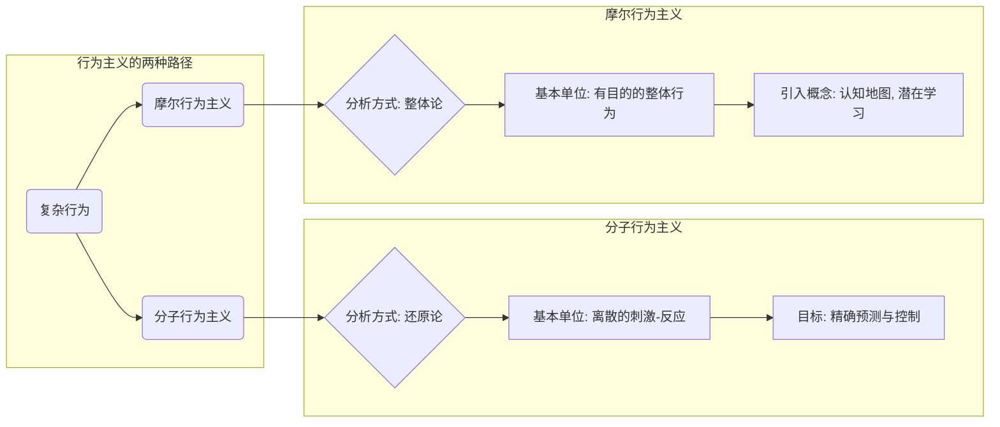
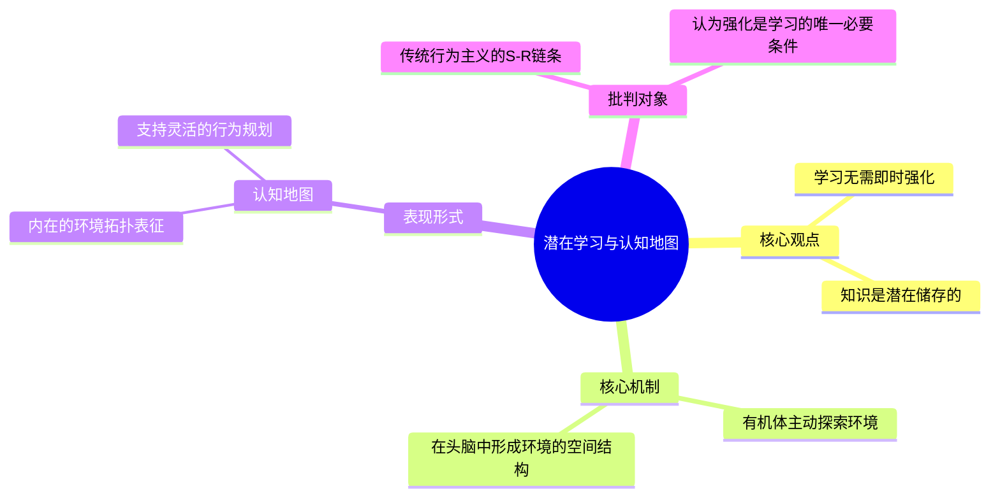
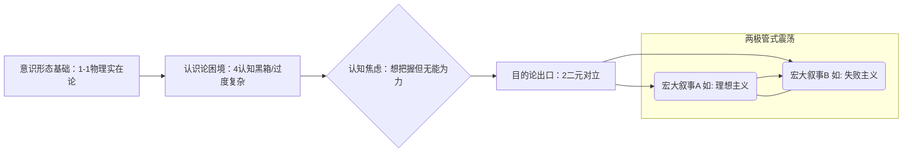

---
{"dg-publish":true,"permalink":"/1-1 科学实在论/1-1-4 行为主义/1-1-4-2 目的行为主义/","created":"2025-09-19T20:52:29.353+08:00","updated":"2025-09-22T22:24:05.287+08:00"}
---

### **一、本章概览**
- **主义主义编码**: 1-1-4-2
- **意识形态命名**: [[目的行为主义\|目的行为主义]]/[[摩尔行为主义\|摩尔行为主义]]
- **核心论断**: 该意识形态在坚信世界由统一、客观的分子现实构成（1-1）的同时，认为主体的内在世界是一个因过度复杂而无法被精确认识的“黑箱”（4），最终导致其在行动上分裂为两种目的：要么是对微观现实的悲观性放弃，要么是对宏观行为的投机性操控（2）。
- **你能获得**: 通过本笔记，你将掌握对[[目的行为主义\|目的行为主义]]这一现代意识形态的“主义主义”诊断框架，理解其内在的“[[9 未命名/实在论\|实在论]]根基 + 认知黑箱 + 操控/放弃”的矛盾结构，并能识别它在当代互联网运营、市场营销以及网络公共讨论（如“[[两极管\|两极管]]”式争论）中的具体体现。

---
### **二、核心内容解析**
#### **“主义主义”四格分析**

1.  **场域之“1” (Ontology)**：该意识形态的[[存在论\|存在论]]设定了一个统一、封闭且完全客观的[[世界\|世界]]。这个世界舞台的背景是被一种绝对的、无所不包的秩序所支配，通常是[[5 主义/物理主义\|物理主义]]或[[操作主义\|操作主义]]的秩序。它预设了万事万物都在一个同质化的、由因果法则贯穿的场域中运行，不存在任何超越这个物理或操作层面的“例外”空间，一切最终都可被还原到这个统一的底层实在。

2.  **本体之“1” (Body)**：在这个统一的场域中，唯一真实存在的[[本体\|本体]]是客观的、离散的“分子事实”或基本要素。无论是物理事件、化学反应还是最微小的行为单元，它们都属于同一种物质性或可操作性的现实。该模型不承认有独立于此的“精神”或“心灵”实体。所谓的[[主体性\|主体性]]、[[目的\|目的]]或[[意识\|意识]]，从[[本体\|本体]]论上讲，都只不过是这些海量分子事实依据机械规则聚合后涌现出的宏观幻象。

3.  **现象之“4” (Phenomenon)**：在[[现象\|现象]]层面，该意识形态遭遇了其核心的内在断裂。尽管[[本体\|本体]]是统一且原则上可知的，但由于其复杂性（“参量太多了，是绵密的”），主体在认识论上无法穿透这个“黑箱”。这个“4”代表的不是一种本体论上的虚无，而是一种**认识论上的不可能**。主体的内在体验是一个无法被精确分析的、混乱的“一团浆糊”。因此，对内在机制的精确探寻被主动放弃，取而代之的是一种对宏观整体行为的“[[毛估\|毛估]]”式的把握。这是一种因系统自身的复杂性而导致的内在分裂和认知上的无能为力。

4.  **目的之“2” (Purpose)**：该意识形态的[[9 未命名/目的论\|目的论]]呈现为一种尖锐的二元对立。它在“[[分子行为主义\|分子行为主义]]”的理想（理论上一切皆可被精确测量和控制）与“[[摩尔行为主义\|摩尔行为主义]]”的现实（实践中只能把握整体、宏观的趋势）之间剧烈摆荡。这种对立导致了行动上的分裂：一极是彻底的、离散化的、可操作的[[因果性\|因果性]]网络，另一极则是聚合的、整体的、带有模糊[[目的\|目的]]性的宏观行为。这使得持有者最终在两种目的间震荡：一种是犬儒式的放弃（“现实太复杂”），另一种是投机式的操控（“下大棋”、“云吵架”），形成一种[[癔症化\|癔症化]]的[[两极管\|两极管]]行为模式。

#### **其他核心知识点**

##### 分子行为主义 vs. 摩尔行为主义
这种对立是理解1-1-4-2模型的关键。[[分子行为主义\|分子行为主义]]是传统的、还原论的行为主义，它试图将复杂的行为拆解为最基本的、独立的“刺激-反应”单元或可操作的原子化事件，并构建一个精确的概率网络。而[[爱德华·托尔曼\|爱德华·托尔曼]]提出的[[摩尔行为主义\|摩尔行为主义]]（或称[[目的行为主义\|目的行为主义]]）则持一种[[格式塔心理学\|格式塔心理学]]式的整体论观点。它认为行为不能被孤立地理解，而必须被看作是一个指向特定[[目的\|目的]]、在特定环境（认知地图）中发生的、具有整体性的“摩尔行为”。它承认[[潜在学习\|潜在学习]]、[[意向性\|意向性]]等内在认知过程，即使这些过程无法被完全操作化。

**举例阐释**：在小鼠走迷宫的实验中，[[分子行为主义\|分子行为主义]]会记录下每一次转弯、每一次停顿，试图建立一个关于路径选择的概率模型。而[[摩尔行为主义\|摩尔行为主义]]则会认为，小鼠并非在学习一系列孤立的动作，而是在其头脑中形成了一张迷宫的[[认知地图\|认知地图]]，它的行为（如从新起点走向终点）是由“去往B点”这个整体[[目的\|目的]]所引导的。

##### 潜在学习与认知地图
[[潜在学习\|潜在学习]]是[[爱德华·托尔曼\|爱德华·托尔曼]]提出的一个核心概念，用以批判传统行为主义的“强化中心论”。它指学习可以在没有即时强化的情况下发生，并且这种学习成果可能在之后遇到动因时才会表现出来。[[认知地图\|认知地图]]则是对这种学习成果的形象化描述，即生物体在探索环境的过程中，会在脑中形成一个类似地图的内在拓扑结构。这解释了为何生物能灵活地规划新路线，而非机械重复被强化过的行为。1-1-4-2意识形态承认这种宏观现象的存在，但将其归因于底层无数分子事实的复杂涌现，而非一个独立的精神维度。

**举例阐释**：一只在迷宫中自由探索但未受任何奖励的小鼠，实际上已经“潜在地”学习了迷宫的布局，形成了[[认知地图\|认知地图]]。当某天在终点放置食物后，它能迅速地、几乎无错地找到终点，其表现远超于第一天接受强化的新手小鼠。这就是[[潜在学习\|潜在学习]]被“激活”的体现。

##### 癔症化的两极管思维
这是未明子对1-1-4-2持有者在面对复杂问题（尤其是社会公共议题）时心理状态的诊断。这种思维模式源于其意识形态的内在矛盾：一方面，他坚信存在一个客观、唯一、可被[[科学\|科学]]解释的底层现实（1-1）；另一方面，他又深感这个现实过于复杂，以至于他个人完全无法把握其运作机制（4）。这种“可知但不可及”的认知困境，导致他将所有问题都简化为一个宏大叙事的二元对立框架（2），如“正义vs邪恶”、“理想主义vs现实主义”、“男权vs女权”。他会在此[[两极管\|两极管]]的两端[[癔症化\|癔症化]]地跳跃：辩论胜利时，他会相信自己掌握了宏观的真理；辩论失败或面对现实的复杂性时，则会立刻退缩到“现实很复杂，我们永远无法了解全部”的失败主义立场。

**举例阐释**：一个典型的“理中客”网民，在讨论社会事件时，会先声称要“让子弹飞一会儿”，承认“现实很复杂”（体现了对4的认知）。但很快，他就会选择一个宏观立场（例如，将问题归结为资本的错或体制的错），并在这个二元框架下与人激烈辩论（进入了2的目的）。一旦辩论受挫，他又会退回“你们都太简单了，真实情况比这复杂得多”的犬儒姿态。

---
### **三、关键观点提取**
- “他（[[目的行为主义\|目的行为主义]]者）相信比如说[[目的性\|目的性]]，比如说[[对象性\|对象性]]，这些东西可以解释为可以最终被消解为一系列的[[分子事实\|分子事实]]，一系列分子行为。”
- “你为了不犯错，你要保持[[无知\|无知]]，不要知道这个混乱当中有哪些要素，不要去以偏概全，你如果搞[[操作主义\|操作主义]]，那就不是一团混乱中上上亿个要素里面搞一两个要素，以偏概全，你反而会犯错。”
- “这个意识形态，它就会你我当时想的就比如说[[珍爱网\|珍爱网]]这种婚恋平台...原来这些人的所谓的第一人称的[[真爱\|真爱]]，他体验到内在的那些[[目的\|目的]]、精神、自我认同，全是你妈的，全是我操作出来的。”
- “他又云吵架失败了，他又立刻转移到什么，现实又是很惨的，我们这吵根本没有用的，现实很混乱，他就是会是个[[两极管\|两极管]]。他说在这个[[9 未命名/目的论\|目的论]]上二震荡。”
- “绝大部分1142的人就是很平凡的人...他们在认识论上就是没有反思的，就是很笨的，不知道知识的发生学，不知道体验内在体验的发生学机制。”

---
### **四、知识点问答**
#### Q: 为什么1-1-4-2意识形态特别容易在互联网运营、市场营销等从业者中产生？
A: 因为这些职业的本质就是“[[摩尔行为主义\|摩尔行为主义]]”的实践。他们面对的是海量、复杂、不可精确预测的用户群体（对应现象之“4”），无法像[[分子行为主义\|分子行为主义]]那样控制每一个微观变量。因此，他们只能通过投放广告、制造话题、烘托文化符号等宏观手段，来引导一个整体性的行为趋势（如购买、关注），这正是一种有[[目的\|目的]]的、整体性的操控（对应目的之“2”）。长此以往，他们会倾向于认为，所有看似复杂的精神现象（如[[真爱\|真爱]]、认同感）都不过是可被宏观操控的、由底层物质性因素决定的结果（对应场域与[[本体\|本体]]之“1”），从而陷入这种犬儒的[[运营实在论\|运营实在论]]。

#### Q: 1-1-4-2中的“现象之4”与拉康精神分析中的“实在界之4”有何根本区别？
A: 两者虽然都用“4”代表一种不可能性，但内涵截然不同。在1-1-4-2中，“4”代表的是一种**认识论上的局限**。它源于[[本体\|本体]]（客观现实）的**过度复杂**，是一个信息量过大而无法处理的“黑箱”，原则上它依然属于那个统一的实在。而在拉康理论中，“4”代表的是**本体论上的对抗**，是符号界自身的**构成性裂隙**或内在不可能性，即[[实在界\|实在界]]（the Real）。它不是因为太复杂而无法被认识，而是它从根本上就抵抗、外在于符号化的秩序。简言之，1-1-4-2的“4”是“我们知识的极限”，而拉康的“4”是“符号系统本身的极限”。

#### Q: 如何理解1-1-4-2持有者既是“死硬的[[9 未命名/实在论\|实在论]]者”，又在行动上表现出[[癔症化\|癔症化]]的特征？
A: 这种矛盾恰是其核心。其“死硬的[[9 未命名/实在论\|实在论]]”（1-1）构成了他信念的基石：存在一个不以人意志为转移的、绝对的客观世界。然而，他无力在认知上把握这个世界的复杂性（4）。这种“信念”与“能力”的巨大鸿沟，使他处于一种恒常的认知焦虑中。为了应对这种焦虑，他投向一个简化的二元对立框架（2）作为其精神支柱。[[癔症化\|癔症化]]正体现在他不断地在“绝对的客观现实不可动摇”和“宏大的二元叙事可以改变一切”这两极之间摇摆，他不断地向想象中的“大他者”（如[[科学\|科学]]、权威、宏大叙事）发问：“我到底该相信哪个？底层现实还是宏观叙事？”这种摇摆和质问正是[[癔症化\|癔症化]]的典型表现。

---
### **五、知识延伸**
- **[[B.F.斯金纳\|B.F.斯金纳]] (B.F. Skinner)**: 作为1-1-4-2所批判和超越的对象的绝佳代表。斯金纳的[[激进行为主义\|激进行为主义]]是[[分子行为主义\|分子行为主义]]的顶峰，他彻底排斥任何内部心理状态的解释，试图建立一个纯粹基于外部强化和行为的[[操作主义\|操作主义]]科学。将他与[[爱德华·托尔曼\|爱德华·托尔曼]]对比，可以清晰地看到从“分子”到“摩尔”的转变。
- **[[控制论\|控制论]] (Cybernetics)**: 这一理论与1-1-4-2的运作模式构成有趣的参照。[[控制论\|控制论]]研究复杂系统的控制与通讯，特别是其中的“黑箱”问题。1-1-4-2的持有者，尤其是运营人员，就像一个朴素的[[控制论\|控制论]]实践者，他们放弃了对系统内部机制的完全理解（黑箱），转而通过观察宏观的输入-输出关系（反馈），来对系统进行调控和操纵。
- **电影《[[点球成金\|点球成金]]》(Moneyball)**: 这部电影展现了从传统经验主义（类似“[[毛估\|毛估]]”的观察）向量化、数据驱动的决策模式（试图逼近“分子”分析）的转变。电影主角用数据模型挑战球探们的直觉，这可以看作是对1-1-4-2中那种[[毛估\|毛估]]式宏观判断的一次[[操作主义\|操作主义]]反击，揭示了这两种思维方式在现实世界中的冲突与张力。

---
### **六、双链关联总结**
- **一级关联 (核心意识形态与概念)**: [[1-1-4-2\|1-1-4-2]]、[[目的行为主义\|目的行为主义]]、[[运营实在论\|运营实在论]]、[[爱德华·托尔曼\|爱德华·托尔曼]]、[[分子行为主义\|分子行为主义]]、[[摩尔行为主义\|摩尔行为主义]]、[[潜在学习\|潜在学习]]、[[认知地图\|认知地图]]、[[两极管\|两极管]]、[[癔症化\|癔症化]]、[[毛估\|毛估]]
- **推测相关人物 (Speculated Figures)**: 互联网流量操盘手、市场营销与广告策划人员、婚恋平台运营者、热衷于在公共议题中站队的“理中客”、部分受过高等教育但缺乏人文社科反思能力的理工科从业者
- **二级关联 (上下文与背景)**: [[5 主义/行为主义\|行为主义]]、[[格式塔心理学\|格式塔心理学]]、[[9 未命名/实在论\|实在论]]、[[5 主义/物理主义\|物理主义]]、[[操作主义\|操作主义]]、[[心理学\|心理学]]、[[互联网产业\|互联网产业]]
- **三级关联 (推测与延展)**: [[B.F.斯金纳\|B.F.斯金纳]]、[[控制论\|控制论]]、[[因果性\|因果性]]、[[主体性\|主体性]]、[[无知\|无知]]、[[真爱\|真爱]]、[[珍爱网\|珍爱网]]