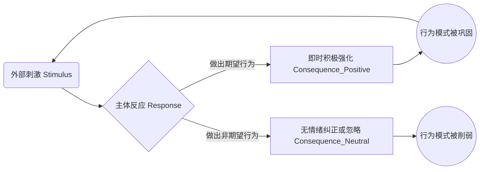
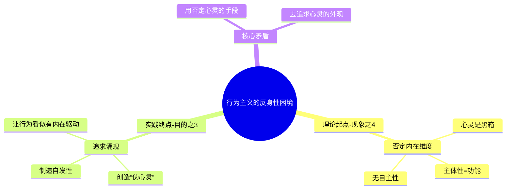
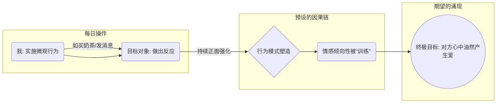

---
{"dg-publish":true,"permalink":"/1-1 科学实在论/1-1-4 行为主义/1-1-4-3 应用行为分析/","created":"2025-09-19T20:52:29.355+08:00","updated":"2025-09-22T22:20:54.135+08:00"}
---

### **一、本章概览**
- **主义主义编码**: 1-1-4-3
- **意识形态命名**: [[应用行为分析\|应用行为分析]] (ABA) / [[微观干预式保守主义\|微观干预式保守主义]]
- **核心论断**: 该意识形态在否认内在精神世界的前提下，试图通过对外部原子行为的持续、积极的[[强化\|强化]]，来机械地“涌现”出一种看似具有内在[[自主性\|自主性]]与[[自发性\|自发性]]的复杂行为模式。其本质是一种将交往对象客体化、工具化的[[操控\|操控]]策略。
- **你能获得**: 你将理解[[5 主义/行为主义\|行为主义]]心理学（特别是[[应用行为分析\|应用行为分析]]）的底层逻辑，洞悉其在目的论上的核心矛盾，并学会识别这种“奶茶式”微观干预在日常人际关系（尤其是亲密关系）中的运作模式及其伦理问题。

---
### **二、核心内容解析**
#### **“主义主义”四格分析**

1.  **场域之“1” (Ontology)**：该意识形态预设的[[世界\|世界]]是一个统一、同质且可拼接的物理性场域。在这个[[存在论\|存在论]]框架中，世界如同一块巨大的乐高底板，所有复杂的现象都可以被还原为最基础、最简单的“行为原子”。这些原子行为遵循着[[充足根据律\|充足根据律]]，它们之间可以被线性、机械地组合起来，从小到大、由简入繁，最终构成一幅看似复杂的行为图景。这个场域是封闭且连续的，不承认有任何超越物理秩序的、非连续性的精神性断裂或维度。

2.  **本体之“1” (Body)**：在此场域中，唯一真实存在（[[9 未命名/本体论\|本体论]]）的是可被观察、测量和操作的客观行为。讲稿中强调“只有行为只有具体行为”，这排除了所有内在的、主观的、精神性的实体。心灵、[[意识\|意识]]、意图、情感等皆被悬置或视为不存在。然而，这个“1”又带有一种特殊的色彩：它追求的是一种能够“独立发声”的行为，即最终目标是让这些被强化的客观行为能够看似自发地产生，脱离外部的直接刺激，形成一种伪自主的运作状态。

3.  **现象之“4” (Phenomenon)**：在[[现象\|现象]]学层面，该意识形态彻底否定了[[主体性\|主体性]]的内在维度。数字“4”在此代表一个空洞、一个黑箱，一个无法被通达的内在虚无。讲稿指出，此体系“不相信他有个内在精神维度”，所谓的“心理”只不过是外部行为功能的别称。个体的[[现象\|现象]]体验被完全等同于其应激功能，例如，一个人是否“健全”，只取决于他能否对外部刺激做出“正常”的行为反应。因此，不存在“心理变态”，只存在“行为障碍”（disorder），[[主体性\|主体性]]被彻底功能化和行为化了。

4.  **目的之“3” (Purpose)**：此意识形态的[[9 未命名/目的论\|目的论]]是其最核心且最具矛盾性的地方。数字“3”在此扮演了一个“调和者”与“中介者”的角色。它旨在调和“微观原子行为”（1）与“宏观整体行为”之间的断裂。这个“3”是一种被预设的“涌现”机制：只要对足够多的、足够细分的简单行为进行持续[[强化\|强化]]，这些行为便会自动地、有机地组织起来，最终“涌现”出一种看似具有内在目的性、[[自主性\|自主性]]和[[自发性\|自发性]]的复杂行为。它试图从外部操作中，凭空创造出一个“可以外显的心灵”，这恰恰是[[5 主义/行为主义\|行为主义]]走向了自身理念的反面，无意识地追求着它在[[现象\|现象]]层面所否定的东西。

#### **其他核心知识点**

##### S-R-C 模型与积极强化
此模型是[[应用行为分析\|应用行为分析]]（ABA）的技术核心，脱胎于[[斯金纳\|斯金纳]]的[[5 主义/行为主义\|行为主义]]。它将行为解构为“刺激 (Stimulus) - 反应 (Response) - 结果 (Consequence)”的链条。ABA的独特之处在于极度强调“结果”这一环，尤其是通过即时的、由受导者偏好的“积极[[强化\|强化]]物”（Positive Reinforcement）来巩固期望的反应。讲稿中提到，对[[自闭症\|自闭症]]儿童的训练，强化的奖励物（如巧克力、游戏币）需由儿童自己选择，且训练者在儿童犯错时仅予以无情绪的纠正，避免负面[[强化\|强化]]。这种方法旨在通过外部奖励，将刺激与正确的反应高效地铆钉在一起。

**举例阐释**：在训练[[自闭症\|自闭症]]儿童洗手时，“去洗手”是刺激（S），儿童走到洗手台前是反应（R），立刻给他一颗爱吃的糖果就是结果/积极[[强化\|强化]]（C）。通过反复[[强化\|强化]]，最终让“去洗手”的指令与走向洗手台的行为自动关联。

##### 行为主义的反身性困境
这是1-1-4-3意识形态的内在核心矛盾。一方面，它在[[现象\|现象]]学层面（4）彻底否定了心灵、[[意识\|意识]]和[[自主性\|自主性]]的真实存在，视其为一个无法探知的“黑箱”。但另一方面，它在[[9 未命名/目的论\|目的论]]层面（3）却致力于制造出一种“看上去”拥有[[自主性\|自主性]]和[[自发性\|自发性]]的行为主体。它想要通过纯粹的外部机械操作，来“涌现”出一个具有内在驱动力的“伪心灵”。这种“让行为不仅仅是行为”的终极目标，使得[[5 主义/行为主义\|行为主义]]在实践的终点戏剧性地追求起了它在理论起点所抛弃的东西，陷入了自我否定的悖论之中。

**举例阐释**：对[[自闭症\|自闭症]]儿童训练的“痊愈”标志是，他能在无人提示的情况下，自己“想”去上厕所、“想”去买东西。这个“想”正是该理论所否认的内在状态，但又是其训练成功的唯一标志。

##### “奶茶式”微观干预
这是1-1-4-3意识形态在日常生活中的典型体现，是一种将人际关系（特别是追求关系）工具化的[[操控\|操控]]策略。它将[[应用行为分析\|应用行为分析]]的逻辑套用在交往对象上，认为通过持续、点滴的“小恩惠”（如每天买奶茶、说好话），就可以像训练动物或[[自闭症\|自闭症]]患者一样，“塑造”（shape）对方的情感与行为。这种做法的底层逻辑是，微观行为的累积可以自动“涌现”出宏观的情感质变（如爱上自己）。它将对方视为一个没有独立[[主体性\|主体性]]、可以被外部[[强化\|强化]]所设定的客体。

**举例阐释**：讲稿中提到的办公室小伙子，每天给心仪的女生买奶茶。他并非在进行平等的沟通，而是在执行一套行为塑造程序，期待对方在持续的“积极[[强化\|强化]]”下，最终“自动地”、“[[自发性\|自发性]]地”爱上他。这是一种将对方“当自闭患者”的、不尊重其[[主体性\|主体性]]的[[操控\|操控]]。

---
### **三、关键观点提取**
- “[[5 主义/行为主义\|行为主义]]的目的变成让[[自闭症\|自闭症]]患者，让自闭儿童，比如说让自闭儿童有心灵，或者有一个可以外显的心灵。”
- “他实际上是把那个人当[[自闭症\|自闭症]]患者。我喜不喜欢你我难道自己不会说吗？对不对？我难道自己不会表达吗？”
- “这个职场的那种甜甜的你妈甜甜的恋爱背后的意识形态主要是这种东西...因为他觉得这个简单行为，微观行为可以这么积累的。”
- “它就是用微观行为，用微观的就是微微弱到几乎会被忽视的一些行为来表达立场。慢慢的来慢慢的慢慢的表达立场，慢慢的来表达和塑造塑造关系。”

---
### **四、知识点问答**
#### Q: 为何说1-1-4-3意识形态在目的上“走向了行为主义的反面”？
A: 因为经典的[[5 主义/行为主义\|行为主义]]在[[9 未命名/本体论\|本体论]]和[[现象\|现象]]学上都坚决排斥“心灵”、“[[意识\|意识]]”等内在概念，认为它们是不可知或不存在的。然而，1-1-4-3意识形态的[[9 未命名/目的论\|目的论]]（3）却是要通过外部行为[[强化\|强化]]，来“涌现”出一个看似拥有[[自主性\|自主性]]和[[自发性\|自发性]]的主体。这个最终目标——一个能自我发起行为的“健全人”——恰恰具备了传统意义上“心灵”的核心特征。因此，它用一套否定心灵的工具，去追求一个具有心灵外观的结果，从而在实践终点上背叛了其理论起点。

#### Q: “奶茶式”微观干预的伦理问题核心是什么？
A: 其核心伦理问题在于对他人[[主体性\|主体性]]的根本性否定与[[操控\|操控]]。它将交往对象降格为一个可通过外部刺激来编程的客体，而非一个拥有独立意志、情感和判断力的平等主体。这种做法取消了真实[[9 未命名/主体间性\|主体间性]]交流的可能性，用一套单向的、可计算的“行为塑造”程序，取代了充满不确定性但却真实的相互理解与情感互动。它在本质上是一种不尊重他人的、自恋式的[[操控\|操控]]。

#### Q: 在1-1-4-3的框架里，“涌现”（emergence）为何是一个核心的、带有欺骗性的概念？
A: 在这个体系中，“[[涌现\|涌现]]”是连接微观机械操作与宏观“伪心灵”状态的关键桥梁，也是其[[9 未命名/目的论\|目的论]]（3）的核心。它的欺骗性在于，它将一个纯粹机械、可预测的累积过程，包装成一个神秘的、有机的、看似自然的质变。它让实施者相信，只要自己不断执行简单的[[强化\|强化]]行为，对方的“爱”或“认同”就会像一个自然过程一样“油然产生”。这掩盖了其行为的[[操控\|操控]]本质，并为这种单向度的、非交互的僵化关系模式提供了虚假的合法性。

---
### **五、知识延伸**
- **[[斯金纳\|斯金纳]]《[[瓦尔登第二\|瓦尔登第二]]》**: 这本小说是[[5 主义/行为主义\|行为主义]]乌托邦的蓝图，描绘了一个完全由行为工程学和积极[[强化\|强化]]所构建的理想社区。它完美展示了1-1-4-3意识形态在社会层面的终极构想，是理解其背后世界观的绝佳文本，既是支持也是批判的参照。
- **[[格式塔心理学\|格式塔心理学]]**: 该学派强调“整体大于部分之和”，认为人的知觉和思维是整体性的，无法被还原为元素的简单相加。这与1-1-4-3试图通过拼接“行为原子”来机械地构造一个“整体”的思路，构成了直接的理论对立。可作为批判1-1-4-3还原论思想的重要参照。
- **电影《[[机械姬\|机械姬]]》 (Ex Machina)**: 影片探讨了如何判断一个人工智能是否拥有真正的[[意识\|意识]]。主角对AI进行图灵测试，本质上就是一套复杂的“刺激-反应”实验。这与1-1-4-3试图从可观察行为中推断甚至“创造”内在[[自主性\|自主性]]的努力高度相似，电影深刻揭示了“看似自主”与“真正自主”之间的模糊界限与哲学困境。

---
### **六、双链关联总结**
- **一级关联 (核心意识形态与概念)**: [[应用行为分析\|应用行为分析]]、[[微观干预式保守主义\|微观干预式保守主义]]、[[5 主义/行为主义\|行为主义]]、[[强化\|强化]]、[[自主性\|自主性]]、[[自发性\|自发性]]、[[操控\|操控]]、[[S-R-C 模型\|S-R-C 模型]]。
- **推测相关人物 (Speculated Figures)**:
    - `[[“奶茶男”式追求者]]`: 指代那些在亲密关系中，用持续的小恩小惠（物质或情感）代替平等沟通，试图“塑造”对方情感的人。他们是该意识形态在日常生活中的完美实践者。
    - `[[“老好人”式操控者]]`: 指那些通过持续的、不求回报的顺从和付出来建立人际关系，并期待对方最终能“[[自发性\|自发性]]”地回报或顺从其隐藏意图的人。
- **二级关联 (上下文与背景)**: [[斯金纳\|斯金纳]]、[[心理学\|心理学]]、[[5 主义/保守主义\|保守主义]]、[[格式塔心理学\|格式塔心理学]]、[[自闭症\|自闭症]]。
- **三级关联 (推测与延展)**: [[涌现\|涌现]]、[[9 未命名/主体间性\|主体间性]]、[[充足根据律\|充足根据律]]、[[心灵哲学\|心灵哲学]]、[[客体化\|客体化]]、[[还原论\|还原论]]、[[9 未命名/伦理学\|伦理学]]。