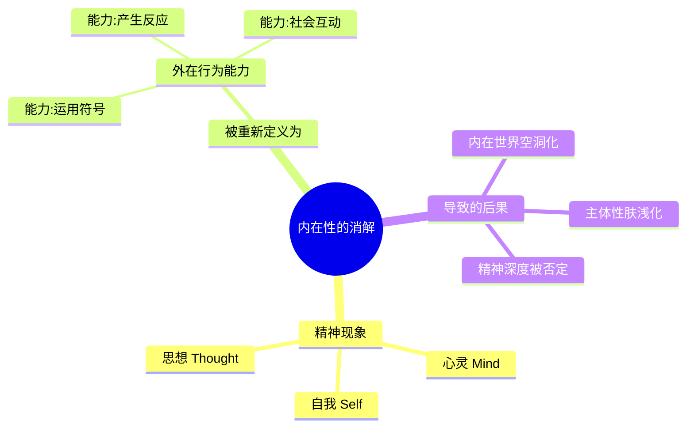
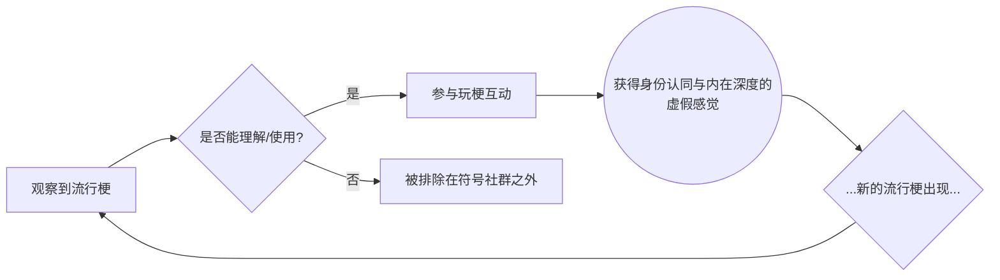
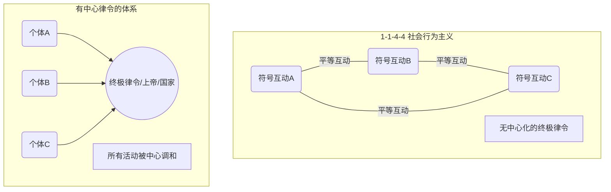

---
{"dg-publish":true,"permalink":"/1-1 科学实在论/1-1-4 行为主义/1-1-4-4 社会行为主义/","created":"2025-09-19T20:52:29.373+08:00","updated":"2025-09-22T22:20:55.023+08:00"}
---

### **一、本章概览**
- **主义主义编码**: 1-1-4-4
- **意识形态命名**: [[社会行为主义\|社会行为主义]] (Social Behaviorism)
- **核心论断**: 该意识形态将心灵、自我等一切[[内在性\|内在性]]彻底消解为外在的、可观察的“[[符号性的互动\|符号性的互动]]”能力，最终导向一种没有终极目的、通过不断“玩梗”式的肤浅互动来确认自身存在感的[[实用主义\|实用主义]]虚无。
- **你能获得**:
    - 理解[[乔治·赫尔伯特·米德\|乔治·赫尔伯特·米德]]的[[社会行为主义\|社会行为主义]]是如何被“主义主义”编码为 1-1-4-4 的。
    - 掌握该意识形态从[[存在论\|存在论]]到[[9 未命名/目的论\|目的论]]的完整内在结构。
    - 洞察“[[玩梗文化\|玩梗文化]]”作为 1-1-4-4 意识形态在当代互联网生活中的具体体现及其内在矛盾。

---
### **二、核心内容解析**

#### **“主义主义”四格分析**

1.  **场域之“1” (Ontology)**：该意识形态的世界观框架是一个统一、同质且自足的[[科学实在论\|科学实在论]]宇宙。这个[[世界\|世界]]在本质上是物理主义的，遵循着一套普遍的、无矛盾的秩序。然而，这个“1”的特殊之处在于，它被预设为一个可以“白嫖”[[符号性的互动\|符号性的互动]]的舞台。即，这个统一的物理世界本身就内在地、无条件地允许和支持着各种符号活动的发生，仿佛这些互动是物理规律的自然延伸。万物，从原子到人类，都在这个单一、封闭的场域中进行着有规律可循的互动。

2.  **本体之“1” (Body)**：在这个统一的[[世界\|世界]]舞台上，存在的“真实之物”也是单一、同质的。不存在精神与物质的二元对立，一切都是可以进行符号性互动的“物质”。无论是人、动物还是无机物，其本质都被还原为遵循特定秩序规则进行互动的实体。这种本体论上的“1”抹平了所有质的差异，将心灵、自我等特殊存在降格为一种特定物质（如大脑）进行复杂符号互动时所表现出的功能属性，其根本与其他物质的互动并无本质区别。

3.  **现象之“4” (Phenomenon)**：在现象层面，该意识形态体现为一种对[[主体性\|主体性]]的激进悬置与消解。这里的“4”代表着[[内在性\|内在性]]的虚无与空缺。心灵、自我意识、精神深度不再被视为一个内在于主体的实体结构，而被彻底“外部化”，还原为一种可被观察和测量的“能力”——即主体运用符号进行社会互动的能力。这种还原论导致了[[主体性\|主体性]]的内在分裂：个体越是试图通过外在的符号操演（如玩梗）来证明和感受自己的内在深度，其[[内在世界\|内在世界]]就越是变得空洞和肤浅。

4.  **目的之“4” (Purpose)**：该意识形态在[[9 未命名/目的论\|目的论]]上同样是一个“4”，即它彻底否定了任何终极目的或宏大叙事。这是一个典型的[[实用主义\|实用主义]]立场，认为[[世界\|世界]]的运动没有一个预设的、主导性的方向。所有的[[符号性的互动\|符号性的互动]]都只是互动本身，它们是无尽的、漫无目的的，不存在一个“元语言”或“[[终极律令\|终极律令]]”来为这一切赋予终极意义。这种目的的“缺席”一方面带来了反抗[[反总体主义\|反总体主义]]的开放性，但另一方面也使生命陷入一种无意义的、不断重复的肤浅循环之中。

#### **其他核心知识点**

##### 内在性的消解与行为能力化
这种意识形态的核心操作，是将所有不可见的精神现象（如心灵、自我、思想）重新定义为一种外在的、可观察的“行为能力”。[[内在性\|内在性]]被彻底掏空，不再是一个具有结构和深度的空间，而被等同于“能够运用符号进行有效社会互动的能力”。这种定义方式是[[5 主义/行为主义\|行为主义]]与[[5 主义/实证主义\|实证主义]]的直接体现，它拒绝承认任何无法被外部观察和量化的事物，最终将人之为人的精神维度，贬低为一种可以被统计和测量的功能。这种消解服务于一种科学主义的掌控欲，试图将复杂的人类经验纳入一个简单的、可预测的互动模型中。

**举例阐释**：讲稿中提到，米德体系下的“有心灵”被定义为“个体有能力用符号来创造意义”。而所谓的“意义”，又被还原为符号在社会交往中“有用”，有一个“稳定的用法”。这意味着，一个人的内心世界不再重要，重要的是他能否像玩游戏一样熟练地使用社会通行的符号（比如黑话、梗），并得到外部的有效反馈。

##### 玩梗文化作为1-1-4-4的当代肉身
[[玩梗文化\|玩梗文化]]是1-1-4-4意识形态在当代互联网社会最生动的体现。它完美地复刻了[[社会行为主义\|社会行为主义]]的核心逻辑：通过纯粹外在的、可复制的[[符号性的互动\|符号性的互动]]（玩梗、发表情包），来模拟、确认甚至替代真实的[[内在世界\|内在世界]]。在这个文化中，一个人是否“有思想”、“有趣”，不再取决于其真实的内在体验和思考深度，而取决于他掌握和运用“梗”这种流行符号的能力。这种行为模式创造了一种虚假的共同体感和个体深度，但其本质是漫无目的（目的之“4)的符号消费，最终反而加剧了[[主体性\|主体性]]的空洞化（现象之“4”）。

**举例阐释**：一个人可能完全不了解某个复杂的社会事件，但他只要学会了关于此事件最流行的几个“梗”，就可以在社交媒体上参与讨论，给人一种他“懂了”、“有态度”的错觉。他通过玩梗这种外在行为，为自己构建了一个虚假的、有深度的内在形象。

##### 无终极律令的实用主义姿态
1-1-4-4在目的论上的“4”体现为一种坚决的[[反总体主义\|反总体主义]]和[[实用主义\|实用主义]]姿态，即拒绝承认在具体的、流动的符号互动之外，还存在一个绝对的、超越性的“[[终极律令\|终极律令]]”或“元规则”来主宰一切。这使得它天然地反对任何试图统一思想的集权体系。然而，这种立场也并非毫无代价。讲稿指出，它虽然表面上宣称没有终极规则，却仍然偷偷预设了一个“1”的场域——即一个能保证所有符号互动可以“平等”进行的、稳定的[[科学实在论\|科学实在论]]世界。这个被默许的、作为兜底的统一场域本身，就是一种隐性的、不被反思的[[终极律令\|终极律令]]。

**举例阐释**：[[理查德·罗蒂\|理查德·罗蒂]]这样的新实用主义者也持类似观点，主张放弃对“真理”、“实在”等宏大概念的追求，满足于地方性的、约定俗成的对话。这种思想看似解放，但它回避了“凭什么这些对话可以持续进行”这个根本问题，因为它暗中依赖着一个稳定的、被主流话语（如科学、法律）所保障的社会秩序。

---
### **三、关键观点提取**
- “他会把心灵的各个结构也给它消解掉，消解成他所说的[[符号性的互动\|符号性的互动]]。”
- “目的论上是没有目的论的，他是个[[实用主义\|实用主义]]立场。……没有一个背后的一个[[终极律令\|终极律令]]。”
- “它表面上坚持的，但是实际上他背后还是预设了场，舆论上还是预设的有[[符号性的互动\|符号性的互动]]的那个场可以白嫖的那个厂……”
- “通过玩梗来识别这个人有没有懂不懂……通过玩梗以为自以为通过玩梗可以让自己有一个[[内在世界\|内在世界]]。……那实际上是很肤浅的。”

---
### **四、知识点问答**
#### Q: 为什么说1-1-4-4意识形态下的主体，越是追求“内在深度”，就越是变得“肤浅”？
A: 因为在该体系中，通往“[[内在深度\|内在深度]]”的路径被错误地设定为外部的“[[符号性的互动\|符号性的互动]]”能力（现象之“4”）。主体只能通过不断地玩梗、使用流行语等外在行为来确认自己的[[内在世界\|内在世界]]。这个过程形成了一个恶性循环：主体为了证明自己的深度，会去追逐更多、更新的外部符号，从而将全部精力投入到肤浅的模仿和表演中，反而没有机会去进行真正的、艰难的内在反思和构建。外在表演越成功，内在的真实性就越被掏空。

#### Q: 1-1-4-4意识形态如何体现其“反总体主义”的特征？这种反抗的局限性又在哪里？
A: 它的[[反总体主义\|反总体主义]]特征主要体现在目的论的“4”上，即它拒绝任何统一的、强制性的[[终极律令\|终极律令]]或价值体系。它主张所有符号互动都是平等的、相对的，没有一个中心化的权力来裁决优劣，这天然地抵制了思想上的集权。然而，其局限性在于，它对场域（1）和本体（1）的设定是完全不加反思的。它默认并依赖于一个统一的、由[[科学实在论\|科学实在论]]或主流权威话语所保障的秩序。因此，它只反对社会、文化层面的“显性极权”，却对更根本的、作为一切互动前提的“隐性极权”（如科学话语霸权）完全顺从。

#### Q: 讲稿提到米德和罗蒂，如何理解[[实用主义\|实用主义]]在这种意识形态中的核心作用？
A: [[实用主义\|实用主义]]在1-1-4-4中扮演了双重角色。首先，它是消解[[内在性\|内在性]]的理论工具。它以“效用”为标准，将无法在外部交往中产生直接“用处”的内在精神活动视为无意义的，从而为将其还原为行为能力提供了合法性。其次，它是目的论虚无（“4”）的直接表达。[[实用主义\|实用主义]]拒绝探讨终极目的和绝对真理，主张意义在于具体的、不断变化的实践活动中，这恰好对应了1-1-4-4那种漫无目的、永无止境的符号互动状态。

---
### **五、知识延伸**
- **[[理查德·罗蒂\|理查德·罗蒂]]的《[[哲学与自然之镜\|哲学与自然之镜]]》**: 这本书是理解1-1-4-4目的论之“4”的绝佳文本。罗蒂在书中系统地批判了追求“真理”作为心灵对实在的精确再现的整个西方哲学传统，主张用“对话”和“团结”取代“客观性”，这与米德体系中放弃[[终极律令\|终极律令]]、转向无目的的社会互动的姿态高度一致。
- **[[B.F.斯金纳\|B.F.斯金纳]]的[[激进行为主义\|激进行为主义]]**: 这是[[5 主义/行为主义\|行为主义]]的一个更极端版本，它不仅消解心灵，甚至认为自由意志是纯粹的幻觉。斯金纳的理论可以看作是1-1-4-4中“现象之4”的深化和极端化，有助于理解将一切归于外部刺激与反应的逻辑推到极致会是什么样子，构成了一个重要的参照和批判对象。
- **[[网络亚文化与身份认同\|网络亚文化与身份认同]]研究**: 这是一个社会学研究领域，专门探讨个体如何在网络社区中通过特定的语言、表情包（梗）来构建和表达身份。将1-1-4-4的分析框架应用于此领域，可以非常精准地诊断出当代网络社群中身份认同的建构方式、其内在的虚假性以及对个体[[主体性\|主体性]]的深刻影响。

---
### **六、双链关联总结**
- **一级关联 (核心意识形态与概念)**: [[社会行为主义\|社会行为主义]]、[[乔治·赫尔伯特·米德\|乔治·赫尔伯特·米德]]、[[符号互动主义\|符号互动主义]]、[[内在性\|内在性]]、[[符号性的互动\|符号性的互动]]、[[玩梗文化\|玩梗文化]]、[[内在世界\|内在世界]]。
- **推测相关人物 (Speculated Figures)**: **“梗百科全书”式的网络用户**。这类用户以惊人的速度学习、使用并传播网络流行梗，其线上人格完全由这些符号拼接而成。他们以此获得社交资本和群体认同，但其个人观点和情感表达也完全被这些既有的符号所框定，体现了通过外在表演来填充内在虚无的1-1-4-4模式。
- **二级关联 (上下文与背景)**: [[实用主义\|实用主义]]、[[5 主义/行为主义\|行为主义]]、[[科学实在论\|科学实在论]]、[[5 主义/实证主义\|实证主义]]、[[社会心理学\|社会心理学]]、[[理查德·罗蒂\|理查德·罗蒂]]。
- **三级关联 (推测与延展)**: [[9 未命名/目的论\|目的论]]、[[主体性\|主体性]]、[[反总体主义\|反总体主义]]、[[终极律令\|终极律令]]、[[激进行为主义\|激进行为主义]]、[[网络亚文化与身份认同\|网络亚文化与身份认同]]、[[B.F.斯金纳\|B.F.斯金纳]]。