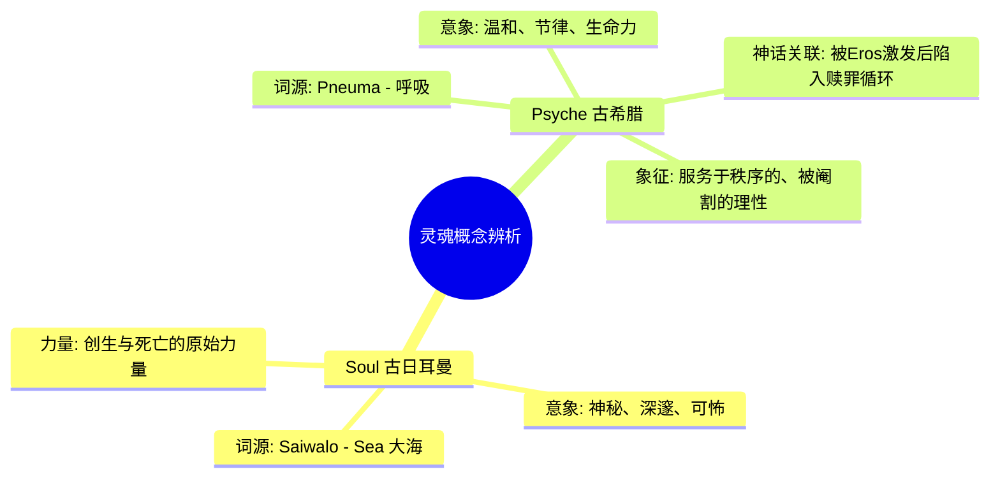
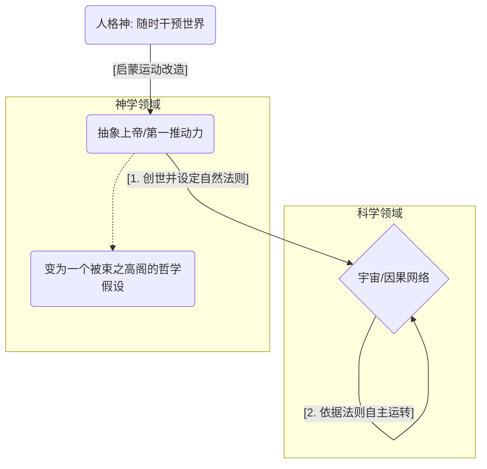
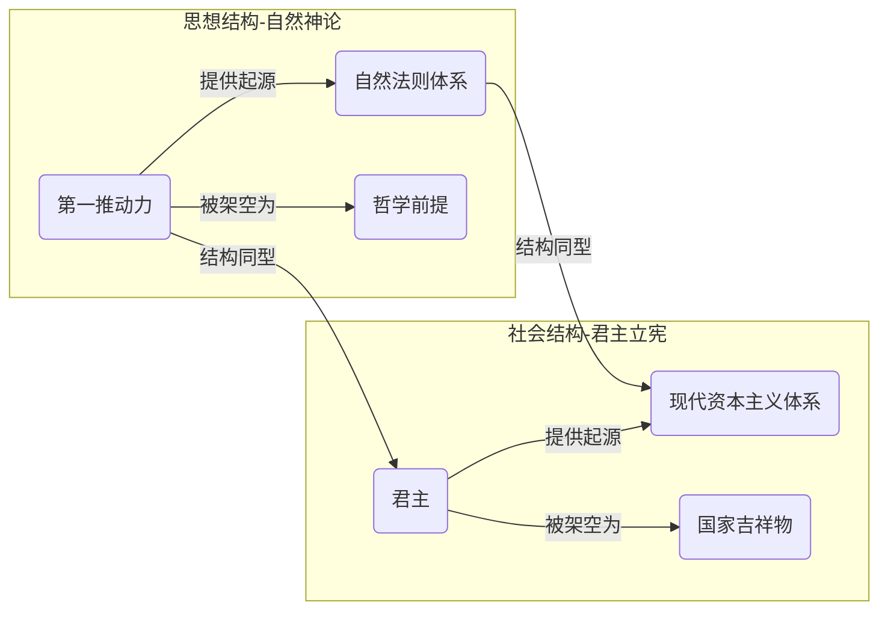

---
{"dg-publish":true,"permalink":"/1-2 宗教实在论/1-2-1 神创论/1-2-1-1 自然神论/","created":"2025-09-19T20:52:29.388+08:00","updated":"2025-09-22T21:57:42.016+08:00"}
---

### **一、本章概览**
- **主义主义编码**: 1-2-1-1
- **意识形态命名**: [[自然神论\|自然神论]] (Deism)
- **核心论断**: [[自然神论\|自然神论]]是一种前反思的意识形态，它通过将世界分裂为神圣的“[[第一推动力\|第一推动力]]”与世俗的“[[因果网络\|因果网络]]”，试图在保留上帝作为终极起源的同时，为[[近代科学\|近代科学]]的自主运作开辟空间。其核心问题在于，它将生命的创造力（[[Eros\|Eros]]）囚禁于一个一次性的、抽象的创世行为中，导致世界本身沦为一个无目的的、自我循环的机械装置。
- **你能获得**: 通过本笔记，你将掌握对[[自然神论\|自然神论]]（1-2-1-1）的“四格”诊断法，理解其在[[9 未命名/本体论\|本体论]]上如何制造分裂，在现象和目的上又如何回归统一；你将辨析[[Psyche\|Psyche]]与Soul的关键区别，并洞悉[[君主立宪制\|君主立宪制]]等现代现象背后隐藏的“[[前现代残余\|前现代残余]]”逻辑。

---
### **二、核心内容解析**
#### **“主义主义”四格分析**

1.  **场域之“1” (Ontology)**：此处的“1”代表一个绝对统一、和谐且封闭的[[世界\|世界]]图景。该意识形态预设的舞台是一个由[[宇宙法则\|宇宙法则]]完全支配的、无缝的[[整全性\|整全性]]系统。在这个场域里，不存在任何外在于秩序的裂隙或矛盾，因为场域本身就是这个永恒、无限、自我循环的秩序的化身。它是一个完美的、如同水晶球般自足的宇宙（Universe），为后续所有运动提供了稳定且不可动摇的背景板。

2.  **本体之“2” (Body)**：在统一的场域内，世界的真实内容被分裂为二。这里的“2”体现为一种创造者与被造物之间的绝对[[对抗性\|对抗性]]。一方是超越性的、大写的“[[第一推动力\|第一推动力]]”（The First Cause），即上帝或古希腊哲学中的[[Eros\|Eros]]（爱欲），祂是万物唯一的始因。另一方则是被派生出的、世俗的、由无数具体原因和结果构成的[[因果网络\|因果网络]]（causes and effects）。这两者处于一种紧张的分离状态：前者启动了世界，但后者则依照自身的机械规律自主运转，前者不再干预后者。

3.  **现象之“1” (Phenomenon)**：主体性的体验在此处被整合为一个统一、被动的实体，即“1”。讲稿精辟地指出，这里的灵魂不再是古日耳曼语境中神秘、深邃的`soul`，而是古希腊神话中的[[Psyche\|Psyche]]（心灵女神）。[[Psyche\|Psyche]]的本质是被动的：她被[[Eros\|Eros]]所爱、所激发，但因背叛而被迫陷入无尽的“赎罪”循环——即完成各种智力考验。这象征着人的心灵虽有理性能力，但其运作模式却是为了弥补某种原初亏欠而进行的重复性劳动，其生命力（呼吸）最终服务于一个外在设定的循环，而非真正的[[自由\|自由]]。

4.  **目的之“1” (Purpose)**：该意识形态的[[9 未命名/目的论\|目的论]]同样是一个封闭的“1”，即永恒的循环与重复。世界的最终目的，就是让上帝创世之初所设定的[[自然法则\|自然法则]]（Natural Law）永无止境地运转下去。上帝就像一个摇动爆米花机的师傅，在给予了第一推动力后，便任由机器“哒哒哒哒”地自行运转。这个[[目的\|目的]]没有超越性，不导向救赎或新世界的开启，唯一的终点就是维持现有秩序的无限循环，确保这个机械宇宙永不偏离其轨道。

#### **其他核心知识点**

##### Psyche 与 Soul 的关键区分
讲稿通过词源学与神话学分析，深刻揭示了[[自然神论\|自然神论]]中主体性被压抑的本质。它区分了两种“灵魂”概念：源自古日耳曼语、与“大海”（Sea）同源的`soul`，代表一种神秘、深不可测、充满创生与死亡力量的原始体验；以及源自古希腊语“呼吸”（pneuma）的[[Psyche\|Psyche]]，代表一种更温和、更具节律性的生命力。在[[自然神话\|自然神话]]体系中，[[Psyche\|Psyche]]被[[Eros\|Eros]]激发后，因“背叛”而陷入了以智力解题来赎罪的循环。这精准地描绘了启蒙时代的主体：看似拥有理性（智力），实则其全部能动性都被限定在探索那个已然被“[[第一推动力\|第一推动力]]”设定好的[[自然法则\|自然法则]]之中，是一种服务于既定秩序的、被阉割了创造性的主体。

**举例阐释**：现代心理学（Psychology）词根正是[[Psyche\|Psyche]]而非Soul，这并非偶然。心理学在诞生之初，往往旨在将人类复杂的内心活动还原为可被观察、测量和预测的规律性机制，这恰恰继承了[[自然神论\|自然神论]]将心灵视为一个可被“解题”的、遵循内在法则的封闭系统的思想。

##### 第一推动力与牛顿的上帝
“[[第一推动力\|第一推动力]]”是[[自然神论\|自然神论]]为调和宗教与科学而发明的核心装置。它将上帝从一个时刻干预世界的人格神，改造为一个抽象的、仅在宇宙开端起作用的本体论假设。上帝的角色类似于一个钟表匠，他设计并制造了一台精密的钟表（宇宙），上紧发条（[[第一推动力\|第一推动力]]）后，便任其自行运转，不再插手。这个操作在历史上起到了将上帝“请出”物理学实验室的作用，为[[牛顿\|牛顿]]等人研究[[自然法则\|自然法则]]提供了合法的思想空间，从而抵御了当时兴起的、被贵族知识分子视为非理性的宗教狂热。

**举例阐释**：讲稿中那个“两个拉比对上帝说‘闭嘴，你的工作已经完成了’”的犹太笑话，生动地揭示了这一结构。上帝（[[第一推动力\|第一推动力]]）在完成创世行动后，其权威就被他自己所创造的[[自然法则\|自然法则]]（以及法则的阐释者——人类）所取代和束缚。

##### 前现代残余与君主立宪制
讲稿援引[[齐泽克\|齐泽克]]的观点，将[[自然神论\|自然神论]]的结构类比于[[现代资本主义\|现代资本主义]]社会中的[[君主立宪制\|君主立宪制]]。纯粹的、绝对的现代性是不存在的，它必须寄生于一个象征性的“[[前现代残余\|前现代残余]]”之上，才能实现其意识形态功能。君主就像那个被架空的“[[第一推动力\|第一推动力]]”，他/她的存在本身没有实际权力，却为整个现代政治与社会体系的“自发”运转提供了一个虚构的、神圣的起源和合法性。这种残余的存在，使得现代社会可以将自身的问题归咎于“尚未清除干净的古代遗毒”，从而回避对现代性自身内在矛盾的反思。

**举例阐释**：英国或日本的王室大典，其庄严、肃穆甚至略带“愚蠢”的仪式感，恰恰反衬和巩固了现代日常生活的“理性”与“自由”。年轻人参加完加冕典礼后涌入酒吧狂欢，这种行为模式揭示了[[前现代残余\|前现代残余]]作为一种“他者”，反而强化了现代主体对自身身份的认同。

---
### **三、关键观点提取**
- “这个时候[[上帝\|上帝]]就被他自己所设立的那个[[自然法\|自然法]]自然法则所反过来束缚了，是1-2-1-1。”
- “在古希腊的那个神话里面，[[心灵\|心灵]]女神、精神女神（[[Psyche\|Psyche]]）背叛了[[上帝\|上帝]]…为了赎罪，他就疲于奔命的去搞定这些智力上的考验，完成各种智力上的考验。”
- “他（[[牛顿\|牛顿]]）把[[上帝\|上帝]]去人格化…变成一个抽象的前提就是所谓的[[第一推动力\|第一推动力]]，这个玩意儿是一个虚的东西，这个玩意儿是个虚的，是个囚笼，把这个[[上帝\|上帝]]给他关起来的。”
- “[[现代资本主义\|现代资本主义]]，他必须寄生在[[前现代残余\|前现代残余]]上。我们这个世界上没有不寄生在[[前现代残余\|前现代残余]]上的资本主义。”

---
### **四、知识点问答**
#### Q: 为何讲稿认为，一个“科学决定论者”（1-1-1-1）转变为“自然神论者”（1-2-1-1）是一种“返祖”和“变蠢”？
A: 因为这种转变并未触及问题的核心。从“主义主义”框架看，真正的思想进步在于对体系的“场域”本身进行反思。[[科学决定论\|科学决定论]]（1-1-1-1）将整个世界视为一个统一的决定论秩序。而[[自然神论\|自然神论]]（1-2-1-1）只是在场域不变（依然是“1”）的前提下，将[[本体\|本体]]分裂为“[[第一推动力\|第一推动力]]”和“[[因果网络\|因果网络]]”。这种二分法是一种低智商的妥协，它回避了对那个统一秩序（即[[科学法则\|科学法则]]本身）的合法性的根本性质疑。一个更聪明的跃迁，应该是走向“2-1-1-1”，即进入[[形而上学\|形而上学]]，直接在场域层面就发问：“这个我们信奉的统一秩序，其本身是否就是有问题的、不唯一的？”

#### Q: [[自然神论\|自然神论]]是如何通过“阉割”[[Eros\|Eros]]（爱欲）来为近代科学铺路的？
A: 在古希腊思想中，[[Eros\|Eros]]是贯穿世界的、持续不断的创生和自我突破的力量。[[自然神论\|自然神论]]将这种力量“阉割”了：它把[[Eros\|Eros]]的全部能量都限制在了宇宙创生的“第一推动”那一个瞬间，并将其囚禁在“[[上帝\|上帝]]”这个抽象的、彼岸的笼子里。如此一来，被创造出的[[世界\|世界]]就不再拥有内在的、自发的生命冲动，而变成了一具可以被[[近代科学\|近代科学]]放心大胆地进行解剖、分析和预测的“尸体”或机械装置。科学的确定性，正是以扼杀世界的生命力为代价换来的。

#### Q: [[自然神论\|自然神论]]（1-2-1-1）中的“2”和真正具有革命性的“2”有何本质区别？
A: [[自然神论\|自然神论]]中的“2”（[[9 未命名/本体论\|本体论]]分裂）是一种“伪对抗”。它虽然设立了“[[第一推动力\|第一推动力]]”与“[[因果网络\|因果网络]]”的对立，但这种对立是静态的、等级制的，前者创造并启动后者后便不再与之发生真实冲突。而一个具有革命性的“2”，如[[阶级斗争\|阶级斗争]]，是指两个实体在同一个场域内进行着你死我活的、持续的动态斗争，这种斗争会不断地重塑场域本身。[[自然神论\|自然神论]]的“2”旨在维持稳定，而革命性的“2”旨在颠覆稳定。

---
### **五、知识延伸**
- **[[拉普拉斯的恶魔\|拉普拉斯的恶魔]] (Laplace's Demon)**: 这一思想实验是[[自然神论\|自然神论]]中决定论思想的逻辑极致。它构想了一个知晓宇宙所有粒子初始状态（相当于[[第一推动力\|第一推动力]]之后的状态）的超级智能，这个智能便能推算出宇宙的全部未来。这完美体现了1-2-1-1意识形态下，世界一旦被启动，就进入一个完全可预测的、封闭的[[因果网络\|因果网络]]的信念。
- **[[钟表匠论证\|钟表匠论证]] (Watchmaker Analogy)**: 由威廉·佩利提出的著名神学论证，是[[自然神论\|自然神论]]最通俗易懂的布道。它认为，如同发现一块构造复杂的钟表必然推断出有位钟表匠一样，观察到宇宙的精妙秩序也必然推断出有一位设计者（上帝）。这个类比精准地捕捉了上帝作为“设计者”和“启动者”而非“持续干预者”的角色。
- **[[尼采\|尼采]]的“权力意志”**: 尼采哲学是对[[自然神论\|自然神论]]所代表的启蒙理性的猛烈批判。他的“[[权力意志\|权力意志]]”概念，可以被看作是对被阉割的[[Eros\|Eros]]的全面解放。在尼采看来，生成、创造和支配的冲动（权力意志）并非一个一次性的[[第一推动力\|第一推动力]]，而是遍在于万物之内、永不休止的内在驱动力。这直接颠覆了[[自然神论\|自然神论]]中那个静态、机械的[[世界\|世界]]图景。

---
## 双链关联总结
- **一级关联 (核心意识形态与概念)**: [[自然神论\|自然神论]]、[[第一推动力\|第一推动力]]、[[因果网络\|因果网络]]、[[Eros\|Eros]]、[[Psyche\|Psyche]]、[[自然法则\|自然法则]]
- **推测相关人物 (Speculated Figures)**:
    - [[牛顿\|牛顿]]: 历史上[[自然神论\|自然神论]]最著名的代表，其物理学体系完美地体现了由[[第一推动力\|第一推动力]]启动、并由普适[[自然法则\|自然法则]]支配的宇宙模型。
    - 当代某些科普作家或“死理性派”科学家: 他们在惊叹宇宙秩序的精巧时，可能会将起源问题归于一个不可知的、类似于“[[第一推动力\|第一推动力]]”的神秘领域，同时坚信现实世界完全由物理法则决定，这在结构上复刻了[[自然神论\|自然神论]]的模式。
- **二级关联 (上下文与背景)**: [[9 未命名/启蒙运动\|启蒙运动]]、[[近代科学\|近代科学]]、[[形而上学\|形而上学]]、[[基督教\|基督教]]、[[9 未命名/本体论\|本体论]]、[[9 未命名/现象学\|现象学]]、[[9 未命名/目的论\|目的论]]
- **三级关联 (推测与延展)**: [[君主立宪制\|君主立宪制]]、[[前现代残余\|前现代残余]]、[[现代资本主义\|现代资本主义]]、[[齐泽克\|齐泽克]]、[[拉普拉斯的恶魔\|拉普拉斯的恶魔]]、[[钟表匠论证\|钟表匠论证]]、[[尼采\|尼采]]、[[科学独断论\|科学独断论]]、[[整全性\|整全性]]、[[对抗性\|对抗性]]