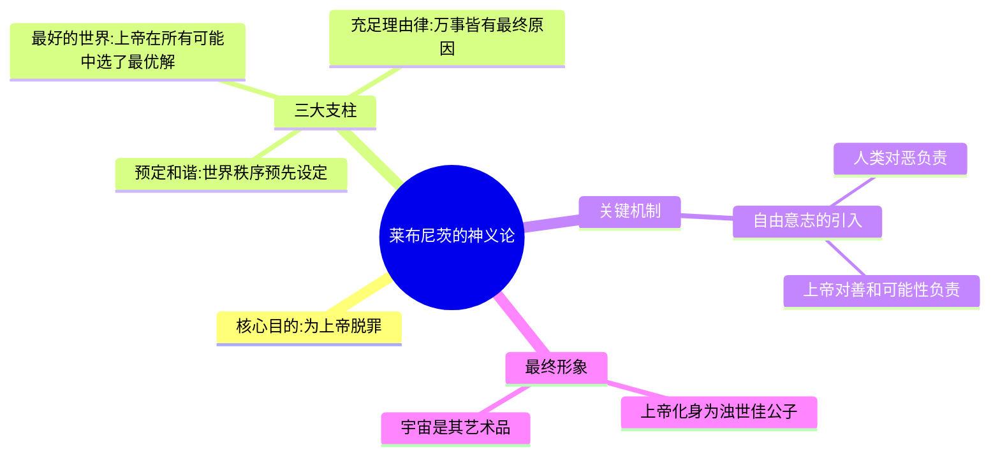
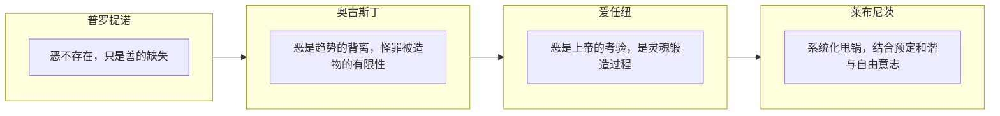
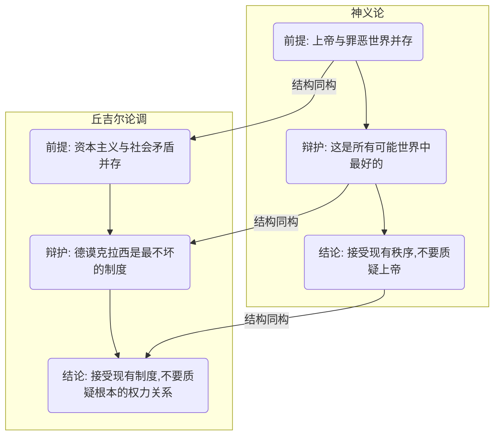

---
{"dg-publish":true,"permalink":"/1-2 宗教实在论/1-2-1 神创论/1-2-1-2 神义论/","created":"2025-09-19T20:52:29.390+08:00","updated":"2025-09-22T22:20:48.055+08:00"}
---

### **一、本章概览**
- **主义主义编码**: 1-2-1-2
- **意识形态命名**: [[神义论\|神义论]] / [[神正论\|神正论]] (Theodicy)
- **核心论断**: [[神义论\|神义论]]是一种为既定秩序辩护的意识形态，其核心操作在于，承认世界存在[[罪恶\|罪恶]]与苦难，但通过一系列精巧的理论（如甩锅、大棋党、最好可能世界论），将这些[[罪恶\|罪恶]]的最终责任从秩序的[[造物主\|造物主]]（上帝或权力本身）身上剥离，转嫁给[[被造物\|被造物]]（人类、个体），从而在不否认问题的前提下，维护该秩序的根本正当性与至善性。
- **你能获得**: 通过本笔记，你将掌握[[神义论\|神义论]]这一经典意识形态（1-2-1-2）的内在构造。你不仅能理解历史上[[普罗提诺\|普罗提诺]]、[[奥古斯丁\|奥古斯丁]]、[[爱任纽\|爱任纽]]及[[莱布尼茨\|莱布尼茨]]等人辩护策略的演进，更能洞悉这种“承认瑕疵但甩锅”的逻辑如何被当代政治话术（如“[[最不坏的制度\|最不坏的制度]]”）所复用，从而获得一种诊断现实世界中精巧辩护术的批判性武器。

---
### **二、核心内容解析**

#### **“主义主义”四格分析**

1.  **场域之“1” (Ontology)**：该意识形态预设的[[世界\|世界]]图景是一个统一、封闭且有序的[[宇宙\|宇宙]]（Universe）。这个“1”代表着场域本身即是一种不容置疑的、先在的、整全的秩序，如宇宙法则或神的宏大计划。它不是与混乱对立的秩序，而是秩序本身就构成了整个舞台。万事万物都在这个唯一的、无所不包的框架内发生，不存在外在于此秩序的任何空间，这就为后续的“辩护”提供了坚实且不容动摇的背景板。

2.  **本体之“2” (Body)**：在这一整全的[[宇宙\|宇宙]]舞台上，真实存在的东西被划分为一个尖锐的二元对立：[[造物主\|造物主]] vs. [[被造物\|被造物]]。这是一个典型的“2”结构，代表着外部的、不可调和的冲突。[[造物主\|造物主]]（上帝）是主动、全能、至善的本体；而[[被造物\|被造物]]（人类、世界）则是被动、有限、充满缺陷的。这种本体论上的根本分裂，直接催生了[[神义论\|神义论]]所要解决的核心矛盾：一个全善的[[造物主\|造物主]]为何创造了一个充满[[罪恶\|罪恶]]的世界？

3.  **现象之“1” (Phenomenon)**：主体的感知与体验被统一处理为一种单一状态：一个有缺陷的[[灵魂\|灵魂]]（Soul）。此处的[[灵魂\|灵魂]]已非古典哲学的*psyche*，而是日耳曼语境中深渊、危险的象征。这个“1”意味着，所有[[主体性\|主体性]]都被同质化为“有待拯救”或“本身有限”的状态。个体的苦难、挣扎和困惑，不再被视为对外部秩序的有效控诉，而被内化为[[灵魂\|灵魂]]自身固有的、普遍的缺陷。这种现象学的统一性，巧妙地将矛盾从造物主转移到了被造物自身。

4.  **目的之“2” (Purpose)**：该意识形态的[[9 未命名/目的论\|目的论]]同样呈现为一个二元对立的斗争结构：[[神义\|神义]]（Theodicy） vs. [[罪恶\|罪恶]]（Evil）。其最终目的并非创造新事物或抵达一个终极的和谐，而是永恒地进行一场辩护战。这场斗争的全部意义，就在于不断地、反复地证明“神之正义”能够压倒和解释“世界的[[罪恶\|罪恶]]”。这个“2”意味着意识形态的运作本身就是其目的，它通过持续的辩护行为，来维持和巩固第一格（场域）与第二格（本体）设定的秩序。

#### **其他核心知识点**

##### 莱布尼茨的“甩锅”三部曲
[[莱布尼茨\|莱布尼茨]]将[[神义论\|神义论]]的辩护技巧发展到了顶峰，他构建了一个看似无懈可击的系统，旨在将上帝从[[罪恶\|罪恶]]的指控中彻底解放出来，堪称一套意识形态上的“完美犯罪”。其核心在于将责任巧妙地转嫁给人类的[[自由意志\|自由意志]]，同时保留上帝的“总设计师”光环。这套理论不仅复杂精巧，更深刻揭示了意识形态如何通过赋予个体“自由”来让其“自愿”承担系统性的罪责。

**举例阐释**：讲稿中提到的“失败的父母”是这个逻辑的绝佳类比。父母会说：“你是我生的（[[充足理由律\|充足理由律]]），我为你设计了最好的成长路线（[[预定和谐\|预定和谐]]），给了你我能给的一切（[[最好的世界\|最好的世界]]）。”当孩子成功时，父母会说“看，不愧是我的基因”；当孩子失败时，则会说“我给了你选择的自由，是你自己不努力（[[自由意志\|自由意志]]的锅）”。通过这种方式，父母成功地将所有荣耀归于自己，将所有失败归于孩子。

##### 辩护策略的演进
[[神义论\|神义论]]并非铁板一块，其内部存在一个愈发精巧的“甩锅”技术迭代过程。从[[普罗提诺\|普罗提诺]]简单粗暴地否认[[罪恶\|罪恶]]的存在，到[[奥古斯丁\|奥古斯丁]]承认其为“善的背离”并归咎于被造物的有限性，再到[[爱任纽\|爱任纽]]将其美化为“上帝的考验”，最终由[[莱布尼茨\|莱布尼茨]]集大成。这个演进过程，正是一部意识形态如何面对现实诘难而不断升级、完善自身防御工事的思想史。

**举例阐释**：讲稿中将这几位思想家比喻为不同类型的君主，生动地揭示了其策略差异。[[普罗提诺\|普罗提诺]]是“无聊暴君”，直接宣布“恶不存在”；[[奥古斯丁\|奥古斯丁]]是“甩锅的昏君”，将问题推给臣民的有限性；[[爱任纽\|爱任纽]]是“勤政的勤君（崇祯）”，用严酷的考验折磨臣民；而[[莱布尼茨\|莱布尼茨]]则是“玩世不恭的木匠皇帝”，设立好规则便撒手不管，好事归己，坏事归人。

##### “最不坏制度”的意识形态陷阱
讲稿将[[神义论\|神义论]]与[[丘吉尔\|丘吉尔]]“[[德谟克拉西\|德谟克拉西]]是[[最不坏的制度\|最不坏的制度]]”的著名论断相类比，揭示了古老的神学辩护术在现代政治话语中的回响。这种论调的意识形态功能在于：它首先默认了一个充满问题的、不公的现实框架（如[[5 主义/资本主义\|资本主义]]下的[[阶级力量对比\|阶级力量对比]]）是不可撼动的前提，然后在此框架内给出一个“相对最优解”。这使得人们的批判被限制在“选择哪个版本的制度”上，而无法去质疑和挑战那个预设了所有选项的根本框架本身。

**举例阐释**：讲稿中用“身价1亿的人和1亿个身价1块钱的人对赌”来比喻。游戏规则（[[德谟克拉西\|德谟克拉西]]）表面上对所有人开放，但参与者入场前已经存在的巨大不平等（[[阶级力量对比\|阶级力量对比]]）决定了游戏结果。宣称这个游戏“最不坏”，就等于无视了这种初始的不公，是一种典型的[[神义论\|神义论]]式辩护。

---
### **三、关键观点提取**
- “这种‘最不坏’/‘最好’的论调，其实等同于[[神正论\|神正论]]给至高主宰甩锅洗地的套路。”
- “好的都归他，坏的甩锅给别人，他自个儿在有点像那种[[浊世佳公子\|浊世佳公子]]那种感觉，那种感觉就是好像这个[[世界\|世界]]是他创造的一个艺术品。”
- “问题是，给这套制度，注入源代码，上上发条，撒手不管，让选举游戏就自己这么无限循环下去的始作俑者本身，才是最罪恶的：他早就预先确保这么玩下去自己永远不会输。”
- “所以当[[丘吉尔\|丘吉尔]]用上帝般的口吻对众人说，[[德谟克拉西\|德谟克拉西]]是最不坏的政治制度了，我希望大家知道这句话真正的含义是什么：‘识相点认命吧泥腿子们，我们还有比这更坏的。’”

---
### **四、知识点问答**
#### Q: 为何说莱布尼茨的[[神义论\|神义论]]相比前人更“高级”，但也更“恶心”？
A: 它的“高级”之处在于，它不像[[普罗提诺\|普罗提诺]]那样否定[[罪恶\|罪恶]]的现实感，也不像[[奥古斯丁\|奥古斯丁]]那样简单归因于“有限性”，而是构建了一个包含[[预定和谐\|预定和谐]]、[[充足理由律\|充足理由律]]和[[最好的世界\|最好的世界]]的复杂系统。它通过引入人类的[[自由意志\|自由意志]]作为[[罪恶\|罪恶]]的直接来源，使得这套辩护逻辑在形式上更完整、更难驳斥。而其“恶心”之处恰恰在于这种精巧的“甩锅”机制：它将系统性的、源于[[造物主\|造物主]]设定的不平等所导致的苦难，全部包装成个体自由选择的后果，从而让受害者为自身的苦难承担全部责任，而[[造物主\|造物主]]则摇身一变，成了宽宏大度的恩主。

#### Q: 1-2-1-2这个编码如何精确地揭示了[[神义论\|神义论]]的内在张力与运作模式？
A: 这个编码揭示了[[神义论\|神义论]]的核心矛盾。场域的“1”和现象的“1”代表了意识形态试图维持的统一性：一个绝对的[[宇宙\|宇宙]]秩序和一个普遍有罪的[[灵魂\|灵魂]]状态。然而，本体的“2”和目的的“2”则暴露了系统无法掩盖的分裂：[[造物主\|造物主]]与[[被造物\|被造物]]的根本对立，以及[[神义\|神义]]与[[罪恶\|罪恶]]的持续战争。因此，[[神义论\|神义论]]的全部运作，就是用场域和现象的“1”去包裹和“消化”本体和目的的“2”，它是一场永无止境的、试图用统一性话语去缝合根本分裂的意识形态劳动。

#### Q: “失败的父母”的比喻如何揭示了[[神义论\|神义论]]在日常生活中的权力运作？
A: 这个比喻将宏大的神学论证拉回了微观的权力关系。它揭示了[[神义论\|神义论]]的本质是一种在不平等的权力关系（父母/子女）中，上位者（父母）维护自身权威、逃避自身责任的话术。上位者将关系的建立（“你是我生的”）和所有积极成果（“好成绩归我基因”）归功于自己，同时将所有消极后果（“坏成绩是你自己的问题”）归咎于下位者的“自由选择”或“内在缺陷”。这表明[[神义论\|神义论]]不仅仅是哲学理论，更是一种弥散在家庭、教育、管理等各种权力场景中的日常意识形态。

---
### **五、知识延伸**
- **[[伏尔泰\|伏尔泰]]的《[[老实人\|老实人]]》**: 这部小说是文学史上对[[莱布尼茨\|莱布尼茨]]“[[最好的世界\|最好的世界]]”理论最辛辣、最著名的讽刺。主角潘葛师傅无论遭遇何种飞来横祸，都坚持“一切都是为了最好的目的”，荒诞的情节与残酷的现实构成了对[[神义论\|神义论]]式乐观主义的毁灭性批判。它与本讲稿构成直接的**批判**关系。
- **[[卡尔·施密特\|卡尔·施密特]]的《[[政治神学\|政治神学]]》**: 施密特提出“所有现代国家理论的显著概念都是世俗化的神学概念”。这一论断为理解“[[神义论\|神义论]]”如何转化为现代政治话语（如[[丘吉尔\|丘吉尔]]的论调）提供了强大的理论框架。它揭示了从“上帝的主权”到“现代主权者”的逻辑延续，与本讲稿构成深刻的**理论支持**关系。
- **电影《[[第七封印\|第七封印]]》**: 英格玛·伯格曼的这部经典电影，直面了[[神义论\|神义论]]所要解答的终极问题——在瘟疫横行、苦难遍地的世界里，上帝为何沉默？骑士与死神的对弈，以及他对信仰的追问，是[[神义论\|神义论]]试图用逻辑平息的、最原始的生存焦虑的艺术呈现。它与本讲稿构成**问题参照**关系，展示了[[神义论\|神义论]]试图去“解决”的那个创伤性内核。

---
## 双链关联总结
- **一级关联 (核心意识形态与概念)**: [[神义论\|神义论]]、[[神正论\|神正论]]、[[莱布尼茨\|莱布尼茨]]、[[预定和谐\|预定和谐]]、[[充足理由律\|充足理由律]]、[[最好的世界\|最好的世界]]、[[自由意志\|自由意志]]、[[奥古斯丁\|奥古斯丁]]、[[普罗提诺\|普罗提诺]]、[[爱任纽\|爱任纽]]、[[单子论\|单子论]]、[[造物主\|造物主]]、[[被造物\|被造物]]、[[罪恶\|罪恶]]、[[灵魂\|灵魂]]
- **推测相关人物 (Speculated Figures)**: [[丘吉尔\|丘吉尔]] (理由：其“最不坏制度”论是神义论的现代政治翻版)、[[失败的父母\|失败的父母]] (理由：在家庭微观权力中复现神义论的甩锅逻辑)、[[浊世佳公子\|浊世佳公子]] (理由：对莱布尼茨式上帝的精准人格化，代表一种不负责任的、唯美的创造者姿态)
- **二级关联 (上下文与背景)**: [[主页\|主页]]、[[存在论\|存在论]]、[[9 未命名/目的论\|目的论]]、[[5 主义/资本主义\|资本主义]]、[[阶级力量对比\|阶级力量对比]]、[[政治神学\|政治神学]]
- **三级关联 (推测与延展)**: [[伏尔泰\|伏尔泰]]、[[老实人\|老实人]]、[[卡尔·施密特\|卡尔·施密特]]、[[第七封印\|第七封印]]、[[德谟克拉西\|德谟克拉西]]、[[最不坏的制度\|最不坏的制度]]