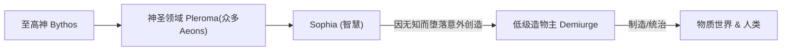
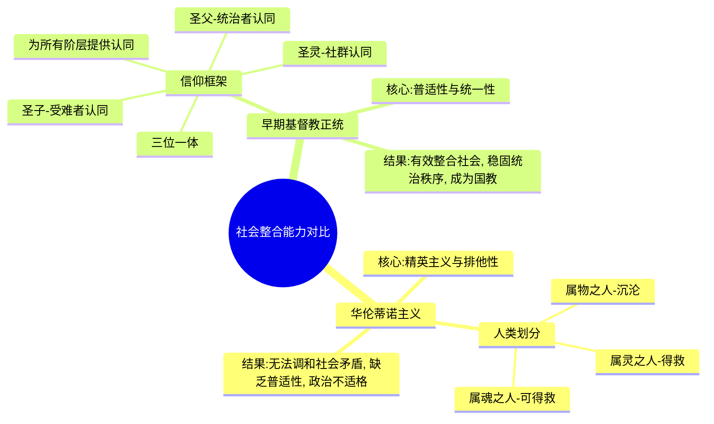
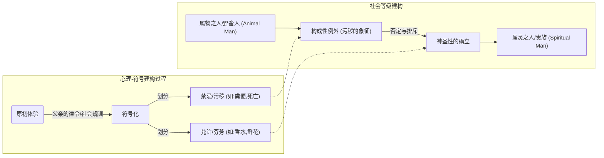

---
{"dg-publish":true,"permalink":"/1-2 宗教实在论/1-2-1 神创论/1-2-1-3 诺斯替主义/","created":"2025-09-19T20:52:29.393+08:00","updated":"2025-09-22T22:20:46.999+08:00"}
---

---
### **一、本章概览**
- **主义主义编码**: 1-2-1-3
- **意识形态命名**: [[华伦蒂诺主义\|华伦蒂诺主义]] / [[5 主义/诺斯替主义\|诺斯替主义]]
- **核心论断**: 这是一种试图通过构建复杂的宇宙论神话来解决[[神正论\|神正论]]难题的意识形态。它将世界的邪恶与不完美归咎于一个次级神祇（[[Sophia\|Sophia]]）的“堕落”或“无知”，而非至高神的直接责任，从而形成一种精巧的“[[甩锅结构\|甩锅结构]]”。其最终目的是通过神秘的[[灵知\|灵知]] (Gnosis) 使人的神圣灵魂逃离物质世界的牢笼，回归本源。
- **你能获得**: 你将掌握“1-2-1-3”编码在[[5 主义/诺斯替主义\|诺斯替主义]]中的具体体现，理解其如何通过二元对立的[[9 未命名/本体论\|本体论]]和中介性的[[9 未命名/目的论\|目的论]]来调和至善上帝与不完美世界之间的矛盾。同时，你将洞悉其核心概念（如[[Pleroma\|Pleroma]]、[[Kenoma\|Kenoma]]、[[Aeons\|Aeons]]），并理解为何这种复杂的体系在与[[早期基督教\|早期基督教]]的竞争中因其社会整合功能的缺失而最终落败。

---
### **二、核心内容解析**
#### **“主义主义”四格分析**

1.  **场域之“1” (Ontology)**：该体系的[[世界\|世界]]框架是一个统一且封闭的[[宇宙论\|宇宙论]]神话。它预设了一个从至高的、不可知的神（[[Bythos\|Bythos]]）开始的完整叙事。这个叙事包含了神圣领域的流溢（[[Pleroma\|Pleroma]]）、次级神祇的堕落、物质世界的创造以及最终的救赎。整个宇宙，无论好坏，都被容纳在这**一个**宏大且唯一的“故事”之中。信奉者的[[世界\|世界]]观被这个单一的、循环往复的神话故事所笼罩，不存在此叙事之外的另一种可能性。这个场域是封闭的、整全的，一切现象都被这个神话所解释和定位。

2.  **本体之“2” (Body)**：在上述统一的神话背景下，世界的[[实在\|实在]]在本体上被明确地分裂为二。存在着两种根本对立的实体：一方是源于神圣[[Pleroma\|Pleroma]]的、纯粹的、超越的、善的**灵性**（Pneuma）；另一方则是由于[[Sophia\|Sophia]]的堕落而产生的、邪恶的、束缚的、虚假的**物质**（Hyle）与现象世界（[[Kenoma\|Kenoma]]）。这种灵与肉、光明与黑暗的二元对立是构成性的，是世界的基本材质。人类也被视为这两种本体的战场，内在的“神性火花”被囚禁在物质的肉身之中，斗争是这个世界的核心实在。

3.  **现象之“1” (Phenomenon)**：主体对世界的感知和体验被视为是统一的、无差别的堕落状态。[[主体性\|主体性]]在此被降格，其所能经验到的一切感官现象、世俗知识，都被归为虚假、邪恶的[[Kenoma\|Kenoma]]的一部分。认识论上是“未反思的”，因为所有现象都被预先判定为负面的、需要被超越的牢笼。不存在通过现象世界达成真理的可能性。因此，主体的体验被同质化为一种被囚禁的、等待救赎的单一状态，其感知的丰富性被彻底压制，统一被标记为“虚妄”。

4.  **目的之“3” (Purpose)**：该意识形态的[[9 未命名/目的论\|目的论]]是典型的中介调和模式。它旨在解决“本体之2”中灵与肉的尖锐对立，以及至善上帝与邪恶世界的神学矛盾。这个调和的中介者就是[[灵知\|灵知]]（Gnosis）——一种神圣的、天启式的秘密知识。通过特定的拯救者（如[[基督\|基督]]）和知识体系，[[灵知\|灵知]]被传递给拥有神性火花的人。这使得他们能够认识到自身的真正来源和世界的虚假本质，最终挣脱物质的束缚，灵魂上升，回归至高的[[Pleroma\|Pleroma]]。这是一个向着神圣中心汇集、以下坠的凡俗世界为起点、以飞升为终点的拯救过程。

#### **其他核心知识点**

##### 甩锅的宇宙论神话 (The Buck-Passing Cosmogony)
这套神话体系的核心功能在于，为至善的、全能的至高神（[[Bythos\|Bythos]]）开脱创造邪恶世界的责任。它构建了一个层级化的神圣领域（[[Pleroma\|Pleroma]]），由一系列名为[[Aeons\|Aeons]]的流溢体构成。其中，最年轻的[[Aeon\|Aeon]]——[[Sophia\|Sophia]]（智慧）因其对至高神的过度渴望或无知（讲稿中提到的[[Saklas\|Saklas]]，即“愚蠢”），从[[Pleroma\|Pleroma]]中堕落，并无意中创造出了有缺陷的物质世界和统治这个世界的低级造物主（[[Demiurge\|Demiurge]]）。因此，世界的邪恶并非源于至善的顶层，而是来自一个神圣家族内部的“意外事故”。这套叙事精巧地将矛盾转移，实现了责任的下放，构成了一个完美的“[[甩锅结构\|甩锅结构]]”。

**举例阐释**：就像一个大家族的企业，董事长（[[Bythos\|Bythos]]）是完美无缺的，但他的一个小儿子（[[Sophia\|Sophia]]）因为急于求成，在外面搞砸了一个项目，造成了巨大亏损（物质世界）。那么，家族对外宣称，这个烂摊子不是董事长的本意，而是那个不成器的儿子的个人行为，同时家族还会派人（拯救者）去弥补这个过失，把有价值的资产（灵魂）收回来。

##### 三元论的政治不适格性
[[华伦蒂诺主义\|华伦蒂诺主义]]将人类分为三个等级：拥有[[灵知\|灵知]]、注定得救的“属灵之人”（Spirituals）；能够通过信仰获得次等拯救的“属魂之人”（Psychics）；以及完全由物质构成、无法得救的“属物之人”（Material/Hylics）。这种划分方式，特别是其复杂的[[Hypostasis\|Hypostasis]]（位格）理论，与当时[[9 未命名/罗马帝国\|罗马帝国]]迫切需要的、能够整合所有社会阶层的[[三位一体\|三位一体]]教义产生了根本冲突。[[三位一体\|三位一体]]通过圣父、圣子、圣灵的统一框架，能够为贵族、平民乃至奴隶提供一个统一的信仰归宿和社会秩序的想象。而[[华伦蒂诺主义\|华伦蒂诺主义]]的精英主义和复杂的等级划分，无法承担起维系一个庞大帝国的意识形态功能，这导致了它在政治竞争中的最终失败。

**举例阐释**：如果说[[三位一体\|三位一体]]像一个国家的统一宪法，对所有公民都有效力。那么[[华伦蒂诺主义\|华伦蒂诺主义]]就像一个高级私人俱乐部的会员章程，它只对少数会员有意义，并且明确地将非会员排除在外，这种章程显然无法用来治理整个国家。

##### 构成性例外与神圣性的建构
讲稿深刻地指出，所有等级制社会都通过划定一个“污秽”的、被排斥的“[[构成性例外\|构成性例外]]”来反向建构“神圣性”。神圣之物之所以显得高洁、芬芳，并非其自身固有的属性，而是通过对“污秽”（如粪便、死亡、野蛮人）的禁忌和否定来确立的。[[华伦蒂诺主义\|华伦蒂诺主义]]中的“属物之人”（Animal Man / Material Man）就扮演了这样的角色。他们的存在，作为沉沦和污秽的象征，成为了“属灵之人”神圣性的垫脚石和参照物。这种将社会底层或特定人群定义为构成性例外，是维护上层神圣秩序和[[9 未命名/力比多\|力比多]]秩序的普遍策略。

**举例阐释**：一个全白的房间之所以显得“纯净”，恰恰是因为哪怕一小点黑色的污渍都会显得格外刺眼。这个“污渍”的存在（或被想象的存在）才定义和强化了“纯净”的感觉。同理，“属物之人”就是那个定义“属灵之人”神圣性的“污渍”。

---
### **三、关键观点提取**
- “这个甩锅的结构，他是个甩锅的结构了解吗？...是我造的，但是他是出问题不是我的错，我还给你们准备好了[[Gnosis\|Gnosis]]教你们怎么回去。”
- “他这种三分法的等级制...其实是个二分法加剩余...这种二分法加剩余的这种东西，它是为了这个剩余的存在，是为了作为[[构成性例外\|构成性例外]]来支撑神圣性。”
- “所有的神圣性就是靠污秽性...通过否定这些东西，回溯性的建构，你所谓神圣性...这个是一种所有等级制社会，它来维护上层神圣性的方式。”
- “对于当时的这个罗马统治者来说，没有这个[[三位一体\|三位一体]]的话，社会稳肯定是兜不住的...这个[[华伦蒂诺主义\|华伦蒂诺主义]]的学说失去它的意识形态功能...失去它的维系共同体的功能。”

---
### **四、知识点问答**
#### Q: 为什么说1-2-1-3编码下的[[华伦蒂诺主义\|华伦蒂诺主义]]本质上是一种“宇宙级的阴谋论”？
A: 因为它将可感知的[[世界\|世界]]（1-现象）描绘成一个由低级、邪恶的[[Demiurge\|Demiurge]]创造的巨大骗局或监狱（[[Kenoma\|Kenoma]]），而真正的、善良的实在（2-本体）则被隐藏起来。其[[9 未命名/目的论\|目的论]]（3-目的）依赖于一套只有少数人能掌握的秘密知识（[[灵知\|灵知]]）来“揭露真相”并获得解脱。这完全符合阴谋论的经典结构：一个被普遍接受的表象（正常世界）+ 一个邪恶的幕后操控者 + 一个解释一切的秘密真相 + 一群掌握真相的“觉醒者”。整个宇宙论（1-场域）就是一个自洽的、无法被证伪的阴谋故事。

#### Q: [[华伦蒂诺主义\|华伦蒂诺主义]]中的“无知/愚蠢” ([[Saklas\|Saklas]]) 与传统基督教的“原罪”有何根本不同？
A: 根本不同在于核心动因。基督教的“原罪”源于亚当夏娃的**意志背叛**，是一种明知故犯的、基于骄傲的**道德性/伦理性**的罪。而[[华伦蒂诺主义\|华伦蒂诺主义]]中的堕落根源——[[Sophia\|Sophia]]的“无知”或“愚蠢”，则是一种**认识论/存在论**层面的缺陷，是一种形而上学的“错误”或“不完整”，而非道德上的邪恶选择。因此，基督教的拯救方案是基于[[信仰\|信仰]]和神的恩典（解决道德问题），而诺斯替的拯救方案是基于[[灵知\|灵知]]（解决无知问题）。

#### Q: 如何理解讲稿中提到的“三元论最后还是要回到这个一元论里面去”？
A: 这句话揭示了[[华伦蒂诺主义\|华伦蒂诺主义]]的内在张力。尽管它在[[9 未命名/本体论\|本体论]]上是二元的（灵/肉），在神格和人类划分上是三元的，但其最终的[[9 未命名/目的论\|目的论]]和初始的[[场域\|场域]]论都是**一元**的。最终目标是让所有神性火花脱离多元与对立，回归到唯一的、无差别的神圣源头[[Bythos\|Bythos]]/[[Pleroma\|Pleroma]]。整个复杂的宇宙悲剧故事，始于“一”，经历“二”与“三”的对立和分裂，最终的救赎方向是重新回归到最初的“一”。这个回归的动力使得整个体系虽然结构复杂，但最终指向一个封闭的、循环的终点。

---
### **五、知识延伸**
- **[[卡尔·荣格\|卡尔·荣格]]的心理学**: 荣格对[[5 主义/诺斯替主义\|诺斯替主义]]极为着迷，在他的《红书》和《向死者的七次布道》中，大量运用了诺斯替概念。他将[[Pleroma\|Pleroma]]（完满）与[[Kenoma\|Kenoma]]（虚空）视为集体无意识的两个基本面向，并将诺斯替神话看作是古代人对心灵深层结构（如阿尼玛、阴影、自性）的投射和探索。荣格的理论为理解诺斯替思想提供了一个现代心理学的参照框架。
- **电影《[[黑客帝国\|黑客帝国]]》 (The Matrix)**: 这部电影是现代版的诺斯替神话寓言。Matrix系统是邪恶[[Demiurge\|Demiurge]]（建筑师）创造的虚假物质世界（[[Kenoma\|Kenoma]]）；Zion是幸存人类的真实避难所；Neo是被选中的救世主，他带来的不是信仰，而是对世界真相的“觉醒”（[[Gnosis\|Gnosis]]），从而带领人类反抗物质世界的奴役。这部电影完美地参照了1-2-1-3的意识形态结构。
- **作家[[菲利普·迪克\|菲利普·迪克]]的小说 (尤其是《VALIS》)**: 迪克的许多作品都充满了诺斯替主题，核心是“何为真实？”的不断追问。在《VALIS》中，主角直接体验到了一个来自外部的、纠正现实的“神圣智慧体”，他将我们的世界视为“黑暗铁狱”（Black Iron Prison），这与诺斯替主义对物质世界的看法如出一辙，是对这种古老思想在当代科幻语境下的深刻延展和批判。

---
### **六、双链关联总结**
- **一级关联 (核心意识形态与概念)**: [[华伦蒂诺主义\|华伦蒂诺主义]]、[[1-2-1-3\|1-2-1-3]]、[[5 主义/诺斯替主义\|诺斯替主义]]、[[神正论\|神正论]]、[[甩锅结构\|甩锅结构]]、[[灵知\|灵知]]、[[Bythos\|Bythos]]、[[Pleroma\|Pleroma]]、[[Kenoma\|Kenoma]]、[[Sophia\|Sophia]]、[[Aeons\|Aeons]]、[[Demiurge\|Demiurge]]、[[Hypostasis\|Hypostasis]]
- **推测相关人物 (Speculated Figures)**: [[Valentinus\|Valentinus]] (历史人物)、**[[尼欧\|尼欧]] (Neo, from *The Matrix*)** (虚构人物，理由：他是典型的诺斯替英雄，通过获得关于现实本质的“知识”而非传统信仰来拯救世界，其成长过程就是一次Gnosis的觉醒之旅)
- **二级关联 (上下文与背景)**: [[欧陆哲学\|欧陆哲学]]、[[9 未命名/精神分析\|精神分析]]、[[古希腊哲学\|古希腊哲学]]、[[新柏拉图主义\|新柏拉图主义]]、[[早期基督教\|早期基督教]]、[[9 未命名/罗马帝国\|罗马帝国]]、[[宇宙论\|宇宙论]]
- **三级关联 (推测与延展)**: [[构成性例外\|构成性例外]]、[[三位一体\|三位一体]]、[[道成肉身\|道成肉身]]、[[卡尔·荣格\|卡尔·荣格]]、[[黑客帝国\|黑客帝国]]、[[菲利普·迪克\|菲利普·迪克]]、[[拉康\|拉康]]、[[9 未命名/符号学\|符号学]]