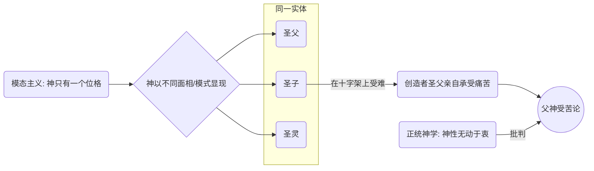
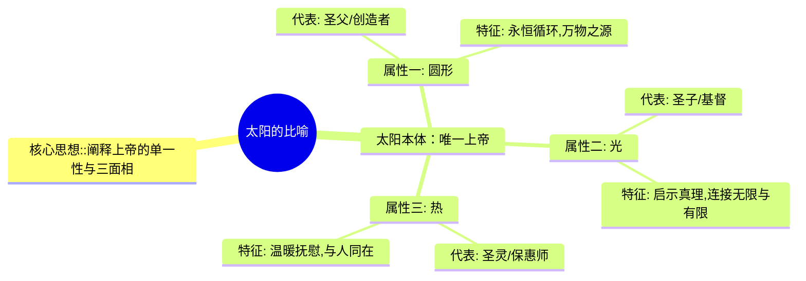
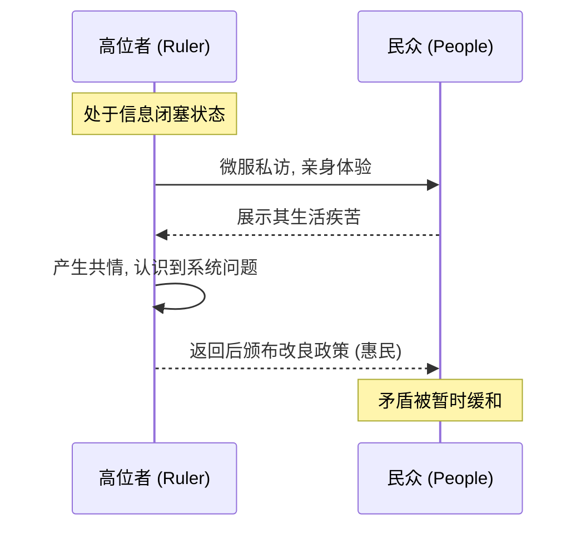

---
{"dg-publish":true,"permalink":"/1-2 宗教实在论/1-2-1 神创论/1-2-1-4 模态位格一元论/","created":"2025-09-19T20:52:29.395+08:00","updated":"2025-09-22T22:20:46.134+08:00"}
---

### **一、本章概览**
- **主义主义编码**: 1-2-1-4
- **意识形态命名**: [[5 主义/模态主义\|模态主义]] (Modalism) / [[模态位格一元论\|模态位格一元论]] (Modalistic Monarchianism)
- **核心论断**: 此意识形态认为，创造世界的唯一神格，通过不同的“模态”（Modes）或“面相”（Faces）与世界互动，并亲自下凡承受其所创造世界的苦难。它试图通过让创造者成为“共同受难者”来解决神义论困境，但最终将变革的希望寄托于高位者“微服私访”式的慈悲，而非结构性的断裂。
- **你能获得**:
    - 掌握 1-2-1-4 编码下“高位者与民同苦”式意识形态的内在结构。
    - 理解[[父神受苦论\|父神受苦论]]这一神学概念及其在思想史上的争议。
    - 学会运用“高位者微服私访”模型来分析现实中某些改良主义或温情主义的政治姿态。
    - 辨析[[5 主义/模态主义\|模态主义]]与[[齐泽克\|齐泽克]]式[[9 未命名/解放神学\|解放神学]]在处理“受难”问题上的根本区别。

---
### **二、核心内容解析**

#### **“主义主义”四格分析**

1.  **场域之“1” (Ontology)**：此意识形态预设的世界是一个**统一且连续的叙事舞台**。它没有形而上学的断裂，从创世（[[Genesis\|Genesis]]）到神话时代，再到现实历史，一切都发生在同一个无缝的[[宇宙\|宇宙]]（Cosmos）之内。数字“1”在此代表一个整全性的背景，神圣历史与凡俗历史被编织在同一块画布上。这个场域是稳定的、无内在冲突的，为后续神圣力量的介入提供了一个同质化的行动空间，保证了神圣干预的直接性和连续性。

2.  **本体之“2” (Body)**：在这个统一的舞台上，存在着**两种根本对立的本体**。一方面是超越性的、神圣的力量（[[神圣性\|神圣性]] | Divinity），另一方面是它所创造的有瑕疵的、充满罪恶与痛苦的[[凡俗世界\|凡俗世界]]（The World）。数字“2”精确地捕捉了这种创造者与被造物之间的二元对立。这种分裂是此意识形态需要解决的核心张力：一个全能的创造者为何会创造出一个不完美的、充满苦难的世界？

3.  **现象之“1” (Phenomenon)**：主体的感知和伦理体验被整合为**单一的、无分裂的整体**。这里的“1”意味着，无论是神还是人，其体验最终都归于同一个[[位格\|位格]]（Person）。[[撒伯里乌\|撒伯里乌]]认为，圣父、圣子、圣灵只是同一神格的不同“面相”（Faces）。因此，当神以“圣子”的形态在人间受苦时，这种痛苦是真实不虚地被唯一的那个神格所体验。这确保了信徒的伦理体验与神的体验是共通的，不存在认知或感知上的鸿沟，为主体与神的“共情”提供了可能。

4.  **目的之“4” (Purpose)**：该意识形态的终极目的导向一种**以“受苦”本身为核心的内在矛盾与转化**。数字“4”在此不代表外部冲突，而代表系统内部的不可能性被激活。终极目的不是通过一种外在的智慧（[[诺斯\|诺斯]]）来超越矛盾，而是让创造者亲自去承受（[[受苦\|Passion]]）他所创造世界的[[内在不一致性\|内在不一致性]]。这种神圣的受难（Patripassianism）成为支付代价、弥合分裂的唯一方式。这种“受苦”本身就是目的，它揭示了系统自身的虚无和代价，并以此为基点，释放出一种新的、带有同情与怜悯的能量（如太阳的热量），从而带来一种改良式的更新。

#### **其他核心知识点**

##### 父神受苦论 (Patripassianism)
这是一种被正统神学视为异端的基督论观点，其核心在于认为“圣父”（The Father）与“圣子”（The Son）是同一位格，因此在十字架上受难的不仅是作为“人”的基督，更是作为宇宙创造者的“圣父”本身。[[5 主义/模态主义\|模态主义]]是其理论基础，因为它取消了位格的区分，认为神只是在以不同“模式”显现。该理论因其挑战了神“无动于衷”（Impassibility）和“不可变”（Immutability）的传统属性而引发巨大争议，其主要批判者如[[德尔图良\|德尔图良]]讥讽其为“钉死了圣父”。

**举例阐释**：讲稿中提到，[[德尔图良\|德尔图良]]嘲讽[[撒伯里乌\|撒伯里乌]]的理论是“把 father 给上架了”，这正是对[[父神受苦论\|父神受苦论]]最直接、最形象的批判。它点明了这种理论在正统派看来是何等荒谬，因为它将至高无上、超越一切痛苦的创造者拉入了凡俗的、被动的受难境地。

##### 太阳的三重比喻
这是[[撒伯里乌\|撒伯里乌]]用以解释其[[5 主义/模态主义\|模态主义]]思想的著名比喻，极富巧思。他将唯一的上帝比作太阳，这个太阳拥有三种统一于自身的属性或说“模态”：**圆形**（Form/Sphere）、**光**（Light）和**热**（Heat）。圆形代表作为创造者、万物之源的“圣父”，是永恒循环、非时间性的存在；光代表照耀世界、启示真理的“圣子”，往返于永恒与有限之间；热代表温暖、抚慰、渗透人心的“圣灵”，是消散的、有限的、与人类共同体同在的。

**举例阐释**：讲稿中特别指出，这个比喻也巧妙地暗示了三种不同的时间性样态。圆形的永恒循环、光的往返穿梭和热的有限消散，分别对应了神之于自身的超越性、神之于世界的启示性，以及神之于人类共同体的内在性。这显示了该比喻深刻的哲学内涵，远非简单的类比。

##### 高位者微服私访
这是演讲者用以阐释 1-2-1-4 意识形态在社会政治领域表现的生动模型。它描绘了一种特定类型的统治者或权力精英：他们身居高位，但心怀善意。由于信息闭塞或脱离群众，他们无法理解民间的疾苦。于是，他们通过“微服私访”的方式，亲自体验底层生活，饱尝自己所缔造的秩序带来的痛苦。这种亲身体验激起了他们的同情心，促使他们返回权力中心后，进行自上而下的改良，如“撒甘露”、“五谷丰登”等，以缓和矛盾。

**举例阐释**：讲稿中提到的“乾隆&纪晓岚”的民间故事，就是这种意识形态的典型文艺作品。它满足了一种民众的幻想：最高统治者本质上是好的，问题只在于他“不知道”；一旦他知道了，他就会出手解决。这种模式将结构性问题个人化、道德化了。

---
### **三、关键观点提取**
- “他为什么能够解决这个道德困境？这不是很明白什么，因为真的是受苦的。上架的是这个[[创造者\|创造者]]本人。”
- “这个萨博刘的比喻就是太阳。他认为这个太阳的有三重属性，一个是他的[[光\|光]]，一个是它的[[热\|热]]，还有一个是它的[[圆\|圆]]...他认为它不是三个东西，它就是一个东西它有三个侧面或者说三个属性。”
- “相当于身居高位者[[微服私访\|微服私访]]。然后饱尝人间疾苦...他自己做的孽，他自己就是这个 creator，创造整个世界的他自己让这个世界秩序有[[内在不一致性\|内在不一致性]]。然后他自己体验到的。”
- “在[[齐泽克\|齐泽克]]那边看来，如果没有这个上架的人，就没有这个[[9 未命名/大他者\|大他者]]。这个[[9 未命名/大他者\|大他者]]是[[9 未命名/回溯性建构\|回溯性建构]]的，懂了吧？”

---
### **四、知识点问答**

#### Q: 为何说“模态主义”(1-2-1-4) 是对神义论困境（即“恶的问题”）的一种解答？
A: 神义论困境的核心在于：如果[[创造者\|创造者]]是全能且全善的，为何世界上还存在邪恶与苦难？[[5 主义/模态主义\|模态主义]]通过让[[创造者\|创造者]]亲自[[受苦\|受苦]]来回应这一难题。它不再将神置于痛苦之外，而是宣称神通过其“圣子”模态，完全、真实地承受了自己所创造世界的瑕疵和痛苦。这样一来，神便不再是一个冷漠的旁观者，而是一个与人类共患难的“同情者”。恶与苦难虽然没有被消除，但其伦理上的不可接受性，因创造者本人的共同承担而被大大缓解了。

#### Q: [[5 主义/模态主义\|模态主义]]的“受苦”与[[齐泽克\|齐泽克]]神学中的“受苦”有何根本不同？
A: 在[[5 主义/模态主义\|模态主义]]中，“受苦”是**真实的大他者**为了弥合自己造成的裂缝而采取的行动，是一种自上而下的共情与救赎。这里的[[9 未命名/大他者\|大他者]]是预先存在的、真实的，其受苦是为了确认和巩固自身的仁慈。而在[[齐泽克\|齐泽克]]的解读中，“受苦”是**一个极致善良的凡人**（基督）的彻底失败，这个失败本身**揭示了[[9 未命名/大他者\|大他者]]的缺席、无能或[[内在不一致性\|内在不一致性]]**。正因为这场悲剧无法被现有秩序解释，人们才[[9 未命名/回溯性建构\|回溯性建构]]出一个超越性的[[9 未命名/大他者\|大他者]]来为之负责或赋予其意义。前者的受苦是为了“证明神在”，后者的受苦是为了“揭示神不在”。

#### Q: 演讲者为何评价 1-2-1-4 这种以“4”结尾的意识形态仍然是“怂包的”（cowardly）？
A: 尽管数字“4”代表了[[内在不一致性\|内在不一致性]]和变革的可能，但在此结构中，这种不一致性（[[受苦\|受苦]]）是被一个更高位的、仁慈的中心所控制和引导的。变革的动力源于高位者的“良心发现”和“自我感动”，最终以一种自上而下的、施舍性的改良（撒甘露）而告终。它并未真正触及产生痛苦的结构性根源，也未赋予受苦者自身的主体性力量。它将希望寄托于高位者的“开恩”，而非受苦者自身的决断与行动，因此，它是一种逃避了真正结构性对抗的、温情脉脉的改良主义，本质上是保守和“怂包的”。

---
### **五、知识延伸**

- **[[5 主义/诺斯替主义\|诺斯替主义]] (Gnosticism)**: 作为[[5 主义/模态主义\|模态主义]]试图克服的另一种思想体系，[[5 主义/诺斯替主义\|诺斯替主义]]同样处理“恶”的问题，但它将其归因于一个低级的、邪恶的造物主（巨匠），并主张通过神秘的“知识”（Gnosis）来获得拯救，逃离这个物质世界。它与[[5 主义/模态主义\|模态主义]]构成了**参照/对比关系**：一个诉诸“知识”，一个诉诸“激情/受苦”。
- **[[德尔图良\|德尔图良]]《驳普拉克西阿》 (Tertullian, *Against Praxeas*)**: 这是批判[[5 主义/模态主义\|模态主义]]和[[父神受苦论\|父神受苦论]]最重要、最直接的历史文献。阅读它可以深入理解当时神学争论的焦点，以及正统派为何坚决反对这种看似充满同情心的神学。它与本讲稿讨论的核心构成**批判关系**。
- **电视真人秀《卧底老板》 (Undercover Boss)**: 这个节目是“高位者微服私访”意识形态的绝佳现代寓言。公司的CEO伪装成普通员工，去体验一线工作的艰辛，最后在充满感情的会议上揭示身份，并为“感动”他的员工提供奖励和公司政策的微调。这完美复刻了1-2-1-4的整个运作逻辑，可作为其在当代企业文化中的**类比/体现**。

---
## 双链关联总结
- **一级关联 (核心意识形态与概念)**: [[1-2-1-4\|1-2-1-4]]、[[5 主义/模态主义\|模态主义]]、[[模态位格一元论\|模态位格一元论]]、[[撒伯里乌\|撒伯里乌]]、[[父神受苦论\|父神受苦论]]、[[位格\|位格]]、[[受苦\|受苦]]、[[内在不一致性\|内在不一致性]]
- **推测相关人物 (Speculated Figures)**: [[乾隆皇帝\|乾隆皇帝]]（作为“微服私访”的文化符号）、[[《卧底老板》中的CEO们\|《卧底老板》中的CEO们]]（作为该意识形态在现代商业管理中的人格化身）
- **二级关联 (上下文与背景)**: [[基督教神学\|基督教神学]]、[[早期基督教\|早期基督教]]、[[5 主义/诺斯替主义\|诺斯替主义]]、[[三位一体\|三位一体]]、[[基督论\|基督论]]、[[9 未命名/罗马帝国\|罗马帝国]]、[[德尔图良\|德尔图良]]
- **三级关联 (推测与延展)**: [[齐泽克\|齐泽克]]、[[9 未命名/解放神学\|解放神学]]、[[9 未命名/大他者\|大他者]]、[[9 未命名/回溯性建构\|回溯性建构]]、[[神义论\|神义论]]、[[博格米勒派\|博格米勒派]]、[[拉康\|拉康]]