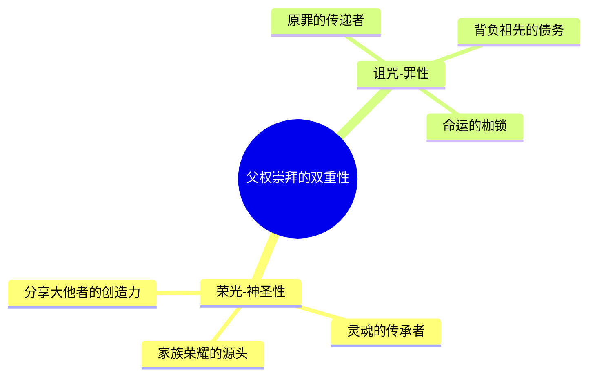
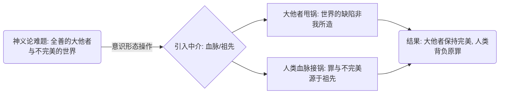
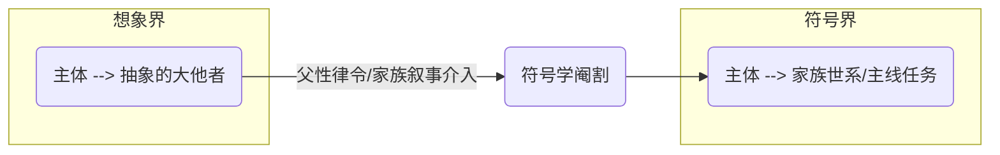

---
{"dg-publish":true,"permalink":"/1-2 宗教实在论/1-2-2 偶像崇拜/1-2-2-1 传殖主义/","created":"2025-09-19T20:52:29.403+08:00","updated":"2025-09-22T22:08:55.822+08:00"}
---

### **一、本章概览**
- **主义主义编码**: 1-2-2-1
- **意识形态命名**: [[传殖主义\|传殖主义]] (Traducianism)
- **核心论断**: 人的灵魂与原罪并非由[[9 未命名/大他者\|大他者]]（上帝）直接创造，而是通过父辈的生殖活动，像血脉一样代代“遗传”而来。这一机制将世界的不完美归咎于祖先的“孽”，从而维护了[[9 未命名/大他者\|大他者]]的完美性，但其代价是建立了以[[父权崇拜\|父权崇拜]]为核心的、将个体命运锁定于家族“主线任务”的封闭体系。
- **你能获得**: 通过本笔记，你将掌握[[传殖主义\|传殖主义]]这一古老神学意识形态的内在运作逻辑，理解它如何通过“甩锅”机制来处理神义论难题，并识别其在现代社会中以“[[原生家庭\|原生家庭]]决定论”、“血脉论”等形式的变体，从而获得解构此类思想束缚的分析工具。

---
### **二、核心内容解析**

#### **“主义主义”四格分析**

1.  **场域之“1” ([[存在论\|存在论]])**: 该意识形态的世界观框架是一个统一且连贯的[[神话学叙事\|神话学叙事]]。这个叙事构成了一个封闭的、无断裂的历史链条，从最初的创世神话，经由一部完整的祖先世系，一直无缝延伸到“我”的降生。世界的意义和背景被这个单一、宏大的故事所垄断。个体不是偶然地抛入世界，而是作为这个宏大叙事链条中预定的一环出场。这个场域的“1”属性意味着，不存在外在于这个[[世系\|世系]]历史的、异质性的时空或意义来源，一切都被整合进一个统一的谱系之中。

2.  **本体之“2” ([[9 未命名/本体论\|本体论]])**: 在这个叙事舞台上，存在着两种根本对立的本体。其一是具有神圣性的、**创生性的存在**，即祖先的“[[父精母血\|父精母血]]”。它被视为能够创造灵魂的、近乎神圣的本源性力量。其二是**派生性的存在**，即后代的肉身与灵魂。后代的存在是次级的、亏欠的，是对祖先创生性存在的延续和亏欠。这种二元对立结构，使得个体的存在本身就带有一种原初的“债务”或“罪性”，因为他/她并非独立自足的，而是派生于那神圣而又已然“犯错”的祖先。

3.  **现象之“2” ([[9 未命名/现象学\|现象学]]/[[9 未命名/认识论\|认识论]])**: 主体的经验世界被清晰地划分为二元对立的两极。一方是以[[信仰\|信仰]] (Faith) 为代表的唯一真理路径，它对应着[[父系隐喻\|父系隐喻]]下的“[[主线任务\|主线任务]]”——即传承家族荣光或洗刷家族罪孽。这条道路是清晰、唯一且赋予人生意义的。另一方则是以[[哲学\|哲学]]或异教 (Paganism) 为代表的、充满迷惑性的多元世界。它如同万花筒，提供无数种可能性，但恰恰因此消解了唯一的目标，使人迷失。[[德尔图良\|德尔图良]]提出的“[[雅典与耶路撒冷\|雅典与耶路撒冷]]有何相干？”正是这一对立的经典表述，它要求主体在唯一的、确定的血脉真理与混乱的、多元的外部知识之间做出决绝选择。

4.  **目的之“1” ([[9 未命名/目的论\|目的论]])**: 该意识形态的最终目的，是实现一种“[[信仰的统治\|信仰的统治]]” (Rule of Faith)。这意味着，个体的终极目标是无条件地回归和维持那个由祖先和[[经文\|经文]] (Scripture) 所构成的、唯一的、封闭的真理体系。所有行动的价值都由其是否符合这一“[[主线任务\|主线任务]]”来评判。最终，世界存在的唯一目的，就是让这个以血脉传承为核心的伦理秩序不断地自我复制、自我循环，拒绝任何外来的、可能破坏其整全性的新元素，达成一种永恒的重复。

#### **其他核心知识点**

##### 父权崇拜的双重性：诅咒与荣光
[[父权崇拜\|父权崇拜]]是[[传殖主义\|传殖主义]]的核心产物，但它并非一种单向度的赞美。其本质在于，父系血脉同时被赋予了两种相互矛盾的属性：神圣的**荣光**与堕落的**诅咒**（原罪）。一方面，父亲因其能够“创造”灵魂而被神圣化，分享了[[9 未命名/大他者\|大他者]]的创造权能，成为家族荣耀的源头。另一方面，正是这条血脉传递了祖先的罪，使每一个后代都背负着原初的债务。这种“又崇高又恐怖”的双重性，构成了强大的精神驱力，使得后代的人生[[主线任务\|主线任务]]要么是光复荣耀（如[[慕容复\|慕容复]]），要么是赎清罪孽，个体被牢牢锁定在这条由血脉定义的轨道上。

**举例阐释**：讲稿中提到的金庸小说人物[[慕容复\|慕容复]]，其一生的悲剧都源于“光复大燕”这一祖传的[[主线任务\|主线任务]]。这个任务既是慕容氏的无上荣光，也是压垮他的沉重诅咒，完美体现了[[父权崇拜\|父权崇拜]]中荣耀与罪孽的扭结。

##### 接锅/甩锅机制：维护大他者的一致性
[[传殖主义\|传殖主义]]最精巧的意识形态操作，在于它为“神义论”问题（一个全善的[[9 未命名/大他者\|大他者]]为何创造了一个充满罪恶与苦难的世界）提供了一个解决方案。它通过引入“[[血脉\|血脉]]”这一中介，巧妙地将责任从[[9 未命名/大他者\|大他者]]身上“甩”掉，让凡人的[[世系\|世系]]来“接锅”。世界的缺陷、人性的罪恶，都不再是[[9 未命名/大他者\|大他者]]的直接创造物，而是人类祖先犯错后，通过血脉代代相传的后果。这样，[[9 未命名/大他者\|大他者]]的绝对完美和全善得以维护，而人类则背负起了一个可解释、可传承的“原罪”，为拯救和赎罪的伦理体系提供了合法性基础。

**举例阐释**：当一个孩子质问“上帝为何把我创造成这样”时，[[传殖主义\|传殖主义]]的回答是：“这不是上帝的错，这是你祖宗十八代传下来的业障，你生于此脉，便需承担。”这个回答将一个形而上学的矛盾，转化为了一个家族伦理的责任。

##### 符号学阉割与主线任务的确立
讲稿借用[[拉康\|拉康]]的理论，将[[传殖主义\|传殖主义]]的家庭教育模式阐释为一种[[符号学阉割\|符号学阉割]]。孩童最初处于[[想象界\|想象界]]，会与[[9 未命名/大他者\|大他者]]进行短路式的认同（如“我就是玉皇大帝”）。[[父性律令\|父性律令]]（以父亲为代表的家族权威）的介入，正是要切断这种自恋式的、无限的想象。它用一个具体的、有限的、充满历史细节的家族[[世系\|世系]]叙事，取代了那个抽象的[[9 未命名/大他者\|大他者]]。这个过程就是“阉割”——它剥夺了主体与[[9 未命名/大他者\|大他者]]直接同一的可能性，但作为补偿，它将主体安置在[[符号界\|符号界]]的一个确定位置上，并赋予其一个明确的“[[主线任务\|主线任务]]”。从此，个体的身份和欲望都被整合进了家族传承的符号系统之中。

**举例阐释**：一个孩子认为自己无所不能，其父亲则通过讲述“我们家祖上是做什么的，你的责任是继承家业”来规训他。这个过程切断了孩子的无限幻想，代之以一个具体的家族身份和责任，使其成功“社会化”，进入由家族定义的[[符号界\|符号界]]。

---
### **三、关键观点提取**
- “[[父权崇拜\|父权崇拜]]本身是在用活人……来僭代什么[[9 未命名/大他者\|大他者]]，你知道吗？”
- “这个 faith（信仰） 它其实就是[[父系隐喻\|父系隐喻]]。[[父系崇拜\|父系崇拜]]有一种好处，就是它能够让你的人生克服存在主义危机。我的存在的唯一任务就是光大门楣。”
- “这个意识形态有这个功能，而且可以强化这个功能，可以让他的父亲具有很强的话语权……维系下层民众生存的张力不要崩盘的一个意识形态的功能。”
- “你的精神意识是由[[9 未命名/符号学\|符号学]]来给它装配出来的，employed by symbolic system……这个 symbolic system 它的共同体范围是很大的。”
- “你必须用一个凡俗的一个[[父性世系\|父性世系]]来代替掉一个超越性的、想象性的、直接和你短路的那么一个（大他者）。否则你是进入不了[[符号系统\|符号系统]]的。”

---
### **四、知识点问答**
#### Q: 为何说[[传殖主义\|传殖主义]]的核心功能是“接锅”，这对[[9 未命名/大他者\|大他者]]和个体分别意味着什么？
A: [[传殖主义\|传殖主义]]的核心功能是“接锅”，意指它将世界和人性的不完美，从其创造者[[9 未命名/大他者\|大他者]]那里转移，让“祖先血脉”来承担责任。对[[9 未命名/大他者\|大他者]]而言，这意味着祂的完美性、全能性和全善性得到了辩护，解决了棘手的神义论难题。对个体而言，这意味着他/她的存在被先天定义为有罪或有亏欠的，其人生的[[主线任务\|主线任务]]被设定为偿还这份源自血脉的“债务”，个体的[[自由\|自由]]和可能性被极大地限制在家族叙事之内。

#### Q: [[传殖主义\|传殖主义]]中的“信仰”与“哲学”的对立，在现实生活中有何体现？
A: 这种对立体现为两种截然不同的人生定向模式。以[[信仰\|信仰]]为代表的路径，好比被赋予了一个明确的“[[主线任务\|主线任务]]”，如“光宗耀祖”、“还清父债”，人生道路单一但清晰，不易产生存在主义迷茫。这在推崇“家族传承”、“子承父业”的文化中非常普遍。以[[哲学\|哲学]]为代表的路径，则象征着一个开放、多元、充满不确定性的现代生活，个体面临无数选择，拥有[[自由\|自由]]但也必须独自承担选择的焦虑和寻找意义的重担。

#### Q: 如何运用[[传殖主义\|传殖主义]]的分析框架，来解构现代社会中的“原生家庭决定论”？
A: “[[原生家庭\|原生家庭]]决定论”可以被看作是[[传殖主义\|传殖主义]]的世俗化版本。它同样预设了一个“血脉”（家庭环境、父母教育）决定个体灵魂（性格、命运）的[[神话学叙事\|神话学叙事]]。运用该框架，我们可以指出：1. 这是一种将复杂个体问题简化为单一来源的“甩锅”机制。2. 它将“父母”置于了近乎[[9 未命名/大他者\|大他者]]的创生性地位，而将子女视为被动的“派生性存在”。3. 我们可以通过引入更广阔的[[符号系统\|符号系统]]（社会、文化、语言、个人选择）来打破这种封闭的因果链，强调精神的塑造是一个远比家庭更复杂的、充满偶然和[[自由\|自由]]的过程，从而夺回定义自我的主动权。

---
### **五、知识延伸**
- **[[奥古斯丁\|奥古斯丁]]的《[[忏悔录\|忏悔录]]》与[[原罪论\|原罪论]]**: 奥古斯丁是系统阐述[[原罪\|原罪]]通过生殖行为代代相传的教父哲学家，其思想与[[德尔图良\|德尔图良]]的[[传殖主义\|传殖主义]]构成了强有力的相互参照。阅读《忏悔录》有助于理解罪、性和神圣性是如何在早期基督教思想中被捆绑在一起的。
- **[[萨特\|萨特]]的《[[存在与虚无\|存在与虚无]]》**: 萨特的“存在先于本质”是[[传殖主义\|传殖主义]]意识形态的完美解毒剂。[[传殖主义\|传殖主义]]认为你的“本质”（作为某血脉的一员）决定了你的“存在”；而[[5 主义/存在主义\|存在主义]]则强调，人首先是自由的存在，然后通过自己的选择去创造本质，这为反抗任何形式的血脉或出身决定论提供了哲学武器。
- **电影《[[狗镇\|狗镇]]》(Dogville)**: 这部电影以寓言形式极致地探讨了“接纳”与“债务”的辩证法。女主角格蕾丝最初以一个需要被拯救的“亏欠者”身份进入狗镇，最终却反转为审判者和毁灭者。这可以看作是对“接锅”逻辑的一种颠覆性演绎，探讨了当“接锅者”不再忍受时可能发生的恐怖后果。

---
## 双链关联总结
- **一级关联 (核心意识形态与概念)**: [[传殖主义\|传殖主义]]、[[德尔图良\|德尔图良]]、[[父权崇拜\|父权崇拜]]、[[血脉崇拜\|血脉崇拜]]、[[接锅机制\|接锅机制]]、[[甩锅机制\|甩锅机制]]、[[主线任务\|主线任务]]、[[符号学阉割\|符号学阉割]]、[[父精母血\|父精母血]]、[[派生性存在\|派生性存在]]、[[信仰的统治\|信仰的统治]]
- **推测相关人物 (Speculated Figures)**: [[慕容复\|慕容复]] (其一生的悲剧都源于背负“光复大燕”的家族使命这一[[主线任务\|主线任务]])、[[曾国藩\|曾国藩]] (讲稿中提到《曾国藩家书》，代表了将家族伦理、个人修身与世系传承高度捆绑的典型)
- **二级关联 (上下文与背景)**: [[主页\|主页]]、[[9 未命名/精神分析\|精神分析]]、[[拉康\|拉康]]、[[符号界\|符号界]]、[[想象界\|想象界]]、[[实在界\|实在界]]、[[9 未命名/大他者\|大他者]]、[[父性律令\|父性律令]]、[[基督教神学\|基督教神学]]、[[教父哲学\|教父哲学]]、[[雅典与耶路撒冷\|雅典与耶路撒冷]]
- **三级关联 (推测与延展)**: [[原生家庭\|原生家庭]]、[[5 主义/存在主义\|存在主义]]、[[身份认同\|身份认同]]、[[俄狄浦斯情节\|俄狄浦斯情节]]、[[神义论\|神义论]]、[[决定论\|决定论]]、[[自由意志\|自由意志]]、[[集体无意识\|集体无意识]]