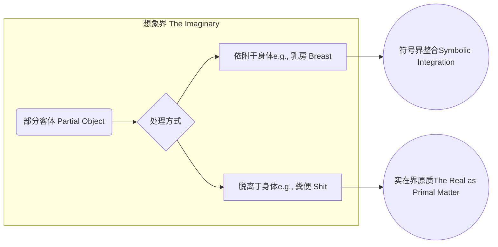
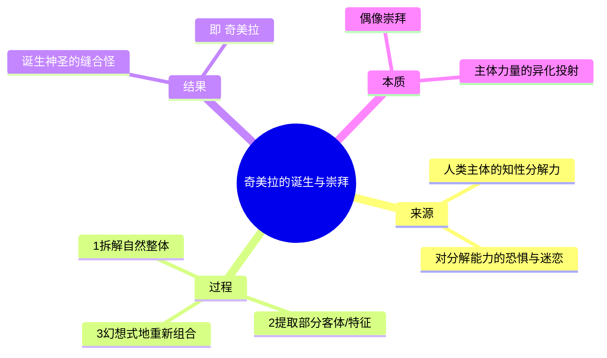
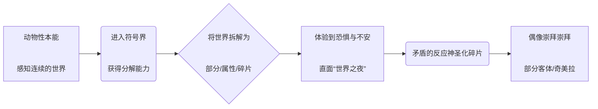

---
{"dg-publish":true,"permalink":"/1-2 宗教实在论/1-2-2 偶像崇拜/1-2-2-2 部分主义/","created":"2025-09-19T20:52:29.406+08:00","updated":"2025-09-22T22:20:45.064+08:00"}
---

### **一、本章概览**
- **主义主义编码**: 1-2-2-2
- **意识形态命名**: [[部分主义\|部分主义]]
- **核心论断**: 这是一种将“部分”凌驾于“整体”之上的意识形态。它通过拆解、重组现实中的元素，创造出如“[[奇美拉\|奇美拉]]”般的缝合怪作为神圣偶像，其本质是人类主体在初获符号能力时，对自己分解世界的力量既恐惧又崇拜的体现。
- **你能获得**: 你将理解“[[部分主义\|部分主义]]”作为一种神学异端、一种精神分析现象（[[恋物癖\|恋物癖]]）和一种原始偶像崇拜的内在逻辑。你将掌握其 1-2-2-2 的“主义主义”结构，并能运用[[拉康\|拉康]]的[[部分客体\|部分客体]]理论，剖析神话、艺术和日常生活中“缝合怪”现象背后的心理机制。

---
### **二、核心内容解析**

#### **“主义主义”四格分析**

1.  **场域之“1” (Ontology)**：该意识形态在[[存在论\|存在论]]上预设了一个统一的[[世界\|世界]]背景。这个“1”代表的并非一个和谐、有机的整体，而是一个由无数碎片、部分被强行“拼合”而成的整全。它承认一个总体的存在，但这个总体的性质是次要的、派生的。世界的舞台是一个巨大的画布，其存在的意义就是为了容纳那些通过拆解与重组被创造出来的、更为重要的“部分”。这个统一的场域是消极的，它仅仅是那些神圣碎片得以表演的背景板，其自身的整体性被部分的优先地位所悬置。

2.  **本体之“2” (Body)**：在此场域中，存在着两种根本对立的实体。一方是**神圣的、被崇拜的“部分”**，即[[部分客体\|部分客体]]（Partial Objects）及其组合体——[[奇美拉\|奇美拉]]（Chimera）。这些实体（如多余的肢体、神话中的缝合怪、图腾符号）因其非自然、反常态的拼合而被赋予了神秘力量。另一方则是**凡俗的、被贬低的“自然整体”**。那些天然完整、符合常规逻辑的事物被视为平庸、缺乏力量的。这种二元对立，本质上是主体的人为创造力与自然造物之间的对抗。

3.  **现象之“2” (Phenomenon)**：[[主体性\|主体性]]的感知体验同样是二元的。主体在经验[[世界\|世界]]时，会遭遇两种截然不同的现象：一种是日常的、可理解的、完整的凡俗事物，它们构成了生活的普通背景；另一种则是令人惊恐又着迷的“部分”或“碎片”。当主体遭遇一个脱离了整体的器官、一个无根的声音（the Voice）、一个怪异的图腾符号时，这种体验是断裂的、冲击性的。这种现象学的二元对立，源于人类[[知性分析力\|知性分析力]]的原始运作：它既能分解世界，又对这种分解所产生的碎片感到不安与崇拜。

4.  **目的之“2” (Purpose)**：该意识形态的[[9 未命名/目的论\|目的论]]体现为一场永恒的斗争。其斗争的双方是：[[Rule of Faith\|Rule of Faith]]（信仰律令）与[[Myth of Image\|Myth of Image]]（图像神话）。前者追求一个由抽象、统一的符号系统（如经文、教义）所规定的、不可见的、去偶像化的秩序。而后者则恰恰相反，它追求通过具象的、可见的、充满感性冲击力的偶像（即由[[部分客体\|部分客体]]构成的图像）来把握神圣性。[[部分主义\|部分主义]]的最终目的，就是不断地生产和崇拜这些“图像神话”，以此来抵抗和颠覆那个抽象、均质的“信仰律令”，使世界永远处于这场偶像崇拜与反偶像崇拜的拉锯战之中。

#### **其他核心知识点**

##### 部分客体 (Partial Object) 与想象界建构
[[部分客体\|部分客体]]是[[拉康\|拉康]]精神分析中的核心概念，指那些在婴儿与母亲关系中被体验到的、可分离的身体部分（如乳房、粪便）或非物质对象（如声音、凝视）。它并非客观的身体部件，而是主体欲望投注的焦点。在[[部分主义\|部分主义]]中，这些[[部分客体\|部分客体]]是构成神圣性的基本原料。讲稿特别区分了两类[[部分客体\|部分客体]]：一类如乳房（Breast），其意义在于“附着于身体”，分离则丧失意义，它导向了[[符号界\|符号界]]的整合；另一类如粪便（Shit），其意义恰恰在于“脱离身体”，它在被排泄后才成为其自身，导向了不可被象征化的[[实在界\|实在界]]（在此被理解为“原质”）。这种区分揭示了[[想象界\|想象界]]如何通过对[[部分客体\|部分客体]]的不同处理，一端连接符号，一端连接原质，构成了主体心智结构的基础。

**举例阐释**：在宗教造像中，佛像头顶的[[肉髻\|肉髻]]或胸口的“卍”字符，就是一种典型的“依附型”[[部分客体\|部分客体]]，它们必须存在于佛陀的身体上才具有神圣意义。而古代神话中被英雄斩落的怪物头颅（如美杜莎的头），则是一种“脱离型”[[部分客体\|部分客体]]，它的神圣/魔性力量恰恰在其与身体分离之后才得以彰显。

##### 奇美拉 (Chimera) 与偶像崇拜的起源
[[奇美拉\|奇美拉]]在讲稿中被用作一个核心比喻，指代由不同来源的[[部分客体\|部分客体]]拼凑、缝合而成的“缝合怪”。它不只是神话中的生物，而是[[部分主义\|部分主义]]意识形态所崇拜的圣物的普遍形式。这种创造[[奇美拉\|奇美拉]]的冲动，源于人类主体在获得[[符号\|符号]]能力初期，对自己“分解”世界的力量的惊恐与迷恋。主体将自然界中不同的生物特征拆解下来（如狮身、羊头、蛇尾），再根据自身的幻想逻辑重新组合，这个过程本身就是一种主体力量的彰显。因此，崇拜[[奇美拉\|奇美拉]]，在本质上是主体在崇拜自己那种被异化、被投射到外部的、强大的符号学创造力。

**举例阐释**：古埃及的[[狮身人面像\|狮身人面像]]（斯芬克斯）是典型的[[奇美拉\|奇美拉]]。它将人的智慧（头部）与狮子的力量（身体）这两个从不同生物身上“拆解”下来的强大特征进行缝合，创造出一个超越自然的、令人敬畏的神圣存在，成为[[偶像崇拜\|偶像崇拜]]的完美对象。

##### 符号的分解性力量与主体恐惧
讲稿援引[[黑格尔\|黑格尔]]的观点，认为人类符号能力的原始形态并非[[康德\|康德]]式的“综合”能力，而是“知性的分解分析能力”。这意味着，当人类进入[[符号\|符号]]世界，最先掌握的本能就是用语言和概念将一个完整的、流动的世界切割成离散的属性、部分和碎片。这种力量是恐怖的，因为它瓦解了世界的自然整体性，让主体直面一个被肢解的、原子化的现实（“世界之夜”）。[[部分主义\|部分主义]]的[[偶像崇拜\|偶像崇拜]]正是对这种恐惧的矛盾反应：一方面，主体害怕这种分解力量；另一方面，又将这种力量的产物（即那些被分解出来的“部分”）神圣化，通过崇拜它们来间接确认和安抚自身的存在。

**举例阐释**：一个小孩玩积木的过程就是这种能力的体现。他首先将一个完整的城堡想象拆解成一个个独立的方块、圆柱（分解），然后又以一种全新的、非“自然”的方式将它们组合成机器人或怪兽（再组合）。这个过程既充满了创造的快乐，也内含着对事物原有形态的“暴力”破坏。

---
### **三、关键观点提取**
- “[[符号\|符号]]本身就是partial objects。符号本身就是部分客体，symbols这些符号……实际上归根结底它是[[部分客体\|部分客体]]。”
- “[[部分主义\|部分主义]]（Partialism）…它实际上代表了一种性化的想象…它代表着这个[[想象界\|想象界]]活动本身二分了。”
- “人类的[[符号\|符号]]学的本能是把东西给拆开，就像那个凤凰女一样，看见的东西，它眼前看到的一切都会被它分解掉，分解到原子级别都分裂掉、散开。”
- “最后在这个[[9 未命名/目的论\|目的论]]上，他就是和那个[[三位一体\|三位一体]]主义的那个[[Rule of Faith\|Rule of Faith]]，它是对立的……你看成是那个[[Myth of Image\|Myth of Image]]，或者我们不要用imagination，就是图画的他的那个myth他的神话。”
- “这个[[奇美拉\|奇美拉]]实际上代表着人类的[[符号\|符号]]学的力量，主体的[[符号\|符号]]学的这种功能。”

---
### **四、知识点问答**
#### Q: 为什么说“[[部分主义\|部分主义]]”（1-2-2-2）既是神学上的“异端”，又是人类一种根本的心理机制？
A: 在[[神学\|神学]]上，尤其是坚持[[三位一体\|三位一体]]的正统神学，它要求一个绝对统一、不可分割的[[神圣\|神圣]]本体（Godhead）。[[部分主义\|部分主义]]将神圣性视为可相加的部分之和（如三叶草的比喻），这瓦解了神圣的绝对整全性，因此是“异端”。然而，在[[9 未命名/精神分析\|精神分析]]看来，主体的形成恰恰依赖于对[[部分客体\|部分客体]]的欲望投注与想象性处理。人类的[[知性分析力\|知性分析力]]天生就倾向于分解世界，这种“部分化”的能力是[[符号\|符号]]与[[想象界\|想象界]]运作的基础。因此，它是一种根植于主体结构深处的心理机制。

#### Q: [[拉康\|拉康]]的“[[部分客体\|部分客体]]”理论如何解释“[[部分主义\|部分主义]]”意识形态中神圣与恐怖并存的现象？
A: [[拉康\|拉康]]的[[部分客体\|部分客体]]理论揭示了其双重性。一方面，如乳房这类与身体紧密相连的[[部分客体\|部分客体]]，能被整合进主体的自恋性想象和[[符号界\|符号界]]，成为美的、神圣的崇拜对象。另一方面，如粪便这类必须与身体分离才能成为其自身的对象，则关联着被排斥的、不可被象征化的[[实在界\|实在界]]，代表着污秽、死亡和恐怖。[[部分主义\|部分主义]]所创造的[[奇美拉\|奇美拉]]偶像，往往是这两类[[部分客体\|部分客体]]的怪异组合，因此它既能唤起对超凡力量的崇拜（神圣），又能引发对肢解、死亡和失控的深层恐惧（恐怖）。

#### Q: 在“[[部分主义\|部分主义]]”中，崇拜“[[奇美拉\|奇美拉]]”为何实际上是在崇拜主体自身的一种力量？
A: 因为“[[奇美拉\|奇美拉]]”并非自然产物，而是主体运用其[[符号\|符号]]的分解与重组能力，对自然秩序进行暴力干预后的人造物。它完美体现了主体摆脱自然束缚、按自身幻想逻辑创造新存在的意志。但主体往往无法直面自身这种堪比神明的创造力（或破坏力），因而将这种力量异化、投射到一个外部的偶像身上。因此，当主体跪拜在[[奇美拉\|奇美拉]]面前时，他实际上是在膜拜自己那被压抑和异化了的、强大的[[符号\|符号]]学能力。

---
### **五、知识延伸**
- **[[恋物癖\|恋物癖]] (Fetishism)**: 这是[[部分主义\|部分主义]]在个体性心理和性欲层面最直接的体现。[[恋物癖\|恋物癖]]的核心机制就是将一个“部分”（如鞋、头发）替代整体（所欲求的对象），并赋予这个“部分”以全部的欲望价值。这与[[部分主义\|部分主义]]将[[部分客体\|部分客体]]神圣化，并使其地位超越自然整体的逻辑完全同构，是理解[[部分主义\|部分主义]]运作的绝佳微观案例。
- **小说《[[弗兰肯斯坦\|弗兰肯斯坦]]》**: 玛丽·雪莱的这部作品是“[[部分主义\|部分主义]]”的文学寓言。弗兰肯斯坦博士通过拼接不同尸体的“部分”，创造出一个科学意义上的“[[奇美拉\|奇美拉]]”。这个被创造物既是超越凡人的强大存在，又是被社会排斥的恐怖怪物，完美展现了[[部分主义\|部分主义]]中创造与毁灭、神圣与恐怖的内在张力，并深刻探讨了这种“人造神”行为的伦理后果。
- **[[古埃及神话\|古埃及神话]] (Ancient Egyptian Mythology)**: 讲稿中提及的古埃及神话是“[[部分主义\|部分主义]]”在文明尺度上的集中体现。其神祇（如鹰头人身的荷鲁斯、胡狼头的阿努比斯）大多是人与动物特征的“缝合体”。这表明一个文明的早期阶段，正是通过创造和崇拜这些“[[奇美拉\|奇美拉]]”式的图像神话，来组织其世界观和神圣体验，是对[[Myth of Image\|Myth of Image]]的经典实践。

---
### **六、双链关联总结**
- **一级关联 (核心意识形态与概念)**: [[部分主义\|部分主义]]、[[Partialism\|Partialism]]、[[1-2-2-2\|1-2-2-2]]、[[部分客体\|部分客体]]、[[奇美拉\|奇美拉]]、[[偶像崇拜\|偶像崇拜]]、[[Myth of Image\|Myth of Image]]、[[Rule of Faith\|Rule of Faith]]
- **推测相关人物 (Speculated Figures)**:
    - **[[弗兰肯斯坦博士\|弗兰肯斯坦博士]]**: 他是[[部分主义\|部分主义]]的终极实践者，通过科学手段人为制造[[奇美拉\|奇美拉]]，并直面其创造物的恐怖后果。
    - **[[仓颉\|仓颉]]**: 作为传说中拥有多只眼睛的汉字创造者，他本人就是“[[部分客体\|部分客体]]”异常增殖的化身，象征着[[符号\|符号]]的创造者本身就是一个“[[奇美拉\|奇美拉]]”式的存在。
    - **[[刘邦\|刘邦]]**: 讲稿中提及他身上异于常人的痣（72颗），这种身体上的“部分”异常被解读为天命的象征，是[[部分客体\|部分客体]]被神圣化的典型历史叙事。
- **二级关联 (上下文与背景)**: [[拉康\|拉康]]、[[黑格尔\|黑格尔]]、[[康德\|康德]]、[[9 未命名/精神分析\|精神分析]]、[[神学\|神学]]、[[三位一体\|三位一体]]、[[想象界\|想象界]]、[[符号界\|符号界]]、[[实在界\|实在界]]、[[主体性\|主体性]]、[[存在论\|存在论]]、[[现象\|现象]]、[[9 未命名/目的论\|目的论]]
- **三级关联 (推测与延展)**: [[恋物癖\|恋物癖]]、[[弗兰肯斯坦\|弗兰肯斯坦]]、[[古埃及神话\|古埃及神话]]、[[狮身人面像\|狮身人面像]]、[[知性分析力\|知性分析力]]、[[癔症化\|癔症化]]、[[肉髻\|肉髻]]