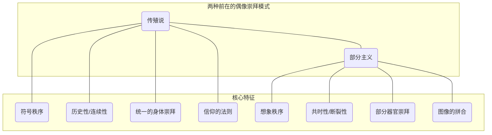
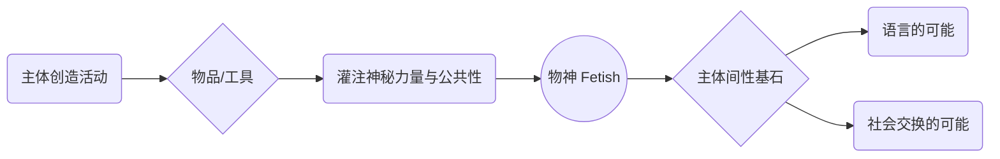
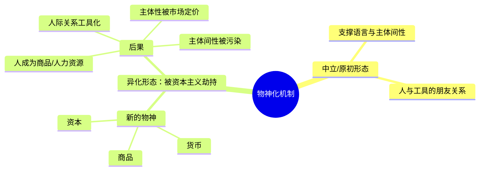

---
{"dg-publish":true,"permalink":"/1-2 宗教实在论/1-2-2 偶像崇拜/1-2-2-3 拜物教/","created":"2025-09-19T20:52:29.408+08:00","updated":"2025-09-22T22:20:42.983+08:00"}
---

### **一、本章概览**
- **主义主义编码**: 1-2-2-3
- **意识形态命名**: [[拜物教\|拜物教]] (Fetishism) / [[恋物癖\|恋物癖]]
- **核心论断**: [[拜物教\|拜物教]] 并非简单的物质崇拜，而是一种深刻的意识形态机制。它通过“[[物神化\|物神化]]”（Fetishization）这一核心动作，**调和**了两种更古老的偶像崇拜模式——代表符号秩序的[[传殖说\|传殖说]]与代表想象分裂的[[部分主义\|部分主义]]——从而为[[9 未命名/主体间性\|主体间性]]乃至[[语言\|语言]]的诞生奠定了基础，但这一机制也极易被[[5 主义/资本主义\|资本主义]]所“异化”，扭曲人类社会关系。
- **你能获得**:
    - 理解[[拜物教\|拜物教]]作为一种深刻精神结构，而不仅仅是马克思的经济概念或弗洛伊德的性倒错。
    - 掌握其如何通过[[物神化\|物神化]]机制，调和[[符号\|符号]]与[[想象\|想象]]两个维度的内在冲突。
    - 洞悉这一机制如何成为[[语言\|语言]]和[[9 未命名/主体间性\|主体间性]]的底层支撑，以及它如何被[[5 主义/资本主义\|资本主义]]扭曲为[[商品拜物教\|商品拜物教]]。

---
### **二、核心内容解析**

#### **“主义主义”四格分析**

1.  **场域之“1” (Ontology)**：该意识形态预设的世界是一个由**统一、连续的创造性叙事**所构成的整体。这个[[世界\|世界]]图景是封闭且自洽的，它从一个神话般的、原始的创造力量开始，通过[[祖先\|祖先]]的血脉（如[[传殖说\|传殖说]]），延伸到“我”这个主体，再由“我”的劳动创造出工具/物品。这个被创造出的“物”又神秘地短路、连接回最初的创造性力量，形成了一个完整的循环。万物都处在这个无缝的、从本源到创造再回归本源的单一故事线之中，不存在真正的外部或断裂。

2.  **本体之“2” (Body)**：在这个统一的叙事舞台上，真实的存在物被分裂为**二元对立**的两类。一方面是“**平凡物**”（Common Objects），即自然界中未经加工的、普通的、缺乏神圣性的事物；另一方面则是“**物神**”（Fetish），即那些经过人类劳动创造，并被灌注了超验的、神秘力量的人造物。世界的本体不再是同质的，而是被一道鸿沟划开，区分为神圣/人造与世俗/自然两大阵营，两者处于持续的张力之中。

3.  **现象之“2” (Phenomenon)**：主体在体验和认知这个世界时，其[[主体性\|主体性]]本身也是分裂的。主体同时拥有两种相互冲突的认知模式。第一种是**神秘主义的体验**，主体能够感受到“物神”中所凝结的、超越其物质性的神圣力量与可靠性，这是一种非理性的、直觉式的把握。第二种则是**工具理性的认知**，主体又能将同一个对象看作纯粹的、可计算的、服务于特定目的的工具。这种在“迷信”与“理性”之间的持续摆动，构成了[[现象\|现象]]层面的内在分裂。

4.  **目的之“3” (Purpose)**：该意识形态的最终[[9 未命名/目的论\|目的论]]在于**调和与中介**。它不寻求维持现状的循环（1），也不满足于二元对立的永久斗争（2），而是旨在通过一个**中介者**——即“[[物神\|物神]]”（Fetish）——来综合两种更古老的、相互冲突的目的。这两种冲突的目的是：以[[传殖说\|传殖说]]为代表的“**一回归一**”（维持符号秩序的同一性），以及以[[部分主义\|部分主义]]为代表的“**一分裂为多**”（让想象性的碎片独立）。[[拜物教\|拜物教]]的目的（3）则是“**一创造出多**”，即通过创造与自身不同的“物”，实现一种生成性的、增殖性的和解，让世界在保持关联的同时变得更加丰富和多样。

#### **其他核心知识点**

##### 两种偶像崇拜的对立
[[拜物教\|拜物教]]（Fetishism）的出现，是为了解决两种更原始、更基础的偶像崇拜模式之间的内在矛盾。第一种是[[传殖说\|传殖说]] (Traducianism)，它代表了[[符号\|符号]]秩序，强调精神/灵魂（Soul）由父母的身体（Body）一脉相承地遗传下来，这是一种基于血缘、世系和连续性历史叙事的崇拜，其典范是“信仰的法则”（Rule of Faith）。第二种是[[部分主义\|部分主义]] (Partialism)，它代表了[[想象\|想象]]秩序，崇拜的是从整体中分裂出来的部分器官或肢体（如眼睛、性征），这是一种非连续的、共时性的、基于知性分割与重组能力的崇拜，其典范是埃及神话中将不同动物部分拼合成新神祇的“图像神话”（Myth of Image）。前者追求统一与传承，后者制造断裂与拼合，两者构成了深刻的张力，而[[拜物教\|拜物教]]正是为了调和这一张力而产生的。

**举例阐释**：[[传殖说\|传殖说]]就像是古代宗族强调“血脉纯正，受之父母”，崇拜的是整个家族世系所承载的那个神圣血统。而[[部分主义\|部分主义]]则如同古埃及人将鹰的头、人的身、蛇的尾拼合成一个神，他们崇拜的是那种能够打破自然整体、进行任意组合的神秘分割力量。

##### 物神化作为前主体间性基石
“[[物神化\|物神化]]”（Fetishization）是[[拜物教\|拜物教]]的核心运作机制，它指的是人类在创造物品（尤其是工具）时，会无意识地将一种超越其物质性的、公共的、可靠的“神秘力量”灌注其中。这一机制是[[9 未命名/主体间性\|主体间性]]得以可能的基础。因为通过[[物神化\|物神化]]，一个“我”创造的私人物品（如一把斧子），被赋予了一种普遍的、所有人都可信赖的属性，从而变成了“公共物”。这使得物品交换成为可能。更重要的是，[[语言\|语言]]本身就是终极的“物神”。我们说的每一个词，都是我们创造出来的“声音之物”，但我们相信它承载着超越我个人发声的、你我也能共同理解的“意义”。没有这种对词语的[[物神化\|物神化]]信念，交流将无法进行。因此，[[物神化\|物神化]]是一种先于个体[[主体性\|主体性]]确立的、建构了社会性联结的底层结构。

**举例阐释**：当你和朋友谈论“正义”时，你们都默认“正义”这个词指向一个共同的、稳定的概念，而不是一堆无意义的音节。你们都把“正义”这个词当作了一个“物神”，相信它体内凝结了某种公共的精神性力量。这就是[[物神化\|物神化]]在语言中的日常运作。

##### 异化的物神化与资本主义
讲稿提出了一个关键区分：[[物神化\|物神化]]本身是一个中立且必要的机制，但它可能被**异化**。[[5 主义/资本主义\|资本主义]]的意识形态，正是通过劫持并扭曲[[物神化\|物神化]]机制来运作的。在[[5 主义/资本主义\|资本主义]]体系下，原本支撑主体间交流的[[物神化\|物神化]]过程，被改造为服务于价值无限增殖的逻辑。商品、货币、资本，都成了新的“物神”。人不再是向自己创造的工具投射主体性，而是反过来，人际关系、乃至人自身的[[主体性\|主体性]]，都被商品交换的逻辑所定义。人变成了“人力资源”，人的价值由其在市场上的价格衡量。这种“**异化的物神化**” (Alienated Fetishization) 污染了[[语言\|语言]]和[[9 未命名/主体间性\|主体间性]]的根基，使社会交往全面工具化和量化。

**举例阐释**：在非异化的关系中，木匠可能会珍视他的锤子，把它看作可靠的伙伴。但在[[5 主义/资本主义\|资本主义]]逻辑下，这把锤子首先是一个具有交换价值的商品，木匠的劳动被抽象为凝结在商品中的价值，而木匠本人则可能将自己视为在劳动力市场上待价而沽的“商品”，其“身价”由市场决定。

---
### **三、关键观点提取**
- “我要说的就是说 **[[拜物教\|拜物教]]** 的这个机制…对于[[9 未命名/主体间性\|主体间性]]的语言是非常重要的。我甚至可以说 every word is a fetish，每一个word都是个fetish。”
- “这个 **[[拜物教\|拜物教]]** …调和这两者（[[传殖说\|传殖说]]与[[部分主义\|部分主义]]）之间的矛盾…人类创造工具在里面灌注了某种神秘性灵性，在这个意义上讲，它是和[[传殖说\|传殖说]]的那个思维方式是一样的。然后另外一方面，这些工具…从自然物的背景当中凸显出来，这种分离性它就是等同于**[[部分主义\|部分主义]]**的。”
- “**[[物神化\|物神化]]** (Fetishization) 它是不可避免的…但是 **[[异化\|异化]]** (Alienation) 和 **[[物神化\|物神化]]** 这两个东西结合在一块是可以避免的，alienated fetishization 它是直接对应 **[[5 主义/资本主义\|资本主义]]** 的。”
- “他的目的就是‘**一要变为多**’…我要创造 something different from myself，我要创造我的对立面出来…这种目的论实际上是人类的劳动的**[[创造力\|创造力]]**。”

---
### **四、知识点问答**
#### Q: 为何说[[拜物教\|拜物教]]的目的论是“3”（中介），而非简单的“1”（同一）或“2”（对抗）？
A: 因为[[拜物教\|拜物教]]的终极目的不是维持一个封闭系统的**循环**（1），也不是让两种力量**永恒对抗**（2），而是要**生产出差异**来**调和**矛盾。它综合了[[传殖说\|传殖说]]（追求血脉延续，类似“1”）和[[部分主义\|部分主义]]（追求分裂碎片，类似“2”）的倾向。通过创造出一个前所未有的“物神”，它既延续了“创造”这一行为（与“1”的叙事相关），又产生了与自身和自然都不同的新事物（与“2”的分裂相关），最终达成了“一创造出多”的**生成性调和**（3），使世界在关联中增殖。

#### Q: 根据讲稿，[[5 主义/资本主义\|资本主义]]是如何通过“异化”来利用[[物神化\|物神化]]这一古老机制的？
A: [[5 主义/资本主义\|资本主义]]并未发明[[物神化\|物神化]]，而是“劫持”了它。原初的[[物神化\|物神化]]机制服务于建立可靠的[[9 未命名/主体间性\|主体间性]]联结（如信任语言、交换工具）。[[5 主义/资本主义\|资本主义]]则将这一机制的目标从“建立联结”篡改为“**无限增殖**”。它让商品、货币和资本取代了原始工具成为新的“物神”，并用一套均质化的、可无限计算的[[符号\|符号]]体系（价格）来衡量它们的“神秘力量”。这导致了[[异化\|异化]]：人的创造力不再是为了生成差异和联结，而是为了生产可交换的价值，人自身也反过来被这套物神逻辑所定义和奴役。

#### Q: 如何理解“每一个词都是一个物神（fetish）”这一论断？它揭示了语言的什么本质？
A: 这句话揭示了[[语言\|语言]]的运作离不开一种**集体的、无意识的信念**。一个词语，物理上只是一段声波或一串墨迹，是人造的“物”。但我们之所以能用它交流，是因为我们集体“相信”它内部凝结了超越其物理性的、稳定的、公共的“意义”。我们将意义“灌注”并“崇拜”于词语这个“物”之中，使其成为一个“物神”。这说明[[语言\|语言]]并非纯粹的逻辑工具，其根基处埋藏着一个前理性的、带有神秘主义色彩的[[拜物教\|拜物教]]结构，正是这个结构支撑了所有[[9 未命名/主体间性\|主体间性]]的交流。

---
### **五、知识延伸**
- **[[商品拜物教\|商品拜物教]] (《资本论》第一卷)**: 这是理解本讲稿“[[异化的物神化\|异化的物神化]]”最直接的理论源头。马克思深刻揭示了在[[5 主义/资本主义\|资本主义]]生产方式下，商品如何被赋予了神秘的社会属性，人与人的社会关系如何被颠倒为物与物的关系，这与讲稿中对资本主义劫持[[物神化\|物神化]]机制的分析完全契合。
- **雅克·拉康的[[对象a\|对象a]] (Object Petit a)**: 在拉康的精神分析理论中，[[对象a\|对象a]]是欲望的成因，是一个永远失落却驱动着主体欲望的“剩余物”。 fetish（恋物）在精神分析中正是[[对象a\|对象a]]的一种具体化身，它作为一个可见的“物”，填补了主体根本性的“匮乏”之位。这可以深化对“物神”何以具有如此强大“神秘力量”的理解。
- **马丁·海德格尔的“物” (Das Ding)**: 在《物》一文中，海德格尔通过对一个陶罐的分析，阐述了“物”如何“聚集”天、地、神、人四方，成为一个世界的中心。这种将一个平凡器物理解为世界性力量交汇点的思想，与讲稿中“物神”从自然背景中凸显出来并被赋予超验力量的论述，构成了有趣的参照与对话。

---
### **六、双链关联总结**
- **一级关联 (核心意识形态与概念)**: [[拜物教\|拜物教]]、[[物神化\|物神化]]、[[传殖说\|传殖说]]、[[部分主义\|部分主义]]、[[异化的物神化\|异化的物神化]]、[[创造力\|创造力]]
- **推测相关人物 (Speculated Figures)**:
    - **[[6 哲学家/卡尔·马克思\|卡尔·马克思]]**: 理论的直接批判对象和思想来源，尤其是[[商品拜物教\|商品拜物教]]概念。
    - **[[6 哲学家/西格蒙德·弗洛伊德\|西格蒙德·弗洛伊德]] / [[6 哲学家/雅克·拉康\|雅克·拉康]]**: 他们的[[恋物癖\|恋物癖]]和[[对象a\|对象a]]理论，为理解[[拜物教\|拜物教]]的[[主体性\|主体性]]和欲望机制提供了[[9 未命名/精神分析\|精神分析]]的维度。
    - **[[Gollum\|Gollum]] (《指环王》)**: 虚构人物的完美案例。他对“魔戒”的迷恋，完全符合[[拜物教\|拜物教]]的结构：一个被创造的物被灌注了绝对的力量，主体的全部存在都围绕这个“物神”展开，并因此扭曲了自身的主体性。
    - **[[阿多诺\|阿多诺]] / [[阿尔都塞\|阿尔都塞]] / [[齐泽克\|齐泽克]]**: 讲稿中直接提及的左翼理论家，他们的工作延续了对[[9 未命名/意识形态\|意识形态]]和[[5 主义/资本主义\|资本主义]]文化逻辑的批判，是本讲稿的对话对象。
- **二级关联 (上下文与背景)**: [[意识形态批判\|意识形态批判]]、[[9 未命名/精神分析\|精神分析]]、[[5 主义/马克思主义\|马克思主义]]、[[欧陆哲学\|欧陆哲学]]、[[9 未命名/符号学\|符号学]]、[[人类学\|人类学]]
- **三级关联 (推测与延展)**: [[9 未命名/主体间性\|主体间性]]、[[语言哲学\|语言哲学]]、[[9 未命名/工具理性\|工具理性]]、[[商品拜物教\|商品拜物教]]、[[对象a\|对象a]]、[[5 主义/资本主义\|资本主义]]