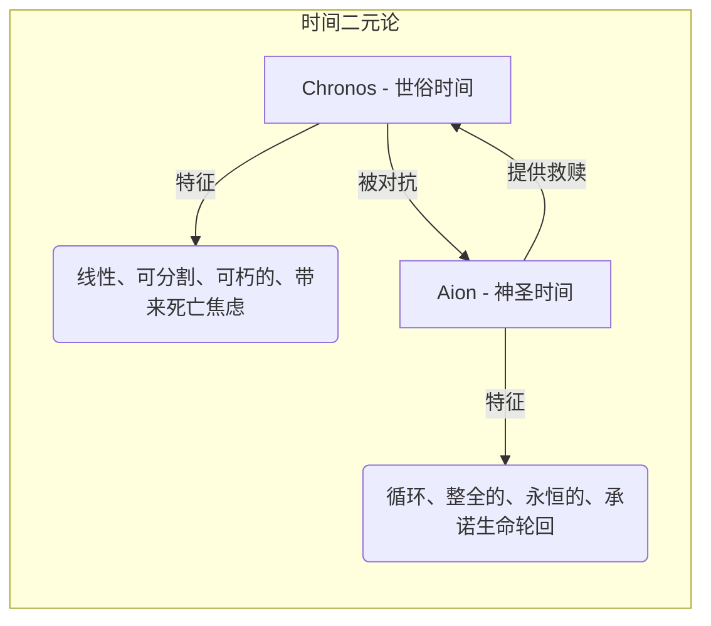
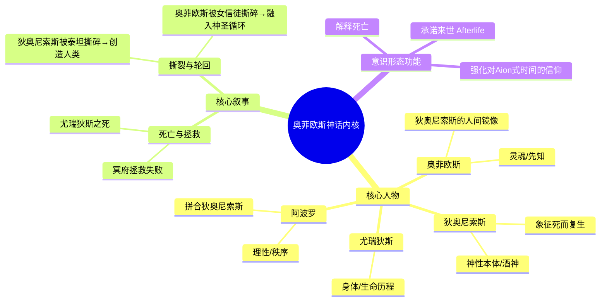
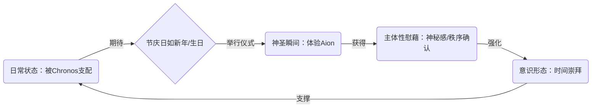

---
{"dg-publish":true,"permalink":"/1-2 宗教实在论/1-2-2 偶像崇拜/1-2-2-4 时间崇拜/","created":"2025-09-19T20:52:29.412+08:00","updated":"2025-09-22T22:20:43.886+08:00"}
---

### **一、本章概览**
- **主义主义编码**: 1-2-2-4
- **意识形态命名**: [[时间崇拜\|时间崇拜]] / [[Aionism\|Aionism]]
- **核心论断**: 这是一种将时间本身神化的意识形态，它崇拜一种包裹万物、永恒循环的活时间（[[Aion\|Aion]]），并通过周期性的“节庆”仪式来体验这种神圣性，以此对抗并消解世俗线性时间（[[Chronos\|Chronos]]）带来的死亡焦虑。其根本问题在于，它用一种宏大的、永恒循环的叙事，遮蔽并取消了主体在每一个“当下”进行断裂式决断的真实可能性。
- **你能获得**: 你将掌握 1-2-2-4 意识形态的内在结构，理解古希腊神话中 [[Chronos\|Chronos]] 与 [[Aion\|Aion]] 的对立如何构成其核心。你还能洞悉[[奥菲欧斯\|奥菲欧斯]]神话如何作为此意识形态的载体，并学会从“过节”这一日常行为中，诊断出[[时间崇拜\|时间崇拜]]的深层运作机制。

---
### **二、核心内容解析**

#### **“主义主义”四格分析**

1.  **场域之“1” (Ontology)**：此意识形态预设的[[世界\|世界]]框架是一个由神圣时间（[[Aion\|Aion]]）所包裹的、绝对统一且封闭的宇宙。这个“1”代表了场域的整全性。讲稿中将其描绘为一层包裹着黄道带和整个宇宙的透明法球，它是一个永恒流转、自我循环的活时间。万事万物都在这个巨大的时间容器内发生，没有任何东西能外在于它。这个场域是循环的、无始无终的，确保了所有事件最终都会被回收进这个宏大的节律之中，从而提供了一种终极的秩序和确定性。

2.  **本体之“2” (Body)**：在这个统一的时间场域内，世界的核心内容被分裂为二元对立的两种时间。这个“2”代表了本体的对抗性。一方是[[Chronos\|Chronos]]，即凡俗的、线性的、可计量的、导致衰老与死亡的世俗时间；另一方是[[Aion\|Aion]]，即神圣的、循环的、具有无限生命力的、能够实现永恒回归的超越性时间。这两种时间构成了世界的基本冲突：有限与无限，腐朽与永生。整个意识形态的运作，都围绕着如何用[[Aion\|Aion]]的力量去对抗、拯救和转化[[Chronos\|Chronos]]的有限性。

3.  **现象之“2” (Phenomenon)**：[[主体性\|主体性]]体验这个世界的方式同样是二元的，这个“2”反映了本体层面二元对立在感知上的投射。一方面，是日常的、被[[Chronos\|Chronos]]所支配的体验，即对生老病死的焦虑、对时间流逝的无力感。另一方面，是通过特定仪式进入的“[[节庆性\|节庆性]]体验”，即在神圣的节日或纪念日，主体暂时脱离日常时间，感受到与永恒时间[[Aion\|Aion]]的连接，体验到一种神秘的、超验的“神圣瞬间”。这种体验为被日常消磨的主体性提供了一个周期性的高峰与慰藉。

4.  **目的之“4” (Purpose)**：该意识形态的最终[[9 未命名/目的论\|目的论]]是“4”，代表着一种超越性的、内在矛盾的虚空。时间本身作为最终目的，其运作方式是悖论性的，它消解了所有简单的一元、二元或三元逻辑。时间既可以被理解为永恒的同一（1=1），也可以被理解为无限分裂的瞬间（1=0.1+0.1...），还可以被视为不断创生的增长。这个“4”意味着，时间作为终极实在（The Real），其本身无法被任何一种符号学逻辑（象征性的、想象性的或物神化的）所捕获。它是一个“不可能性”的核心，指向一个无法被完全整合的裂隙，但正是这个裂隙，驱动着整个意识形态的循环。

#### **其他核心知识点**

##### 两种时间观的对立：Chronos vs. Aion
这两种源自[[古希腊神话\|古希腊神话]]的时间概念是理解[[时间崇拜\|时间崇拜]]的关键。[[Chronos\|Chronos]]（克罗诺斯）代表着我们日常经验中线性的、可分割的、不可逆的时间，它带来衰老与死亡，是有限性的体现。在神话中，他吞噬自己的孩子，象征着时间对万物的囚禁。而[[Aion\|Aion]]则代表一种神圣的、循环的、永恒的生命时间，它不是一段段流逝的，而是包含一切的整体。它象征着生命的周而复始与永恒回归。[[时间崇拜\|时间崇拜]]的核心，就是试图通过对[[Aion\|Aion]]的信仰和仪式，来超越或救赎被[[Chronos\|Chronos]]所困的凡俗生命。

**举例阐释**：一个老人每年都过生日或过年。从[[Chronos\|Chronos]]的角度看，这标志着他又老了一岁，离死亡更近一步，令人感伤。但从[[Aion\|Aion]]的角度看，这个“节庆”是一个神圣循环的节点，让他再次接入了那个永恒的生命节律，感受到的不是衰老，而是一种神秘的、周而复始的力量的再次显现，从而获得慰藉。

##### 奥菲欧斯神话与狄奥尼索斯崇拜
[[奥菲欧斯\|奥菲欧斯]]神话是[[时间崇拜\|时间崇拜]]意识形态的完美叙事载体。奥菲欧斯（Orpheus）本人作为[[狄奥尼索斯崇拜\|狄奥尼索斯崇拜]]的先知，其故事深刻地体现了生、死、复活与轮回的主题。他的妻子尤瑞狄斯（Eurydice，象征普遍的生命历程）之死，代表了[[Chronos\|Chronos]]的无情。奥菲欧斯进入冥府试图拯救她，是对抗死亡的努力。他最终的失败（回头一瞥）与被酒神女信徒撕碎的结局，与[[狄奥尼索斯\|狄奥尼索斯]]被泰坦撕碎的神话形成了镜像关系。这个神话结构（神/人被撕碎 -> 创造/轮回）为信徒提供了一个模板：个体的死亡并非终结，而是融入更大神圣循环（[[Aion\|Aion]]）的必要环节，并许诺了来世（Afterlife）。

**举例阐释**：讲稿中将[[奥菲欧斯\|奥菲欧斯]]与[[狄奥尼索斯\|狄奥尼索斯]]的关系类比为彼得与基督的关系。基督（神）受难复活，为人类开辟了救赎之路；彼得（人）作为其追随者，也以殉道的方式重演了其命运。同样，[[狄奥尼索斯\|狄奥尼索斯]]的被撕碎与复活是神圣原型，[[奥菲欧斯\|奥菲欧斯]]的相似命运则向凡人展示了通往不朽的路径。

##### 节庆性与神圣瞬间
“[[节庆性\|节庆性]]”（Festivity）是[[时间崇拜\|时间崇拜]]在现实中最主要的实践方式。节日，并非简单的休息或纪念，而是一个结构性的“神圣瞬间”。在这一刻，凡俗的、线性的[[Chronos\|Chronos]]时间被暂时悬置，永恒的、循环的[[Aion\|Aion]]时间得以“降临”并被体验。通过庆祝仪式（如过年、过圣诞、过生日），个体与共同体得以周期性地确认那个超验的、神圣的宇宙秩序依然有效，并且自己仍被包含在这个永恒的循环之内。这种体验为被日常性磨损的[[主体性\|主体性]]注入了神圣感和意义感，从而巩固了整个意识形态。

**举例阐释**：“618”或“双十一”购物节在当代也可被视为一种世俗化的[[节庆性\|节庆性]]。它创造了一个周期性的、万众瞩目的“神圣瞬间”，人们在这一刻的消费行为被赋予了狂欢和仪式的色彩，暂时脱离了日常的精打细算，体验一种集体的、被引导的欲望释放，这正是[[时间崇拜\|时间崇拜]]中通过特定节点释放主体性能量的现代变体。

---
### **三、关键观点提取**
- “时间的这个[[9 未命名/目的论\|目的论]]结构，它本身是超越这三种想象模式的...这三种符号学的运行模式都被这个[[时间崇拜\|时间崇拜]]所消解掉了，然后被它所青春掉了。”
- “实际上对于[[时间崇拜\|时间崇拜]]，其实是对于这种[[抉择性的当下\|抉择性的当下]]时刻的崇拜，而不是对于久远的崇拜。”
- “你体验到[[无限\|无限]]，人类只能体验到界限。那这个时候你体验到这个界限，就是你的那个神圣瞬间，也就是你的生命的终结。”
- “节庆性就是几月几号，还包括[[历法\|历法]]崇拜...过节就代表[[神圣循环\|神圣循环]]在继续延续，[[神圣瞬间\|神圣瞬间]]在再一次降临，证明他真的是真的。”

---
### **四、知识点问答**
#### Q: 为什么说 1-2-2-4 意识形态的核心是对立的，即“本体”和“现象”都是“2”？
A: 因为[[时间崇拜\|时间崇拜]]建立在一对根本性的二元对立之上。在[[9 未命名/本体论\|本体论]]层面，它将真实的时间分裂为神圣的、永恒的[[Aion\|Aion]]与凡俗的、可朽的[[Chronos\|Chronos]]，这是世界内容的根本冲突。在[[9 未命名/现象学\|现象学]]层面，这种对立直接映射为主体体验的两种模式：被[[Chronos\|Chronos]]支配的、充满焦虑的[[日常体验\|日常体验]]，和在特定时刻与[[Aion\|Aion]]连接的、充满神秘感的[[节庆性体验\|节庆性体验]]。因此，无论是世界的构成还是主体的感知，都围绕着这个“2”所代表的对抗性来展开。

#### Q: [[奥菲欧斯神话\|奥菲欧斯神话]]中的“不能回头”禁令，如何揭示了这种意识形态的运作秘密？
A: “不能回头”的禁令象征着对“过去”的压抑。在这种意识形态下，主体被要求永远向前看，体验未来的无限可能性，从而遗忘或不去凝视已经发生的、不可挽回的创伤与死亡（即[[Chronos\|Chronos]]的作用）。一旦回头，就意味着直面那个已然固化的、死亡的过去（尤瑞狄斯永远留在冥府），这将打破[[Aion\|Aion]]所承诺的无限循环的幻象。因此，这个禁令的本质是：为了维持对永恒生命的信仰，你必须放弃对真实历史和个体有限性的回溯与反思。

#### Q: 未明子为何批判说，对“永恒”的崇拜，实际上是对“抉择性的当下”的逃避？
A: 因为在[[时间崇拜\|时间崇拜]]的框架下，真正的变革和断裂是不可能的。一切都被预设在一个永恒循环的[[Aion\|Aion]]之中，任何看似崭新的事件最终都会被证明是宏大节律的一部分。而“[[抉择性的当下\|抉择性的当下]]”恰恰是一种能够彻底断裂过去、创造出全新可能性的时刻，它充满了不确定性和主体的绝对责任。[[时间崇拜\|时间崇拜]]通过提供一个“一切终将回归”的宏大叙事，让主体放弃了在当下做出真正决断的勇气，转而将希望寄托于一个确定的、周而复始的未来，这是一种深刻的逃避。

---
### **五、知识延伸**
- **[[尼采\|尼采]]的[[9 未命名/永恒轮回\|永恒轮回]]**: 尼采的这一核心思想与[[Aionism\|Aionism]]构成了深刻的对话关系。尼采的[[9 未命名/永恒轮回\|永恒轮回]]不是一种宿命论的循环，而是一个伦理学指令：你要如此生活，以至于你愿意无数次地重复它。它强调的是肯定生命、在当下做出最强力决断的“超人”意志。可以将其视为对 1-2-2-4 意识形态的一种哲学升华与批判性转化，即从被动的循环信仰，转向主动的创造性循环。
- **[[爱利亚德\|爱利亚德]]的《[[神圣与世俗\|神圣与世俗]]》**: 这位宗教史学家的经典著作系统阐述了“神圣时间”（循环的、可逆的、节庆的）与“世俗时间”（线性的、历史的、不可逆的）的对立。这为理解[[时间崇拜\|时间崇拜]]中[[Aion\|Aion]]与[[Chronos\|Chronos]]的二元对立提供了完美的学术参照系，可以帮助我们从更广阔的比较宗教视野来审视这一意识形态。
- **电影《[[土拨鼠之日\|土拨鼠之日]]》**: 这部电影是[[时间崇拜\|时间崇拜]]从消极到积极转化的寓言。主角最初被困在日复一日的循环（消极的[[Chronos\|Chronos]]式重复）中，感到绝望和虚无。但最终，他通过在循环中学习、创造和爱，将这个诅咒转变为一个可以臻于完美的“神圣时间”（积极的[[Aion\|Aion]]式体验），这生动地演绎了如何在一个看似封闭的循环中找到[[自由\|自由]]与意义。

---
### **六、双链关联总结**
- **一级关联 (核心意识形态与概念)**: [[时间崇拜\|时间崇拜]]、[[Aionism\|Aionism]]、[[Aion\|Aion]]、[[Chronos\|Chronos]]、[[节庆性\|节庆性]]、[[奥菲欧斯神话\|奥菲欧斯神话]]、[[狄奥尼索斯崇拜\|狄奥尼索斯崇拜]]、[[神圣瞬间\|神圣瞬间]]、[[神圣循环\|神圣循环]]、[[抉择性的当下\|抉择性的当下]]
- **推测相关人物 (Speculated Figures)**:
    - [[尼采\|尼采]]: 他的[[9 未命名/永恒轮回\|永恒轮回]]思想与[[狄奥尼索斯\|狄奥尼索斯]]精神，是这一意识形态最直接的哲学共鸣者与升华者。
    - [[爱利亚德\|爱利亚德]]: 其对神圣与世俗时间的学术研究，为[[时间崇拜\|时间崇拜]]提供了理论框架。
    - **遵循传统节庆生活的长者**: 现实中，那些生命节奏完全由传统节假日（春节、清明、中秋等）定义，并从中获得安身立命之感的人，是[[时间崇拜\|时间崇拜]]的无意识践行者。
- **二级关联 (上下文与背景)**: [[古希腊神话\|古希腊神话]]、[[俄尔普斯教\|俄尔普斯教]]、[[5 主义/诺斯替主义\|诺斯替主义]]、[[基督教神学\|基督教神学]]、[[9 未命名/精神分析\|精神分析]]、[[偶像崇拜\|偶像崇拜]]、[[9 未命名/现象学\|现象学]]
- **三级关联 (推测与延展)**: [[9 未命名/永恒轮回\|永恒轮回]]、[[神圣与世俗\|神圣与世俗]]、[[9 未命名/死亡驱力\|死亡驱力]]、[[历法\|历法]]、[[物神崇拜\|物神崇拜]]、[[身体崇拜\|身体崇拜]]、[[部分主义\|部分主义]]