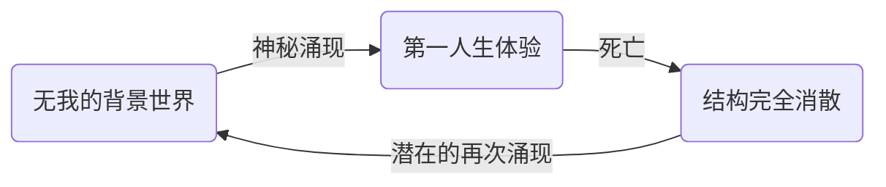
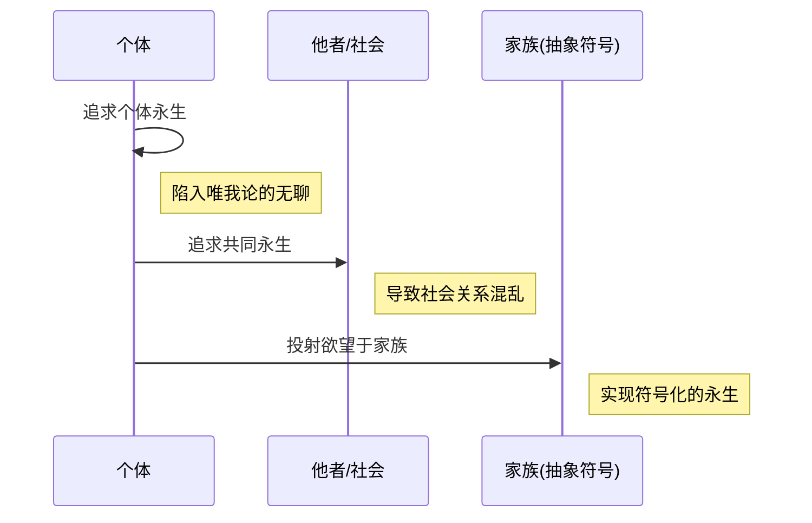
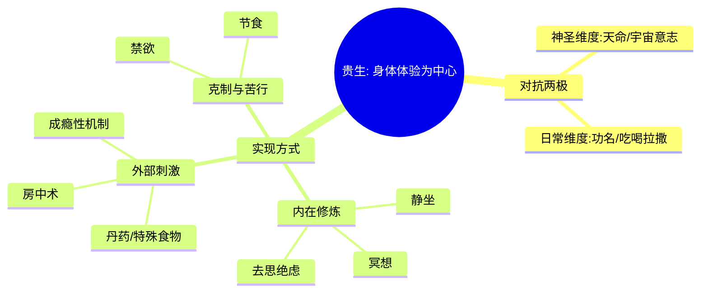

---
{"dg-publish":true,"permalink":"/1-2 宗教实在论/1-2-3 唯灵论/1-2-3-1 永生主义/","created":"2025-09-19T20:52:29.420+08:00","updated":"2025-09-22T21:57:46.159+08:00"}
---

### **一、本章概览**
- **主义主义编码**: 1-2-3-1
- **意识形态命名**: [[5 主义/永生主义\|永生主义]] 
- **核心论断**: “永生主义”并非真正追求[[生命\|生命]]的无限延续，而是一种对[[9 未命名/主体间性\|主体间性]]关系网络断裂的深刻恐惧。它将个体对死亡的焦虑，最终转化为对一个抽象共同体（如[[家族\|家族]]）永恒存续的崇拜。
- **你能获得**: 你将掌握“[[5 主义/永生主义\|永生主义]]”这一意识形态的内在[[9 未命名/符号学\|符号学]]结构，理解其如何从个体欲望演变为集体崇拜，并能辨识现实中从帝王求仙到“家族荣光”等思想背后共通的1-2-3-1编码逻辑。

---
### **二、核心内容解析**

#### **“主义主义”四格分析**

1.  **场域之“1” (Ontology)**：该意识形态预设的[[世界\|世界]]是一个统一且具备循环生产能力的封闭舞台。它相信，既然“我”能够从一个“无我”的背景中“无中生有”地涌现一次，那么这个背景秩序本身就蕴含着重复生产[[主体性\|主体性]]的潜能。这个[[世界\|世界]]是一个“可居住的家”（livable home），保证了[[生命\|生命]]可以被不断重新启动。因此，[[死亡\|死亡]]并非终局，只是这个统一场域内的一次状态重置，场域本身是永恒且自洽的，永远为生命的再次登场提供可能性，这构成了“1”的整全与循环特性。

2.  **本体之“2” (Body)**：在此[[世界\|世界]]观下，[[实在\|实在]]被明确划分为两个相互对立的领域：[[可朽之物\|可朽之物]] (Mortal) 与[[不朽之物\|不朽之物]] (Immortal)。日常的、凡俗的事物是可朽的，它们稳定、持存，但缺乏改变命运的神力。而真正能够赋予永生的[[不朽之物\|不朽之物]]，如仙丹、蟠桃、灵气，在神话叙事中反而被描绘为极其不稳定、转瞬即逝的。这种对立（凡俗/神圣，持存/易逝）构成了本体论上的二元对抗，即“2”的结构。追求永生，就是用一种转瞬即逝的“神物”去对抗另一种凡俗的“朽物”。

3.  **现象之“3” (Phenomenon)**：主体在体验[[世界\|世界]]时，面临着“神圣维度”（如天命、宇宙意志）与“日常维度”（如功名利禄、吃喝拉撒）的二元撕扯。[[5 主义/永生主义\|永生主义]]者既不愿被宏大的神圣意志所奴役，也鄙夷纯粹动物性的日常生存。因此，他选择了一个中介来调和这对矛盾——即以“我”为中心的、独特的“[[身体性体验\|身体性体验]]”。这种体验通过静坐、冥想、服食丹药、房中术乃至苦行等方式获得，它既超越了凡俗，又拒绝了外在神圣的规训，形成了一个以自我感受为绝对核心的“3”的中心化结构，即“[[贵生\|贵生]]”。

4.  **目的之“1” (Purpose)**：[[5 主义/永生主义\|永生主义]]的[[9 未命名/目的论\|目的论]]并非简单的个体生命无限延续，因为纯粹的个体永生将导向[[唯我论\|唯我论]]式的终极无聊。其真正的目的，是让一种“有意义的生活”——即稳定的[[主体间\|主体间]]关系网络——进入永恒的循环。当发现个体和亲友的共同永生会因时间冲刷而导致伦理关系混乱时，这种欲望便投射到一个更抽象的载体上，如[[家族\|家族]]的千秋万代。最终，它追求的是一个封闭的、理想化的社会关系模型的无限重复与自我维系，这正是“1”所代表的终极循环与同一性。

#### **其他核心知识点**

##### 生命的循环涌现与死亡焦虑的消解
“[[5 主义/永生主义\|永生主义]]”的深层心理机制在于，它通过一种[[9 未命名/符号学\|符号学]]的“赖皮”逻辑，消解了[[死亡\|死亡]]的终极性。讲稿指出，无意识深处坚信：既然[[主体性\|主体性]]可以从虚无中凭空涌现一次，那么在[[死亡\|死亡]]回归虚无后，没有理由不能涌现第二次。这个信念源于一个悖论：要么存在一个“大他者”需要“我”而让我诞生，那祂也会让我再次诞生；要么不存在“大他者”，“我”是自我涌现的，那么在条件归零后，“我”依然可以自我涌现。这种信念使得表面上的“怕死”实际上转化为对“生活消失”的恐惧。

**举例阐释**：古代“士为知己者死”的决绝行为，并非源于对生命的漠视，而是在其[[符号\|符号]]系统中，[[死亡\|死亡]]并非绝对终点。他们相信，既然生命能够开启一次，就能开启第二次。因此，他们敢于将此生的赌注压在一次壮烈的行动上，因为潜意识里认为这并非“终局游戏”。

##### 从个体永生到家族主义的演变
[[5 主义/永生主义\|永生主义]]的欲望逻辑存在一个必然的演化路径。最初，它表现为个体的、自恋式的长生渴望。但这种追求很快会面临[[唯我论\|唯我论]]的困境——一个只有自己的永恒[[世界\|世界]]是无法忍受的牢笼。随即，欲望扩展为“共同永生”（与亲人、爱人一同），但这又会因时间的无限拉长而导致原有的社会伦理关系（如父子、夫妻）崩溃。最终，为了维系那种“有意义”的关系结构，欲望被抽象化、符号化，投射到[[家族\|家族]]这一想象的共同体上。追求“家族的永恒兴旺”便成了个体永生欲望的最终社会形态。

**举例阐释**：讲稿中提到的[[儒教士大夫\|儒教士大夫]]，他们的人生目标往往不是个人的肉体不朽，而是“家族的千秋万代”。他们通过修身、齐家、治国，将自己的生命价值融入家族的延续之中，实现了从1-2-3-1个人版到社会版的转化。

##### “贵生”：作为中介的身体性体验
在[[5 主义/永生主义\|永生主义]]的现象学结构（“3”）中，“[[贵生\|贵生]]”是一种核心实践策略。它指的是将个体的[[身体性体验\|身体性体验]]置于至高无上的中心地位，以此来调和“神圣天命”与“凡俗日常”的对立。追求者通过各种极端或特殊的方式，如炼丹服药、气功静坐、房中术、禁欲苦行等，创造一种“神妙的”身体感受。这种感受既不同于日常的麻木，也反抗了外在的宏大叙事，使主体得以在自己的身体内部找到一个自足的、可控的“精神家园”，并将其误认为通往永生的道路。

**举例阐释**：魏晋时期的名士服用“五石散”后，追求一种飘飘欲仙的身体感受。这种体验使他们暂时脱离了儒家礼教（神圣维度）的束缚和现实政治（日常维度）的烦恼，沉浸在一种以自我身体为中心的迷狂状态中，这正是“[[贵生\|贵生]]”哲学的典型体现。

---
### **三、关键观点提取**
- “追求[[永生\|永生]]归根结底不是说为了追求[[生命\|生命]]的不朽……他追求的是[[主体间\|主体间]]的关联网络、关系网络的尺寸。”
- “[[5 主义/永生主义\|永生主义]]其实最终一定会走向[[家族主义\|家族主义]]崇拜……他会把这种有意义的这种结构想要推向永恒，然后不停的延续下去。”
- “你真正害怕[[死亡\|死亡]]，不是因为不敢面对自己的[[主体性\|主体性]]的一个消弭。你实际上你是认为这个世界上还有一种[[9 未命名/主体间性\|主体间性]]的关系是很可贵的。”
- “这些[[5 主义/永生主义\|永生主义]]他们都……好像这是个电影院，然后我作为一个观众我可以进去看，但是我就一直要看下去。”
- “在认识论上，这个就是以某种就是我的生存在这个immortal，它就是由这个来调和的……[[贵生\|贵生]]。”

---
### **四、知识点问答**
#### Q: 为何讲稿认为，追求永生者潜意识里是“坚信自己不会死的”？
A: 因为该意识形态的底层逻辑建立在“[[世界\|世界]]是一个能循环生产主体的场域”（场域之“1”）之上。它推断，既然[[生命\|生命]]可以从无到有出现一次，就必然可以出现第二次。这种[[9 未命名/符号学\|符号学]]上的循环可能性，使得物理[[死亡\|死亡]]在无意识层面被视为一次“可重置”的事件，而非终结。因此，真正的焦虑并非来自存在的终结，而是害怕失去当前这套宝贵的[[主体间\|主体间]]关系网络，即“生活”的消逝。

#### Q: “[[5 主义/永生主义\|永生主义]]”中的“2” (本体) 和“3” (现象) 是如何关联的？
A: 本体上的“2”（[[可朽之物\|可朽之物]] vs. [[不朽之物\|不朽之物]]）为现象上的“3”（[[贵生\|贵生]]）提供了实践工具与目标。主体为了调和“神圣”与“日常”的矛盾，需要一种独特的体验。这种体验的来源，正是通过操控本体论上的[[不朽之物\|不朽之物]]（如炼制和服用丹药）来改造[[可朽之物\|可朽之物]]（自己的肉身）。通过这种实践，主体获得了一种中心化的、自足的[[身体性体验\|身体性体验]]，从而在现象界实现了“3”的中介结构。

#### Q: 从[[秦始皇\|秦始皇]]求仙到[[儒教士大夫\|儒教士大夫]]追求家族荣耀，体现了“永生主义”怎样的内在演化？
A: 这体现了[[5 主义/永生主义\|永生主义]]从个体层面到社会层面的必然演化。[[秦始皇\|秦始皇]]代表了最原初的个体[[5 主义/永生主义\|永生主义]]，其欲望直接指向肉体不朽，但这种模式最终会陷入[[唯我论\|唯我论]]的困境。[[儒教士大夫\|儒教士大夫]]则代表了该意识形态的成熟形态，他们将永生的欲望从不稳定的个体生命，转移到了一个更稳定、更抽象的[[符号\|符号]]载体——[[家族\|家族]]之上。这解决了个人永生的无聊和关系混乱的问题，将目的（“1”）从“个体生命的循环”升华为“家族关系的循环”。

---
### **五、知识延伸**
- **[[秦始皇\|秦始皇]]**：中国历史上追求个体永生的最极致代表。他派遣方士寻找仙山、炼制丹药，完美诠释了1-2-3-1意识形态中对[[不朽之物\|不朽之物]]的执着和通过外在手段改造身体以求永生的模式。他是理解[[5 主义/永生主义\|永生主义]]个人版的绝佳案例。
- **道教外丹术**: 一种通过化学方法炼制“长生不老药”的方术。它在实践层面完全对应了讲稿中描述的，试图通过驾驭某种神秘的、转瞬即逝的[[不朽之物\|不朽之物]]（金丹）来转化[[可朽之物\|可朽之物]]（肉体）的二元对抗逻辑。它是对该意识形态“本体之2”的现实注解。
- **阿尔贝·加缪《[[西西弗斯神话\|西西弗斯神话]]》**: 讲稿用[[西西弗斯\|西西弗斯]]作为永恒诅咒的例子，但加缪对此给出了一个批判性的参照。加缪认为，正是因为意识到生命的荒诞和循环的无意义，西西弗斯才能通过蔑视自己的命运而获得自由。这提供了一个跳出1-2-3-1循环的可能：不追求延续，而是在有限和重复中创造意义，构成对[[5 主义/永生主义\|永生主义]]目的论的深刻反思。

---
### **六、双链关联总结**
- **一级关联 (核心意识形态与概念)**: [[5 主义/永生主义\|永生主义]]、[[1-2-3-1\|1-2-3-1]]、[[生命\|生命]]、[[死亡\|死亡]]、[[主体性\|主体性]]、[[9 未命名/主体间性\|主体间性]]、[[可朽之物\|可朽之物]]、[[不朽之物\|不朽之物]]、[[贵生\|贵生]]、[[身体性体验\|身体性体验]]、[[家族主义\|家族主义]]、[[唯我论\|唯我论]]
- **推测相关人物 (Speculated Figures)**: [[秦始皇\|秦始皇]] (个体永生主义的典型君主)、[[儒教士大夫\|儒教士大夫]] (家族主义形态的实践者)、[[魏晋名士\|魏晋名士]] (以“贵生”为核心的现象学实践者)
- **二级关联 (上下文与背景)**: [[9 未命名/精神分析\|精神分析]]、[[9 未命名/符号学\|符号学]]、[[存在论\|存在论]]、[[9 未命名/现象学\|现象学]]、[[道教\|道教]]、[[中国古代哲学\|中国古代哲学]]、[[神话学\|神话学]]
- **三级关联 (推测与延展)**: [[9 未命名/死亡驱力\|死亡驱力]]、[[荒诞\|荒诞]]、[[西西弗斯\|西西弗斯]]、[[9 未命名/大他者\|大他者]]、[[成瘾性机制\|成瘾性机制]]、[[想象的共同体\|想象的共同体]]