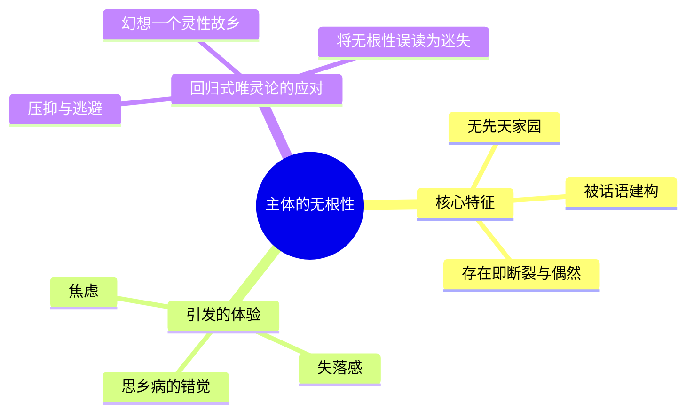
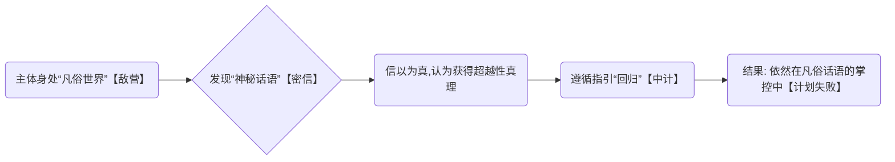
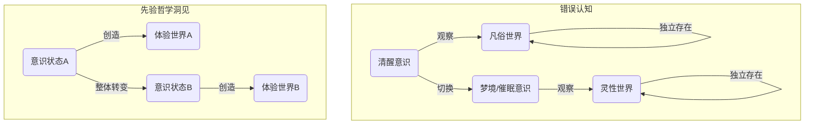

---
{"dg-publish":true,"permalink":"/1-2 宗教实在论/1-2-3 唯灵论/1-2-3-2 回归式唯灵论/","created":"2025-09-19T20:52:29.431+08:00","updated":"2025-09-22T22:20:40.854+08:00"}
---

### **一、本章概览**
- **主义主义编码**: 1-2-3-2
- **意识形态命名**: [[回归式唯灵论\|回归式唯灵论]]
- **核心论断**: 该意识形态构建了一个“灵性vs物质”的二元对立世界，并鼓吹主体应通过神秘体验挣脱凡俗的“牢笼”，回归一个想象中的、至高的灵性本源。其核心谬误在于，它所谓的“回归”路径和“彼岸家园”，恰恰是由它所鄙夷的此岸世界的[[凡俗话语\|凡俗话语]]所炮制的，本质上是一种拒绝承认[[主体的无根性\|主体的无根性]]而产生的“思乡病”。
- **你能获得**: 你将掌握 1-2-3-2 编码意识形态的完整诊断框架，理解其如何通过制造[[灵性\|灵性]]与[[物质\|物质]]的对立来运作。你将能识别并批判性地分析现实中类似的“回归”式话语（如某些新时代灵修），并掌握诸如“[[主体的无根性\|主体的无根性]]”和“[[蒋干盗书\|蒋干盗书]]式的愚蠢”等核心批判工具。

---
### **二、核心内容解析**

#### **“主义主义”四格分析**

1.  **场域之“1” (Ontology)**：[[回归式唯灵论\|回归式唯灵论]]预设了一个整全、统一但具有等级梯度的[[世界\|世界]]图景。这个[[存在论\|存在论]]框架是一个从最低等的[[物质\|物质]]世界到最高等的[[灵性\|灵性]]本源（至高主宰）的连续谱系。世界并非分裂的，而是一个单一的、充满不同“位面”或“层面”的宇宙，所有存在物都可以在这个从低到高的梯度上被定位。这个“1”的统一性体现在，所有层面都服务于一个最终的“回归”可能性，整个宇宙舞台的唯一意义就是提供一条从凡俗到神圣的上升通道，它是一个封闭自洽的、等级森严的灵性阶梯。

2.  **本体之“2” (Body)**：在这个统一的灵性阶梯场域中，真实的存在物被划分为两种截然对立的本体：[[物质\|物质]]性的（Material）和[[灵性\|灵性]]的（Spiritual）。前者是凡俗的、可朽的、有限的肉体与世界；后者则是神圣的、永恒的、无限的灵魂与灵界。这种二元对立是该意识形态的核心驱动力，它将[[世界\|世界]]的一切都解释为这两种本体之间的斗争。主体被定义为被困在低等[[物质\|物质]]躯壳中的高等[[灵性\|灵性]]存在，其生命的本质就是一场[[灵性\|灵性]]对抗[[物质\|物质]]、寻求解放的战争。

3.  **现象之“3” (Phenomenon)**：主体如何感知这个二元对立的[[世界\|世界]]？是通过一个核心中介。一方面是代表凡俗的“[[共同体话语\|共同体话语]]”或日常体验，这是需要被超越的；另一方面是代表真理的“[[神秘话语\|神秘话语]]”或超凡体验。而调和这两者的中介（“3”），就是一系列被认为能够“接触”灵界的特殊方法与状态，如[[催眠\|催眠]]、[[梦境\|梦境]]、幻视、通灵（Mediumship）等。这些中介机制成为了连接凡俗与神圣的桥梁，它们被赋予了至高的认知权威，能够“验证”灵界的存在，并将主体从日常经验的束缚中“解放”出来。

4.  **目的之“2” (Purpose)**：该意识形态最终导向一个二元对立的[[9 未命名/目的论\|目的论]]抉择。第一个目的是“[[逗留\|逗留]]”（Linger），即沉沦于[[物质\|物质]]世界，追求世俗的永生或共同体生活，这被视为一种失败或低级的状态。第二个目的，也是其所推崇的唯一正道，是“[[回归\|回归]]”（Revert）。这意味着主体必须放弃对凡俗世界的一切眷恋，通过[[灵性\|灵性]]的提升，最终超越自身的[[有限性\|有限性]]，与至高的神圣主宰合二为一。整个系统的运动方式，就是在这两种目的之间做出明确的、不可调和的选择，是一场“[[回归\|回归]]”对抗“[[逗留\|逗留]]”的终极斗争。

#### **其他核心知识点**

##### 主体的无根性
这是一种源于[[9 未命名/精神分析\|精神分析]]与[[欧陆哲学\|欧陆哲学]]的核心观念，它指出[[主体性\|主体性]]并非拥有一个预先存在的、稳固的“家园”或“本源”。相反，主体是在语言和[[共同体话语\|共同体话语]]中被建构出来的，其存在本身就是一种偶然和断裂，没有任何先验的归宿。[[回归式唯灵论\|回归式唯灵论]]的根本错误，就在于它无法直面这种无根的焦虑。它将这种无根感误读为一种“思乡病”，并进而幻想、投射出一个绝对的、想象性的“灵性家园”作为[[回归\|回归]]的目标。这种行为恰恰是对[[主体的无根性\|主体的无根性]]这一真相的压抑和逃避。

**举例阐释**：讲稿中提到的苏轼词句“我欲乘风归去”，在这种批判视角下，不再是浪漫的诗意，而是一种典型的症状。它暴露了主体渴望逃离当下凡俗处境，去往一个想象中的“琼楼玉宇”（理想家园）的幻想。这种“归去”的冲动，恰恰证明了主体无法安于其无根的现实。

##### “蒋干盗书”式的愚蠢
这个比喻精妙地揭示了[[回归式唯灵论\|回归式唯灵论]]在认识论上的自相矛盾和天真。信徒们认为自己所处的凡俗世界是虚假、不可信的“敌营”，却又天真地相信能从这个“敌营”内部找到通往“真实世界”的秘密线索（[[神秘话语\|神秘话语]]、古籍、秘法）。这就像三国时期的蒋干，身在敌营（曹营），却轻易相信了自己“发现”的密信，完全没有意识到这封信本身就是敌营为了欺骗他而故意设置的诱饵。这种愚蠢在于，它未能认识到，所谓的“神秘话语”并非外在于[[凡俗话语\|凡俗话语]]，而恰恰是[[凡俗话语\|凡俗话语]]系统为了处理其自身无法解释的例外状况而生产出来的一部分。

**举例阐释**：一个人不信任现代科学和主流社会的一切，认为它们都是“谎言”。但他却在网上找到一篇宣扬地心说的“远古神秘文献”，并深信不疑。他没有意识到，这篇所谓的“神秘文献”也是在现代社会的网络、语言和知识背景下被制造和传播的，它本身就是现代社会话语的一部分，而非真正的“外部真相”。

##### 作为中介的神秘体验
在1-2-3-2的结构中，“3”代表的中介角色至关重要，它负责弥合“2”（[[物质\|物质]]vs[[灵性\|灵性]]）的对立。[[催眠\|催眠]]、[[梦境\|梦境]]、幻视等“神秘体验”被塑造成通往灵性世界的可靠通道。这种观点的根本谬误在于一种“前先验转向”的朴素实在论。它错误地假设，当主体的意识状态发生切换（如从清醒到入梦），只是主体换了一个“观察窗口”，而去观察一个稳定不变的、客观存在的“灵界”。而[[先验哲学\|先验哲学]]的洞见在于，意识结构本身就构成了体验到的[[世界\|世界]]。意识状态的切换，意味着整个体验[[世界\|世界]]的本体论背景都发生了改变，根本不存在一个独立于意识之外的、可供“切换进入”的稳定位面。

**举例阐释**：讲稿中提到，信徒认为通过[[梦境\|梦境]]可以进入一个“主体间”的灵界。但讲者犀利地指出，梦中的其他人物是梦者意识的投射，并无真正的[[主体性\|主体性]]。将梦境体验实体化，认为自己真的“去”了另一个[[世界\|世界]]，就是这种前先验的、朴素的错误。

---
### **三、关键观点提取**
- “你这个密道里面，你在那个密道里面神秘的你所谓的你真正家也是这个家的一部分，你是一个凡俗的[[共同体话语\|共同体话语]]当中的一个所谓的[[神秘话语\|神秘话语]]，这个[[神秘话语\|神秘话语]]根本不是神秘，它还是虚假的。”
- “这种东西蛇皮就蛇皮在他没有看到[[主体的无根性\|主体的无根性]]。然后他又进一步去想象，幻想投射一个想象性的想象，新的一个思乡病。”
- “就相当于蒋干盗书...你这已经身在敌营了，拿到所有东西都不可信的。我靠他已经是敌人了，我靠在敌营里面好像发现真相，我操这拿到证据他还已经是个敌人了。”
- “苏轼这句话low就low在妈了个巴子的，你那个超越性的位面和你这个繁琐的位面，如果真的有这种二分的话，他应该是完全断裂的。你他妈还乘风归去了，我靠风凭什么做中中介。”

---
### **四、知识点问答**
#### Q: 为何讲稿将“回归式唯灵论”的信徒称为“巨婴”？
A: 因为“巨婴”的核心特征是拒绝接受与自身愿望不符的现实，并幻想能[[回归\|回归]]到一个无所不能、无所不包的母体式怀抱中。[[回归式唯灵论\|回归式唯灵论]]完美复刻了这一心理结构。它拒绝承认[[主体的无根性\|主体的无根性]]和[[有限性\|有限性]]这一残酷现实，转而幻想出一个至高的、无限的、充满关怀的“灵性家园”或“至高主宰”，并把生命的全部意义都寄托在“[[回归\|回归]]”这一行为上。这种对现实的逃避和对幻想性“家园”的依赖，正是心智不成熟的“巨婴”表现。

#### Q: 为什么说通过催眠、梦境等方式切换意识状态，并不能证明另一个“位面”的存在？
A: 这是因为该观点犯了“前[[先验哲学\|先验哲学]]转向”的错误。它天真地认为，有一个客观、独立的[[世界\|世界]]（或多个位面）在那里，而我们的意识只是一个观察它的工具。因此，切换意识状态（如[[催眠\|催眠]]）就像切换不同的望远镜。然而，[[先验哲学\|先验哲学]]的根本洞见是，意识结构本身是构成我们所体验的[[世界\|世界]]的前提。意识状态的根本改变，意味着整个体验[[世界\|世界]]的框架、规则和内容都随之重构了。因此，你体验到的不是“另一个位面”，而是一个“由另一种意识状态所构成的[[世界\|世界]]”，它并不具备独立于该意识状态的客观存在性。

#### Q: 请用“蒋干盗书”的比喻，解释为何“神秘话语”本质上仍是“凡俗话语”的一部分？
A: 在“蒋干盗书”的故事中，蒋干以为自己偷到的密信是曹营的“核心机密”，是外在于周瑜阵营的“真相”。但他不知道，这封信是周瑜故意让他看到的，是周瑜计谋的一部分。同理，[[回归式唯灵论\|回归式唯灵论]]的信徒将“[[神秘话语\|神秘话语]]”（如灵修秘籍）视为超越“[[凡俗话语\|凡俗话语]]”的真理。但他们没有意识到，这些“[[神秘话语\|神秘话语]]”本身就是由[[凡俗话语\|凡俗话语]]系统为了处理自身的矛盾、例外和无法解释的现象而生产出来的。它就像是社会这个“大系统”的一个安全阀或补充丁，看似神秘，实则仍在系统的掌控和定义之内，是“凡俗话语”的构成性例外，而非真正的外部。

---
### **五、知识延伸**
- **[[5 主义/诺斯替主义\|诺斯替主义]] (Gnosticism)**: 这是一个古代的宗教与哲学思想体系，可视为[[回归式唯灵论\|回归式唯灵论]]的完美历史原型。诺斯替主义同样认为，[[物质\|物质]]世界是一个由低级神祇（德穆革）创造的牢笼，而人类的灵魂中含有来自至高灵性世界的神圣火花。人生的目的就是通过获得“灵知”（Gnosis）来唤醒这火花，最终摆脱肉体和物质世界的束缚，[[回归\|回归]]至高的灵性本源。它与1-2-3-2的结构构成强烈的参照关系。
- **电影《[[超体\|超体]]》 (Lucy)**: 讲稿中直接提及的案例，是1-2-3-2意识形态目的论的终极视觉化呈现。女主角通过药物开发了100%的脑力，最终超越了肉体的[[有限性\|有限性]]，瓦解为无处不在的信息流，并说出“I am everywhere”。这完美诠释了该意识形态所追求的、与无限的宇宙本源合二为一的终极“[[回归\|回归]]”幻想。
- **[[Emanuel Swedenborg\|Emanuel Swedenborg]]**: 讲稿中提到的瑞典科学家、神学家和神秘主义者。他的生平就是1-2-3-2意识形态的绝佳样本。他从一个研究[[物质\|物质]]世界的科学家，转变为一个声称可以通过幻视与天使、灵魂沟通，并详细描绘灵界结构的神秘主义者。他的著作构成了现代[[唯灵论\|唯灵论]]的重要基石，是理解该意识形态的一个关键历史人物。

---
### **六、双链关联总结**
- **一级关联 (核心意识形态与概念)**: [[回归式唯灵论\|回归式唯灵论]]、[[主页\|主页]]、[[主体的无根性\|主体的无根性]]、[[蒋干盗书\|蒋干盗书]]式的愚蠢、[[神秘话语\|神秘话语]]、[[凡俗话语\|凡俗话语]]、[[共同体话语\|共同体话语]]、[[回归\|回归]]、[[逗留\|逗留]]
- **推测相关人物 (Speculated Figures)**: [[Emanuel Swedenborg\|Emanuel Swedenborg]] (讲稿明确提及，是该意识形态的历史范本)、[[《超体》中的露西\|《超体》中的露西]] (作为实现该意识形态终极目的的虚构人物)、各类新时代运动（New Age Movement）的上师或古鲁（Gurus） (作为该意识形态在当代的传播者)。
- **二级关联 (上下文与背景)**: [[唯灵论\|唯灵论]]、[[5 主义/诺斯替主义\|诺斯替主义]]、[[9 未命名/精神分析\|精神分析]]、[[欧陆哲学\|欧陆哲学]]、[[先验哲学\|先验哲学]]、[[存在论\|存在论]]、[[9 未命名/目的论\|目的论]]
- **三级关联 (推测与延展)**: [[有限性\|有限性]]、[[无限性\|无限性]]、[[主体性\|主体性]]、[[物质\|物质]]、[[灵性\|灵性]]、[[催眠\|催眠]]、[[梦境\|梦境]]、[[中介\|中介]]、[[二元对立\|二元对立]]