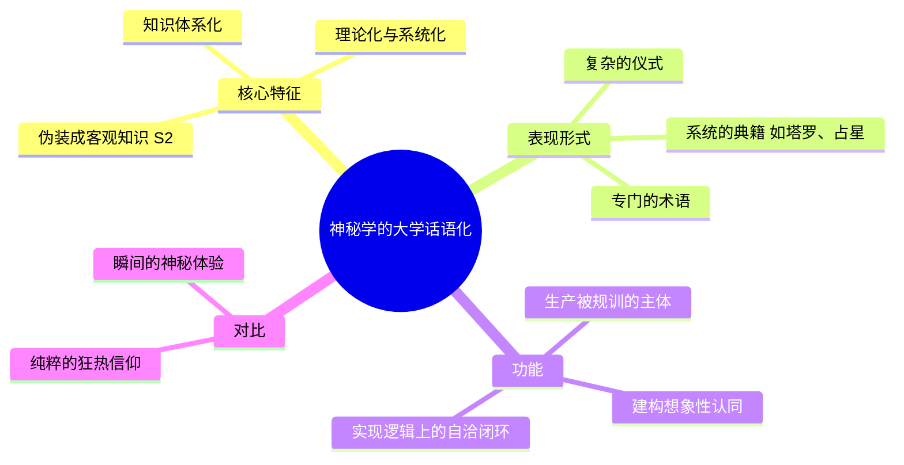
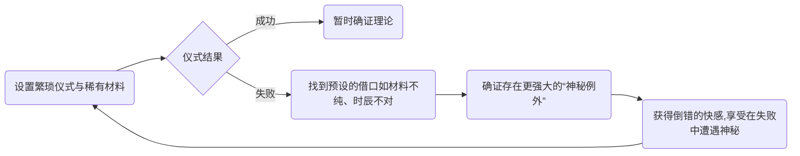
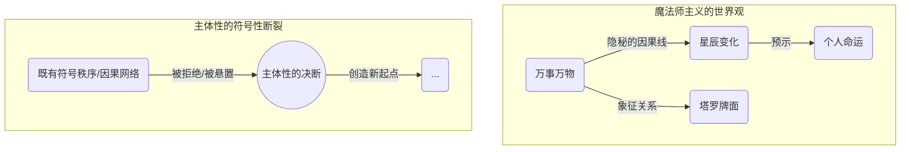

---
{"dg-publish":true,"permalink":"/1-2 宗教实在论/1-2-3 唯灵论/1-2-3-3 魔法师主义/","created":"2025-09-19T20:52:29.439+08:00","updated":"2025-09-22T22:20:39.655+08:00"}
---

### **一、本章概览**
- **主义主义编码**: 1-2-3-3
- **意识形态命名**: [[5 主义/魔法师主义\|魔法师主义]] 
- **核心论断**: [[5 主义/魔法师主义\|魔法师主义]]是一种小有产者知识分子的意识形态，它试图通过建构一套看似理性的“神秘科学”（如占星、塔罗），来调和超验世界与凡俗生活。其本质是一种自我伪装的、倒错化的[[9 未命名/癔症\|癔症]]，它迷恋于制造“普遍联系”的幻觉，从而逃避真正由[[主体性\|主体性]]带来的[[符号性断裂\|符号性断裂]]。
- **你能获得**:
    1.  理解 1-2-3-3 编码如何精确描述一种寻求“隐秘知识”的意识形态结构。
    2.  掌握运用[[9 未命名/精神分析\|精神分析]]工具（特别是[[9 未命名/癔症\|癔症]]与[[9 未命名/倒错\|倒错]]）诊断此类意识形态的方法。
    3.  辨析“普遍联系”的幻象与真实世界中“[[符号性断裂\|符号性断裂]]”的根本区别。
    4.  了解为何此类思想在特定的社会阶层（如[[小有产者\|小有产者]]）中具有吸引力。

---
### **二、核心内容解析**

#### **“主义主义”四格分析**

1.  **场域之“1” (Ontology)**：该意识形态预设的世界是一个由“[[大宇宙\|大宇宙]]”与“[[小宇宙\|小宇宙]]”构成的、无缝连接的统一整体。在这个[[存在论\|存在论]]框架下，万物皆有联系，一切现象都是某种更深层实在的“征兆”或“象征”。它不承认偶然或无意义的断裂，整个[[世界\|世界]]被想象成一个巨大的、充满隐秘因果网络的关系网。这种对[[普遍联系\|普遍联系]]的执着，构成了一个封闭且自洽的整全系统，任何事件都可以被回溯性地纳入这个网络，从而消解了真正的例外或断裂。

2.  **本体之“2” (Body)**：在这个统一的场域中，真实的存在分裂为二元对立的两极：一边是可见的、粗糙的“[[自然力\|自然力]]”（Natural Forces），即日常物理世界的规则；另一边则是不可见的、精微的“[[星辰之力\|星辰之力]]”（Astral Forces），即一种隐秘的、超验的、支配万物命运的神秘力量。这两者构成了世界的二元本体。[[5 主义/魔法师主义\|魔法师主义]]的核心实践，就是试图通过特殊知识去理解和操控后者，并让其作用于前者，这种显性与隐性力量的对抗构成了其[[世界\|世界]]运作的基本张力。

3.  **现象之“3” (Phenomenon)**：主体如何体验这个二元世界？是通过一个中介——一套被理论化的“[[神秘科学\|神秘科学]]”或“术”（The Art/Science of Magic）。这个中介调和了神圣维度（Divine）与日常维度（Daily）的对立。它不像纯粹的神秘主义那样依赖瞬间的、非理性的“合一体验”，而是模仿科学共同体，建构出一套可以学习、可以传承、有逻辑（尽管是伪逻辑）的[[大学话语\|大学话语]]。塔罗牌、占星术等体系就是这个中介的体现，它使得主体能够“理性地”感知和解释那个隐秘的[[星辰之力\|星辰之力]]，从而获得一种智识上的优越感。

4.  **目的之“3” (Purpose)**：该意识形态的[[9 未命名/目的论\|目的论]]同样由一个中介（“3”）来调和。它既不完全追求“[[长生主义\|长生主义]]”式的在世（Lingering），也不完全追求“[[回归主义\|回归主义]]”式的出世（Ascending）。魔法师（Magician）选择了一种半入世半出世的姿态：他需要一份世俗职业来维生，承认凡俗生活的价值；但同时又通过掌握隐秘知识，自认为活在一个更高的精神位面。其最终目的并非彻底的自我消解或永生，而是“改善”（Improve）：既提升自我的灵性，也试图以一种“高级顾问”的身份帮助或影响共同体，从而在这两种终极状态之间取得一种动态的、自洽的平衡。

#### **其他核心知识点**

##### “大学话语”化的神秘学
这种意识形态的核心特征，是将其神秘主义内核包装成一套系统的、可传授的知识体系，即[[拉康\|拉康]]意义上的[[大学话语\|大学话语]]。它不再是纯粹的信仰或狂热，而是建立起一套复杂的理论、术语、仪式和解释框架（如塔罗牌的牌阵、占星术的星盘），试图证明其知识的“合理性”与“深刻性”。这种做法的本质，是将一套基于想象性认同的信念，伪装成不容置疑的、客观的知识（S2），并在此基础上生产出主体（被规训的学生/信徒）。它通过无限扩充其解释工具（如引入“水逆”等新概念），使其解释力永远大于被解释的对象，从而达成一种“怎么说都有理”的逻辑闭环，这正是[[大学话语\|大学话语]]的典型特征。

**举例阐释**：现代流行的星座运势解读。它不仅仅是简单的“今天运气好”，而是发展出一整套关于行星位置、相位、宫位的复杂理论。解读时会使用“土星进入你的事业宫”、“水星逆行影响沟通”等专业术语，使其听起来像一门严谨的学科。这种“科学化”包装，使其能够吸引那些受过教育但又对主流话语不满的[[小有产者\|小有产者]]。

##### 倒错化的癔症
讲稿对[[5 主义/魔法师主义\|魔法师主义]]者的核心[[9 未命名/精神分析\|精神分析]]诊断是“[[9 未命名/倒错\|倒错]]化的[[9 未命名/癔症\|癔症]]”（Perverted Hysteria）。典型的[[9 未命名/癔症\|癔症]]者会不断追问“我是什么？”，并期待主人给出答案，但答案总会让他失望。而[[5 主义/魔法师主义\|魔法师主义]]者则更进一步：他们主动地、甚至享受地去扮演这个“求而不得”的角色。他们精心设计繁琐的仪式、寻找稀奇古物，其潜意识动机恰恰是为了给仪式的“失败”预留借口。每一次失败（如“材料不纯”、“时辰不对”），都反过来证明了“存在着某种更强大的神秘力量”，从而让他们在自己的无能中体验到一种倒错的快感。他们迷恋的不是成功，而是“失败”所揭示的那个“神秘例外”本身。

**举例阐释**：一个魔法师在进行召唤仪式时失败了。他不会质疑魔法本身，反而会兴奋地分析：“啊，是因为今晚月相不对，而且我用的羽毛里混入了一根黑色的，这是不祥之兆，说明有另一股力量在对抗我！” 这种将失败合理化并从中获得“洞见”的姿态，就是[[9 未命名/倒错\|倒错]]化[[9 未命名/癔症\|癔症]]的体现。

##### 普遍联系 vs. 符号性断裂
[[5 主义/魔法师主义\|魔法师主义]]建立在“[[普遍联系\|普遍联系]]”的信念之上，认为世界是一个符号和征兆的海洋，万物皆可解读。然而，讲稿指出，这恰恰是对真正断裂的回避。所有在图像层面（imaginary）的“魔法”——比如凭空打雷——一旦发生，就会立刻被符号系统（symbolic）收编，成为“自然规律”中一个之前未被发现的部分，从而丧失其超越性。真正的“魔法”并非图像的断裂，而是[[符号性断裂\|符号性断裂]]：即[[主体性\|主体性]]的决断。当主体以一种无根的、非理由的方式说出“我爱”或“我选择”时，这个行动无法被任何既有的因果网络或符号秩序完全解释，它创造了一个全新的起点。这才是唯一的、不可被还原的断裂。

**举例阐释**：对于[[爱情\|爱情]]，[[5 主义/魔法师主义\|魔法师主义]]会试图用星盘、血型等“[[普遍联系\|普遍联系]]”来解释“你们为什么会相爱”。而讲稿所强调的[[主体性\|主体性]]则认为，真正的[[爱情\|爱情]]事件是“我爱你，没有任何理由”（I love you, because I love you）。这个决断本身就是一种[[符号性断裂\|符号性断裂]]，它不服从任何外部的解释体系，它自己就是自己的原因。

---
### **三、关键观点提取**
- “他们这些人就认为真正的 great work，它不是这个[[世界\|世界]]本身，而是这里面有一条隐秘的灵性道路...可以让你通过这条道路可以获得这个自我超越的。”
- “我会把这种东西看成是种[[小有产者\|小有产者]]的，在不同的时代都会以这种方式连接起来，你去看吧，那些玩什么塔罗牌的，通通都是[[小有产者\|小有产者]]。”
- “归根结底他们是一种[[9 未命名/癔症\|癔症]]话语，但是它是一种自我遮掩的[[9 未命名/癔症\|癔症]]话语，自我伪装的...所以归根结底这东西是高度[[9 未命名/癔症\|癔症]]的。”
- “真正的断裂是[[符号性断裂\|符号性断裂]]...唯一的这个[[世界\|世界]]的魔法只有一个 is subjectivity（[[主体性\|主体性]]）。”
- “他以[[9 未命名/癔症\|癔症]]本身为享乐了...他把[[9 未命名/癔症\|癔症]]本身当成一种神秘的状态去追求，他追求[[9 未命名/癔症\|癔症]]，它实际上是一种[[9 未命名/倒错\|倒错]]。”

---
### **四、知识点问答**

#### Q: 为什么说[[5 主义/魔法师主义\|魔法师主义]]本质上是反迷信的，同时它自身又是一种更高级的“迷信”？
A: [[5 主义/魔法师主义\|魔法师主义]]自认为是反迷信的，因为它鄙视那些只知其然不知其所以然的民间巫术（low magic），并试图为神秘现象建立一套“理性”的[[大学话语\|大学话语]]。然而，这种“理性”是伪装的，它通过无限扩充解释工具来确保自身永不被证伪，其内核依然是一种对“[[普遍联系\|普遍联系]]”的非理性信仰。因此，它只是用一种系统化、理论化的“高级迷信”取代了朴素的、经验性的“低级迷信”，本质上仍是对[[符号性断裂\|符号性断裂]]的回避。

#### Q: “倒错化的癔症”如何体现在魔法师对仪式失败的态度上？
A: 魔法师通过设置极其复杂的仪式条件（如稀有材料、特定时辰），潜意识里已经为失败做好了准备。当仪式失败时，他不会感到挫败，反而会体验到一种[[9 未命名/倒错\|倒错]]的快感。因为“失败”恰好证明了存在一个他无法完全掌控的、强大的“神秘例外”，这让他得以享受在“无限接近真理但又求之不得”的[[9 未命名/癔症\|癔症]]状态中。失败不是终点，而是维持其[[9 未命名/癔症\|癔症]]式享乐的必要环节。

#### Q: 为何说[[主体性\|主体性]]的决断才是唯一的“魔法”？
A: 因为所有超自然现象，一旦在图像或现实层面发生，就会被现有的[[符号秩序\|符号秩序]]所解释和收编，从而失去其超越性（“它本来就是自然规律的一部分”）。而[[主体性\|主体性]]的决断，如无条件的[[爱情\|爱情]]或伦理行为，是唯一无法被任何既定因果网络完全解释的事件。它是一个纯粹的开端，一种“无中生有”的[[符号性断裂\|符号性断裂]]。这种创造新规则、自我立法的能力，才是讲稿语境下真正的、不可被还原的“魔法”。

---
### **五、知识延伸**
- **[[艾利法·列维\|艾利法·列维]]的著作 (如《高等魔法的教义与仪式》)**: 作为讲稿中提到的核心人物，直接阅读其原著是理解[[5 主义/魔法师主义\|魔法师主义]]思想源头和其“[[大学话语\|大学话语]]”建构方式的最佳途径。这构成了直接的**支持与参照**。
- **[[卡尔·荣格\|卡尔·荣格]]的“[[共时性\|共时性]]”理论**: 荣格提出的“[[共时性\|共时性]]”（Synchronicity）概念，即“有意义的巧合”，可以被视为[[5 主义/魔法师主义\|魔法师主义]]中“[[普遍联系\|普遍联系]]”信念在20世纪心理学中的一个精致变体。它试图为非因果性的连接提供理论基础，与魔法师的世界观高度相似，是极佳的**理论参照**。
- **[[拉康\|拉康]]的“[[四种话语\|四种话语]]”理论**: 讲稿明确使用了“[[大学话语\|大学话语]]”这一概念来剖析[[5 主义/魔法师主义\|魔法师主义]]。深入学习[[拉康\|拉康]]的四种话语（主人话语、大学话语、癔症话语、分析家话语），能更深刻地理解这种意识形态如何通过构建知识体系来行使权力、塑造主体，并与其他社会话语模式形成**批判性对比**。

---
## 双链关联总结
- **一级关联 (核心意识形态与概念)**: [[5 主义/魔法师主义\|魔法师主义]]、[[艾利法·列维\|艾利法·列维]]、[[普遍联系\|普遍联系]]、[[大学话语\|大学话语]]、[[9 未命名/倒错\|倒错]]、[[9 未命名/癔症\|癔症]]、[[主体性\|主体性]]、[[符号性断裂\|符号性断裂]]、[[大宇宙\|大宇宙]]、[[小宇宙\|小宇宙]]
- **推测相关人物 (Speculated Figures)**:
    - [[于吉\|于吉]]、[[张角\|张角]] (讲稿提及的中国古代人物，符合其社会动员特征)
    - [[卡尔·荣格\|卡尔·荣格]] (其“[[共时性\|共时性]]”和原型理论，可视为一种现代化的、心理学化的[[5 主义/魔法师主义\|魔法师主义]])
- **二级关联 (上下文与背景)**: [[5 主义/神秘主义\|神秘主义]]、[[隐秘学\|隐秘学]] (Occultism)、[[赫尔墨斯主义\|赫尔墨斯主义]]、[[9 未命名/精神分析\|精神分析]]、[[拉康\|拉康]]、[[小有产者\|小有产者]]、[[5 主义/社会主义\|社会主义]]
- **三级关联 (推测与延展)**: [[长生主义\|长生主义]]、[[回归主义\|回归主义]]、[[唯物论\|唯物论]]、[[爱情\|爱情]]、[[共时性\|共时性]]、[[四种话语\|四种话语]]