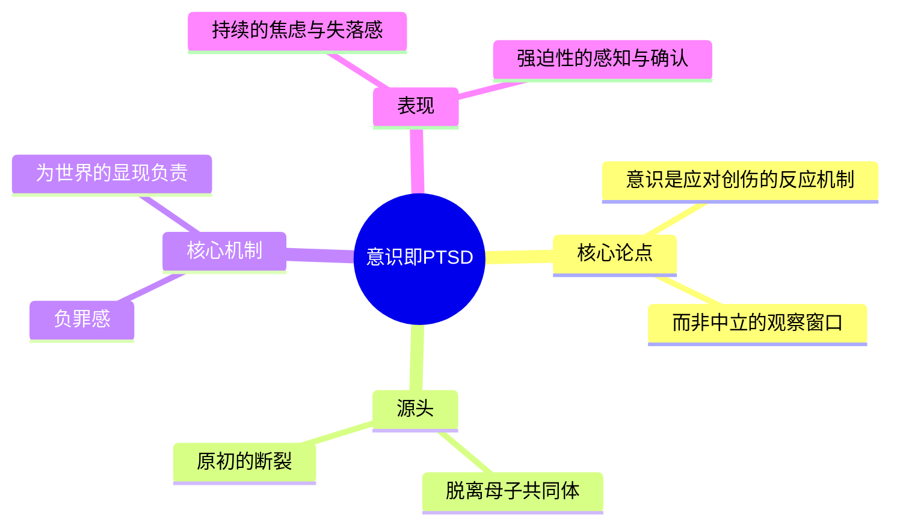
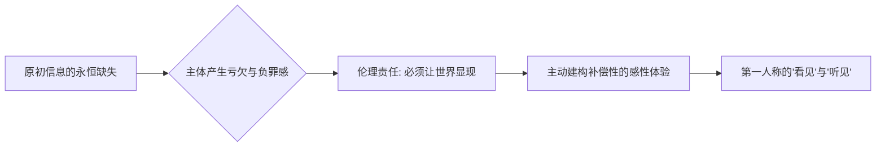
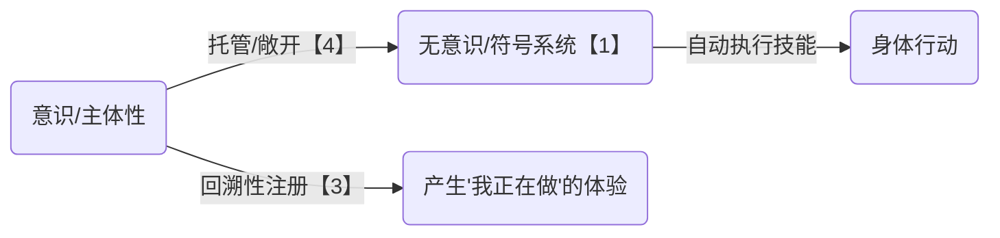

---
{"dg-publish":true,"permalink":"/1-2 宗教实在论/1-2-3 唯灵论/1-2-3-4 弃绝主义/","created":"2025-09-19T20:52:29.443+08:00","updated":"2025-09-22T22:20:38.590+08:00"}
---

### **一、本章概览**
- **主义主义编码**: 1-2-3-4
- **意识形态命名**: [[5 主义/弃绝主义\|弃绝主义]] / [[厌离主义\|厌离主义]] (Renunciation-ism)
- **核心论断**: 该意识形态是人类清醒[[意识\|意识]]本身的基本结构，它源于一种原初的[[创伤\|创伤]]。它通过将[[主体性\|主体性]]设立为调和“理想的[[连续\|连续]]”与“创伤性[[断裂\|断裂]]”的中心，来应对一个由[[语言\|语言]]和[[命运\|命运]]构成的封闭世界，但这一过程必然伴随着深刻的[[负罪感\|负罪感]]，最终导向一种开放性的、渴望从现有伦理关系中“消失”或解脱的姿态。
- **你能获得**: 你将理解未明子如何将人类的[[意识\|意识]]结构本身模型化为一种意识形态（1-2-3-4）。你将掌握[[负罪感\|负罪感]]是如何成为感知世界的核心驱动力，并了解为何说所有人的意识本质上都是一种[[创伤后应激障碍\|创伤后应激障碍]]（PTSD）的反应机制。此外，你还能洞悉这一结构在普通人学习技能和极端创伤者（如[[失独父母\|失独父母]]）寻求精神解脱时的具体运作方式。

---
### **二、核心内容解析**

#### **“主义主义”四格分析**

1.  **场域之“1” (Ontology)**：该意识形态预设的世界框架是一个统一、封闭且无法逃离的[[符号系统\|符号系统]]，它具体表现为[[语言\|语言]]或[[命运\|命运]]。这个场域是整全性的（1），意味着所有可能性和规则都已预先设定好，如同一个无法卸载的操作系统。对于身处其中的主体而言，这个世界是一个绝对的、背景性的“囚笼”，它规定了伦理关系、生命轨迹和意义的边界。主体的痛苦正源于这个宏大、无缝的秩序与其个体生命体验之间产生的剧烈冲突，而主体无力改变这个作为舞台的[[世界\|世界]]本身。

2.  **本体之“2” (Body)**：在这个由[[语言\|语言]]和[[命运\|命运]]构成的统一场域中，真实存在（本体）的东西被体验为两种绝对对立的力量：[[断裂\|断裂]]与[[连续\|连续]]。这构成了典型的二元对抗（2）。“[[连续\|连续]]”代表了世界本应有的美好、平顺的秩序，如家庭美满、生老病死的自然循环。“[[断裂\|断裂]]”则代表了创伤性的[[事件\|事件]]（Event），是突如其来的、破坏连续性的巨大打击，如亲人离世。这两种本体尖锐对立，无法调和，构成了主体内心最深刻、最痛苦的矛盾，世界被撕裂为“本该如此的理想”和“已然发生的惨剧”。

3.  **现象之“3” (Phenomenon)**：主体如何感知和体验这个分裂的世界？是通过一个中心化的中介（3）——[[主体性\|主体性]]或[[自我意识\|自我意识]]。当神圣的维度（对奇迹的渴望）与凡俗的维度（残酷的日常）发生冲突时，主体通过不断返回自身的[[意识\|意识]]来强行将两者缝合。这种返回是一种承担责任的姿态，主体将世界的[[断裂\|断裂]]归咎于自身，从而产生强烈的[[负罪感\|负罪感]]。正是这种负罪感，驱动着主体去感知、去体验，试图用自身的[[意识\|意识]]去连接那个已经破碎的世界。因此，所有第一人称的感知，本质上都是一种由[[负罪感\|负罪感]]驱动的伦理行为。

4.  **目的之“4” (Purpose)**：该意识形态最终导向一个开放性的目的（4），即“弃绝”（Renunciation）。在持续的痛苦和[[负罪感\|负罪感]]中，主体最终放弃了为世界赋予一个统一、确定的目标。目的论的维度被敞开，不再追求与至上之物合一或永生，而是追求从现有的伦理网络和[[符号系统\|符号系统]]中解脱、消失，如[[9 未命名/俄狄浦斯\|俄狄浦斯]]最后在克洛诺斯圣林中的神秘消失。这种敞开也体现在日常生活中，[[意识\|意识]]将自身变成一个通道，允许[[无意识\|无意识]]的冲动和习得的技能（如弹钢琴）自由涌现，而[[自我意识\|自我意识]]仅仅在事后追认这些行为是“我”做的，体现了一种对世界进程的“让位”。

#### **其他核心知识点**

##### 意识即创伤后应激障碍 (PTSD)
未明子在此提出一个颠覆性论断：人类清醒的[[意识\|意识]]结构，其本身就是一种[[创伤后应激障碍\|创伤后应激障碍]]（PTSD）的机制。它并非一个客观中立的观察窗口，而是为了应对一次原初的、已被遗忘的创伤——即从与母亲的完美共同体中[[断裂\|断裂]]出来的[[事件\|事件]]——而形成的防御和补偿系统。意识的运作，就是持续不断地处理这一根本性的“失落”（Loss）。因此，我们所有的清醒体验都伴随着一种底层的焦虑和[[负罪感\|负罪感]]，感觉自己搞砸了某种本应完美的东西。这种结构迫使我们不断地去感知、去确认、去为世界的显现“负责”，其本质是一种永恒的应激反应。

**举例阐释**：婴儿获得[[意识\|意识]]的过程就是最典型的例子。他从一个混沌圆满的全能感状态（在母体或母子共同体中）中被抛出，这个[[断裂\|断裂]]本身就是最大的创伤。他不知道自己错在哪里，而这种“不知道”本身就构成了他的“罪”。为了应对这种焦虑，他被迫发展出[[自我意识\|自我意识]]，开始区分主体与客体，并为自己的感知和体验负责，这整个过程就是PTSD机制的建立过程。

##### 主体性的伦理代价：负罪感驱动的感知
在1-2-3-4的结构中，感知并非一个被动的接收过程，而是一个主动的、带有伦理立场的建构行为，其核心驱动力是[[负罪感\|负罪感]]。讲稿中提到“只要有声音就有负罪感”，其深层含义是：我们之所以能听到声音、看到影像，是因为我们的[[意识\|意识]]结构对一个“原初信息的缺失”感到亏欠。我们听到的，永远不是那个“自在之物”发出的声音，而是我们因为“没能听到那个真实声音”而产生的补偿性建构。我们的[[主体性\|主体性]]通过承担这种“亏欠”的罪责，才将感官信息组织成有意义的体验。

**举例阐释**：[[心因性失明\|心因性失明]]的例子。一个癔症患者在生理结构完好的情况下“看不见”物体，就是因为其[[意识\|意识]]未能发起这种“伦理响应”。他没有产生那种“我必须为这个物体的显现而负责”的[[负罪感\|负罪感]]，因此感知机制被阻断。反过来说，我们能看见，恰恰是因为我们的[[意识\|意识]]不断在进行这种“有罪的”响应与建构。

##### 习得技能的托管机制
[[5 主义/弃绝主义\|弃绝主义]]的结构在非病理状态下，完美地解释了普通人学习和掌握技能（如弹琴、开车）的“沉浸”或“心流”状态。在这个过程中，主体（3）有意识地将控制权“托管”给背景性的[[符号系统\|符号系统]]（1），也就是我们的[[无意识\|无意识]]或肌肉记忆。目的论的维度（4）被敞开，允许身体和思维按照已内化的规则自动流淌，不受[[意识\|意识]]的逐帧干预。而[[自我意识\|自我意识]]则扮演着一个回溯性的“盖章者”，它不创造行为，但会持续地将这些自动涌现的行为确认为“我在做”，从而维持一种连贯的自我感觉。

**举例阐释**：一位熟练的钢琴家在演奏时，并不会思考“下一个音符该按哪里”。他的[[意识\|意识]]进入“托管”状态，让长期训练形成的身体记忆（[[符号系统\|符号系统]]的一部分）自然流淌。他的[[自我意识\|自我意识]]只是作为体验者，不断地确认“是我在演奏这首优美的曲子”，从而将[[断裂\|断裂]]的音符缝合成[[连续\|连续]]的乐章。

---
### **三、关键观点提取**
- “[[意识\|意识]]本身就是[[创伤\|创伤]]性的应激障碍（[[创伤后应激障碍\|创伤后应激障碍]]）。”
- “所有第一人称感觉都是一种[[负罪感\|负罪感]]的置换，但是这个负罪的机制就是不知道自己的罪是什么的一种罪。”
- “这个[[断裂\|断裂]]这个是意志性的事态的[[断裂\|断裂]]，是在这个[[世界\|世界]]本身断的。你要把这个[[断裂\|断裂]]咔咔到这个一字头，让它变成2，就有的玩了。”
- “意识本身是没有决定力的，要靠[[意志\|意志]]...他会把一些我内在的突发奇想的一种心血来潮的一些点子和想法注册到他的‘我想’这个话语的后面。”
- “[[9 未命名/俄狄浦斯\|俄狄浦斯]]其实就是人的[[自我意识\|自我意识]]象征。他的弑父娶母，就是说他从一种...符号系统在背景性的完全的主宰你的[[意识\|意识]]结构，你把它弑掉。”

---
### **四、知识点问答**
#### Q: 为什么在[[5 主义/弃绝主义\|弃绝主义]]（1-2-3-4）中，[[自我意识\|自我意识]]既是解决方案，又是痛苦的根源？
A: 在这个结构中，[[自我意识\|自我意识]]（3）是唯一的解决方案，因为它扮演了中介者的角色，强行将“理想的[[连续\|连续]]”（对美好生活的向往）和“创伤的[[断裂\|断裂]]”（无法接受的悲剧）这两个对立的本体（2）维系在一起，避免了主体精神的彻底崩溃。但它同时也是痛苦的根源，因为它维系统一的方式是将所有的[[断裂\|断裂]]都归咎于自身，即产生无尽的[[负罪感\|负罪感]]。主体为了维持世界的表面完整，选择用自身的痛苦去填补世界的裂痕。

#### Q: [[5 主义/弃绝主义\|弃绝主义]]最终导向的“消失”或“解脱”，和佛教的[[涅槃\|涅槃]]有何异同？
A: 两者都追求从痛苦的循环中解脱。其相似之处在于，都意识到现世的伦理关系和[[符号系统\|符号系统]]是痛苦的来源，都寻求一种“厌离”或“出离”。不同之处在于，[[5 主义/弃绝主义\|弃绝主义]]的解脱更具悲剧性和奇迹性色彩，如[[9 未命名/俄狄浦斯\|俄狄浦斯]]的神秘消失，它是一种对现有秩序的彻底弃绝，一种对[[命运\|命运]]的最终否定。而佛教的[[涅槃\|涅槃]]，尤其在大乘佛教中，更强调通过智慧勘破“[[无我\|无我]]”的真相，最终可能以“不住涅槃”的方式回到世间普度众生，它包含着一种转化而非单纯消失的维度。

#### Q: 讲稿提到这个结构可以被“1-2-4”的[[反偶像崇拜\|反偶像崇拜]]所扬弃，这意味着什么？
A: 这意味着一种潜在的“治疗”路径。[[5 主义/弃绝主义\|弃绝主义]]（1-2-3-4）的核心问题在于那个作为中介、承担一切[[负罪感\|负罪感]]的[[主体性\|主体性]]（3）。扬弃它的关键在于打破这个中心。转向[[反偶像崇拜\|反偶像崇拜]]（如1-2-4-4），意味着不再依赖一个中心化的自我或神圣偶像来拯救，而是直面世界本身的[[断裂\|断裂]]（2）和内在不可能性（现象之4），并接受一种循环往复但无中心的目的（目的之4）。这意味着将[[负罪感\|负罪感]]从“我”的责任，转移到对世界本身结构性矛盾的认识上，从而卸下伦理重负。

---
### **五、知识延伸**
- **[[索福克勒斯\|索福克勒斯]]的《[[俄狄浦斯在克洛诺斯\|俄狄浦斯在克洛诺斯]]》**: 这是理解[[5 主义/弃绝主义\|弃绝主义]]原型——[[9 未命名/俄狄浦斯\|俄狄浦斯]]——的必读文本。该剧详细描绘了这位盲眼流亡者在生命尽头如何拒绝一切城邦的伦理和政治要求，最终在复仇女神的圣林中神秘消失，完美诠释了“弃绝”的终极姿态。
- **[[拉康\|拉康]]的[[主体理论\|主体理论]]**: [[拉康\|拉康]]的思想为1-2-3-4结构提供了强大的理论支持。其[[符号界\|符号界]]（Symbolic）对应场域之“1”，[[实在界\|实在界]]（Real）的创伤对应本体之“2”的[[断裂\|断裂]]，而主体（$）本身就是一种分裂和缺失，其形成与原初的“阉割”和[[负罪感\|负罪感]]密不可分。这与讲稿中“意识即PTSD”的论断高度契合。
- **电影《[[亲爱的\|亲爱的]]》**: 讲稿中直接引用的案例。这部电影深刻地描绘了[[失独父母\|失独父母]]在遭遇巨大创伤后，其整个生活世界和[[主体性\|主体性]]是如何被这个[[断裂\|断裂]]性[[事件\|事件]]所重构的。他们所承受的痛苦、[[负罪感\|负罪感]]以及对日常生活的疏离感，是[[5 主义/弃绝主义\|弃绝主义]]在现实中最残酷的写照。

---
### **六、双链关联总结**
- **一级关联 (核心意识形态与概念)**: [[5 主义/弃绝主义\|弃绝主义]]、[[厌离主义\|厌离主义]]、[[1-2-3-4\|1-2-3-4]]、[[意识\|意识]]、[[主体性\|主体性]]、[[自我意识\|自我意识]]、[[负罪感\|负罪感]]、[[断裂\|断裂]]、[[连续\|连续]]、[[事件\|事件]]、[[创伤\|创伤]]、[[创伤后应激障碍\|创伤后应激障碍]]、[[语言\|语言]]、[[命运\|命运]]、[[符号系统\|符号系统]]
- **推测相关人物 (Speculated Figures)**:
  - [[9 未命名/俄狄浦斯\|俄狄浦斯]]: 该意识形态的文学原型，其一生完美演绎了从背负[[命运\|命运]]到最终“弃绝”世界的过程。
  - [[安提戈涅\|安提戈涅]]: 作为[[9 未命名/俄狄浦斯\|俄狄浦斯]]的女儿，她继承了这种弃绝的气质，拒绝世俗法则，坚持一种超验的伦理原则，直至死亡。
  - [[失独父母\|失独父母]] (作为一种社会形象): 讲稿中用以说明极端创伤如何将人推入此意识形态的现实范例，他们的存在本身就是对社会“连续性”神话的[[断裂\|断裂]]。
- **二级关联 (上下文与背景)**: [[9 未命名/精神分析\|精神分析]]、[[拉康\|拉康]]、[[古希腊悲剧\|古希腊悲剧]]、[[索福克勒斯\|索福克勒斯]]、[[存在论\|存在论]]、[[9 未命名/现象学\|现象学]]、[[9 未命名/伦理学\|伦理学]]
- **三级关联 (推测与延展)**: [[心因性失明\|心因性失明]]、[[癔症化\|癔症化]]、[[无我论\|无我论]]、[[涅槃\|涅槃]]、[[宿命论\|宿命论]]、[[反偶像崇拜\|反偶像崇拜]]、[[意志\|意志]]、[[无意识\|无意识]]