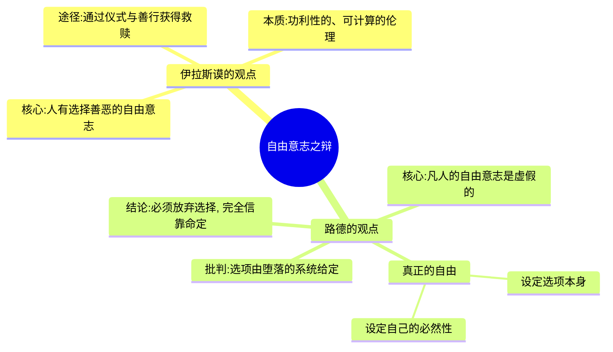
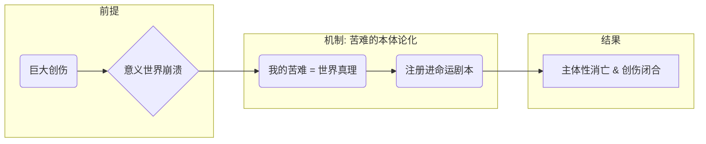
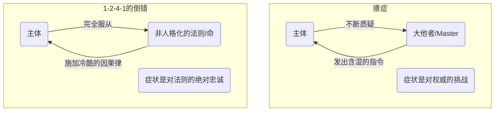

---
{"dg-publish":true,"permalink":"/1-2 宗教实在论/1-2-4 反偶像崇拜/1-2-4-1 神学命定论/","created":"2025-09-19T20:52:29.451+08:00","updated":"2025-09-22T21:57:48.043+08:00"}
---

### **一、本章概览**
- **主义主义编码**: 1-2-4-1
- **意识形态命名**: [[神学命定论\|神学命定论]] (Theological Fatalism)
- **核心论断**: 该意识形态是一种在巨大创伤后形成的防御机制，主体通过彻底放弃[[自由意志\|自由意志]]，将自身无法承受的苦难理解为一种神圣、预定的文本（[[盛典\|盛典]]）中的必然情节，从而将自身的毁灭转化为一种符号化的“注册”，实现一种去主体化的闭合。
- **你能获得**:
    - 理解[[神学命定论\|神学命定论]]如何通过“命定”框架来处理极端创伤。
    - 掌握1-2-4-1编码下，场域、本体、现象、目的四个维度的具体运作方式。
    - 辨析[[路德\|路德]]式的“无自由意志”论与[[伊拉斯谟\|伊拉斯谟]]的“自由意志”论的核心分歧。
    - 洞察这种意识形态在文学（如[[祥林嫂\|祥林嫂]]）和现实生活中的具体体现。

---
### **二、核心内容解析**

#### **“主义主义”四格分析**

1.  **场域之“1” (Ontology)**：在此意识形态中，整个[[世界\|世界]]被预设为一个统一、封闭且完全被书写好的剧本或神圣文本，即“[[盛典\|盛典]]”。这个场域是整全且无缝的，不存在任何外在于这个“命定”秩序的可能性。所有事件，尤其是个人的重大经历，都只不过是这个宏大文本中早已被注册好的一行字。这种[[存在论\|存在论]]框架抹杀了任何偶然性和真正的创造性，万事万物都遵循一个僵死、唯一的因果律，这个律法就是“命”本身。它不是一个开放的舞台，而是一个早已完成、只待被动上演的封闭剧场。

2.  **本体之“2” (Body)**：世界的核心[[实在\|实在]]由一个不可调和的二元对立构成：一边是个人无法承受的、赤裸的苦难与创伤；另一边是一个冷漠、无力、甚至“蛇皮的”超越性主宰。与传统宗教不同，这里的神无法提供慰藉或救赎。因此，真正具有本体论优先地位的，反而是主体的“苦命”本身。个体的悲剧、痛苦和驯服被提升为这个世界上最真实、最核心的内容，它直接构成了世界的真相。这种对立使得任何通过善行或仪式与神“讨价还价”的尝试都变得毫无意义。

3.  **现象之“4” (Phenomenon)**：主体性在此处被彻底“拆解”和“去主体化”，呈现为一个内在的空洞或虚无。数字“4”不代表开放的可能性，而是代表[[主体性\|主体性]]的坍缩和失守。主体不再拥有反思性的自我意识或[[自由意志\|自由意志]]，无法做出任何有意义的决断。所有的感知和体验都变成对“命定”秩序的被动承受。祥林嫂的喃喃自语“我真傻，真的”就是这种状态的写照：她不再是一个能主动叙述自己故事的主体，而只是一个重复播放创伤的留声机，其自我意识已被创伤彻底贯穿和掏空。

4.  **目的之“1” (Purpose)**：该意识形态的[[9 未命名/目的论\|目的论]]与场域论发生了“短路”。由于世界本身就是一个封闭循环的命定剧本，其最终目的无非就是让这个剧本原封不动地演下去。所谓的终极目标，就是被动地承受、确认并完成这个命定的因果链条。它不导向任何新的状态或超越性的救赎，只导向对现有秩序的无限确认。用讲稿的话说，就是让这个“僵死的因果性秩序”不断循环。对个体而言，终极目的就是成为这个剧本中一个悲惨的符号，从而在符号层面上获得一种虚假的永恒。

#### **其他核心知识点**

##### 路德式的“无自由意志”论
在[[马丁·路德\|马丁·路德]]看来，[[伊拉斯谟\|伊拉斯谟]]所倡导的“人有[[自由意志\|自由意志]]在善恶间做选择”本身就是一种堕落。因为这些选项并非由人自己设定，而是在一个已然堕落的符号系统内被给予的。真正的[[自由\|自由]]并非在A与B之间选择，而是设定A与B这两个选项本身的能力，甚至更进一步，是“设定自己的必然性”——将内在偶然萌生的决断，回溯性地确认为不可动摇的必然。因此，在1-2-4-1的框架下，任何凡俗的功利性算计和选择都被视为对神圣秩序的亵渎，唯一的出路是彻底放弃选择的幻觉，完全相信一切皆由命定。

**举例阐释**：当你面前有两个工作机会让你选择，这并非真正的[[自由\|自由]]。真正的[[自由\|自由]]是能够创造出第三个、完全属于你自己的选项，并有能力宣告“这就是我的必然道路”，无论它在别人看来多么偶然或不理性。

##### 作为世界真相的“苦难本体论”
[[神学命定论\|神学命定论]]的一个核心机制，是将个体无法消化的巨大创伤（如[[祥林嫂\|祥林嫂]]丧子之痛）从一个偶然的、无意义的事件，提升为具有本体论地位的世界真相。个体的苦难不再是“我的”不幸，而是“世界”本然的悲剧性法则的体现。通过这种方式，主体将自己的苦命“注册”到宏大的[[盛典\|盛典]]（命运剧本）之中，使痛苦获得了某种符号性的“意义”和位置。这种“自我驯服”的过程伴随着一种痛楚的快感，即“我虽然毁灭了，但我的毁灭是这个世界真理的一部分”，从而在绝望中找到一个闭合的支点。

**举例阐释**：[[祥林嫂\|祥林嫂]]在反复诉说阿毛的故事时，她已经不是在寻求他人的理解或同情，而是在进行一种仪式：通过不断重述，她将自己的创伤确认为一个永恒不变的事实，一个构成了她生命乃至世界本质的“硬核”，这是她唯一剩下的[[实在\|实在]]。

##### 去癔症化的倒错
讲稿指出，1-2-4-1是一种“去[[9 未命名/癔症\|癔症]]化”的[[9 未命名/倒错\|倒错]]。[[9 未命名/癔症\|癔症]]主体的特点是不断质疑大他者（“你到底想要我怎样？”），其症状是对权威的挑战。而1-2-4-1的[[9 未命名/倒错\|倒错]]则完全相反，它不质疑，而是彻底认同并服务于一个非人格化的、如机器般冷酷的法则（“命”）。它不寻求与一个活生生的、有人格的主宰建立关系，反而迷恋那些“去人格化”的物。这种姿态体现为一种反偶像崇拜的恋物癖，因为人格化的神可能带来不确定性，而无生命的、遵循因果律的秩序才是绝对可靠的。

**举例阐释**：讲稿中提到“泥塑的比活人亲，木头做的比砖头做的亲”。这意味着，对于一个深陷1-2-4-1意识形态的人来说，一个没有生命、不会回应、仅仅代表着“命定”秩序的泥塑神像或木头棺材，比一个活生生的、会说话、有人格的人更值得信赖和亲近。因为前者是纯粹法则的化身，而后者充满了不确定的欲望和变数。

---
### **三、关键观点提取**
- “真正的[[自由\|自由]]甚至都不是给出自己的选项，而是设定自己的必然性。”
- “他把自己的苦命是放在[[存在论\|存在论]]上高的那那边的...把自己的苦难是注册在[[存在论\|存在论]]上优先的那一部分的。”
- “这是一个去[[9 未命名/癔症\|癔症]]化的一种[[9 未命名/倒错\|倒错]]。在在现代社会里面很少在看这种，但是在农业时代是大量的会出现这种的。”
- “对于1-2-4-1的人来说，泥塑的比活人亲...因为它去人格化，他对大他者去人格化。”

---
### **四、知识点问答**
#### Q: 在1-2-4-1的[[神学命定论\|神学命定论]]中，为何超越性的“主宰”是无力的，而“命”却拥有至高无上的权力？
A: 因为该意识形态的根源是处理无法被既有神学框架解释的极端[[创伤\|创伤]]。一个人格化的“主宰”意味着可以沟通、祈求甚至讨价还价，但这在巨大的、无意义的苦难面前会显得虚假和无力。因此，系统将权力赋予一个非人格化的、如同[[物理法则\|物理法则]]一样的“[[命\|命]]”或“[[盛典\|盛典]]”。这个“命”是冷酷、绝对且不可违抗的，它恰恰能解释那种无情的苦难。主宰的无力化，正是为了衬托出这个命定秩序的绝对性和不可撼动性。

#### Q: 为什么说1-2-4-1是一种“防御性机制”，而不是一种主动的哲学选择？
A: 因为它的形成逻辑并非始于思辨，而是源于心理创伤。当主体遭遇的痛苦超出了其意义系统的承受极限时（如[[祥林嫂\|祥林嫂]]的经历），原有的[[主体性\|主体性]]会面临崩溃。1-2-4-1通过将这种毁灭性的偶然事件重新编码为“命中注定”，为即将崩溃的自我提供了一个最终的、虽然是负面的秩序。它以放弃[[自由意志\|自由意志]]和消解自我为代价，换取了创伤的“闭合”和一种符号层面的安宁，因此它本质上是一种为了避免彻底精神崩溃而采取的不得已的心理策略。

#### Q: 讲稿中提到1-2-4-1可以作为动员“兵源”的工具，这与其被动、认命的特性是否矛盾？
A: 表面看似矛盾，实则不然。处于1-2-4-1状态的个体虽然自身是消极认命的，但他们已经放弃了个人意志，完全服从于那个他们认定的“[[盛典\|盛典]]”或“天命”。这时，如果有一个强大的外部行动者（如[[路德\|路德]]或闵采尔）成功地将自己定义为这个“[[盛典\|盛典]]”的解释者和执行者，那么这些个体就会毫无保留地追随。他们行动的动力不是来自个人欲望，而是来自对“天命”的绝对服从。他们变成了最理想的工具，因为他们不计个人得失，只为执行那个被告知的、命中注定的神圣任务。

---
### **五、知识延伸**
- **[[斯多葛主义\|斯多葛主义]] (Stoicism)**: 作为一个参照系，[[斯多葛主义\|斯多葛主义]]也强调接受命运（Amor Fati），但它强调通过理性来保持内心的德性与安宁，主体依然是积极和在场的。而1-2-4-1则是主体性被彻底掏空后的被动承受，是一种更绝望的姿态。
- **[[5 主义/加尔文主义\|加尔文主义]]的预定论 (Calvinist Predestination)**: 这是一个强有力的支持性理论。加尔文主义的核心教义“预定论”认为，一个人是否得救完全由上帝预先决定，与个人行为无关。这与1-2-4-1中放弃个人努力、完全相信命运安排的逻辑高度相似，都取消了人通过[[自由意志\|自由意志]]进行自我救赎的可能性。
- **鲁迅的《[[祝福\|祝福]]》**: 本讲稿多次提及的[[祥林嫂\|祥林嫂]]正是出自此作品。这篇小说是体验和理解1-2-4-1意识形态下个体悲剧的绝佳文本，它生动地展示了一个人在连续的社会和家庭创伤下，如何一步步丧失[[主体性\|主体性]]，最终被“命定”的叙事所吞噬。

---
### **六、双链关联总结**
- **一级关联 (核心意识形态与概念)**: [[神学命定论\|神学命定论]]、[[无自由意志\|无自由意志]]、[[盛典\|盛典]]、[[苦难本体论\|苦难本体论]]、[[去癔症化的倒错\|去癔症化的倒错]]、[[自我驯服\|自我驯服]]
- **推测相关人物 (Speculated Figures)**: [[祥林嫂\|祥林嫂]] (被创伤吞噬的典型)、[[约伯\|约伯]] (圣经中承受无故苦难并与神对峙的形象)、[[马丁·路德\|马丁·路德]] (作为该意识形态的理论构建者与使用者)
- **二级关联 (上下文与背景)**: [[宗教改革\|宗教改革]]、[[基督教神学\|基督教神学]]、[[伊拉斯谟\|伊拉斯谟]]、[[巴迪欧\|巴迪欧]]、[[保罗\|保罗]]、[[存在论\|存在论]]、[[9 未命名/现象学\|现象学]]、[[9 未命名/目的论\|目的论]]
- **三级关联 (推测与延展)**: [[斯多葛主义\|斯多葛主义]]、[[5 主义/加尔文主义\|加尔文主义]]、[[预定论\|预定论]]、[[创伤\|创伤]]、[[防御机制\|防御机制]]、[[主体性\|主体性]]、[[9 未命名/癔症\|癔症]]、[[9 未命名/倒错\|倒错]]、[[自由\|自由]]、[[必然性\|必然性]]