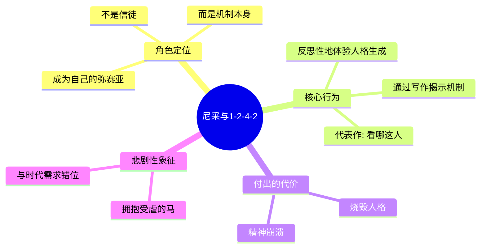
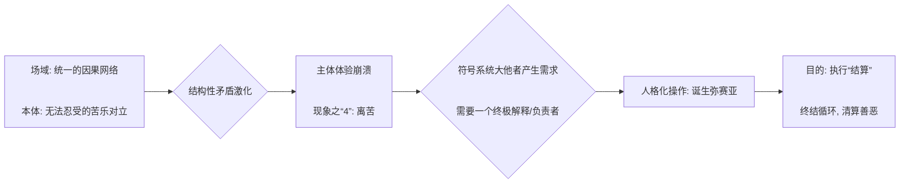
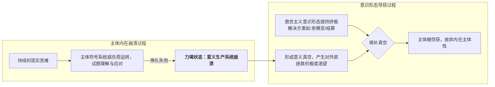

---
{"dg-publish":true,"permalink":"/1-2 宗教实在论/1-2-4 反偶像崇拜/1-2-4-2 救世主义/","created":"2025-09-19T20:52:29.454+08:00","updated":"2025-09-22T22:20:35.510+08:00"}
---

### **一、本章概览**
- **主义主义编码**: 1-2-4-2
- **意识形态命名**: [[救世主义\|救世主义]] (Messianism)
- **核心论断**: [[救世主义\|救世主义]]是一种源于极度痛苦与社会崩坏的意识形态。它预设了一个统一的[[善恶二元论\|善恶二元论]]舞台，将现实分裂为“沉沦的苦难”与“超越性拯救”两大对立本体。主体在此体验到的是前语言的、几乎是生物本能式的“[[离苦\|离苦]]”渴望，最终导向一个二元对立的结局：要么永陷命定循环，要么由一位[[弥赛亚\|弥赛亚]]式人物进行终极“[[结算\|结算]]”。
- **你能获得**: 通过本笔记，你将掌握对[[救世主义\|救世主义]]意识形态的“主义主义”诊断框架，理解其如何从场域、本体、现象到目的环环相扣。你将深入了解[[尼采\|尼采]]与此意识形态的复杂关系、[[人格化\|人格化]]作为核心心理机制的运作方式，并警惕这种结构在现实中为极权主义者铺路的危险。

---
### **二、核心内容解析**

#### **“主义主义”四格分析**

1.  **场域之“1” (Ontology)**：该意识形态的世界观框架是一个统一且封闭的[[因果网络\|因果网络]]，其核心主题是善与恶的宏大斗争。虽然表现为[[善恶二元论\|善恶二元论]]，但其[[存在论\|存在论]]底色是“1”，因为善恶双方都是在这个唯一的、整全的、有内在规律的宇宙舞台上进行表演。无论是[[琐罗亚斯德教\|琐罗亚斯德教]]中的至高智慧主宰[[阿胡拉·马兹达\|阿胡拉·马兹达]]，还是其他体系中的唯一创世神，都设定了一个绝对的、包罗万象的背景秩序。在这个秩序中，一切苦难与奖赏都被认为是有因果的，整个世界是一个巨大的、等待最终清算的道德记账本。

2.  **本体之“2” (Body)**：在这个统一的舞台上，真实存在的事物被清晰地划分为二元对立的两极。一方是“在场的”，即充满痛苦、罪恶、欲望与苦难的凡俗世界，讲稿中将其生动地描述为“泥泞之中”或“烈火当中”的[[沉沦\|沉沦]]状态。另一方则是“超越的”，即能够带来拯救、解脱与终结痛苦的光明力量，是一种[[罪与赎\|罪与赎]]结构中的“赎”的力量。这种划分不是温和的，而是极端的、你死我活的。对于被此意识形态俘获的主体而言，世界的内容只有这两样：要么是无法忍受的现实，要么是唯一值得期盼的拯救。

3.  **现象之“4” (Phenomenon)**：主体在此结构中的感知体验是崩溃和无效的。数字“4”代表了主体性的内在分裂与虚无。讲稿指出，此时的认识论只剩下两个字：“[[离苦\|离苦]]”。这意味着所有复杂的感知、理性的反思、美学的体验都已失效，主体被还原为一种前符号学的、生物本能式的求生欲。这种体验是“最低限度的体验”，是意识结构被巨大痛苦击穿后的残余。它不再建构世界，只是绝望地在世界中寻找一个出口，这个出口本身就是虚无的、不可能的，因而构成了“4”的特征。

4.  **目的之“2” (Purpose)**：该意识形态的[[9 未命名/目的论\|目的论]]也呈现为尖锐的二元对立。世界的运动导向两种截然不同的结局。其一是“命定的循环”，即[[因果网络\|因果网络]]的无限重复，主体在其中永恒地承受痛苦，这是一种没有希望的、被动的状态。其二则是“[[结算\|结算]]”，即由一个[[弥赛亚\|弥赛亚]]式的角色降临，强行终止这个循环，对整个世界的善恶、苦乐进行一次总清算。这个“[[结算\|结算]]”是所有被俘获者翘首以盼的终极事件，代表着一种主动的、打破现状的决断。最终的目的就在于从这两种命运中做出选择或等待被选择。

#### **其他核心知识点**

##### 尼采的献祭式扮演
讲稿深刻地指出，晚年的[[尼采\|尼采]]并非简单地被[[救世主义\|救世主义]]俘获，而是将自身“装配”成了这一意识形态机制本身。他不是信徒，而是试图成为那个被众人崇拜的[[弥赛亚\|弥赛亚]]。通过撰写《[[看哪这人\|看哪这人]]》等著作，尼采以一种反思性的、哲学化的方式，去直面和戳穿人格诞生的[[前符号学\|前符号学]]机制。这种行为的代价是巨大的：他献祭了自己的人格（Personality），烧毁了自我意识的根基，最终精神崩溃。他拥抱一匹被抽打的马，是他只能找到的唯一一个具体的“被拯救者”，这既是其伟大的悲剧，也是其与时代错位的明证。他用自身的疯狂，为我们揭示了1-2-4-2结构在最深层次上的运作逻辑。

**举例阐释**：当尼采写下“我为什么如此聪明？”、“我为什么能写出这么好的书？”时，他正是在用一种极度清醒的理性去勘探那个非理性的、诞生出“我”这个[[位格\|位格]]的深渊。这种“反思”行为本身就像一个程序试图删除自己的底层驱动，最终导致了系统的崩溃，即他的疯狂。

##### “结算”机制与弥赛亚的诞生
“[[结算\|结算]]”（算账）是[[救世主义\|救世主义]]的核心驱动力。当现实的痛苦（本体之“2”）和主体的崩溃（现象之“4” ）达到极限时，那个统一的[[因果网络\|因果网络]]（场域之“1”）就显得不再自洽。为了解决这种矛盾，符号系统（[[9 未命名/大他者\|大他者]]）被迫进行一次“[[人格化\|人格化]]”操作：它分裂出一个“儿子”，即[[弥赛亚\|弥赛亚]]，来承担[[结算\|结算]]的使命。这个[[弥赛亚\|弥赛亚]]是一个负责者，他的出现为无意义的苦难赋予了终极的意义和目的。因此，[[弥赛亚\|弥赛亚]]并非凭空出现，而是这个意识形态结构为了维持自身逻辑闭环而必然产生的符号学功能位。

**举例阐释**：中国历史上的多次农民起义，常会推出一个“真命天子”或“弥勒降世”的形象。这个形象就是“[[结算\|结算]]”机制的[[人格化\|人格化]]体现。当百姓的苦难达到顶点，现存秩序无法提供任何解释时，“木子弓口，应谶而生”这样的谶语便创造出一个[[弥赛亚\|弥赛亚]]，为颠覆旧秩序、清算旧账提供了合法性。

##### 力竭状态与意识形态俘获
讲稿强调，1-2-4-2意识形态的产生并非源于智力选择，而是源于一种深刻的“[[力竭\|力竭]]”（Exhaustion）状态。当个体或群体的物质与精神资源被彻底耗尽，其固有的符号系统无法再正常运转时，他们就最容易被[[救世主义\|救世主义]]所俘获。这是一种失败和无力的状态，主体因为“太痛苦了”而放弃了复杂的思考和感知，转而寻求一个简单、彻底、外部的解决方案。[[力竭\|力竭]]是主体性防线的崩溃，为[[救世主义\|救世主义]]这种高强度的、许诺终极拯救的意识形态打开了方便之门。

**举例阐释**：义和团运动中的许多参与者，如“红灯照”的大师兄、大师姐，他们并非出于深思熟虑的政治纲领，而是在面对传统社会崩解和外来侵略的双重压力下，陷入了集体性的[[力竭\|力竭]]状态。此时，“刀枪不入”、“神仙下凡”等[[救世主义\|救世主义]]叙事，便成为他们唯一的精神寄托和行动指南。

---
### **三、关键观点提取**
- “尼采他基本上已经把自己装配成这么一个1-2-4-2本这个主义本身...他却只能拯救一匹马，拯救一匹被主人抽打的马，然后扑上去哭，然后就精神崩溃了。”
- “[[弥赛亚\|弥赛亚]]其实是个结算者，结算者过来算账，小二过来算账。”
- “这个机制装配在这边，就使得你具有[[人格化\|人格化]]...大他者二分出一个他的儿子。这个儿子就是作为[[弥赛亚\|弥赛亚]]为一切做结算，为一切这种不一致性负责，就是一个负责者。”
- “这种你张出这个空间只能被...极右翼所所利用，这是绝对错误的...你张出这个空间只能被只能产生出[[希特勒\|希特勒]]了。”
- “尼采晚期[[力竭\|力竭]]了，是那红灯照大婶儿大叔他[[力竭\|力竭]]了，他太痛苦[[力竭\|力竭]]了，她的符号系统转不周了，我们是要避免[[力竭\|力竭]]。”

---
### **四、知识点问答**

#### Q: 为什么讲稿强调[[救世主义\|救世主义]]的场域是“1”（统一）而非“2”（对立），尽管其核心是[[善恶二元论\|善恶二元论]]？
A: 因为善恶的对立是在一个被预设为统一、封闭且有终极意义的[[世界\|世界]]舞台（即场域之“1”）上展开的。这个统一的场域（如[[琐罗亚斯德教\|琐罗亚斯德教]]的至高神或一个绝对的[[因果网络\|因果网络]]）保证了斗争不是无意义的混乱，而是有目的、有规律、最终可以被“[[结算\|结算]]”的宇宙大戏。二元对立是舞台上的“内容”（本体之“2”），而舞台本身是单一的、整全的。

#### Q: [[现象\|现象]]之“4”（内在崩溃）与[[目的\|目的]]之“2”（终极审判）之间有何内在联系？
A: [[现象\|现象]]之“4”描述了主体因极端痛苦而导致的内在结构崩溃，体验只剩下纯粹的“[[离苦\|离苦]]”本能。这种内在的虚无和不可能性，使得主体无法依靠自身来解决困境。因此，它必然向外投射出一个绝对的、二元对立的解决方案（[[目的\|目的]]之“2”）：要么在现有秩序中毁灭，要么被一个外在的[[弥赛亚\|弥赛亚]]彻底拯救并进行“[[结算\|结算]]”。“4”的内在绝境，催生了对“2”的终极外部裁决的渴望。

#### Q: 讲稿为何严厉警告“这个时代不需要[[尼采\|尼采]]”，并认为敞开这个[[弥赛亚\|弥赛亚]]空间是极度危险的？
A: 因为[[救世主义\|救世主义]]（1-2-4-2）的结构本身创造了一个“救世主”的符号学空位。[[尼采\|尼采]]作为一个哲学家，以悲剧性的方式占据并揭示了这个位置。但在现实政治中，这个空位极易被野心家和煽动者（如[[希特勒\|希特勒]]）所占据。他们利用民众在[[力竭\|力竭]]状态下的“[[离苦\|离苦]]”渴望，将自己扮演成[[弥赛亚\|弥赛亚]]，最终引导集体走向毁灭性的狂热。因此，敞开这个空间，无论初衷多么悲壮，客观上都是在为极右翼和法西斯主义铺路。

---
### **五、知识延伸**
- **[[约伯记\|约伯记]] (Book of Job)**: 这部《圣经》中的文本是探讨1-2-4-2结构的绝佳材料。约伯作为一个无辜的受苦者，他的经历直接挑战了善恶终有报的简单[[因果网络\|因果网络]]，并向上帝发出了“凭什么”的质问，这本身就是一种对“[[结算\|结算]]”的原始呼唤，深刻体现了在统一神圣秩序下的个体苦难问题。
- **陀思妥耶夫斯基《[[卡拉马佐夫兄弟\|卡拉马佐夫兄弟]]》中的“宗教大法官”章节**: 这一章节是[[救世主义\|救世主义]]的深刻文学寓言。大法官批判重返人间的基督，认为人类在[[力竭\|力竭]]状态下承受不了自由之重，宁愿交出自由以换取奇迹、神秘和权威。这精准地揭示了大众渴望被拯救、渴望一个强力[[弥赛亚\|弥赛亚]]来终结痛苦与混乱的集体心理。
- **[[9 未命名/瓦尔特·本雅明\|瓦尔特·本雅明]]的“历史哲学论纲”**: 本雅明的“历史天使”和“弥赛亚时间”概念，提供了一种与讲稿中批判的[[救世主义\|救世主义]]形成参照和对比的革命性思想。本雅明的[[弥赛亚\|弥赛亚]]并非一个具体的降临者，而是一种断裂性的历史时刻，是受压迫者抓住机遇、炸开历史连续统的革命行动，这为我们思考“拯救”提供了另一种非人格化、更具政治能动性的路径。

---
### **六、双链关联总结**
- **一级关联 (核心意识形态与概念)**: [[救世主义\|救世主义]]、[[弥赛亚\|弥赛亚]]、[[结算\|结算]]、[[离苦\|离苦]]、[[人格化\|人格化]]、[[力竭\|力竭]]、[[因果网络\|因果网络]]、[[善恶二元论\|善恶二元论]]、[[沉沦\|沉沦]]、[[罪与赎\|罪与赎]]
- **推测相关人物 (Speculated Figures)**: [[希特勒\|希特勒]] (讲稿明确提及，是占据弥赛亚空位的负面典型)、[[朱元璋\|朱元璋]] (从极度苦难中崛起的底层形象，符合力竭背景)、[[唐·吉诃德\|唐·吉诃德]] (一个错位的、以悲喜剧形式扮演救世角色的文学形象)、[[洪秀全\|洪秀全]] (一个将基督教弥赛亚叙事与本土结合，发动大规模运动的历史人物)
- **二级关联 (上下文与背景)**: [[欧陆哲学\|欧陆哲学]]、[[9 未命名/精神分析\|精神分析]]、[[尼采\|尼采]]、[[看哪这人\|看哪这人]]、[[琐罗亚斯德教\|琐罗亚斯德教]]、[[摩尼教\|摩尼教]]、[[基督教\|基督教]]、[[道教\|道教]]、[[主体性\|主体性]]、[[位格\|位格]]
- **三级关联 (推测与延展)**: [[9 未命名/大他者\|大他者]]、[[9 未命名/符号学\|符号学]]、[[前符号学\|前符号学]]、[[穿越幻想\|穿越幻想]]、[[9 未命名/目的论\|目的论]]、[[存在论\|存在论]]、[[约伯记\|约伯记]]、[[卡拉马佐夫兄弟\|卡拉马佐夫兄弟]]、[[9 未命名/瓦尔特·本雅明\|瓦尔特·本雅明]]