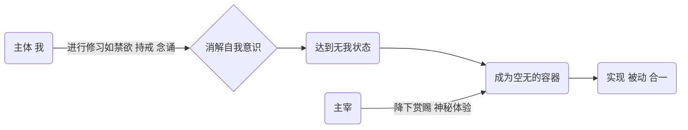
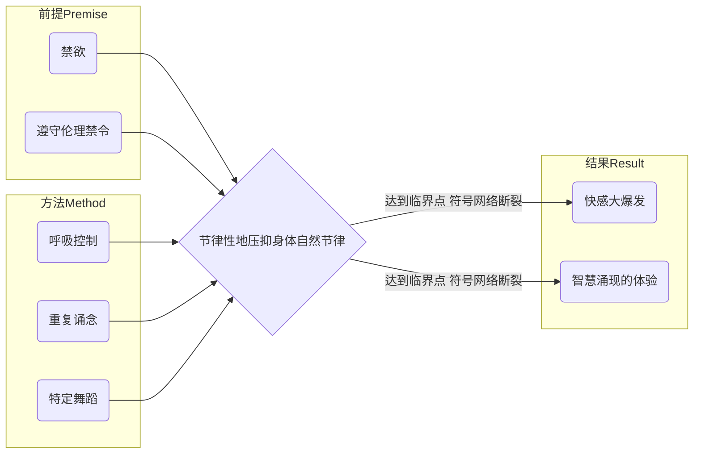
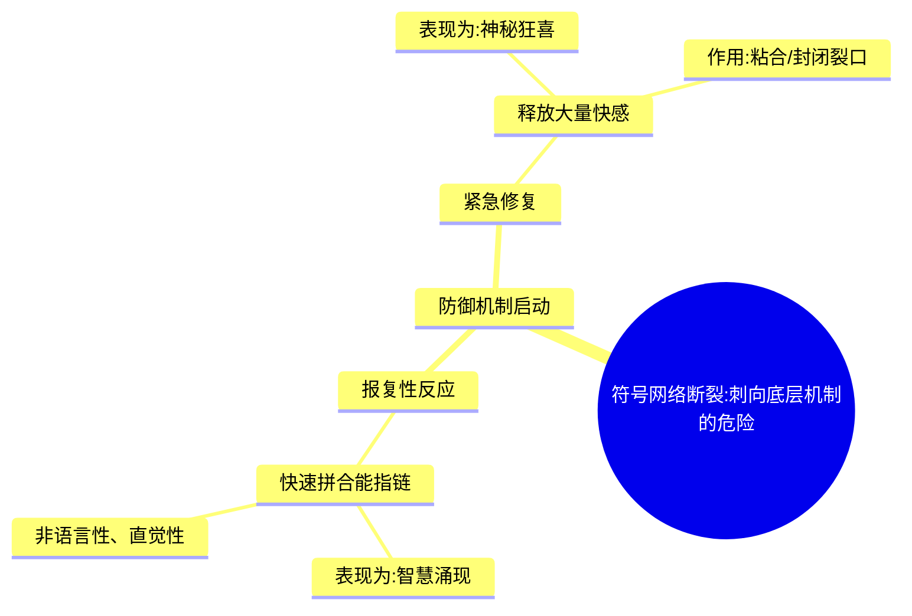

---
{"dg-publish":true,"permalink":"/1-2 宗教实在论/1-2-4 反偶像崇拜/1-2-4-3 神智论/","created":"2025-09-19T20:52:29.456+08:00","updated":"2025-09-22T22:20:34.230+08:00"}
---

### **一、本章概览**
- **主义主义编码**: 1-2-4-3
- **意识形态命名**: [[神智论\|神智论]] (Theosophy) / 以[[苏菲主义\|苏菲主义]]为典型代表
- **核心论断**: [[神智论\|神智论]]是一种通过彻底的“[[无我\|无我]]”状态，悬置日常[[现象\|现象]]世界的虚假性，以被动等待一个超越性[[主宰\|主宰]]的“[[赏赐\|赏赐]]”（神秘体验），从而暂时调和“无限[[循环\|循环]]”与“最终[[结算\|结算]]”两种[[9 未命名/目的论\|目的论]]矛盾的意识形态。其核心是一种通过诱导精神-生理层面的“短路”，来获得防御性“智慧”的内在实践。
- **你能获得**:
    - 理解1-2-4-3编码如何精准勾勒出[[神智论\|神智论]]的[[世界\|世界]]观、二元本体、虚无现象与中介目的。
    - 掌握[[5 主义/神秘主义\|神秘主义]]体验（如[[出神\|出神]]）在[[9 未命名/精神分析\|精神分析]]视角下的心理机制，即它如何通过“节律性压抑”诱发“[[快感\|快感]]大爆发”与防御性的“智慧涌现”。
    - 辨析[[神智论\|神智论]]的“[[无我\|无我]]而为一”与[[回归主义\|回归主义]]灵修的“打怪升级”式合一的根本区别。

---
### **二、核心内容解析**

#### **“主义主义”四格分析**

1.  **场域之“1” (Ontology)**：该意识形态预设了一个绝对统一、整全的[[世界\|世界]]背景，即“[[存在单一论\|存在单一论]]”。在这个[[存在论\|存在论]]框架下，宇宙万物并非独立实体，而仅仅是唯一的、至高的[[主宰\|主宰]]的自我体验、自我认识或自我梦境的显现。整个[[世界\|世界]]是这位[[9 未命名/大他者\|大他者]]的内在剧场，我们所经历的一切都是祂在做梦时浮现的内容。当[[主宰\|主宰]]隐匿时，[[世界\|世界]]便显现为多样与流变；当祂“觉醒”时，万物则回归其统一的本质。因此，场域的“1”代表着一个无所不包、终极同一的绝对实在背景。

2.  **本体之“2” (Body)**：在这个统一的场域中，[[实在\|实在]]被划分为两个相互对立的本体层面。其一是[[主宰\|主宰]]的“隐匿”状态，表现为我们所处的这个凡俗、流变、充满伦理矛盾（爱恨、善恶）的有限[[世界\|世界]]，这是一个残缺且虚幻的层面。其二是[[主宰\|主宰]]的“显现”状态，通常被比喻为“光”或纯粹的真实本体。这种显现只在特定条件下（如[[出神\|出神]]状态）才能被感知。因此，本体的“2”代表了凡俗[[世界\|世界]]（梦境）与神圣实在（觉醒）之间不可调和的[[二元对立\|二元对立]]。

3.  **现象之“4” (Phenomenon)**：该意识形态将主体的日常感知与理性认识（无论是普通人的经验还是学者的理论）贬低为彻底的虚假与无意义。[[主体性\|主体性]]本身被视为空洞和有限的，无法通过自身努力通达真实。真正的“知识”（神智）只能在“[[无我\|无我]]”和“[[出神\|出神]]”状态下获得。这意味着，通往真实的路径恰恰在于现象层面的彻底作废与[[主体性\|主体性]]的自我悬置。现象之“4”在此处精准地指向了主体认识能力的[[内在分裂\|内在分裂]]与[[不可能性\|不可能性]]，只有通过掏空自身，才能为神圣的降临留出空间。

4.  **目的之“3” (Purpose)**：该意识形态的[[9 未命名/目的论\|目的论]]面临一个内在冲突：一方面是凡俗[[世界\|世界]]永无止境的因果“[[循环\|循环]]”，另一方面是期盼一个终极的“[[结算\|结算]]”（如[[救世主义\|救世主义]]的末日审判）。“3”的角色正是在这两者之间进行调和的[[中介\|中介]]。这个[[中介\|中介]]就是[[主宰\|主宰]]的“[[赏赐\|赏赐]]”——即非人力所能掌控的、随时可能降临的[[5 主义/神秘主义\|神秘主义]]体验。这个“神秘的瞬间”既能让主体暂时跳出无尽的[[循环\|循环]]之苦，又不必等到遥远的最终[[结算\|结算]]，它作为一个临时的、个人化的解决方案，维系了整个系统的动态平衡。

#### **其他核心知识点**

##### 无我而为一 (Union through Self-Annihilation)
[[神智论\|神智论]]追求的“合一”并非主体通过修行、积累知识或能量，逐步提升自我以达至神圣，即“打怪升级”式的[[回归主义\|回归主义]]。恰恰相反，它要求主体首先承认自身的彻底无能与虚无，通过一系列修习方法彻底消解自我意识，达到“[[无我\|无我]]”状态。此时，主体不再是主动的追求者，而是一个被动的、空无的容器，等待[[主宰\|主宰]]的“[[赏赐\|赏赐]]”与“承载”。这种合一的本质是“我”的消失，而非“我”的膨胀，是一种反自恋的灵性路径，其核心在于彻底的顺从与敞开。

**举例阐释**：讲稿中明确对比了1-2-4-3与1-2-3-2（[[回归主义\|回归主义]]唯灵论）。后者预设了一套完整的灵性秩序（如星体层级），主体通过学习和实践这套秩序来提升自己，最终与预设的顶点合一。而[[神智论\|神智论]]则认为，任何由“我”预设的秩序都是虚妄的，必须首先放弃“我”这个认知主体，才能迎来真正的启示。

##### 神秘主义体验的心理机制
讲稿从[[9 未命名/精神分析\|精神分析]]和认知神经科学的角度，将[[5 主义/神秘主义\|神秘主义]]体验去神秘化，揭示其为一套可操作的心理-生理技术。其核心机制是“节律性的压抑身体节律”。通过[[禁欲\|禁欲]]和遵守非理性的[[伦理禁令\|伦理禁令]]来积攒心理能量（降低[[快感\|快感]]阈值），再通过呼吸控制、执念、重复诵念、舞蹈等方式，以一种高度重复、去符号联想的节律，强行压抑身体的自然节律。当这种压抑达到临界点，会导致符号网络的断裂，并触发身体防御机制，产生强烈的“[[快感\|快感]]大爆发”和非语言性的“领会”。

**举例阐释**：讲稿中提到的“邯郸学步”寓言。走路本是一种半自主的身体程序，如果一个人刻意用意识去控制每一步的肌肉运动，反而会破坏原有的协调，最终连路都不会走。这说明有意识的、节律性的干预能够深刻影响甚至破坏身体的自动化程序，这与[[5 主义/神秘主义\|神秘主义]]修习的底层逻辑是相通的。

##### 智慧涌现的防御性本质
[[神智论\|神智论]]修习者在[[出神\|出神]]状态下获得的“智慧”或“洞见”，并非真正接触到了超越性的实在，而是一种神经系统的防御反应。当重复性的修习导致主体日常的[[能指\|能指]]链（符号关联网络）断裂时，意识会面临刺入底层“源代码”（如植物神经系统）的危险，这可能导致严重的病理化后果。为了防止这种崩溃，神经系统会“报复性地”快速拼合[[能指\|能指]]链，产生大量未经语言化的直觉关联，表现为“智慧涌现”；同时，释放大量[[快感\|快感]]作为“粘合剂”和安抚机制，将这个被撕开的裂口迅速堵上。

**举例阐释**：讲稿中生动地比喻道，这种机制就像身体受伤后，血小板不顾一切地涌上来将伤口堵住。这种“堵塞物”虽然起到了保护作用，但它本身并非健康的组织。同样，[[5 主义/神秘主义\|神秘主义]]体验中涌现的“智慧”，是心理系统为了防止崩溃而生成的紧急“补丁”，而非对[[世界\|世界]]本质的真正认知。

---
### **三、关键观点提取**
- “而这个[[神智论\|神智论]]，神智论则是处于一种[[无我\|无我]]状态，等待[[赏赐\|赏赐]]。就是说的这个灵性秩序到底是怎么样的，得他来告诉你，你不配。”
- “我体验到的一切都是假的。我的认识到的这一切都是虚幻的...真正能够体验到什么真实的东西，要靠一种[[出神\|出神]]状态。”
- “节律性的压抑身体的节律，只要这样去做就可以有神秘主义体验，没有技术含量。”
- “为什么会感到产生智慧？因为它会报复性的快速拼合[[能指\|能指]]链给你...那实际上是一种防御机制，就像伤口被敞开了，一下子血小板要涌上来...全给老子堵上再说。”

---
### **四、知识点问答**
#### Q: 为何说[[神智论\|神智论]]的“合一”是反自恋的，而[[回归主义\|回归主义]]的灵修本质上是自恋的？
A: [[神智论\|神智论]]（1-2-4-3）的出发点是现象（4）的虚假和[[主体性\|主体性]]的空无，它要求彻底的“[[无我\|无我]]”，将自我视为空的容器，等待[[主宰\|主宰]]的填充，这是一种对自我能力的根本否定。而[[回归主义\|回归主义]]唯灵论（如1-2-3-2）则认为主体是可以通过特定方法（如学习灵性知识、练习特定技巧）不断完善、升级，并最终凭借自身努力与神圣合一的。后者的整个过程是以“我”的成长和实现为中心的，是一种精致的[[自恋\|自恋]]。

#### Q: 在1-2-4-3的框架中，作为[[中介\|中介]]的“[[赏赐\|赏赐]]”（神秘体验）是如何调和永恒“[[循环\|循环]]”与终极“[[结算\|结算]]”这两种目的的？
A: “[[循环\|循环]]”代表了凡俗[[世界\|世界]]无尽的痛苦轮回，而“[[结算\|结算]]”则是一种对终极解脱的盼望。这两种[[9 未命名/目的论\|目的论]]是冲突的。神秘体验作为“[[赏赐\|赏赐]]”提供了一种即时的、个人化的解脱方案。它让信徒在当下就能体验到超越[[循环\|循环]]的狂喜，暂时中止了痛苦，同时又因为它是一种随时可能降临的“恩典”而非最终审判，从而缓解了等待终极“[[结算\|结算]]”的焦虑。它是一种让信徒得以在漫长等待中坚持下去的“中场休息”。

#### Q: 根据讲稿的[[9 未命名/精神分析\|精神分析]]视角，为何说通过[[神智论\|神智论]]方法获得的“能力”远不如丧失的多？
A: 因为这种方法本质上是一种对自身心理-生理系统的“赖皮”或“攻击”。它通过人为制造符号网络的断裂来倒逼出防御性的[[快感\|快感]]和“智慧”，这种体验虽然强烈，但它以破坏正常的认知和身体节律为代价。正如“邯郸学步”的例子，过度有意识地干预半自主系统，可能导致该系统功能的丧失。因此，修习者可能获得了短暂的[[出神\|出神]]体验，却可能损害了自身与[[世界\|世界]]进行健康、自发互动的基本能力。

---
### **五、知识延伸**
- **[[5 主义/神秘主义\|神秘主义]] (Mysticism)**: [[神智论\|神智论]]是[[5 主义/神秘主义\|神秘主义]]的一种特定形态。可以参照基督教神秘主义者如[[埃克哈特大师\|埃克哈特大师]]的思想，他同样强调通过“空”与“无”来接近上帝，这与“[[无我\|无我]]”的理念构成了深刻的互文关系，可作为参照研究。
- **[[拉康\|拉康]]的[[实在界\|实在界]] (Lacan's Real)**: 讲稿中对符号网络断裂、[[快感\|快感]]爆发的描述，是[[拉康\|拉康]]理论的绝佳应用。[[5 主义/神秘主义\|神秘主义]]体验可以被理解为一次对[[实在界\|实在界]]的危险窥探。当[[象征界\|象征界]]（语言、秩序）的屏障被撕开，主体短暂地暴露在创伤性的[[实在界\|实在界]]前，而狂喜（Jouissance）和涌现的“智慧”则是[[象征界\|象征界]]为了自保而紧急生成的防御机制。
- **电影《[[湮灭\|湮灭]]》 (Annihilation)**: 这部电影在视觉和叙事上，深刻探讨了自我边界的消融、与一个不可名状的他者融合的过程。主角们进入“闪光”区域后经历的身份解体、基因重组和最终的自我“[[湮灭\|湮灭]]”，与[[神智论\|神智论]]中通过“[[无我\|无我]]”与[[主宰\|主宰]]合一的主题形成了强烈的艺术类比，可作为一种感性参照。

---
### **六、双链关联总结**
- **一级关联 (核心意识形态与概念)**: [[神智论\|神智论]]、[[苏菲主义\|苏菲主义]]、[[无我\|无我]]、[[出神\|出神]]、[[主宰\|主宰]]、[[赏赐\|赏赐]]、[[快感\|快感]]、[[伦理禁令\|伦理禁令]]、[[存在单一论\|存在单一论]]
- **推测相关人物 (Speculated Figures)**: [[鲁米\|鲁米]] (Rumi, 作为苏菲派诗人与实践者的代表)、[[埃克哈特大师\|埃克哈特大师]] (Meister Eckhart, 作为基督教神秘主义中“无”的代表)、[[海伦娜·布拉瓦茨基\|海伦娜·布拉瓦茨基]] (Helena Blavatsky, 作为讲稿中明确提到的、需加以区分的近代神智学创立者)
- **二级关联 (上下文与背景)**: [[主页\|主页]]、[[9 未命名/精神分析\|精神分析]]、[[拉康\|拉康]]、[[5 主义/神秘主义\|神秘主义]]、[[存在论\|存在论]]、[[9 未命名/现象学\|现象学]]、[[9 未命名/目的论\|目的论]]、[[瓦哈比派\|瓦哈比派]]
- **三级关联 (推测与延展)**: [[实在界\|实在界]]、[[象征界\|象征界]]、[[能指\|能指]]、[[享乐\|享乐]]、[[回归主义\|回归主义]]、[[救世主义\|救世主义]]、[[二元对立\|二元对立]]、[[中介\|中介]]