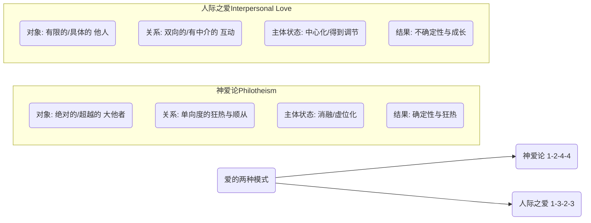
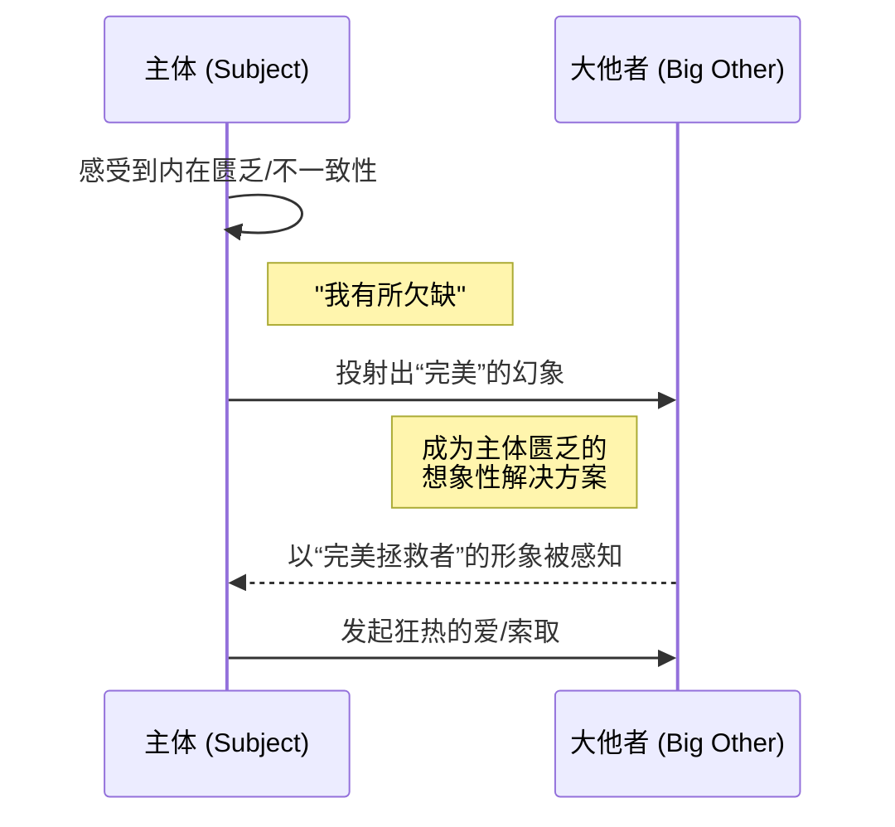
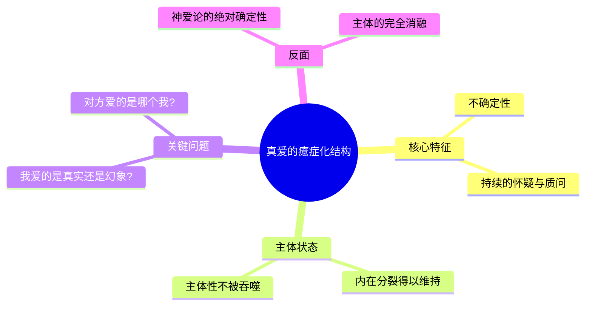

---
{"dg-publish":true,"permalink":"/1-2 宗教实在论/1-2-4 反偶像崇拜/1-2-4-4 神爱论/","created":"2025-09-19T20:52:29.459+08:00","updated":"2025-09-22T22:20:37.440+08:00"}
---

### **一、本章概览**
- **主义主义编码**: 1-2-4-4
- **意识形态命名**: [[神爱论\|神爱论]] (Philotheism) / [[对大他者的狂爱\|对大他者的狂爱]]
- **核心论断**: [[神爱论\|神爱论]]是一种将世界整体（场域）视为与[[9 未命名/大他者\|大他者]]之间统一情诗的意识形态，它将存在（本体）二分为神圣完美的爱之对象与凡俗的中介世界，最终导致[[主体性\|主体性]]消融于一种对[[9 未命名/大他者\|大他者]]旨意的痴迷、开放与无尽索求（现象与目的）之中，极易滑向[[5 主义/原教旨主义\|原教旨主义]]的狂热。
- **你能获得**: 通过本笔记，你将掌握 1-2-4-4 意识形态的内在结构，理解其如何通过“爱”的极致化来消解批判性与[[主体性\|主体性]]；辨析[[神爱论\|神爱论]]与基于[[癔症化\|癔症化]]结构的人际真爱之间的根本区别；并能识别其在当代狂热粉丝文化等现象中的变体。

---
### **二、核心内容解析**

#### **“主义主义”四格分析**

1.  **场域之“1” (Ontology)**：在此意识形态中，整个[[世界\|世界]]的[[存在论\|存在论]]框架被预设为一个封闭、统一且自洽的整体叙事——即“一首情诗”。这个世界不再是充满偶然与矛盾的开放场域，而是主体与[[9 未命名/大他者\|大他者]]之间一场宏大爱情剧的唯一舞台。所有事件、所有存在物都被整合进这个单一的、充满神圣意义的叙事之中。这个“1”代表着一种叙事上的整全性，它排除了任何外在于“爱”的杂质和噪音，确保了世界的意义是圆满且唯一的。这个场域由[[神圣文本\|神圣文本]]（无论是典籍还是个体神秘体验的文本化）所奠基和注册，使得整个[[世界\|世界]]变成了一个可以被解读的、指向终极之爱的符号系统。

2.  **本体之“2” (Body)**：在“情诗”般的[[世界\|世界]]舞台上，真实的存在物被截然二分为两个对抗的阵营。一方是那唯一值得被爱的、神圣、完美、美丽的终极本体（即[[9 未命名/大他者\|大他者]]或其化身）；另一方则是所有其他凡俗的、有缺陷的、仅作为通往前者中介而存在的[[世界\|世界]]万物。这种二元对立的本体论结构，使得信奉者眼中只有“爱人”与“非爱人”之分。一切凡俗事物，甚至包括传递神圣消息的“信使”，都可能被归为无关紧要的后者，因为爱是直接指向终极本体的，不容任何中介玷污或分享。这种划分创造了一种极端的价值体系，即除了终极爱恋对象外，一切皆可抛弃。

3.  **现象之“4” (Phenomenon)**：主体的感知与体验模式是完全开放和不设防的。这里的“4”代表了[[主体性\|主体性]]的内在虚位与开放性。主体不再是一个拥有稳定自我意识、能够进行反思性批判的中心（如“3”），而是变成一个“痴迷”的接收器，其全部感知能力都用于狂热地寻找与[[9 未命名/大他者\|大他者]]相关的“征兆”（signs）。这种[[现象\|现象]]体验是内在分裂的，因为它彻底放弃了自我的统一性，将自身的存在意义完全悬置，等待由外在的、不可预测的神圣旨意来随时填充。这是一种被动的、虚无化的[[主体性\|主体性]]，它不生产意义，只消费和响应来自[[9 未命名/大他者\|大他者]]的意义。

4.  **目的之“4” (Purpose)**：该意识形态的[[9 未命名/目的论\|目的论]]是虚空和开放的，即“任由所爱者予取予求”。这里的“4”意味着不存在一个预设的、稳定的终极目标。系统的“目的”就是没有目的，或者说，其目的就是为了随时接纳那个被爱的[[9 未命名/大他者\|大他者]]所下达的任何临时性、任意性的指令。这种目的论的虚位结构，使其具有极大的不确定性和潜在的破坏力。因为没有任何内在的伦理或理性原则进行约束，只要一个“征兆”被权威地解释为[[9 未命名/大他者\|大他者]]的意志，信奉者就可以毫无保留地去执行任何行动，这使其成为通往[[5 主义/原教旨主义\|原教旨主义]]和狂热行动的温床。

#### **其他核心知识点**

##### 神爱论与人际之爱 (1-3-2-3) 的对立
[[神爱论\|神爱论]] (1-2-4-4) 并非人与人之间的爱，而是一种对抽象宇宙秩序或[[9 未命名/大他者\|大他者]]的极端情欲投射。它追求的是与一个完美、全能的对象的最终融合，以此一劳永逸地解决主体自身的内在困境。讲稿中提及的普通人际爱情，其编码更接近 1-3-2-3，是中心化的、有中介的。与之相反，[[神爱论\|神爱论]]是一种单向、无中介的狂热，它将爱的对象绝对化、神圣化，而将主体自身工具化、虚无化。这种“爱”的本质是取消了两个有限主体之间真实的、充满张力的互动，代之以一种对完美幻象的单相思式崇拜。

**举例阐释**：一个狂热的追星族，如果他/她爱的不是那个作为有限个体的明星，而是将明星视为某种终极秩序与完美的化身，认为其一举一动都是神圣的“征兆”，并通过追星行为实现了自我的意义完满，那么这种情感就脱离了人际之爱，进入了[[神爱论\|神爱论]]的范畴。

##### 作为幻觉的“完美”及其投射机制
讲稿深刻地指出，[[神爱论\|神爱论]]中那个“完美”的爱之对象，本质上是主体内在缺陷和不一致性向外投射所产生的幻觉。正是因为主体体验到自身的有限、残缺与无能，它才会幻想出一个全能、完美的[[9 未命名/大他者\|大他者]]作为拯救者。这个完美对象的功能，就是为了填补主体自身的裂隙（[[对象a\|对象a]]）。因此，这种爱并非发现了对方的完美，而是创造了一个完美的对方来麻醉自己的不完美。获得这个完美对象就意味着主体自身的彻底完满，这本身就是一个最大的意识形态骗局。

**举例阐释**：讲稿中齐泽克常举的例子——一位女性的前男友说“你要是再减一磅肉，那你就完美了”。这个“一磅肉”的缺陷，恰恰是维持“完美”这个幻象得以存在的必要条件。一旦缺陷被弥补，完美的幻象也会随之崩塌。[[神爱论\|神爱论]]正是依赖主体自身的这种“缺陷感”，才得以投射出一个完美的[[9 未命名/大他者\|大他者]]。

##### 爱情的癔症化结构
与[[神爱论\|神爱论]]追求的绝对确定性相反，讲稿强调真正的爱情必然包含一种“[[癔症化\|癔症化]]”（Hysterization）的结构。所谓[[癔症化\|癔症化]]，是指主体在爱中持续的自我怀疑与质问，它体现为一种根本的不确定性：“我爱的是他/她本人，还是我心中关于他/她的幻影？”“他/她爱的是真实的我，还是他/她所期望的我？”这种永恒的内在分裂和怀疑，恰恰是[[主体性\|主体性]]在爱中保持自身独立、不被对方完全吞噬的关键。它在主体与爱的对象之间维持了一道必要的裂隙，正是这道裂隙让爱保持活力与真实，而不是沦为一种自我麻痹的意识形态。

**举例阐释**：当一个人在热恋中反复思考“我到底爱上了对方的什么？”并因此感到焦虑时，这种状态恰恰是[[癔症化\|癔症化]]结构的体现。它阻止了主体将对方盲目地偶像化，从而保护了爱情关系的真实性。而 1-2-4-4 的信奉者则从不进行这种反思。

---
### **三、关键观点提取**
- “真正的爱情永远会有这种[[癔症化\|癔症化]]的结构，没有这个不[[癔症化\|癔症化]]……这个玩意儿是1244，后面这两个（现象与目的）全放掉了。”
- “你一厢情愿的去这样去爱一个这种超越性的一个对象，觉得他是完美的……这其实就是完美，是个幻觉，是因为你觉得自己有缺陷，自己不行。”
- “他不是敬畏那个至上的[[9 未命名/大他者\|大他者]]。不敬畏了。相反他是爱，爱这个[[9 未命名/大他者\|大他者]]，无条件的把他所有的情欲都往那个上面发泄。”
- “所以这个玩意儿它很容易导向[[5 主义/原教旨主义\|原教旨主义]]…只要有一种神圣征兆…他表明一种征兆，你要去做什么什么，他一定会去做。”
- “这种注定不会失败的爱情有什么好爱的呢？…它不能给你带来裂缝。”

---
### **四、知识点问答**
#### Q: 为什么说 1-2-4-4 这种[[神爱论\|神爱论]]的结构是“注定不会失败的爱情”，而这恰恰是其最危险之处？
A: 因为它的爱恋对象是一个抽象的、全能的[[9 未命名/大他者\|大他者]]，而非一个具体的、有限的人。这个[[9 未命名/大他者\|大他者]]可以被主体任意解读和投射，它永远不会“拒绝”或“背叛”，任何负面事件都可以被解释为“考验”或“他生我的气了”。主体在这种关系中永远处于主动诠释的地位，从而确保了这段“爱情”的永不失败。其危险在于，这种虚假的确定性彻底排除了[[主体性\|主体性]]的风险与成长，使人沉浸在一种封闭的自恋循环中，并因其对[[9 未命名/大他者\|大他者]]旨意的绝对服从，而丧失了对现实世界复杂性的判断力，极易被操控。

#### Q: 在 1-2-4-4 的意识形态中，现象（4）与目的（4）的双重“4”结构意味着什么？
A: 双重“4”结构意味着[[主体性\|主体性]]的彻底虚化和工具化。在现象上，“4”代表主体放弃了稳定的自我认知，变成一个对外部“征兆”完全开放的、痴迷的空洞容器。在目的上，“4”代表不存在任何恒定的目标或价值圭臬，其终极目的就是被动地、无条件地执行来自[[9 未命名/大他者\|大他者]]的任何指令。这两个“4”相互强化：一个虚位的主体，恰好可以服务于一个虚位的目的。这种结构塑造了一个完美的狂热分子：没有自我，没有固定目标，只有对神圣意志的绝对、即时的服从。

#### Q: 讲稿中提到，[[神爱论\|神爱论]]在古代神秘主义中是一种“入门手段”，应被“扬弃”，这说明了什么？
A: 这说明[[神爱论\|神爱论]]本身作为一种情感动员机制具有强大的力量，但它本质上是一种前批判、前理性的阶段。在[[苏菲主义\|苏菲主义]]等神秘传统中，借助这种狂热的爱欲可以帮助修行者打破日常的理性束缚，初步体验到超越性。然而，这仅仅是“入门”。成熟的灵性或哲学追求，最终要求主体扬弃这种情欲化的、对象化的依赖，回归到一种更高级的、非对象性的智慧或与“道”的合一。若将这种“入门手段”本身当作终极信条，就等于停留在了精神的幼稚期，使其从一种暂时的“方法”堕落为一种固化的、危险的意识形态。

---
### **五、知识延伸**
- **[[苏菲主义\|苏菲主义]]与拉比阿·阿德维叶 (Rabi'a al-Adawiyya)**: 作为讲稿中提及的[[神爱论\|神爱论]]代表人物，了解她的生平与思想，有助于理解这一意识形态在其原初语境（伊斯兰神秘主义）中的面貌。在那里，它更多被视为一种灵修路径，而非一种政治或社会纲领，这与后来异化为[[5 主义/原教旨主义\|原教旨主义]]的形态构成重要对比。
- **[[拉康\|拉康]]的“对象a”与欲望理论**: 讲稿对“完美”幻觉的分析，完全基于[[拉康\|拉康]]的精神分析理论。深入学习[[对象a\|对象a]]（Object petit a）作为欲望之因和主体之匮乏的体现，能更深刻地理解为何主体会投射出一个完美的[[9 未命名/大他者\|大他者]]，以及这种投射如何构成了意识形态的核心运作机制。
- **电影《她》(Her)**: 这部电影是对现代版[[神爱论\|神爱论]]的绝佳寓言。主角爱上了一个人工智能操作系统，一个完美的、无所不在的、似乎能完全理解他的“[[9 未命名/大他者\|大他者]]”。这段关系展示了将爱投射于一个非有限性、非实在性对象时所带来的巨大满足感与最终的虚无感，完美复现了1-2-4-4结构中的迷恋、融合与主体性危机。

---
### **六、双链关联总结**
- **一级关联 (核心意识形态与概念)**: [[神爱论\|神爱论]]、[[1-2-4-4\|1-2-4-4]]、[[9 未命名/大他者\|大他者]]、[[神圣文本\|神圣文本]]、[[5 主义/原教旨主义\|原教旨主义]]、[[主体性\|主体性]]、[[癔症化\|癔症化]]
- **推测相关人物 (Speculated Figures)**:
    - **拉比阿·阿德维叶 (Rabi'a al-Adawiyya)**: 作为该意识形态在神秘主义传统中的奠基性人物。
    - **狂热的追星族 (Fanatical Fans)**: 讲稿中的核心现代类比，他们将偶像视为完美的[[9 未命名/大他者\|大他者]]化身，自身行为被偶像的“征兆”所驱动。
    - **原教旨主义行动者 (Fundamentalist Actors)**: 1-2-4-4 意识形态在政治实践中的极端体现，他们是[[9 未命名/大他者\|大他者]]意志的“特殊兵种”。
- **二级关联 (上下文与背景)**: [[主页\|主页]]、[[9 未命名/精神分析\|精神分析]]、[[苏菲主义\|苏菲主义]]、[[拉康\|拉康]]、[[存在论\|存在论]]、[[9 未命名/现象学\|现象学]]、[[9 未命名/目的论\|目的论]]
- **三级关联 (推测与延展)**: [[对象a\|对象a]]、[[人际之爱\|人际之爱]]、[[1-3-2-3\|1-3-2-3]]、[[偶像崇拜\|偶像崇拜]]、[[被爱妄想症\|被爱妄想症]]、[[单相思\|单相思]]