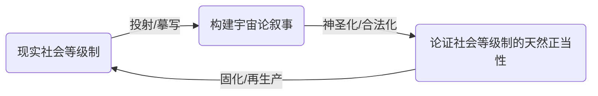
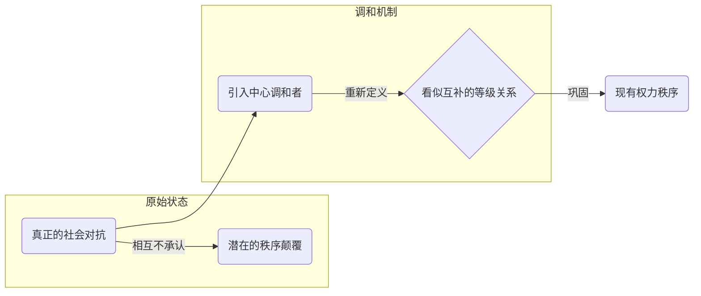
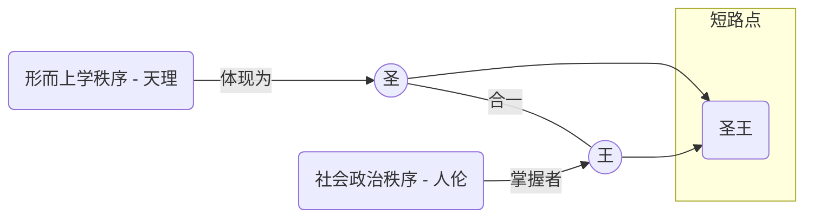

---
{"dg-publish":true,"permalink":"/1-3 唯我论/1-3-1 伪唯心主义/1-3-1-1 客观唯心主义/","created":"2025-09-19T20:52:29.470+08:00","updated":"2025-09-22T21:57:51.495+08:00"}
---

### **一、本章概览**
- **主义主义编码**: 1-3-1-1
- **意识形态命名**: [[客观唯心主义\|客观唯心主义]] (庸俗化版本) / [[前现代文化贵族的话术体系\|前现代文化贵族的话术体系]]
- **核心论断**: 这种意识形态并非真正的哲学思辨，而是一种服务于统治阶级的[[权力\|权力]]话术。它通过构建一个封闭的、等级森严的宇宙论，将社会秩序神秘化、永恒化，从而确立“文化贵族”（如[[士大夫\|士大夫]]阶层）作为真理代言人和秩序仲裁者的绝对权威。
- **你能获得**: 你将理解 1-3-1-1 意识形态如何利用一个封闭的形而上学框架（场域之“1”），通过一个中心化的中介（本体之“3”）来调和并掩盖社会矛盾，最终将个体（现象之“1”）规训于一个永恒循环的等级秩序（目的之“1”）之中。你也能识别出这种思维模式在历史（如[[程朱理学\|程朱理学]]）和当代生活中的变体。

---
### **二、核心内容解析**

#### **“主义主义”四格分析**

1.  **场域之“1” (Ontology)**：此意识形态预设了一个整全、封闭且永恒的[[世界\|世界]]框架，即一个绝对的“[[宇宙\|宇宙]]”(Universe)。这个框架本身是不容置疑的，它为万事万物预设了固定的位置和秩序。这里的“1”意味着[[存在论\|存在论]]上的终极闭合，它排除了任何外在于该体系的可能性或对框架本身进行根本性质疑的可能。它不是一个开放探索的场域，而是一个先验给定的、等级森严的舞台，所有存在者都必须在这个舞台上扮演被预先写好的角色。

2.  **本体之“3” (Body)**：在这个封闭的宇宙舞台上，核心的[[实在\|实在]]由一种中心化的精神或“[[天理\|天理]]”所构成。数字“3”的结构至关重要，它代表着“2+1”的调和模式。这里的“2”并非真正的对抗，而是被重新叙述为互补的、等级化的对立（如君臣、夫妇、阴阳）。而关键的“+1”就是那个超然的调和中心——“[[圣人\|圣人]]”或“道统”。这个中心化的中介者不仅解释了对立为何是和谐的，更垄断了解释权，从而将潜在的社会分裂转化为巩固自身地位的秩序。这个[[本体\|本体]]因此不是纯粹的精神，而是被特定社会阶层（[[士大夫\|士大夫]]）所代言和操控的权力化精神。

3.  **现象之“1” (Phenomenon)**：个体的[[主体性\|主体性]]在此被彻底压制。数字“1”意味着[[现象\|现象]]体验的单一化和同质化。个体的“心灵”被认为与至高的“精神”具有某种“亲和性”，但这是一种派生和服从的关系。主体不具备独立的、批判性的认知能力，其最高德性就是“循规蹈矩”，即无条件地认同并内化那套由“[[圣人\|圣人]]”所阐释的宇宙秩序。任何偏离这一轨道的个人体验都被视为“忤逆”，是非法的。主体的感知世界的方式是统一的、被规定好的，不存在多元视角。

4.  **目的之“1” (Purpose)**：该意识形态的[[9 未命名/目的论\|目的论]]是导向永恒的循环与重复，以维持现有权力结构的稳定。数字“1”在此处代表的“[[真理\|真理]]”或“理”，并非开放性的探索，而是一种“被实现的合理性”（actualized rationality）。这个目的就是让那套等级森严的宇宙秩序无限循环下去，确保每个部分都安守本分。其终极[[目的\|目的]]就是权力本身的维系，讲稿中尖锐地指出其本质为“掐赢”，即确保特定阶层在这种不变的秩序中永远处于优势地位。

#### **其他核心知识点**

##### 话术化的宇宙论
这套体系中的“形而上学”并非对[[存在\|存在]]本身的严肃探究，而是一种服务于政治目的的“[[话术\|话术]]化宇宙论”。它将现实社会中业已存在的等级关系（如宗法制中的嫡庶之分）投射到宇宙层面，编造出一套看似玄妙的宇宙生成叙事（如“清浊二气”、“阴阳”等），然后再反过来用这套宇宙论来论证现实社会等级制的天然合理性与永恒性。这种操作的本质是一种循环论证，它将一个特定阶级的社会结构伪装成不可动摇的宇宙法则，是一种讲稿中所言的“meta-sociology”（元社会学），而非真正的“meta-physics”（[[形而上学\|形而上学]]）。

**举例阐释**：讲稿中提到的[[程朱理学\|程朱理学]]，其关于“理”与“气”的复杂论述，以及从太极到两仪四象的推演，表面上是在解释[[世界\|世界]]的构成，实际上其核心功能是为君臣、父子、夫妇的“三纲五常”伦理秩序提供一个宇宙论层面的合法性基础，从而论证封建宗法制度的不可撼动性。

##### 中心化的调和
这是理解[[本体\|本体]]之“3”的关键机制。1-3-1-1 意识形态不否认[[世界\|世界]]存在对立（“2”），但它通过引入一个绝对的中心调和者（“+1”），将真正的、不可调和的社会对抗，转化为一种表面和谐、实则不平等的互补关系。这个中心调和者，无论是“[[圣人\|圣人]]”还是“[[士大夫\|士大夫]]”阶层，都自诩为超越对立双方的更高存在，他们掌握着定义和解释这种“和谐”的[[权力\|权力]]。因此，对抗性被消解了，取而代之的是一个由中心所规定的、等级分明的合作体系。

**举例阐释**：讲稿中提到，原本可能是压迫者与被压迫者之间的对立，被这套话术重新包装为“君臣”、“夫妇”等各司其职、相互补充的和谐关系。这种“调和”的代价是被压迫方丧失了反抗的合法性，因为反抗不再是阶级斗争，而是破坏宇宙和谐的“忤逆”之举。

##### 圣王短路
“[[圣王短路\|圣王短路]]”是指该意识形态通过“[[圣王\|圣王]]”（Sage-King）这一概念，将形而上学秩序与社会政治秩序直接缝合、短路。理想的统治者既是掌握最高[[权力\|权力]]的“王”，又是体悟宇宙[[真理\|真理]]的“圣”。这种身份的合一，使得政治统治获得了形而上学的神圣光环，而形而上学的解释权也直接服务于政治统治。这使得统治阶级的[[权力\|权力]]变得不容置疑，因为反对它就等于反对整个[[宇宙\|宇宙]]的[[天理\|天理]]。

**举例阐释**：在中国古代，“内圣外王”的理想人格就是这种短路的体现。一个理想的君主被认为既有深厚的德性修养（内圣），又能成功地治理国家（外王）。这种理论使得士大夫阶层可以通过阐释“圣人之道”来影响甚至规训君主的“王之权”，从而实现其政治抱负。

---
### **三、关键观点提取**
- “它（1-3-1-1）实际上是一种摆出来就是要独立政权的一个姿态。它是在[[前现代\|前现代]]思想体系中普遍存在的…因为这个就是[[前现代\|前现代]]的学术共同体，它本质上是候选的政权。”
- “这个东西本来是一种…相互不承认的的对立，被他这样一遮盖，遮盖成变成一种相互承认的一种对立，就是所谓的夫妇，什么君臣。”
- “他看上去是这个宇宙论决定了社会关系，实际上是反的，实际上是反过来，是社会关系在在这些占优势的人…他把这种东西说成是一个永恒的不变的一个[[宇宙\|宇宙]]的等级制。”
- “这个形而上学和社会学短路了…这个东西就是所谓的[[圣王\|圣王]]，它会被神秘化为[[圣王\|圣王]]。”
- “我国的所谓的[[形而上学\|形而上学]]是这种meta-sociology（元社会学）。”

---
### **四、知识点问答**

#### Q: 为什么说 1-3-1-1 意识形态中的“[[真理\|真理]]”或“理”，其本质是“[[权力\|权力]]”？
A: 因为在该体系中，“[[真理\|真理]]”（目的之“1”）并非通过开放的、批判性的探究得来，而是被预先设定为维护一个封闭循环的等级秩序。掌握这套宇宙论解释权的“[[文化贵族\|文化贵族]]”或“[[士大夫\|士大夫]]”阶层（本体之“3”的核心），通过宣称自己能够洞悉“[[天理\|天理]]”，实际上是将自己的阶级意志伪装成了[[宇宙\|宇宙]]意志。因此，所谓的“[[真理\|真理]]”只是这套等级秩序的自我循环指令，而服从“[[真理\|真理]]”就等于服从该阶级的统治，其核心就是维持和行使[[权力\|权力]]。

#### Q: 1-3-1-1 中的“[[本体\|本体]]之‘3’”是如何巧妙地消解社会矛盾的？
A: 它是通过“[[中心化的调和\|中心化的调和]]”机制来运作的。它首先承认社会中存在对立（“2”），但这并非无法解决的对抗。随后，它引入一个超越性的中介——“[[圣人\|圣人]]”或其代言人（“+1”），这个中介通过其话语[[权力\|权力]]，将你死我活的对抗重新定义为一种功能互补、等级分明的和谐关系（如君臣之义）。这样，真正的社会矛盾就被掩盖和转移了，任何反抗都会被指责为破坏这种“和谐”大局的非理性行为，从而巩固了中介者自身及其所代表的统治秩序。

#### Q: 为何讲稿称这种思想体系连“哲学”都算不上，而只是一种“话术”？
A: 因为真正的[[哲学\|哲学]]，尤其是[[德国观念论\|德国观念论]]以降的思辨哲学，其核心在于对[[世界\|世界]]框架本身的批判性反思，是一种开放的、冒险性的智力活动。而 1-3-1-1 体系的出发点和归宿都是为了论证和维护一个既定的[[权力\|权力]]结构。它的[[宇宙\|宇宙]]论（本体论叙事）并非基于严谨的逻辑推演或对[[现象\|现象]]的真诚探索，而是对社会现实的直接摹写和神秘化包装。其目的不是求知，而是“掐赢”（维权），因此它是一种封闭的、服务于特定利益的意识形态[[话术\|话术]]，而非开放的哲学思考。

---
### **五、知识延伸**
- **[[柏拉图的《理想国》\|柏拉图的《理想国》]]**: 这是一个典型的将[[形而上学\|形而上学]]（理念世界）与严格的社会等级制（哲学王、卫士、生产者）直接挂钩的政治哲学体系。哲学王作为能够洞悉“善的理念”的“[[圣人\|圣人]]”，其统治的合法性来自于超验的[[真理\|真理]]，这与 1-3-1-1 中的“[[圣王短路\|圣王短路]]”逻辑高度相似，可作为其在西方古典哲学中的参照。
- **[[阿尔都塞的“意识形态国家机器”\|阿尔都塞的“意识形态国家机器”]]**: 阿尔都塞理论中，教育、宗教、文化等机构作为意识形态国家机器，其功能是再生产统治阶级的意识形态，使被统治者自愿服从。讲稿中描述的“教化贵族”[[士大夫\|士大夫]]阶层，通过炮制和传播[[程朱理学\|程朱理学]]这样的宇宙论来维护等级秩序，完美地扮演了这一角色，可用于进行结构性批判分析。
- **[[卡尔·施密特的“政治”概念\|卡尔·施密特的“政治”概念]]**: 施密特认为“政治”的本质在于划分敌我。1-3-1-1 意识形态通过“[[中心化的调和\|中心化的调和]]”，将潜在的“敌人”关系转化为内部的、等级化的“伙伴”关系，从而实现了“去政治化”的效果，即掩盖了真实的对抗，用一套伦理或宇宙秩序取代了政治决断。这可以作为一个批判性的参照，揭示该意识形态压制真正政治性的本质。

---
### **六、双链关联总结**
- **一级关联 (核心意识形态与概念)**: [[客观唯心主义\|客观唯心主义]]、[[1-3-1-1\|1-3-1-1]]、[[前现代文化贵族的话术体系\|前现代文化贵族的话术体系]]、[[程朱理学\|程朱理学]]、[[话术化的宇宙论\|话术化的宇宙论]]、[[中心化的调和\|中心化的调和]]、[[圣王短路\|圣王短路]]、[[士大夫\|士大夫]]、[[天理\|天理]]、[[圣人\|圣人]]
- **推测相关人物 (Speculated Figures)**: [[程颐\|程颐]]、[[朱熹\|朱熹]] (作为历史范例)、[[6 哲学家/柏拉图\|柏拉图]] (作为思想参照)、自以为是的“房管”或家长式管理者 (作为当代生活中的行为模式类比)
- **二级关联 (上下文与背景)**: [[主页\|主页]]、[[德国观念论\|德国观念论]]、[[唯心主义\|唯心主义]]、[[前现代\|前现代]]、[[形而上学\|形而上学]]、[[9 未命名/本体论\|本体论]]、[[9 未命名/现象学\|现象学]]、[[9 未命名/目的论\|目的论]]、[[权力\|权力]]、[[话术\|话术]]、[[宇宙论\|宇宙论]]
- **三级关联 (推测与延展)**: [[阿尔都塞\|阿尔都塞]]、[[意识形态国家机器\|意识形态国家机器]]、[[卡尔·施密特\|卡尔·施密特]]、[[政治\|政治]]、[[理想国\|理想国]]、[[去政治化\|去政治化]]、[[循环论证\|循环论证]]