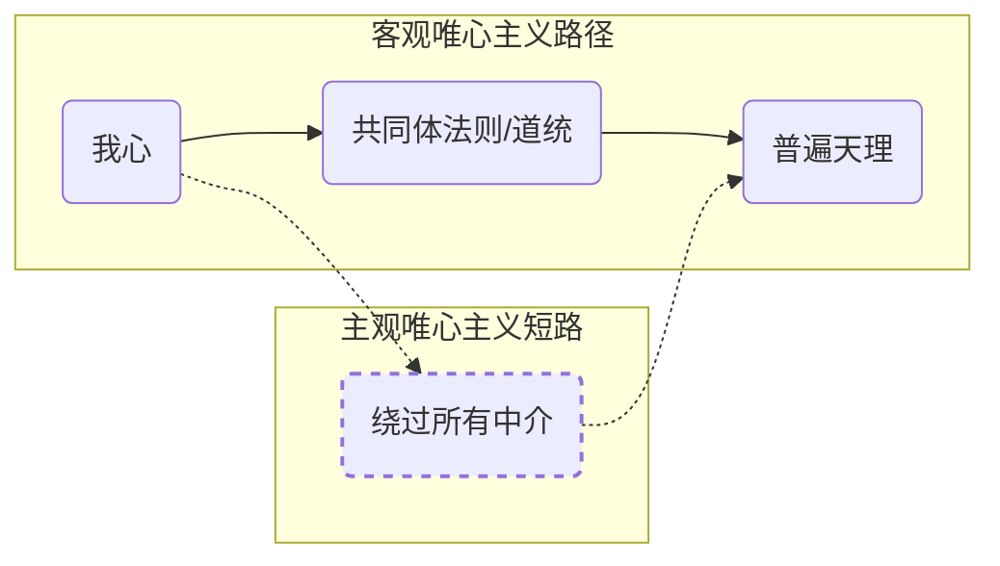
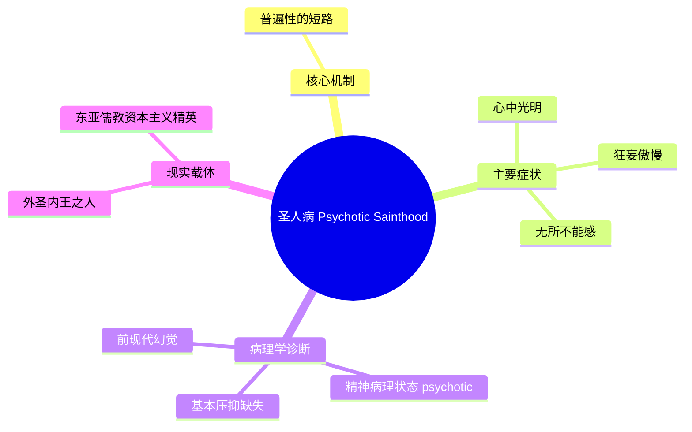

---
{"dg-publish":true,"permalink":"/1-3 唯我论/1-3-1 伪唯心主义/1-3-1-2 主观唯心主义/","created":"2025-09-19T20:52:29.471+08:00","updated":"2025-09-22T22:20:23.908+08:00"}
---

### **一、本章概览**
- **主义主义编码**: 1-3-1-2
- **意识形态命名**: [[主观唯心主义\|主观唯心主义]] (或 [[有限唯心主义\|有限唯心主义]])
- **核心论断**: [[主观唯心主义\|主观唯心主义]] 是一种前现代的伦理姿态，它通过将孤绝的第一人称意识“短路”式地提升为普遍伦理法则，从而克服[[客观唯心主义\|客观唯心主义]] (1-3-1-1) 导致的自虐式道德压抑。它能带来“[[心中光明\|心中光明]]”的解放感，但其本质是一种精神病理学上的“[[圣人病\|圣人病]]”，是成为“圣人”最廉价的方式。
- **你能获得**: 你将掌握 1-3-1-2 意识形态的内在结构，理解它如何作为 [[客观唯心主义\|客观唯心主义]] (1-3-1-1) 的“解决方案”而出现，并能辨识其在历史人物（如[[圣保罗\|圣保罗]]、[[王阳明\|王阳明]]）和文化现象（如抽象的[[师承\|师承]]关系）中的体现，最终学会从精神分析角度诊断这种“圣人病”的心理机制。

---
### **二、核心内容解析**

#### **“主义主义”四格分析**

1.  **场域之“1” (Ontology)**：该意识形态预设的世界是一个统一、完整的伦理舞台。与强调物理法则的宇宙论不同，这里的“1”更贴近一个封闭的[[生活世界\|生活世界]]。所有事件和存在都被理解为在这个单一的、以伦理精神为核心的场域内展开。它不关心宇宙的起源或物质构成，而是设定了一个默认的、不被质疑的统一背景，所有主体的行动都在这个背景下获得其伦理意义。

2.  **本体之“3” (Body)**：世界的真实核心是一个中心化的[[精神\|精神]] (Geist)。这个“3”代表着一个调和性的、作为万物本源的绝对精神或天理。然而，与 [[客观唯心主义\|客观唯心主义]] (1-3-1-1) 不同的是，这个精神的权威并非由外在的[[道统\|道统]]或圣人来担保，而是潜藏于每一个体之内，等待被主体化的过程所激活。它是一个有待被“我心”直接触及和等同的中心。

3.  **现象之“1” (Phenomenon)**：主体体验是一个整全、光明、无矛盾的内在王国。这里的“1”代表着第一人称意识的绝对统一性，即“[[心中光明\|心中光明]]”的状态。通过将自身的内在体验提升为普遍法则，主体克服了原先在道德压抑下的内部分裂。所有感官经验和内在冲突都被这个强大的、自认为是普遍的“我心”所整合，体验为一种灵肉合一、知行合一的流畅状态。

4.  **目的之“2” (Purpose)**：该意识形态的最终目的在于维持一种二元对抗。但这种对抗并非 [[客观唯心主义\|客观唯心主义]] 压抑下的“法则 vs 欲望”，而是一种更高级的对抗：“**我心中的普遍法则 vs 共同体的特殊法则**”。遵循真正的[[伦理\|伦理]]，就意味着要勇敢地背叛和违抗世俗的、狭隘的共同体规则。这种对抗本身就是目的，它让主体在孤独的反叛中体验到与普遍精神合一的崇高快感。

#### **其他核心知识点**

##### 法罪相生论 (The Law-Sin Symbiosis)
在 [[主观唯心主义\|主观唯心主义]] 出现之前，其前身 [[客观唯心主义\|客观唯心主义]] (1-3-1-1) 陷入一种恶性循环。它设立一个外在的、绝对的道德法则（Law），这种压抑必然会催生出过剩的、被定义为“罪”（Sin）的欲望。主体越是遵循法则去压抑欲望，欲望就越是以扭曲的形式过剩，从而又需要更严酷的法则来压制。这种“法”与“罪”相互定义、相互激发的共生关系，形成了一个让主体陷入无尽痛苦和自虐快感的封闭循环，即“法罪相生论”。

**举例阐释**：讲稿中提到的“道学先生”就是典型。他拼命压制自身的欲望，像打地鼠一样扑灭每一个念头。这个压抑的过程本身是极其痛苦的，但这种痛苦也带来了一种病态的、受虐狂式的快感，使他沉溺于这种“道德严酷主义”的循环中无法自拔，其[[主体性\|主体性]]最终被掏空（演变为 1-3-4-2）。

##### 普遍性的短路 (The Short-Circuit of the Universal)
1-3-1-2 意识形态的核心操作，就是通过一次激进的“短路”，跳出“法罪相生论”的循环。主体不再寻求与外在的、共同体的法则和解，而是选择完全退回到自身孤绝的第一人称意识中。随后，它进行一个疯狂的、非反思的跳跃，即宣布“我这孤绝内心中剩下的东西，就是真正的、普遍的伦理精神”。它绕过了共同体、[[道统\|道统]]、历史传承等一切中介，直接将“我心”与“天理”划上等号，从而实现了爱欲与伦理的统一。

**举例阐释**：[[王阳明\|王阳明]]提出的“心外无物”和“致良知”，在这里被解读为一种伦理上的短路操作。他主张伦理准则无需外求，通过向内勘探，每个人都能直接触及那普遍的“良知”。这种操作使得遵循内心法则（如“知行合一”）本身就成了一种充满爱欲和解放感的行为，因为它同时是对外部僵化礼教的一种反叛。

##### 圣人病 (The Saint's Disease)
这是讲稿对 [[主观唯心主义\|主观唯心主义]] 的最终诊断。这种通过“短路”达成的“[[心中光明\|心中光明]]”状态，本质上是一种精神病理学症状。它之所以“廉价”，是因为它建立在一个前现代的幻觉之上：即认为存在一个纯粹的、未被语言和共同体污染的“内在意识”。现代思想已经揭示，第一人称意识本身就是由主体间的语言结构所塑造的。因此，1-3-1-2 的主体将这种被建构的内在性误认为普遍真理，是一种结构性的精神病 (psychotic) 状态，表现为狂妄、傲慢，以及一种“什么都做得”的怪物般的姿态。

**举例阐释**：讲稿最后将这种“外圣内王”的人格与儒教资本主义下的某些精英联系起来。这些人内心仿佛有一套绝对自洽的法则，让他们可以无视外部规则，做出常人难以想象的行为。这种状态看似是“圣人”，实则是一种危险的、与现实隔绝的精神病理。

---
### **三、关键观点提取**
- “如果没有[[法则\|法则]]的话，就没有[[罪\|罪]]可言……无压抑则无过剩。”
- “你越是孤独，越是被[[9 未命名/共同体\|共同体]]排挤，你越是能体验到那个那个真正普遍的维度。”
- “[[主观唯心主义\|主观唯心主义]]的这个主观，这个subjective，这个idealism这里的主观是在于把[[精神\|精神]]主观化是[[精神\|精神]]普遍化的必要环节。”
- “这个所谓的[[圣人\|圣人]]境界是[[精神病理学\|精神病理学]]它的基本机制。”
- “这个‘[[心中光明\|心中光明]]’，你只要能做到这一点，搞到这个短路，什么都做得……真的是什么都做的。”

---
### **四、知识点问答**

#### Q: 为什么说 1-3-1-2 的核心是一种“短路”操作？它“短路”了什么？
A: 它“短路”了连接个体与普遍真理之间的社会性、历史性中介。在 [[客观唯心主义\|客观唯心主义]] (1-3-1-1) 的体系中，个体（我心）必须通过遵循[[9 未命名/共同体\|共同体]]的法则、师从圣人的[[道统\|道统]]，才能间接地触及普遍的“天理”。而 1-3-1-2 的主体则直接绕过所有这些中介，宣称“我心即天理”，将孤绝的内在体验直接等同于普遍法则，这是一次激进的、跨越了所有社会符号秩序的跳跃。

#### Q: 讲稿为何将 1-3-1-2 的状态诊断为“[[圣人病\|圣人病]]”，并认为它在现代是虚假的？
A: 因为这种状态建立在一个[[前现代\|前现代]]的幻觉上，即相信存在一个纯粹、原初、未被污染的内在意识。现代[[9 未命名/精神分析\|精神分析]]和语言哲学揭示，我们的第一人称意识从根本上就是由主体间的语言和[[符号界\|符号界]]所结构的。因此，现代人试图撤回到所谓的“纯粹内心”去寻找普遍真理，这一行为本身就是虚伪的，因为他撤回的那个“内心”早已是社会规训的产物。将这个被建构的内在性奉为绝对真理，是一种结构性的精神病理（psychotic）表现。

#### Q: 1-3-1-2 意识形态中的“对抗”（数字2）与通常意义上的“善恶对立”有何根本不同？
A: 通常的善恶对立，如在 1-3-4-2 中体现的，是体系内的对立，即“共同体法则 vs 个人欲望/罪”。而 1-3-1-2 的“对抗”是一种体系间的对立，即“**我内在的普遍法则 vs 外在的共同体特殊法则**”。在这种结构里，违背共同体的“法”（在共同体看来是“罪”），恰恰是践行更高普遍法则的“善”。因此，它的目的不是消灭对抗，而是通过投身于这种“以背叛求忠诚”的对抗本身，来获得伦理上的快感与确认。

---
### **五、知识延伸**
- **[[克尔凯郭尔\|克尔凯郭尔]]的“[[信仰骑士\|信仰骑士]]”**: 克尔凯郭尔在《恐惧与颤栗》中描绘的亚伯拉罕，为了服从上帝（绝对的、普遍的命令），必须“目的论式地悬置伦理”（悬置共同体的伦理法则），准备杀死自己的儿子。这与 1-3-1-2 主体为遵循“内心普遍法则”而背叛共同体法则的结构高度相似，是理解这种伦理决断的绝佳参照。
- **[[拉康\|拉康]]的“[[精神病\|精神病]]理”结构**: 讲稿直接使用了“psychotic”一词。根据拉康理论，[[精神病\|精神病]]的核心机制是对“父之名”（代表[[符号界\|符号界]]秩序的根本性符码）的“排除”（Foreclosure）。1-3-1-2 主体排除了共同体的法则这一社会性“父之名”，并用自己内心的幻觉（我心=天理）来填补这个空洞，导致其现实感的崩塌，这可以看作是对该意识形态进行[[9 未命名/精神分析\|精神分析]]诊断的理论工具。
- **陀思妥耶夫斯基《[[罪与罚\|罪与罚]]》**: 主人公拉斯柯尔尼科夫认为自己是超越凡人伦理的“超人”，可以为了一个“更高的善”而去杀人。他试图用自己内心的“普遍法则”取代社会的法律，这正是 1-3-1-2 逻辑的文学再现。小说的结局也揭示了这种“短路”操作最终必然导致个体与社会秩序的毁灭性冲突。

---
### **六、双链关联总结**
- **一级关联 (核心意识形态与概念)**: [[主观唯心主义\|主观唯心主义]]、[[客观唯心主义\|客观唯心主义]]、[[法罪相生论\|法罪相生论]]、[[普遍性的短路\|普遍性的短路]]、[[圣人病\|圣人病]]、[[心中光明\|心中光明]]
- **推测相关人物 (Speculated Figures)**: [[圣保罗\|圣保罗]]、[[王阳明\|王阳明]]、[[蒋介石\|蒋介石]]、[[拉斯柯尔尼科夫\|拉斯柯尔尼科夫]] (理由：他们都在不同程度上体现了以个人内在的、被普遍化的信念来对抗或超越现有共同体法则的特征。)
- **二级关联 (上下文与背景)**: [[前现代\|前现代]]、[[9 未命名/伦理学\|伦理学]]、[[主体性\|主体性]]、[[第一人称意识\|第一人称意识]]、[[9 未命名/精神分析\|精神分析]]、[[精神病理学\|精神病理学]]、[[道统\|道统]]、[[师承\|师承]]、[[9 未命名/共同体\|共同体]]
- **三级关联 (推测与延展)**: [[克尔凯郭尔\|克尔凯郭尔]]、[[信仰骑士\|信仰骑士]]、[[拉康\|拉康]]、[[符号界\|符号界]]、[[自虐\|自虐]]、[[狂躁症\|狂躁症]]、[[恶性循环\|恶性循环]]、[[儒教资本主义\|儒教资本主义]]、[[罪与罚\|罪与罚]]