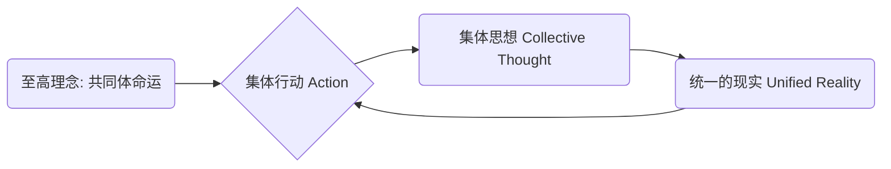
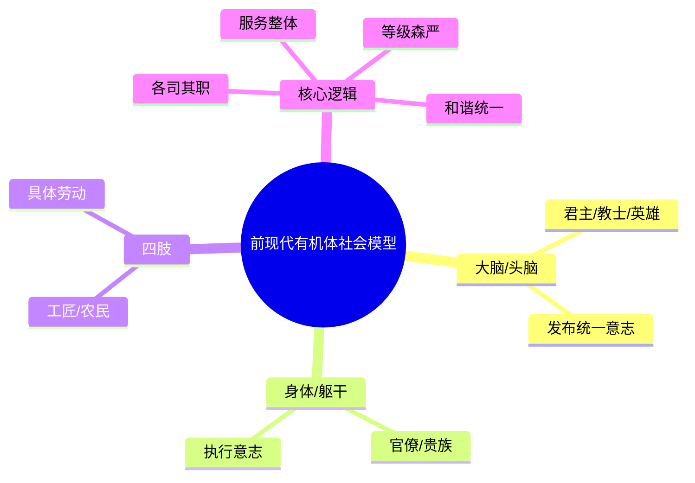
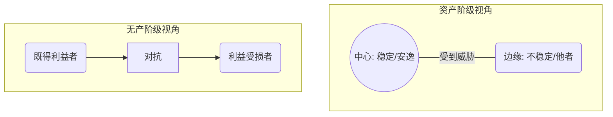

---
{"dg-publish":true,"permalink":"/1-3 唯我论/1-3-1 伪唯心主义/1-3-1-3 现实唯心主义/","created":"2025-09-19T20:52:29.474+08:00","updated":"2025-09-22T22:25:49.099+08:00"}
---

### **一、本章概览**
- **主义主义编码**: 1-3-1-3
- **意识形态命名**: [[现实唯心主义\|现实唯心主义]] (Actual Idealism) / [[行动唯心主义\|行动唯心主义]] (Idealism of Action)
- **核心论断**: 该意识形态通过将“[[集体行动\|集体行动]]”奉为至高的中介，来强行调和[[集体秩序\|集体秩序]]与[[个体普遍性\|个体普遍性]]之间的矛盾。它本质上是一种将社会问题归结为“人心不齐”，并试图通过一种前现代的、英雄主义式的暴力行动来强制实现思想统一的[[9 未命名/意识形态\|意识形态]]。
- **你能获得**: 读完本笔记，你将掌握对 1-3-1-3 意识形态的完整“四格”诊断框架，理解其如何通过抬高“[[行动\|行动]]”的地位来压制[[9 未命名/现代性\|现代性]]矛盾，并能识别其在历史（如[[5 主义/法西斯主义\|法西斯主义]]）与现实中“拧绳哲学”话语的体现。

---
### **二、核心内容解析**

#### **“主义主义”四格分析**

1.  **场域之“1” (Ontology)**：该意识形态预设了一个统一、均质且不被反思的[[世界\|世界]]框架。这个世界是一个单一的舞台，所有人和事件都在这个共享的、无缝的背景中展开。它不承认[[世界\|世界]]本身可能存在结构性的分裂或根本性的对立（如阶级对立），而是将所有冲突都理解为这个统一背景下的“不和谐音”。这种对[[存在论\|存在论]]背景的整全性（1）幻想，是其后续提出“万众一心”解决方案的根本前提，因为它首先假设了所有人脚下踩的是同一块坚实、完整的大地。

2.  **本体之“3” (Body)**：在该意识形态中，真正实在的本体是[[精神\|精神]]（Mind/Spirit），但这个[[精神\|精神]]并非孤立的个体意识，而是一个中心化的、起中介作用的集体精神。数字“3”的特征在此体现为，这个[[精神\|精神]]是一个能够调和与统合所有个体的核心。它不是简单的个体精神之和，而是一个优先于个体的、具有主动性的“共同体意志”。它就像一个中央处理器，将所有人的心灵都视为其终端，从而克服了[[主观唯心主义\|主观唯心主义]]中的个体孤立性。

3.  **现象之“1” (Phenomenon)**：主体的感知与经验被认为是统一且无差别的。既然[[世界\|世界]]（场域1）是统一的，[[精神\|精神]]（本体3）是中心化的，那么每个个体的心灵体验（[[现象\|现象]]）也必然是同质的。这种意识形态会宣称“人同此心，心同此理”，任何偏离这种统一体验的[[主体性\|主体性]]都会被视为一种错误或病态。数字“1”在此处意味着个体经验的丰富性与差异性被彻底抹平，所有人都被期待拥有相同的感知、相同的情感，从而为“[[集体行动\|集体行动]]”扫清障碍。

4.  **目的之“3” (Purpose)**：该意识形态的最终[[9 未命名/目的论\|目的论]]是通过一个核心中介——“[[行动\|行动]]”(Action)——来弥合一切矛盾，实现绝对的统一。这里的“3”是解决问题的关键。面对[[理学\|理学]]（1-3-1-1）的压抑性和[[心学\|心学]]（1-3-1-2）的颠覆性之间的冲突，它提出的方案既不是压抑也不是内省，而是用一种外在的、集体的、往往是暴力的“[[行动\|行动]]”来强行“拧绳”。这个[[行动\|行动]]本身成为了目的，它优先于思考和个人意志，通过让所有人“动起来”，从而在一个更高的层面上实现所谓的“万众一心”。

#### **其他核心知识点**

##### 集体行动的优先性
在[[现实唯心主义\|现实唯心主义]]中，“[[行动\|行动]]”被提升到了一个本体论的高度，它不再是思想的结果，反而成为了思想的生产者。这种意识形态认为，一个统一的集体思想并非通过教育或辩论产生，而是通过共同的、无差别的“[[行动\|行动]]”被塑造出来。它颠倒了“先思后行”的常理，主张“先行后思”，甚至“行动即思考”。这种对行动的极端推崇，使其具有强烈的反智主义和意志主义色彩，因为它认为，只要集体意志驱动的行动开始，现实和思想就会随之被创造和统一，一切内在的矛盾和疑虑都可以在共同的运动中被消解。

**举例阐释**：[[5 主义/法西斯主义\|法西斯主义]]的崛起便是典型。它不首先致力于构建一套逻辑自洽的理论体系，而是强调游行、集会、街头斗争等“[[行动\|行动]]”。通过这些集体行动，参与者的思想被统一起来，一种“我们”的集体认同被塑造出来，而这种被行动所塑造的“集体思想”又反过来为其暴力行动提供了合法性辩护，形成了一个自我强化的闭环。

##### 前现代的有机体社会幻想
这种意识形态本质上是对[[9 未命名/现代性\|现代性]]社会中真实存在的、不可调和的矛盾的一种逃避，其解决方案是退回到一种[[前现代\|前现代]]的社会想象中。它将社会想象成一个“[[有机体社会\|有机体社会]]”（Organic Whole），其中每个部分（个人或阶级）都像身体的器官一样，拥有固定的功能，并服务于一个统一的整体意志（通常由“大脑”或“英雄”代表）。这种想象抹杀了[[9 未命名/现代性\|现代性]]社会中个体自由、阶级对立等核心特征，将一切社会问题都简化为有机体内部的“失调”，而解决方法自然就是加强中央控制，让所有器官“如臂使指”。

**举例阐释**：中世纪的等级社会就是典型的[[有机体社会\|有机体社会]]。教士负责灵魂（头），贵族负责保卫（手臂），农民负责生产（腿脚），每个阶层各司其职，共同构成一个和谐的基督教王国。[[现实唯心主义\|现实唯心主义]]借用了这种模型，但将其极端化为“亿万人如一人”，彻底取消了各部分之间的任何差异。

##### 社会图景的视差
讲稿的核心批判在于，[[现实唯心主义\|现实唯心主义]]所依赖的“统一现实”基础是虚假的。[[9 未命名/现代性\|现代性]]社会的基本特征恰恰在于其内在的分裂，不同阶级对社会现实的看法存在着不可通约的“[[视差\|视差]]”。资产阶级倾向于将社会看作一个稳定的中心，不断受到外部不稳定因素（如无产阶级的反抗）侵扰的圆形结构。而无产阶级则将社会理解为一个由两大对立阶级构成的二元对抗结构。1-3-1-3意识形态完全无视这种根本性的分裂，强行宣称只存在一种社会图景，并以暴力手段消灭另一种。

**举例阐释**：当发生工人罢工时，在资产阶级的视角下，这是一群“外部的麻烦制造者”在破坏“我们”社会的稳定与和谐。而在工人的视角下，这是生产关系内部固有的阶级矛盾的必然爆发。[[现实唯心主义\|现实唯心主义]]会采纳前一种视角，将罢工定义为需要通过强力“[[行动\|行动]]”来清除的外部威胁，从而掩盖了社会本身的内在对抗。

---
### **三、关键观点提取**
- “天下所有的问题，社会共同体所有的问题，在于人心...我们就要通过一种[[行动\|行动]]去把这个人心给他齐一齐。”
- “他这里的模式，它是[[前现代\|前现代]]的模式...是这个社会就像个人体一样，是一个[[有机体社会\|有机体社会]]。”
- “这种[[行动\|行动]]...总会体现出某种[[暴力\|暴力]]...这叫秀才遇到兵，有理说不清。这个1-3-1-2的秀才遇到这个兵，他有理说不清。”
- “这个矛盾它被一种看上去最激进的一种[[集体行动\|集体行动]]理论...他把这个[[集体行动\|集体行动]]给他哲学化...实际上是就是用上面这个东西把它给杀了。”
- “这个东西我们会把它叫做一种...[[英雄崇拜\|英雄崇拜]]...他就是让天下最大的问题，是心不齐。”

---
### **四、知识点问答**
#### Q: 为何1-3-1-3意识形态必然导向“英雄崇拜”而非“圣人崇拜”？
A: “圣人”（如[[心学\|心学]]的代表）是通过向内的自我收缩，触及一种抽象的、批判性的[[普遍性\|普遍性]]，这种[[普遍性\|普遍性]]往往与现存的[[集体秩序\|集体秩序]]构成紧张关系。而“英雄”则恰恰相反，他是那个发动和领导“[[集体行动\|集体行动]]”的核心，是集体意志的人格化身。在该意识形态中， 矛盾的解决依赖于外在的、统一的“[[行动\|行动]]”，就必须有一个发出行动指令的中心。这个中心便是“英雄”，他的意志被等同于共同体的命运，其行动的决断力取代了圣人的内省思辨。
#### Q: “行动优先于思想”在1-3-1-3体系中具体起到了什么意识形态功能？
A: 它起到了规避理性反思和掩盖内在矛盾的核心功能。如果“思想优先”，人们就会追问“我们为何要行动？”“行动的目标是否正义？”等问题，这会暴露社会内部的分裂。而“[[行动\|行动]]优先”则创造了一种紧急状态，通过“先动起来再说”的逻辑，将所有人都卷入一场共同的运动中。在这种运动的狂热中，个体的批判性思考被悬置，共同的身份在行动中被锻造出来，从而在实践层面强行制造出一种虚假的团结，掩盖了行动背后真实的矛盾。
#### Q: 如何理解讲稿中提到的“这个action就是强行弥合collective和subjective这两个维度”？
A: 这句话指出了1-3-1-3的核心运作机制。在[[前现代\|前现代]]社会，collective（集体秩序，如[[理学\|理学]]）和subjective（个体内心，如[[心学\|心学]]）之间存在深刻矛盾。1-3-1-3的方案就是引入一个第三者——暴力的“[[集体行动\|集体行动]]”。这个[[行动\|行动]]既是集体的（collective），因为它要求所有人参与；又作用于每个人的主观能动性（subjective），强迫其服从。它就像一根暴力的“绳子”，把代表集体秩序的一端和代表个体反抗的另一端强行“拧”在一起，用行动的不可置疑性，替代了理性的调和。

---
### **五、知识延伸**
- **[[乔万尼·秦梯利\|乔万尼·秦梯利]] (Giovanni Gentile)**: 本讲稿分析的“[[现实唯心主义\|现实唯心主义]]”的提出者，被誉为“[[5 主义/法西斯主义\|法西斯主义]]的哲学家”。他的哲学直接服务于[[墨索里尼\|墨索里尼]]的政权，将国家理解为一个伦理和精神的实体，而个体只有在完全融入国家意志的“[[行动\|行动]]”中才能实现自身。他的思想是1-3-1-3意识形态最经典的理论样本。
- **[[卡尔·施密特\|卡尔·施密特]] (Carl Schmitt)**: 施密特的政治哲学与1-3-1-3有强烈的共鸣。其“决断论”强调主权者通过决断创造秩序，这与“[[行动\|行动]]”优先于规则的思想一致。其“敌我之分”的政治本质论，也为那种通过制造外部敌人来凝聚内部的“[[集体行动\|集体行动]]”提供了理论基础。将施密特与秦梯利进行对比阅读，可以更深刻地理解这种意志主义政治哲学的内核。
- **电影《[[浪潮\|浪潮]]》(Die Welle)**: 这部电影是一个关于1-3-1-3意识形态如何在微观环境中形成的绝佳寓言。一位老师为了向学生解释独裁统治的形成，发起了一个模拟实验。通过统一的着装、手势和口号（即“[[集体行动\|集体行动]]”），学生们迅速形成了一个高度排外的集体，压制了个体差异。电影生动地展示了“[[行动\|行动]]”如何塑造思想，以及这种集体狂热最终如何导向[[暴力\|暴力]]。

---
## 双链关联总结
- **一级关联 (核心意识形态与概念)**: [[现实唯心主义\|现实唯心主义]]、[[行动唯心主义\|行动唯心主义]]、[[集体行动\|集体行动]]、[[有机体社会\|有机体社会]]、[[英雄崇拜\|英雄崇拜]]、[[拧绳哲学\|拧绳哲学]]
- **推测相关人物 (Speculated Figures)**: [[墨索里尼\|墨索里尼]]（讲稿明确指出）、所有强调“意志”与“行动”来凝聚国家，并视内部异议为根本威胁的威权主义领袖。
- **二级关联 (上下文与背景)**: [[主页\|主页]]、[[5 主义/法西斯主义\|法西斯主义]]、[[客观唯心主义\|客观唯心主义]]、[[主观唯心主义\|主观唯心主义]]、[[理学\|理学]]、[[心学\|心学]]、[[政治哲学\|政治哲学]]、[[乔万尼·秦梯利\|乔万尼·秦梯利]]
- **三级关联 (推测与延展)**: [[卡尔·施密特\|卡尔·施密特]]、[[视差\|视差]]、[[前现代\|前现代]]、[[9 未命名/现代性\|现代性]]、[[暴力\|暴力]]、[[9 未命名/意识形态\|意识形态]]、[[决断论\|决断论]]、[[主体性\|主体性]]、[[普遍性\|普遍性]]