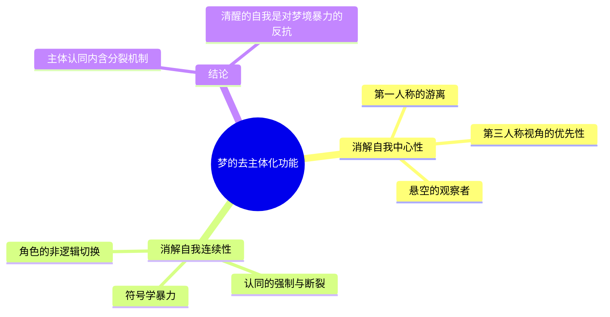
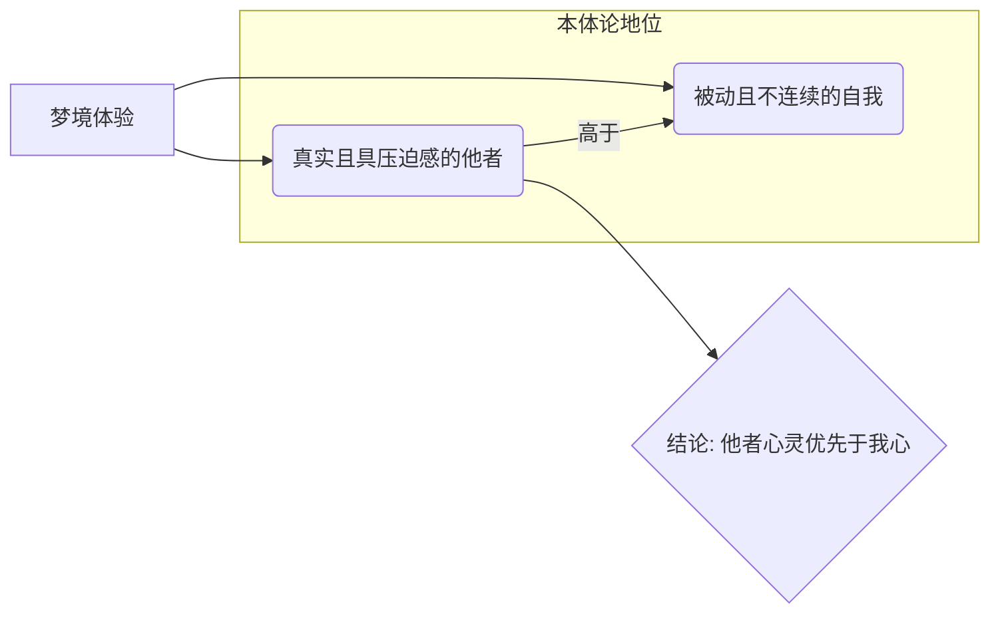
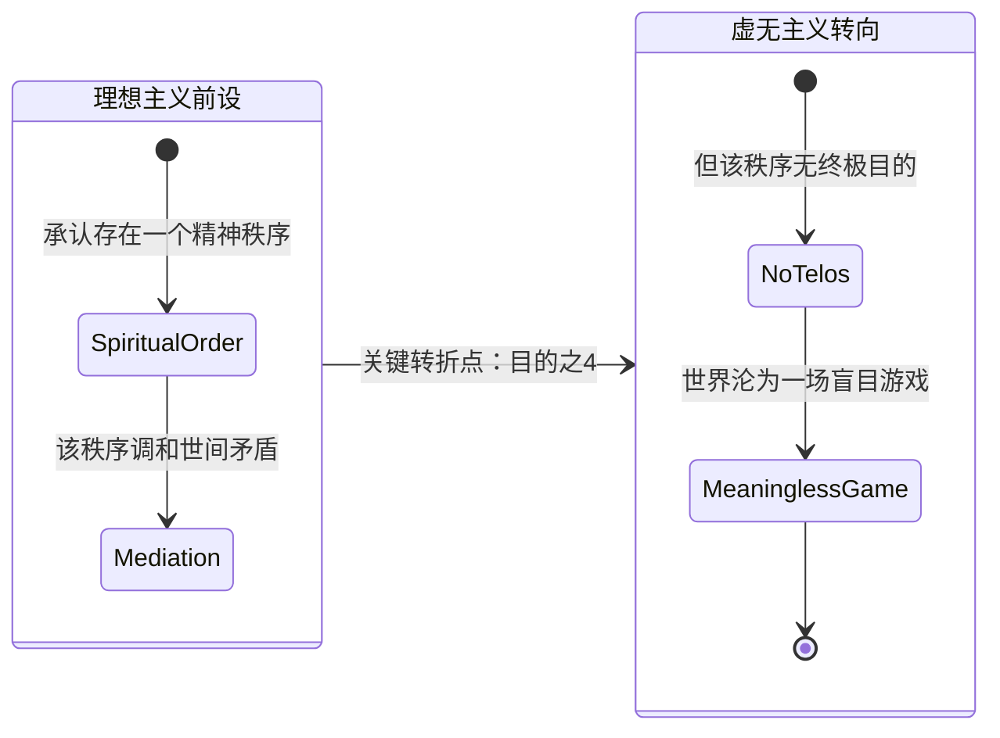

---
{"dg-publish":true,"permalink":"/1-3 唯我论/1-3-1 伪唯心主义/1-3-1-4 唯梦论/","created":"2025-09-19T20:52:29.477+08:00","updated":"2025-09-22T22:20:27.129+08:00"}
---

### **一、本章概览**
- **主义主义编码**: 1-3-1-4
- **意识形态命名**: [[唯梦论\|唯梦论]] / [[梦境主义\|梦境主义]]
- **核心论断**: “唯梦论”是一种理想主义的虚无主义，它将整个世界理解为一个由至高精神主宰的、无终极目的的梦境。在此梦境中，个体的[[主体性\|主体性]]被消解，而[[他者\|他者]]的真实性反而优先于自我，最终导致所有集体与个人的奋斗都化为一场无意义的、不断切换场景的戏剧。
- **你能获得**: 通过本笔记，你将掌握 1-3-1-4 意识形态的完整结构，理解“人间如梦”这一古典意象在哲学层面上的深刻含义，特别是它如何通过独特的[[主体性\|主体性]]和[[9 未命名/主体间性\|主体间性]]理论，消解了庸俗唯心主义中常见的集体与个人之间的张力，并最终导向一种独特的[[虚无主义\|虚无主义]]。

---
### **二、核心内容解析**

#### **“主义主义”四格分析**

1.  **场域之“1” (Ontology)**：该意识形态预设的世界框架是一个统一、封闭且无所不包的整体。这个[[世界\|世界]]如同一个巨大的舞台或是一个连续的梦境，由一个单一的、绝对的精神（Spirit）所统摄。万事万物都在这个唯一的、无外部的场域中发生，不存在逃离这个“梦境”的可能性。它是一个整全的宇宙剧场，所有的存在者都只是这个剧场中的角色，共享同一个本体论背景，不存在真正的“域外”。

2.  **本体之“3” (Body)**：在这个统一的舞台上，世界的内在构成是一种由中心调和的对立关系。具体来说，是“一”（至高、普遍的[[Being\|Being]]）与“多”（杂多、具体的 beings）之间的矛盾。这个矛盾并非直接冲突，而是由一个中介者——[[精神\|精神]]（Spirit）——来进行中心化的调和与支配。这个[[精神\|精神]]赋予了万物秩序，使得每一个具体的存在者都能通过分有至高[[Being\|Being]]的概念（即“东西性”）而被整合进一个等级化的体系中。

3.  **现象之“1” (Phenomenon)**：主体的感知和经验是完全被动和统一的。个体的[[心灵\|心灵]]（mind）只是一个接收器，一个不幸的受体（unfortunate receptor），单向地承载着那个至高[[精神\|精神]]所导演的梦境。在这个框架下，不存在真正独立的[[主体性\|主体性]]或自由意志，所有个体的感知、认同和体验都由这个统一的、前认识论的本体性力量所规定。个体的[[现象\|现象]]体验是同质化的，因为它们都源自同一个“造梦主”。

4.  **目的之“4” (Purpose)**：该意识形态的[[9 未命名/目的论\|目的论]]是虚无的，其运动最终导向消散与解体。数字“4”在此处代表内在的分裂、不可能性与空洞。这个由[[精神\|精神]]主宰的宇宙之梦，虽然在场域、本体和现象上看似统一有序，但其运动本身没有任何终极目标。它既非为了达成永恒的循环（1），也非为了在对抗中决出胜负（2），更不是为了向某个核心不断汇集和沉淀（3）。它的运动是盲目的、随意的，最终会像梦一样“醒来”或消散，一切冲突与纠葛都变得毫无意义，这正是其[[虚无主义\|虚无主义]]特性的根源。

#### **其他核心知识点**

##### 梦的去主体化功能
“唯梦论”的核心机制在于它揭示了梦境所具有的强大的[[去主体化\|去主体化]]功能。它并非简单地否定“我”的存在，而是从结构上瓦解了清醒状态下稳固的自我意识。这一过程主要通过两个层面实现：首先是**消解自我中心性**，在梦中，我们常常体验到视角切换，第一人称会轻易地游离为第三人称的“悬空观察者”，自我的核心地位被动摇；其次是**消解自我连续性**，梦境通过一种不由分说的“符号学暴力”，强行让我们认同于不断变化的角色与情境，前一个“我”的剧情尚未结束，就可能被切换到下一个完全无关的“我”，从而打断了自我认同的线性时间感。这种机制揭示了[[主体性\|主体性]]的构建本身就内含着断裂和自我背叛。

**举例阐释**：讲稿中提到，醒来后我们之所以固执地认同于一个连续、中心化的自我，恰恰是因为在梦中被那种随意支配、撕裂我们认同的力量“吓到了”。清醒的自我同一性，是对“我本可以是谁（I can be anyone）”这一梦中真相的压抑和否定。

##### 梦境中的他者优先性
与[[唯我论\|唯我论]]将他者视为“我”的投射或模拟不同，[[唯梦论\|唯梦论]]提出了一个悖论性的观点：在梦境中，[[他者\|他者]]的真实性与本体论地位反而优先于“我”。梦中的自我（dream-self）往往是被动的、被情绪裹挟的、随时可以被牺牲的“蹩脚的我”；而梦中的[[他者\|他者]]——无论是你恐惧的敌人还是贪恋的爱人——却常常是无法摆脱、极其真实且具有强大行动力的存在。他们构成了梦境的核心张力，是驱动剧情的关键。这种体验表明，他者的心灵并非派生于我心，反而，“我”是在与这些更具真实感的[[他者\|他者]]的关系网络中被临时定义的。

**举例阐释**：你在梦里被一个怪物追赶，那个怪物的压迫感、真实感和它对你造成的恐惧，远远比你那个只会惊慌逃窜的“自我”要来得更加坚实和不可动摇。这个怪物（[[他者\|他者]]）定义了整个梦境的基调和你的存在状态。

##### 理想主义的虚无主义
“唯梦论”被定性为一种极为罕见的“理想主义的虚无主义”。其“理想主义”体现在它承认并设定了一个统摄万物的、超越性的[[精神\|精神]]秩序（Spiritual Order），这个秩序调和了存在者内部的矛盾，是[[世界\|世界]]的终极实在。然而，其“虚无主义”则源于其[[9 未命名/目的论\|目的论]]的“4”编码。这个至高的[[精神\|精神]]秩序虽然存在，但它的运作是盲目的、无目的的，就像一场永不落幕却毫无意义的游戏。它玩弄着世间万物和所有心灵，却不导向任何终点。因此，尽管存在一个“理想”的绝对精神，但其本质却是虚无的，这在中国古代[[士大夫\|士大夫]]阶层中表现为一种看破红尘、消极厌世的姿态。

**举例阐释**：[[苏轼\|苏轼]]在《[[前赤壁赋\|前赤壁赋]]》中所言：“盖将自其变者而观之，则天地曾不能以一瞬；自其不变者而观之，则物与我皆无尽也。”这正体现了“唯梦论”的双重视角：一方面，万物在梦境般的[[世界\|世界]]中瞬息万变（变者）；另一方面，主宰这场变化的那个不变的“梦”本身（不变者）却是永恒的。然而，这种永恒没有带来慰藉，反而因其无目的性而让人感叹“何羡乎”，最终导向一种超脱的虚无感。

---
### **三、关键观点提取**
- “在梦境里面这个自我...与其说你是从第一人称去体验...你不如说这个第一人称天然的就带有一种第三人称...第三人称视角某种意义上具有某种优先性。”
- “主体的同一性，主体认自我认同的...机制内在的实际上它是一种裂解的力量，他恰恰是通过这种分离来实现了认同。”
- “真正的[[唯梦论\|唯梦论]]者...他是一个[[他者\|他者]]的心灵优先于我的...优先于我的[[心灵\|心灵]]。”
- “清醒状态的自我同一性是依靠对于梦境的这种暴力...的一种反抗，对于这种暴力的否定，试图掩盖一个丑闻...其实 i can be anyone。”
- “这种理想主义就是一种...[[虚无主义的理想主义\|虚无主义的理想主义]]。这个东西很...少见...但是在中国文化里面恰恰有这种东西，就[[士大夫\|士大夫]]那种消极厌世的那种态度。”

---
### **四、知识点问答**
#### Q: “唯梦论” (1-3-1-4) 如何巧妙地消解了其他庸俗唯心主义（如1-3-1-1和1-3-1-2）所面临的“集体”与“个人”的对立？
A: 其他庸俗唯心主义纠结于至高的[[精神\|精神]]秩序应由集体伦理（客观唯心主义）还是个人良心（主观唯心主义）来承接。而[[唯梦论\|唯梦论]]通过将整个[[世界\|世界]]框架设定为一场梦，从根本上瓦解了“个人”与“集体”这两个对立项的坚固性。在梦中，“个人”的[[主体性\|主体性]]是 fragmented 和 de-centered 的，而“集体”（由无数真实的[[他者\|他者]]构成）虽然看似强大，但其内部的冲突和关系也是混乱且无目的的。最终，两者都被置于一个更高的“梦的主宰”视角下，被视为这场无意义游戏中的不同棋子，因此它们之间的对立也失去了终极意义。

#### Q: 为什么说“唯梦论”中的“他者”是基督教或拉康意义上的“邻人”(Neighbor)？
A: 因为在梦境中，[[他者\|他者]]并非一个可以被客体化、可以保持安全距离的陌生人。他们是无法甩掉、与“我”发生着紧张纠葛的存在，其切近性（proximity）和真实性甚至比现实中的人更强。这种无法被符号系统完全整合、既爱又恨、既吸引又排斥的、具有创伤性临近性的[[他者\|他者]]，正是“[[邻人\|邻人]]”概念的核心。他们是栖居在我们[[心灵\|心灵]]内部、对我们产生直接效力的存在，而非外部的、可有可无的交往对象。

#### Q: 为何讲稿称这种思想在西方哲学中罕见，却在中国士大夫文化中存在？
A: 这可能源于文化与哲学传统的差异。西方主流哲学，尤其是启蒙以降，非常强调一个强大、自主、连续的理性[[主体性\|主体性]]，并且[[9 未命名/目的论\|目的论]]传统深厚（无论是神学目的论还是历史目的论）。因此，一个彻底消解[[主体性\|主体性]]且否定终极目的的框架难以成为主流。相反，中国[[士大夫\|士大夫]]文化深受道家和佛教思想影响，前者有[[庄周梦蝶\|庄周梦蝶]]对真实性的根本质疑，后者有“万法皆空”的观念。加之官场沉浮带来的政治幻灭感，使得士大夫阶层更容易产生一种将人生视为一场宏大而无谓之梦的姿态，以此获得精神上的超脱。

---
### **五、知识延伸**
- **[[庄周梦蝶\|庄周梦蝶]]**: 这是中国哲学中探讨“物我”关系与现实虚幻界限的最著名典故。庄子梦蝶，不知是庄周梦蝶还是蝶梦庄周，完美地诠释了[[唯梦论\|唯梦论]]中自我认同的不确定性与视角的可逆转性，是[[唯梦论\|唯梦论]]的哲学源头之一。
- **电影《[[盗梦空间\|盗梦空间]]》(Inception)**: 这部电影将梦境的层次性、主体在梦中的脆弱性、以及梦中[[他者\|他者]]（“前意识投影”）的强大力量进行了视觉化呈现。它探讨了梦境逻辑如何侵蚀现实感知，以及一个强大的“造梦主”如何操控他人的体验，可视为对[[唯梦论\|唯梦论]]中“精神主宰”与“被动心灵”关系的现代寓言。
- **[[苏轼\|苏轼]]《[[前赤壁赋\|前赤壁赋]]》**: 作为讲稿直接引用的文本，它集中体现了[[士大夫\|士大夫]]在面对浩瀚宇宙与个体渺小、永恒时间与短暂生命时所产生的哲学思考。文中“逝者如斯，而未尝往也；盈虚者如彼，而卒莫消长也”的观点，正是对[[唯梦论\|唯梦论]]中“不变的造梦者”与“变化的梦中景”这一核心矛盾的诗意表达。

---
### **六、双链关联总结**
- **一级关联 (核心意识形态与概念)**: [[唯梦论\|唯梦论]]、[[梦境主义\|梦境主义]]、[[庸俗唯心主义\|庸俗唯心主义]]、[[去主体化\|去主体化]]、[[他者优先性\|他者优先性]]、[[理想主义的虚无主义\|理想主义的虚无主义]]、[[精神\|精神]]
- **推测相关人物 (Speculated Figures)**: [[苏轼\|苏轼]] (作为该意识形态的典型实践者，体现了士大夫在政治失意后的虚无与超脱)、[[庄子\|庄子]] (作为该思想的哲学先驱)
- **二级关联 (上下文与背景)**: [[主页\|主页]]、[[存在论\|存在论]]、[[9 未命名/现象学\|现象学]]、[[9 未命名/目的论\|目的论]]、[[主体性\|主体性]]、[[9 未命名/主体间性\|主体间性]]、[[士大夫\|士大夫]]、[[符号学暴力\|符号学暴力]]
- **三级关联 (推测与延展)**: [[唯我论\|唯我论]]、[[虚无主义\|虚无主义]]、[[邻人\|邻人]]、[[庄周梦蝶\|庄周梦蝶]]、[[前赤壁赋\|前赤壁赋]]、[[盗梦空间\|盗梦空间]]