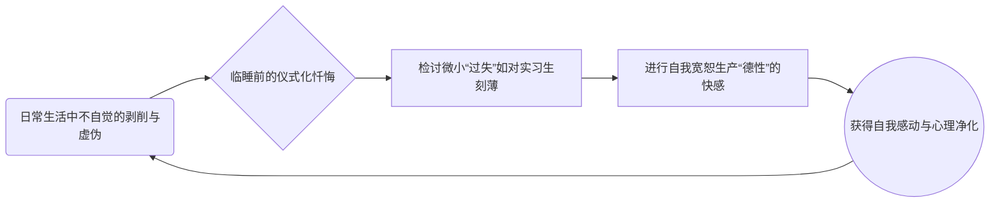
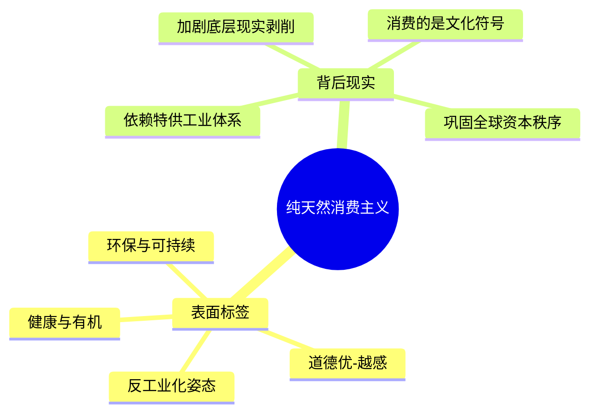
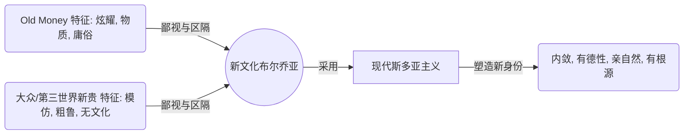

---
{"dg-publish":true,"permalink":"/1-3 唯我论/1-3-2 本真主义/1-3-2-1 现代斯多亚主义/","created":"2025-09-19T20:52:29.485+08:00","updated":"2025-09-22T22:20:30.631+08:00"}
---

### **一、本章概览**
- **主义主义编码**: 1-3-2-1
- **意识形态命名**: [[现代斯多亚主义\|现代斯多亚主义]]
- **核心论断**: “现代斯多亚主义”是一种服务于全球化时代“New Money”精英（尤其是文化、科技领域的布尔乔亚）的意识形态。它通过挪用和炮制一种 sanitized（无害化）的[[古典学\|古典学]]，构建出一套以“内敛德性”和“亲近自然”为核心的文化身份，从而在鄙视“老钱”的庸俗和区隔大众的同时，巧妙地掩盖并巩固其在全球资本主义体系中的优势地位。
- **你能获得**: 你将掌握使用“主义主义”1-3-2-1 编码，诊断并解构当代精英阶层如何运用文化与消费手段进行身份建构与阶级区隔的分析方法。你将理解其核心实践（如仪式化反思、纯天然消费）背后的虚伪性，并洞察其与真正[[古典斯多亚主义\|古典斯多亚主义]]的根本区别。

---
### **二、核心内容解析**

#### **“主义主义”四格分析**

1.  **场域之“1” (Ontology)**：该意识形态预设的世界是一个统一、和谐且完整的[[宇宙\|宇宙]]。这里的“1”与[[古典斯多亚主义\|古典斯多亚主义]]中充满张力的“2”（宇宙 vs 时间）截然不同，它抹除了任何根本性的矛盾。这个场域被默认为是一个稳定、可控的全球化[[5 主义/资本主义\|资本主义]]体系，技术与理性原则上可以解决一切问题，使其无限循环运转。这种整全的世界观，恰恰为身处其中的得利者（新布尔乔亚）提供了一个无需被革命、只需在内部进行“德性”微调的安稳舞台，一切冲突都被预先消解在这个和谐的背景之中。

2.  **本体之“3” (Body)**：在这个统一的世界舞台上，核心的实在是一种至高的、中心化的[[理性\|理性]]（Reason）。这个“3”扮演着调和者的角色，它是判断万物的最终标准，用以区分什么是“自然的”、“合乎德性的”，以及什么是“过度的”、“反常的”。这种[[理性\|理性]]并非古典哲学中超越性的 Logos，而是被新布尔乔亚的阶级利益和生活方式所定义的工具理性。它成为一个中介，将复杂的现实矛盾（如阶级剥削）转化为简单的德性问题（如个人欲望的节制），从而维护了系统的稳定。

3.  **现象之“2” (Phenomenon)**：主体的体验被一个清晰的二元对立结构所规定：[[本真\|本真]] vs [[非本真\|非本真]]。这构成了现象界的“2”。“本真”被定义为符合德性的、自然的、内敛的生活方式；而“非本真”则指向那些过度的、虚伪的、不讲究“吃相”的欲望，尤其指向他们所鄙视的“老钱”（Old Money）的炫耀式消费和第三世界新贵的粗鄙。[[主体性\|主体性]]被牢牢地锚定在这个二元判断中，通过不断进行自我规训（如写忏悔日记）来确认自己属于“本真”的一方，从而获得道德优越感。

4.  **目的之“1” (Purpose)**：该意识形态的最终[[9 未命名/目的论\|目的论]]是回归到“1”，即维护并永恒地重复那个和谐、统一的现有秩序。这个终点不是为了达成某种超越性的解放，而是为了成为一个斯多亚式的“圣贤”（Sage），但这“圣贤”的形象已经被重新编码为：一个在全球化体系内生活得体面、有德性、与“自然”（被消费主义重新定义的自然）和谐共处的成功人士。最终，所有的行为——反思、消费、社交——都是为了让这个由1-3-2构成的结构自我封闭、无限循环，巩固其持有者的优越地位。

#### **其他核心知识点**

##### 虚伪的自我反思仪式
这种意识形态的核心实践是一种仪式化的自我反思，其本质是“加倍的虚伪”。它并非导向真正的自我批判或结构性变革，而是一种用于生产“自我感动”和道德优越感的心理机制。持有者（如新文化布尔乔亚）会在一天结束时，按照预设的德性标准（如宽容、节制）检讨自己的“过失”，然后通过“宽恕自己”这一行为获得一种崇高的道德体验。这个过程形成了一个封闭循环：犯下结构性的恶（作为剥削体系的受益者），进行个体性的、无涉根本的忏悔，获得情感上的净化，然后心安理得地在第二天重复前一天的生活。这种反思从不触及反思标准本身的合理性，也从不质疑他们所处的优势地位。

**举例阐释**：讲稿中生动地描绘了这种场景——跨国公司高管在头等舱里，对自己白天开了个伤害第三世界合作伙伴的玩笑而感到“愧疚”，然后通过一番自我原谅的内心戏，流下感动的泪水，第二天继续维持其在全球体系中的支配地位。这正是将结构性问题个人化、情感化的典型操作。

##### 纯天然消费主义的文化建构
[[现代斯多亚主义\|现代斯多亚主义]]者所推崇的“亲近自然”并非真正的回归自然，而是通过消费特定的商品和服务来建构一种“自然”的文化符号。他们消费的“纯天然”产品，其生产过程往往需要更复杂的现代工业体系来支撑，对真实自然和底层劳动者的损害可能更大。这种消费行为的重点不在于物品本身，而在于消费这一行为所能购买到的“前反思的政治正确”和“消费正确”的身份标签。它是一种将阶级优越感包装成道德优越感的手段，通过消费一个“环保”、“健康”、“有良知”的幻象，来掩盖消费行为背后深刻的社会与环境代价。

**举例阐释**：讲稿中提到的星巴克咖啡杯案例是绝佳的说明。一杯咖啡售价2美元，其中0.01美元捐给危地马拉农民，消费者因此获得了道德满足感。但这种逻辑刻意忽略了其余1.99美元正是维系那个持续伤害农民的全球贸易体系的一环。这种消费模式让他们心安理得地继续“环保地”剥削。

##### “新钱”对“老钱”的文化区隔
[[现代斯多亚主义\|现代斯多亚主义]]是新兴的文化、科技[[布尔乔亚\|布尔乔亚]]（New Money）用来与传统的、更依赖实业和金融的“老钱”（Old Money）进行阶级内部斗争的文化武器。他们鄙视“老钱”张扬、炫耀、有时甚至粗鄙的生活方式（如买油田、搞选美），并试图建立一套新的、以“知识”、“品味”、“德性”和“古典根源”为核心的优越性标准。通过拥抱一种看似内敛、朴素且有文化深度的生活哲学，他们不仅将自己塑造为更高级、更文明的统治阶级，还为自己的新兴权力来源（如信息技术、文化产业）赋予了合法性与高贵性。

**举例阐释**：讲稿提到，这些新兴精英热衷于古典学、艺术设计、人工智能，他们看不起“老钱”打高尔夫、搞家族宫廷政治的做派。他们选择奥勒留的《沉思录》而非豪华游艇，正是用[[文化资本\|文化资本]]来挑战和压制传统[[经济资本\|经济资本]]的体现。

---
### **三、关键观点提取**
- “这种人是加倍虚伪的...然后说到最后一句话，要自己对自己说，我原谅你...然后他就自我感动了，因为他觉得自己这个时候有一种德行叫做宽恕。”
- “他们消费东西纯天然，它实际上是在消费一种[[文化\|文化]]...不如说是他们在建构一种文化，建构一种前反思的。[[政治正确\|政治正确]]，[[消费正确\|消费正确]]。”
- “你这杯咖啡如果是两块钱两刀的话，那你其他的1.99刀全在伤害他，对不对？...他们不去想这个问题的。”
- “这些新兴的[[文化布尔乔亚\|文化布尔乔亚]]，他们在看到那些old money的时候，就鄙视他们的生活方式庸俗的，这种低劣的...他自己要搞一套[[古典学\|古典学]]士的内敛的，然后有根源的。”

---
### **四、知识点问答**
#### Q: 为什么说[[现代斯多亚主义\|现代斯多亚主义]]的“回归自然”恰恰是最不自然的？
A: 因为它所追求的“自然”是一个被高度人工化、资本化的拟像。它依赖于一个庞大的全球工业与物流体系，专门为其特供那些符合“纯天然”标准的消费品。这个过程不仅没有脱离现代[[5 主义/资本主义\|资本主义]]，反而加剧了对真实自然环境的改造和对底层劳动力的剥削。它所谓的“自然”，是一个需要耗费巨额财富才能维系的、与大众隔绝的“主题公园”，是[[文化资本\|文化资本]]的终极体现，而非对现代性的真正反叛。

#### Q: 在1-3-2-1编码中，居于中心的“3”（理性）如何巧妙地服务于该意识形态的持有者？
A: 这里的[[理性\|理性]]“3”充当了一个看似中立、实则充满偏见的仲裁者。它被这群新兴精英定义为能够调和一切的标准，但其评判依据（如何为“德性”，何为“过度”）完全源自他们自身的生活方式与阶级利益。通过这个中心化的[[理性\|理性]]，他们可以将复杂的社会经济矛盾（如贫富差距）降级为个人道德修养问题，从而回避了对整个体系的结构性批判，并将自身的统治地位合理化为“德性”的自然结果。

#### Q: 讲稿中将这群人比作“东林党”，这一历史类比揭示了该意识形态怎样的政治功能？
A: “[[东林党\|东林党]]”的比喻精准地指出了这群精英在政治上的虚伪性和脱离现实性。他们和历史上的东林党人一样，占据道德高地，满口仁义道德（德性、环保、多元文化），对他人的道德瑕疵极为挑剔，却对造成社会问题的根本结构性因素视而不见。他们通过这种清谈式的道德表演，掩盖了自身作为既得利益者的事实，其所谓的“关怀”和“正义”往往是慷他人之慨，并不能带来任何实质性的社会变革，反而巩固了现行秩序。

---
### **五、知识延伸**
- **[[布尔迪厄\|布尔迪厄]]的《[[区分：判断力的社会批判\|区分：判断力的社会批判]]》**: 这本社会学经典是理解[[现代斯多亚主义\|现代斯多亚主义]]背后逻辑的必备理论工具。[[布尔迪厄\|布尔迪厄]]系统阐述了[[文化资本\|文化资本]]、[[经济资本\|经济资本]]和社会资本如何相互作用，以及“品味”和生活方式如何成为阶级区隔与社会再生产的关键机制。[[现代斯多亚主义\|现代斯多亚主义]]正是新兴精英阶层运用[[文化资本\|文化资本]]进行自我合法化和阶级区分的完美案例。
- **[[玛莎·努斯鲍姆\|玛莎·努斯鲍姆]] (Martha Nussbaum)**: 讲稿中猛烈批判的代表人物。了解她的“能力方法”（Capabilities Approach）和关于情感伦理的著作，可以帮助我们理解这种意识形态所挪用的学术资源。通过对比其理论原貌与讲稿中的批判，可以更深刻地思考哲学理论在进入公共领域后，是如何被特定阶级筛选、改造并用作意识形态工具的。
- **电影《[[菜单\|菜单]]》(The Menu, 2022)**: 这部电影辛辣地讽刺了精英阶层将食物和餐饮体验异化为一种关于概念、故事和身份地位的极端消费主义。电影中食客们对“纯天然”、“本地食材”、“概念艺术”的病态追逐，与[[现代斯多亚主义\|现代斯多亚主义]]者对“纯天然消费”的执着如出一辙，两者都揭示了上层阶级在空虚的精神世界中，如何通过消费文化符号来寻求虚假的超越与意义。

---
### ## 双链关联总结
- **一级关联 (核心意识形态与概念)**: [[现代斯多亚主义\|现代斯多亚主义]]、[[1-3 唯我论/1-3-2 本真主义/1-3-2-1 现代斯多亚主义\|1-3-2-1 现代斯多亚主义]]、[[新文化布尔乔亚\|新文化布尔乔亚]]、[[虚伪的自我反思\|虚伪的自我反思]]、[[纯天然消费主义\|纯天然消费主义]]、[[德性伦理学\|德性伦理学]]、[[古典学\|古典学]]、[[本真\|本真]]
- **推测相关人物 (Speculated Figures)**: [[玛莎·努斯鲍姆\|玛莎·努斯鲍姆]] (讲稿中明确的批判对象，被视为该意识形态的学界旗手)、[[奥勒流\|奥勒流]] (被该意识形态挪用为精神偶像)、[[硅谷精英\|硅谷精英]] (讲稿中提及的该意识形态的主要实践人群，如高管、技术新贵)
- **二级关联 (上下文与背景)**: [[主页\|主页]]、[[多元文化主义\|多元文化主义]]、[[全球资本主义\|全球资本主义]]、[[9 未命名/身份政治\|身份政治]]、[[消费主义\|消费主义]]、[[布尔乔亚\|布尔乔亚]]、[[白左\|白左]]、[[后现代\|后现代]]
- **三级关联 (推测与延展)**: [[布尔迪厄\|布尔迪厄]]、[[文化资本\|文化资本]]、[[《区分：判断力的社会批判\|《区分：判断力的社会批判]]》、[[东林党\|东林党]]、[[古典斯多亚主义\|古典斯多亚主义]]、[[理性\|理性]]、[[欲望\|欲望]]、[[政治正确\|政治正确]]、[[《菜单\|《菜单]]》