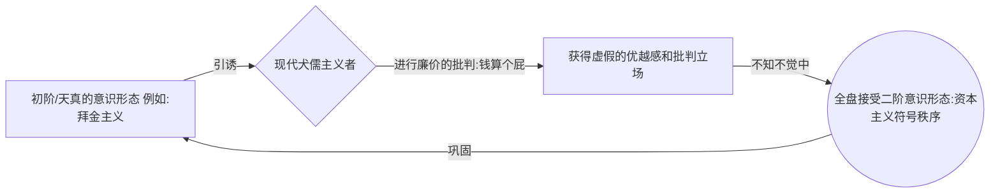
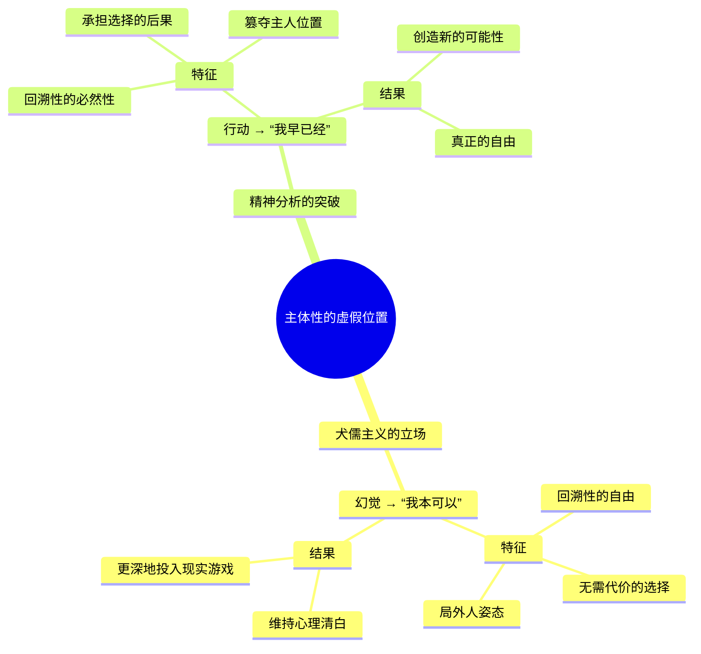
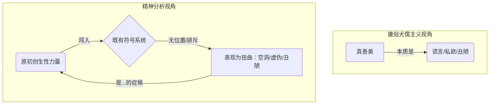

---
{"dg-publish":true,"permalink":"/1-3 唯我论/1-3-2 本真主义/1-3-2-2 现代犬儒主义/","created":"2025-09-19T20:52:29.491+08:00","updated":"2025-09-23T00:13:47.557+08:00"}
---

### **一、本章概览**
- **主义主义编码**: 1-3-2-2
- **意识形态命名**: [[现代犬儒主义\|现代犬儒主义]] (Modern Cynicism)
- **核心论断**: [[现代犬儒主义\|现代犬儒主义]]并非对意识形态的真正颠覆，它本身就是一种更高级、更隐蔽的意识形态。它通过“批判”一个虚构的、天真的初阶意识形态（幌子），来让主体获得一种廉价的、无需付出任何代价的批判性立场，从而更深地被现实的[[符号系统\|符号系统]]所俘获。
- **你能获得**: 你将掌握[[现代犬儒主义\|现代犬儒主义]] (1-3-2-2) 的内在结构，理解现代意识形态如何通过“自反性”运作，学会识别“[[我本可以\|我本可以]]”这种虚假自由的陷阱，并了解[[9 未命名/精神分析\|精神分析]]视角下突破这种困境的可能路径。

---
### **二、核心内容解析**

#### **“主义主义”四格分析**

1.  **场域之“1” (Ontology)**：[[现代犬儒主义\|现代犬儒主义]]预设了一个统一、封闭且永恒不变的[[世界\|世界]]框架。这个框架在当代就是[[5 主义/资本主义\|资本主义]]的文化共同体。犬儒主义者虽然在姿态上鄙视其中的一切，但其行为和思考都发生在这个封闭的系统内部，从未真正质疑过这个舞台本身。他们相信这个充满“套路”和“蝇营狗苟”的[[世界\|世界]]是唯一真实的，并且会“千秋万代”地持续下去，不存在任何历史性的突破或变革可能，一切都只是在这个统一场域内的无限循环。

2.  **本体之“3” (Body)**：在该意识形态中，世界的真实内容被一个至高的、中心化的精神或原则所调和，讲稿中称之为“[[理性的狡计\|理性的狡计]]”。犬儒主义者将自己想象成与这个至高精神同谋的冷眼旁观者，俯瞰着世人被自身的卑劣动机所玩弄。这个“精神”扮演了中介者的角色，它调和了终极的抽象力量（大写的 Being）与具体的、不断背叛这种力量的个体存在（小写的 being）之间的矛盾，确保所有人的“蝇营狗苟”最终都在服务于一个更大的、统一的秩序。

3.  **现象之“2” (Phenomenon)**：犬儒主义者的主体经验建立在一个清晰的二元对立之上：即“高尚的谎言”与“卑劣的现实”之间的对抗。一方面是公开宣称的、冠冕堂皇的意识形态（幌子），另一方面是背后实际驱动人们行为的、自私自利的蝇营狗苟。主体性就体验为洞悉了这对矛盾的“清醒者”。这种对立是外在的、对称的，犬儒主义者通过不断戳破“谎言”来确认自己掌握了“现实”，从而维持一种虚假的本真感。

4.  **目的之“2” (Purpose)**：该意识形态的[[9 未命名/目的论\|目的论]]同样建立在二元对立上，即“公共宣称的目的”与“私人真实的目的”之间的永恒冲突。前者被视为虚伪的，后者（通常被归结为暴力、色情、永生等原始欲望）则被视为丑陋但真实的。犬儒主义者认为，人永远在这两种目的之间撕扯，而这种对立本身就是最终的结局，不会有任何调和或超越。他们满足于指出这种分裂，并将其作为一切行为的终极解释，从而放弃了创造任何新目的的可能性。

#### **其他核心知识点**

##### 现代意识形态的自反性
[[现代意识形态\|现代意识形态]]的运作机制已不再是天真地让人相信某个理念，而是通过邀请主体去“批判”它来生效。它会故意抛出一个简单、天真的初阶意识形态（如“金钱万能”），引诱犬儒主义者来戳破它。然而，犬儒主义者在进行这种“零元购”式的廉价批判时，所使用的语言、姿态和预设，恰恰就是那个真正起作用的、更深层次的二阶意识形态。通过批判幌子，你反而全盘接受了支撑这个幌子的整个框架。这种机制是自反的（Self-reflective），它将对自身的批判也整合为自身运作的一部分。

**举例阐释**：当一个人批判“[[拜金主义\|拜金主义]]”的虚荣时，他通常会说“钱买不来真正的幸福”。这句话本身就默认了“钱”是一个拥有巨大力量、能够衡量一切的通用等价物，只是其效力范围有限而已。他批判的只是钱的“表面”，却彻底臣服于钱作为社会资源调配核心的“里子”，从而更深地陷入了[[5 主义/资本主义\|资本主义]]的[[符号系统\|符号系统]]。

##### “我本可以”的虚假自由
“[[我本可以\|我本可以]]”（I could have...）是[[现代犬儒主义\|现代犬儒主义]]者维系其主体幻觉的核心句法。这句话构建了一个虚构的回溯性立场，仿佛主体拥有一个可以自由选择是否要“同流合污”的局外人位置。犬儒主义者在现实中完全投入地玩着各种套路，但通过在内心里默念“我本可以不说谎”或“我本可以拒绝”，来为自己保留一种廉价的清白和自由感。这是一种纯粹的意识形态操作，它提供了一个虚假的安全距离，让你在心理上与自己的行为剥离，从而更安稳地维持现状。

**举-例阐释**：一个职场“老油条”，他深谙办公室政治并乐在其中，但常常对新人感叹：“唉，我本可以像你一样单纯，但人在江湖身不由己。” 这句话就是典型的“[[我本可以\|我本可以]]”，它让此人在享受着蝇营狗苟带来的好处的同时，还保留了一份“道德上”的纯洁，这便是最深刻的虚伪。

##### 真相、善恶与美的精神分析式颠倒
[[现代犬儒主义\|现代犬儒主义]]者将世俗的“真善美”还原为其对立面：真相背后是谎言，善行背后是私欲，美的背后是丑陋的肉欲。这是一种低仿的、庸俗化的[[9 未命名/精神分析\|精神分析]]。在真正的[[拉康\|拉康]]式[[9 未命名/精神分析\|精神分析]]中，确实存在类似的颠倒，但原因完全不同。[[真善美\|真善美]]在[[符号系统\|符号系统]]中之所以最初会以“空洞、虚伪、丑陋”的面目显现，并非因为它们的本质如此，而是因为一种原初的、创生性的力量在试图闯入一个既有的、僵化的符号秩序时，没有为它预留的位置。它的降临只能表现为对现有秩序的撕裂、扭曲和崩解，因而显得“丑陋”或“虚无”。

**举例阐释**：当一种全新的艺术形式出现时，最初往往被主流审美斥为“丑陋”、“无意义”或“虚无”（如印象派、立体主义的遭遇）。犬儒主义者会说“这背后不过是想出名的把戏”，而[[9 未命名/精神分析\|精神分析]]则会看到，这种“丑陋”恰恰是新的美学原则在冲击旧有美学[[符号系统\|符号系统]]时产生的症候性表现。

---
### **三、关键观点提取**
- “现代[[9 未命名/意识形态\|意识形态]]恰恰就表现为对意识形态的批判...你恰恰是你戳破了他，你才被这个[[9 未命名/意识形态\|意识形态]]所俘获了。”
- “真正的虚伪在于三个字，‘[[我本可以\|我本可以]]’。这个东西是 pure ideology...因为纯的[[9 未命名/意识形态\|意识形态]]就是面对[[9 未命名/意识形态\|意识形态]]的自由选择。”
- “唯一免费的自由是什么？就是出卖自己的自由。唯一免费的批判是什么？就是卖掉你自己的信任、坚信的能力。”
- “要把神经症变成一种精神病...这个症状不是症状，这个就是我本身，这个就是我的正常状态。”
- “不要在欲望上让步。所有的欲望都会诱惑你去否认这是你自己的欲望...你千万不要让步，你的主体性就在于你可以强行的，妈的，这就是我的欲望。”

---
### **四、知识点问答**
#### Q: 为什么说现代犬儒主义者是“套路的真诚收集癖”？
A: 因为他们在社交中建立认同的方式，并非分享真实的内在感受，而是通过相互交换和展示自己所洞悉的“套路”和“谎言”。他们所谓的“交个底”、“说真心话”，实际上是坦白“我是如何说谎的”。在这种交换中，戳破谎言的行为本身被当作了唯一的“本真”行为。他们真诚地热爱和收藏这些关于“不真诚”的知识，通过这种方式形成一种“我们都懂”的共谋关系，从而获得一种虚假的主体间认同。

#### Q: 如何区分犬儒主义的虚假自由（“我本可以”）与精神分析所说的真正自由（“我早已经”）？
A: “[[我本可以\|我本可以]]”是一种虚构的回溯，它假设存在一个外在于[[符号系统\|符号系统]]的、纯洁的主体，这个主体本可以选择不做恶或不说谎。这是一种逃避责任的、零成本的“自由”。而“[[我早已经\|我早已经]]这样做了”则是一种激进的承担，它回溯性地将一个既成事实（哪怕是被迫的）认领为自己的必然选择。它否认了那个纯洁的局外人位置，通过主动篡夺[[符号系统\|符号系统]]的因果链，将“不得不”变成“我就是要”，从而在必然性中开辟出真正的[[自由\|自由]]。

#### Q: 讲稿中提到的“把神经症变成精神病”是什么意思？这如何成为克服犬儒主义的一种方式？
A: 这是一种[[9 未命名/精神分析\|精神分析]]式的激进主体行为。“神经症”的状态是，主体感受到一个外在的、异己的法则（[[符号系统\|符号系统]]的“大他者”）在干涉自己，导致自己产生“症状”（如犬儒式的分裂）。而“变成精神病”则意味着主体不再将这个症状视为外来的、病态的东西，而是强行将其宣布为“这就是我的新常态，我的新法则”。通过这种方式，主体不再是被动的受害者，而是主动成为了自身法则的立法者，从而短路了犬儒主义那种在“幌子”和“里子”之间摇摆不定的状态，实现了对[[符号系统\|符号系统]]的突破。

---
### **五、知识延伸**
- **[[6 哲学家/斯拉沃热·齐泽克\|斯拉沃热·齐泽克]] (Slavoj Žižek)**: 这位斯洛文尼亚哲学家的意识形态理论是本讲稿的直接思想来源。他对[[现代犬儒主义\|现代犬儒主义]]的分析（“他们知道自己在做什么，但他们依然这么做”）以及意识形态通过“批判”自身来运作的观点，都与讲稿内容高度重合，是深入理解本讲稿的最佳参照。
- **[[9 未命名/精神分析\|精神分析]] (特别是 [[拉康\|拉康]] 的理论)**: 讲稿大量运用了[[拉康\|拉康]]的概念，如[[符号系统\|符号系统]]、欲望、大他者、主体性等，并以此作为克服犬儒主义困境的出路。理解[[拉康\|拉康]]关于主体如何在[[符号系统\|符号系统]]的裂缝中诞生的理论，是理解“不要在欲望上让步”等激进口号的理论基础。
- **电影《[[搏击俱乐部\|搏击俱乐部]]》 (Fight Club)**: 这部电影的主角爱德华·诺顿在影片开头是[[现代犬儒主义\|现代犬儒主义]]的完美化身——一个厌恶消费主义却又沉浸其中的公司职员。他通过创造泰勒·德顿这个另类人格，试图以一种极端暴力的方式突破犬儒困境，这可以看作是对“把神经症变成精神病”的戏剧化演绎。

---
### **六、双链关联总结**
- **一级关联 (核心意识形态与概念)**: [[现代犬儒主义\|现代犬儒主义]]、[[意识形态批判\|意识形态批判]]、[[9 未命名/自反性\|自反性]]、[[我本可以\|我本可以]]、[[理性的狡计\|理性的狡计]]、[[符号学缝合\|符号学缝合]]、[[套路\|套路]]、[[幌子\|幌子]]
- **推测相关人物 (Speculated Figures)**: 办公室“老油条”（他们深谙规则并以此为傲，同时又鄙视规则）、看透红尘的“人生导师”（他们将一切崇高都解释为卑劣动机）、濒临失业的工薪阶层（他们通过防御性的愤世嫉俗来应对系统性的无力感）
- **二级关联 (上下文与背景)**: [[9 未命名/精神分析\|精神分析]]、[[拉康\|拉康]]、[[齐泽克\|齐泽克]]、[[5 主义/资本主义\|资本主义]]、[[5 主义/后现代主义\|后现代主义]]、[[欧陆哲学\|欧陆哲学]]
- **三级关联 (推测与延展)**: [[虚无主义\|虚无主义]]、[[失败主义\|失败主义]]、[[防御性悲观主义\|防御性悲观主义]]、[[主体性\|主体性]]、[[欲望\|欲望]]、[[自由\|自由]]与[[必然性\|必然性]]