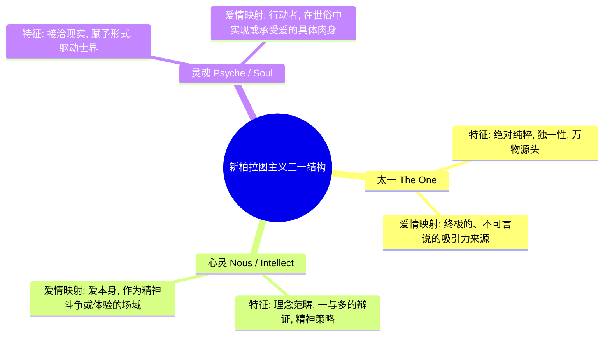
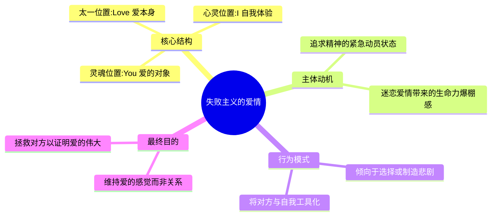
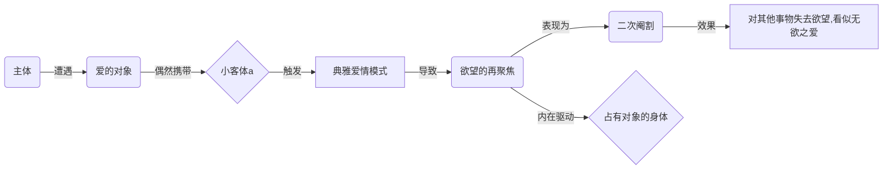

---
{"dg-publish":true,"permalink":"/1-3 唯我论/1-3-2 本真主义/1-3-2-3 现代新柏拉图主义/","created":"2025-09-19T20:52:29.497+08:00","updated":"2025-09-23T00:13:48.910+08:00"}
---

### **一、本章概览**
- **主义主义编码**: 1-3-2-3
- **意识形态命名**: [[现代新柏拉图主义\|现代新柏拉图主义]] / [[拜爱情教\|拜爱情教]]
- **核心论断**: 现代世俗社会中的“罗曼蒂克之爱”已经成为一种主流的准宗教意识形态。它通过构建一个以“[[爱情\|爱情]]”为绝对中心的精神框架，来调和个体在[[5 主义/自由主义\|自由主义]]背景下面临的“心甘情愿”与“逼不得已”之间的现象学分裂，从而为生命赋予一种看似本真的目的。
- **你能获得**: 本笔记将为你揭示我们这个时代无处不在的“爱情至上”观念的底层哲学结构。你将掌握如何运用[[新柏拉图主义\|新柏拉图主义]]的“太一-心灵-灵魂”三元论，来分析不同爱情模式（如自恋型、拯救型、崇拜型）的内在动力，并理解[[爱情\|爱情]]是如何在精神分析层面与欲望、阉割和[[小客体a\|小客体a]]等概念深刻关联的。

---
### **二、核心内容解析**

#### **“主义主义”四格分析**

1.  **场域之“1” (Ontology)**：该意识形态预设了一个统一、稳定且有序的[[世界\|世界]]框架。这个[[存在论\|存在论]]背景是前反思的，它不质疑世界本身的完整性。正是在这样一个被默认为和谐整体的宇宙舞台上，宏大的、具有超越意义的个人叙事——例如“一生一世的真爱”——才显得可能且有意义。这个稳固的场域保证了[[爱情\|爱情]]故事的展开不会遭遇根本性的、来自世界本身的断裂或荒谬，确保了其内部逻辑的自洽。

2.  **本体之“3” (Body)**：在统一的世界框架下，其核心的[[本体\|本体]]被设定为一个中介性的“精神”。这个“精神”的功能在于调和世界内在的根本张力，如[[存在\|存在]]与存在者、形式与质料之间的矛盾。在[[现代新柏拉图主义\|现代新柏拉图主义]]的语境下，这个核心的调和性精神就是“[[爱情\|爱情]]”本身。它被视为一种能够弥合世俗与神圣、理想与现实的根本力量，是驱动世界、赋予万物意义的真实本体，使得原本分裂的现实得以统一。

3.  **现象之“2” (Phenomenon)**：在[[主体性\|主体性]]的体验层面，该意识形态呈现为一种深刻的二元对立。主体感知到的[[世界\|世界]]被分裂为两个相互冲突的维度：一边是“本真的”、发自内心的[[心甘情愿的维度\|心甘情愿的维度]]（如为了爱人无私奉献）；另一边是“非本真的”、被外部现实所强迫的[[逼不得已的维度\|逼不得已的维度]]（如为了生存而从事的庸俗工作）。这种内心在理想与现实间的持续撕裂，构成了该意识形态下主体的核心生存体验和痛苦来源。

4.  **目的之“3” (Purpose)**：该意识形态的[[9 未命名/目的论\|目的论]]导向一个绝对的中心，这个中心就是“[[爱情\|爱情]]”。它的终极目标是通过[[爱情\|爱情]]这一中介，来完美地调和现象层面（“2”）的二元对立。[[爱情\|爱情]]使得“心甘情愿”与“逼不得已”这两个维度达成了辩证统一：你“心甘情愿”地去做那些“逼不得已”的牺牲；同时，你感到爱上某人本身也是一种“逼不得已”的命运。[[爱情\|爱情]]成为了生活的最终答案和最高目的，一切矛盾在此得到消解与升华。

#### **其他核心知识点**

##### 新柏拉图主义三元论的现代挪用
该讲稿的核心创见在于将[[新柏拉图主义\|新柏拉图主义]]经典的“[[太一\|太一]] - [[心灵\|心灵]] - [[灵魂\|灵魂]]”三元结构，创造性地用作分析现代爱情关系的诊断工具。古老的神学框架被重新编码，用于揭示“[[我\|我]] - [[爱\|爱]] - [[你\|你]]”这个现代爱情句法中的权力关系与欲望流向。[[太一\|太一]]代表着绝对、统一、不可言说的超越性源头；[[心灵\|心灵]]是承接[[太一\|太一]]并分化出理念的中介；[[灵魂\|灵魂]]则是更进一步、与具体质料和现实世界相接触的动力。通过将“我”、“爱”、“你”这三个要素任意排列并置入这三个位置，就可以生成并解析出不同类型的爱情意识形态模型。

**举例阐释**：当把“你”（所爱之人）放置在[[太一\|太一]]的位置，“[[爱\|爱]]”（作为一种精神活动）放置在[[心灵\|心灵]]的位置，“我”（主体自身）放置在[[灵魂\|灵魂]]的位置时，就构成了一种典型的“舔狗式”或[[典雅爱情\|典雅爱情]]模型。对方成为了一个绝对的、神圣的、不可企及的超越性存在，而“我”只能通过“[[爱\|爱]]”这一中介去朝拜祂，并在现实中为之奔走，成为其意志在世俗的执行者。

##### 失败主义的爱情：爱上“爱情”本身
这是一种将“[[爱\|爱]]”（Love）这个行为/概念本身置于[[太一\|太一]]之位的爱情模式。在此模式中，“我”和“你”都降格为服务于“[[爱\|爱]]”这一至高存在的工具。主体真正迷恋和追求的，并非具体的某个人，而是自身处于“恋爱状态”时的那种精神被全面调动的“紧急动员状态”。这种爱情的内在[[9 未命名/目的论\|目的论]]是维持这种高强度的情感体验，而非导向一段稳定和谐的关系。因此，它常常需要通过不断制造戏剧性、困难乃至失败来为这种“紧急状态”注入燃料，其最终导向的是一种悲剧性的美学享受。

**举例阐释**：一个艺术家反复爱上不该爱的人，并在每一次的痛苦与挣扎中获得巨大的创作灵感。对他而言，稳定的幸福关系反而会使其艺术枯竭，因为他真正需要的是“[[爱情\|爱情]]”这个过程所带来的强烈情感震荡，而不是爱的结果。

##### 典雅爱情与精神分析的阉割
讲稿深入分析了以“你”为[[太一\|太一]]的崇拜式爱情，并将其命名为“[[典雅爱情\|典雅爱情]]”。这种爱情模式与[[拉康\|拉康]]的精神分析理论高度契合。主体之所以对某人产生如此强烈的爱，是因为对方身上偶然地体现了一个“比我更在我之内”的神秘特质，即[[小客体a\|小客体a]]（object petit a）。这个特质是主体自身被符号系统所[[阉割\|阉割]]时所失落的、无法言说的欲望原质。当主体陷入这种[[典雅爱情\|典雅爱情]]后，会发生第二次[[阉割\|阉割]]：对那个唯一客体的强烈欲望，会反过来“阉割”掉主体对其他所有事物的欲望，使其进入一种看似“纯爱”、“无欲”的状态，但实际上这是一种欲望被高度重组和聚焦的体现。

**举例阐释**：一个原本生活丰富、兴趣广泛的人，在陷入一段刻骨铭心的爱情后，突然对之前的所有爱好（如游戏、社交、美食）都失去了兴趣。他所有的生命能量和欲望都只指向了那一个人，这便是[[典雅爱情\|典雅爱情]]所导致的“二次[[阉割\|阉割]]”效应。

---
### **三、关键观点提取**
- “[[爱情\|爱情]]就可以让你心甘情愿的逼不得已，也让你逼不得已的心甘情愿。”
- “他真正要维持的就是他爱[[爱情\|爱情]]本身，他爱那种动员状态，那种精神的紧急动员状态，它整个符号系统被动员起来了。”
- “你爱这个人并不是因为他这个人怎么样，而是因为他体现了某种东西。这种东西是什么？在我自己内在的，但是这种东西就超出于我的，是我的内在世界没有办法去包容的一个东西。”
- “这种无欲之爱就是纯爱……但他这种爱其实名义上叫纯爱，但实际上他是不停的想要追求去和这个爱……他绝望的只能去把握这个U的body（身体）。”

---
### **四、知识点问答**
#### Q: 为什么说1-3-2-3这种“拜爱情教”是现代[[5 主义/自由主义\|自由主义]]者的主流意识形态？
A: 因为[[5 主义/自由主义\|自由主义]]社会强调个人选择和自我实现，但这往往导致个体在原子化的市场竞争中，面临理想自我与现实处境的巨大分裂（现象学上的“2”）。“[[拜爱情教\|拜爱情教]]”提供了一个完美的私人领域解决方案：它将“[[爱情\|爱情]]”提升为一个超越性的、由个体自由选择的终极目的（目的论上的“3”），个体可以通过投入一段“本真”的亲密关系来对抗外部世界的异化，从而在私密的二人世界中完成自我实现，完美地调和了[[5 主义/自由主义\|自由主义]]所预设的自由与现实之间的矛盾。

#### Q: 在“[[我\|我]]-[[爱\|爱]]-[[你\|你]]”的三元论游戏中，“[[爱\|爱]]”本身扮演了怎样的角色？它仅仅是一种情感吗？
A: 在这个框架中，“[[爱\|爱]]”远不止是情感。它是一个结构性的“中介”或“事件”。根据其摆放位置，其功能截然不同。当“[[爱\|爱]]”处于[[心灵\|心灵]]（中介）位置时，它是一系列连接主体与神圣客体的精神策略和斗争。当“[[爱\|爱]]”处于[[太一\|太一]]（源头）位置时，它变成了被崇拜的终极实在本身，即“为爱而爱”。它更接近[[巴蒂欧\|巴蒂欧]]所说的[[真理事件\|真理事件]]，一个能够重塑主体和世界的断裂性时刻，它见证了某个超越性的[[9 未命名/大他者\|大他者]]的存在。

#### Q: “[[典雅爱情\|典雅爱情]]”中的“无欲”与真正的“禁欲”有何本质区别？
A: “[[典雅爱情\|典雅爱情]]”的“无欲”是一种欲望被高度聚焦和重组后产生的“二次[[阉割\|阉割]]”效应，而非主动的禁欲。主体的力比多（libido）并非被压抑或消除了，而是被那个携带[[小客体a\|小客体a]]的唯一对象所彻底捕获，导致其对其他对象的欲望通路被暂时切断。其本质是欲望的“专一化”而非“虚无化”。相反，传统的禁欲往往是基于伦理或信仰，主动地、普遍地压制所有欲望，其背后没有一个特定的、引发欲望重组的客体。

---
### **五、知识延伸**
- **[[阿兰·巴蒂欧\|阿兰·巴蒂欧]]《[[爱的颂歌\|爱的颂歌]]》**: 讲稿数次提及[[巴蒂欧\|巴蒂欧]]和“[[事件\|事件]]”概念。这本书是他对爱的哲学思考的集中体现。巴蒂欧将爱视为一种“双人场景”的[[真理事件\|真理事件]]，它挑战了爱情的浪漫主义神话（如1-3-2-3）和犬儒主义的解构，为理解“爱”提供了一个与本讲稿既有联系又有区别的当代哲学视角。
- **[[罗兰·巴特\|罗兰·巴特]]《[[恋人絮语\|恋人絮语]]》**: 这本书是对陷入爱情意识形态中的主体现象学的完美文本呈现。巴特以碎片化的方式记录了恋人在各种情境下的内心独白、挣扎与幻想，它生动地展示了1-3-2-3意识形态下，主体是如何被“本真/非本真”的二元对立所撕扯，是理解本讲稿“现象之‘2’”的绝佳参照。
- **[[6 哲学家/雅克·拉康\|雅克·拉康]]关于[[小客体a\|小客体a]]的理论**: 讲稿对[[典雅爱情\|典雅爱情]]的分析直接借用了拉康的核心概念[[小客体a\|小客体a]]。深入了解这一概念（即欲望的诱因、主体中不可同化的剩余物）将极大地加深对“为何我们会爱上特定的人”这一问题的理解，并揭示[[爱情\|爱情]]背后深刻的无意识欲望结构。

---
### **六、双链关联总结**
- **一级关联 (核心意识形态与概念)**: [[现代新柏拉图主义\|现代新柏拉图主义]]、[[拜爱情教\|拜爱情教]]、[[主页\|主页]]、[[爱情\|爱情]]、[[太一\|太一]]、[[心灵\|心灵]]、[[灵魂\|灵魂]]、[[我\|我]]、[[你\|你]]、[[失败主义的爱情\|失败主义的爱情]]、[[典雅爱情\|典雅爱情]]、[[心甘情愿的维度\|心甘情愿的维度]]、[[逼不得已的维度\|逼不得已的维度]]

- **推测相关人物 (Speculated Figures)**:
    - [[普罗提诺\|普罗提诺]]: [[新柏拉图主义\|新柏拉图主义]]的奠基人，其思想是本讲稿分析工具的直接来源。
    - [[盖茨比\|盖茨比]] (小说人物): 其对黛西的爱是[[典雅爱情\|典雅爱情]]的文学典范，黛西身上的“绿光”正是盖茨比欲望投射的[[小客体a\|小客体a]]。

- **二级关联 (上下文与背景)**: [[新柏拉图主义\|新柏拉图主义]]、[[9 未命名/精神分析\|精神分析]]、[[欧陆哲学\|欧陆哲学]]、[[9 未命名/现象学\|现象学]]、[[5 主义/自由主义\|自由主义]]、[[存在论\|存在论]]、[[9 未命名/目的论\|目的论]]、[[拉康\|拉康]]、[[巴蒂欧\|巴蒂欧]]、[[罗兰·巴特\|罗兰·巴特]]

- **三级关联 (推测与延展)**: [[小客体a\|小客体a]]、[[阉割\|阉割]]、[[事件\|事件]]、[[真理事件\|真理事件]]、[[9 未命名/大他者\|大他者]]、[[崇高化\|崇高化]]、[[斯多葛主义\|斯多葛主义]]、[[犬儒主义\|犬儒主义]]