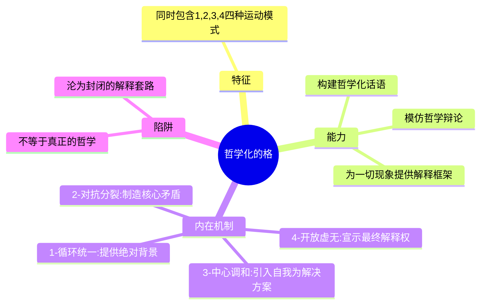

---
{"dg-publish":true,"permalink":"/1-3 唯我论/1-3-2 本真主义/1-3-2-4 现代智者学派/","created":"2025-09-19T20:52:29.501+08:00","updated":"2025-09-23T00:13:49.733+08:00"}
---

### **一、本章概览**
- **主义主义编码**: 1-3-2-4
- **意识形态命名**: [[现代智者学派\|现代智者学派]] / [[民哲主义\|民哲主义]]
- **核心论断**: 该意识形态是“民间哲学家”的精神画像，其特征在于：以一个僵化统一的[[世界\|世界]]秩序为前提（1），将自我意识神化为调和万物的中心（3），用“聪明/愚蠢”的二元对立来感知[[现象\|现象]]（2），并因窥见到宇宙终极[[目的\|目的]]的空缺（4）而产生一种填补该空缺、攫取话语权力的“哲人王”式狂妄野心。
- **你能获得**:
    1.  掌握对 1-3-2-4 这一特定意识形态的“四格”诊断方法。
    2.  理解“[[民哲\|民哲]]”心态的内在结构，及其为何总表现出一种“能读懂一切哲学”的全能幻想。
    3.  学会辨别真正的哲学探究与以攫取[[话语权力\|话语权力]]为目的的“哲学化话语”之间的区别。

---
### **二、核心内容解析**

#### **“主义主义”四格分析**

1.  **场域之“1” (Ontology)**：该意识形态预设了一个统一、整全且循环的[[世界\|世界]]图景。这里的“1”代表一个不容置疑的、类似于“[[物理法则\|物理法则]]”的终极背景秩序。它像一个[[沉睡的大他者\|沉睡的大他者]]，虽然存在，却是被动、无目的、无意识的。对[[民哲\|民哲]]而言，这个[[存在论\|存在论]]背景是绝对的、给定的，是其全部思想的安全地基。它本身不产生意义，只提供一个稳定的舞台，这种稳定性也正是他们从不敢质疑的思维起点，保证了其理论体系的封闭性。

2.  **本体之“3” (Body)**：在这个统一的舞台上，真正的核心实体是一个中心化的、起调和作用的“至高智信”（Supreme Intelligence）。这里的“3”代表一种精神性的中介力量，它能够理解并安排[[世界\|世界]]的秩序。在[[民哲主义\|民哲主义]]中，这具体表现为一种[[庸俗唯我论\|庸俗唯我论]]：[[民哲\|民哲]]将自己的“聪明才智”直接等同于这个至高的本体。他认为自己就是那个能够调和宇宙万物矛盾、赋予其意义的中心，是[[沉睡的大他者\|沉睡的大他者]]的唯一合法代言人。

3.  **现象之“2” (Phenomenon)**：[[主体性\|主体性]]体验被简化为一个僵化的二元对立结构。这里的“2”体现为一种非黑即白的对抗性感知模式，即“本真 vs 非本真”，而在[[民哲\|民哲]]的语境下，这被粗暴地窄化为“聪明 vs 愚蠢”。所有的人、事、理论，都被这个二元滤镜所审视和归类。凡是符合其理论的就是“聪明的”、“本真的”，凡是不符合的，就是“愚蠢的”、“僵化的”。这种对抗性的[[现象\|现象]]学，是其建立自我优越感和排斥异己的核心机制。

4.  **目的之“4” (Purpose)**：该意识形态的最终[[9 未命名/目的论\|目的论]]是指向一个空缺、待定义的位置。这里的“4”代表[[民哲\|民哲]]所瞥见的真相：宇宙的终极目的或意义是虚无的、开放的。然而，他们并非以存在主义式的焦虑来面对这个虚空，而是将其视为一个权力真空。这个发现激发了他们的“[[哲人王\|哲人王]]”野望，认为这个空缺的位置就是为自己量身定做的。因此，他们的最终目的就是抢占这个位置，用自己的“主义”为[[世界\|世界]]立法，从而获得终极的[[话语权力\|话语权力]]。

#### **其他核心知识点**

##### 哲学化的格 (The Philosophizable Grid)
[[民哲主义\|民哲主义]]的 1-3-2-4 编码因其同时包含了“1-统一”、“2-对抗”、“3-中介”、“4-开放”四种基本的符号学运动模式，从而构成了一个“哲学化的格”。这意味着拥有此思维结构的人，掌握了模仿哲学话语的所有基本元素，能够对任何文本进行貌似深刻的解读。他们可以谈论统一的本源（1），分析矛盾对立（2），提出一个核心来调和（3），并最终指向某种不确定性（4）。然而，这种能力不等于真正的哲学思考，因为它只是一种僵化的套用，其目的是将一切复杂思想都还原为自身早已固化的框架，而非真正地与思想对象进行开放性的互动。

**举例阐释**：当一个[[民哲\|民哲]]解读[[黑格尔\|黑格尔]]的“精神是头盖骨”时，他会立即启动这套“哲学化”工具：首先，他看到“精神”和“头盖骨”的[[对立\|对立]]（套用2）；然后，他将这种对立解释为“最高智慧”与“最低愚蠢”的矛盾，并把自己定位为那个理解了此点的“至高智信”（套用3）；最终宣称，这个真理指向了宇宙目的的虚空，而只有他自己的理论才能填补它（套用4）。

##### 沉睡的大他者与哲人王野望
在[[现代智者学派\|现代智者学派]]的观念中，宇宙的根本秩序（场域之“1”）是一个[[沉睡的大他者\|沉睡的大他者]]。这个“大他者”如同无意识的物理规律，虽然构成了[[世界\|世界]]的基础，但它本身没有意志和目的。[[民哲\|民哲]]的“洞见”在于发现了这个权力中心的“沉睡”状态，以及随之而来的[[9 未命名/目的论\|目的论]]上的虚空（目的之“4”）。这个发现并未让他们感到恐惧，反而激发了“狐假虎威”式的狂喜和野心。他们认为这是一个千载难逢的机会，可以取而代之，成为这个[[世界\|世界]]的立法者和意义的赋予者，即成为“[[哲人王\|哲人王]]”。这种野望的本质并非追求真理，而是追逐在终极意义层面上的[[话语权力\|话语权力]]。

**举例阐释**：许多[[民哲\|民哲]]热衷于创造带有“混元”、“太极”、“宇宙”等宏大词汇的理论体系，并给它们起上华丽的名字。这正是其“[[哲人王\|哲人王]]”野望的体现：他们试图通过命名和体系构建，来扮演那个为沉睡的[[世界\|世界]]赋予终极意义的角色。

##### 庸俗唯我论与权奴心态
[[民哲主义\|民哲主义]]的内核是一种[[庸俗唯我论\|庸俗唯我论]]（Vulgar Solipsism）。它将[[民哲\|民哲]]的个人智识，直接等同于宇宙的中心调和力量（本体之“3”）。这种自我神化导致他们以一种“[[权奴\|权奴]]”的心态看待其他哲学家。他们认为，历史上所有伟大的哲学家，不过是和自己一样的同类——成功抢占了[[9 未命名/目的论\|目的论]]话语权的权力追逐者。他们无法理解为知识本身而进行的探寻，只能将一切思想活动都解读为对权力的欲望。因此，他们对现存哲学讨论充耳不闻，因为在他们看来，那些不过是其他“[[权奴\|权奴]]”的呓语，而自己才是真正的、当代的胜利者。

**举例阐释**：讲稿中提到，[[民哲\|民哲]]会将那些“聪明的”、已故的哲学家视为和自己一样的同类，即“抢到了一席之地的[[权奴\|权奴]]”。而对于那些他们看不懂的、严谨的学者（讲稿中称为“官哲”），则会轻蔑地将其视为固守僵死秩序（1）的“蠢货”。

---
### **三、关键观点提取**
- “这种[[民哲\|民哲]]都有一种...比较蹩脚的[[相对主义\|相对主义]]，比较蹩脚的[[怀疑论\|怀疑论]]，因为他还是一开头，他脑子里面还设定有一个[[沉睡的大他者\|沉睡的大他者]]。”
- “他们追逐的这些[[民哲\|民哲]]...我跟你讲他追逐的就是在[[9 未命名/目的论\|目的论]]上，在这个宇宙的[[9 未命名/目的论\|目的论]]上，整个体系的[[9 未命名/目的论\|目的论]]上的[[话语权力\|话语权力]]。”
- “他一切哲学文本的结果就是把所有的哲学家都还原成和他一样的人。”
- “他们骨子里会把这些人（其他哲学家）当成是他的同类[[权奴\|权奴]]。所以这些现代的这种智者，它实际上是一种[[虚无主义\|虚无主义]]。”
- “这是一种[[神经症\|神经症]]...不对，他已经...自我认同，这就是[[精神病\|精神病]]。他有自我认同的，你跟他说他不承认的，他是病理化的，严重病理化的。”

---
### **四、知识点问答**
#### Q: 为何说 1-3-2-4 意识形态的核心驱动力，恰恰来自于其目的论上的“4”？
A: 因为“1”（统一场域）、“3”（自我中心）和“2”（二元对立）共同构建了一个封闭且自我满足的静态结构。如果没有“4”，这个体系会满足于自身的逻辑自洽。正是“4”的引入，即对宇宙终极目的之“虚无”的瞥见，才为这个静态系统注入了动态的、狂妄的能量。这个“虚空”被[[民哲\|民哲]]的[[庸俗唯我论\|庸俗唯我论]]（3）解读为一个权力真空，一个等待他去征服的领地，从而激发了他成为“[[哲人王\|哲人王]]”、创造自己主义体系的全部动力。

#### Q: “[[现代智者学派\|现代智者学派]]”与古希腊的智者学派（如[[普罗泰戈拉\|普罗泰戈拉]]）有何本质区别？
A: 古希腊智者学派的核心在于[[修辞学\|修辞学]]和[[相对主义\|相对主义]]，其口号“人是万物的尺度”开启了[[主体性\|主体性]]哲学的先河，具有革命性。而“[[现代智者学派\|现代智者学派]]”虽然在表面上玩弄概念、表现出[[相对主义\|相对主义]]姿态，但其根基（场域之“1”）却是一个绝对、僵化的[[独断论\|独断论]]前提（存在一个统一的宇宙秩序）。它的[[相对主义\|相对主义]]只是一种策略，用以瓦解他人观点，最终目的却是要建立自己绝对的[[话语权力\|话语权力]]（填补“4”），这使其成为一种伪装的[[独断论\|独断论]]，而非真正开放的[[怀疑论\|怀疑论]]。

#### Q: 未明子为何将这种思维模式诊断为一种“病理化”状态，甚至从“[[神经症\|神经症]]”修正为“[[精神病\|精神病]]”？
A: 因为这种思维模式并非一种可供主体自由选择的哲学立场，而是一种强迫性的、自我封闭的循环。主体完全“自我认同”于这个结构，无法抽身反思。他不是“使用”这套框架，而是“成为”了这套框架。从[[神经症\|神经症]]（主体与症状尚有冲突）修正为[[精神病\|精神病]]（主体完全认同于其幻觉/妄想结构），是因为[[民哲\|民哲]]不认为自己的思维方式有问题，反而认为是[[世界\|世界]]的终极真理，这表明其现实检验能力已经严重受损，陷入了彻底的[[唯我论\|唯我论]]闭环。

---
### **五、知识延伸**
- **[[9 未命名/苏格拉底\|苏格拉底]]的诘问法**: 这是对抗[[现代智者学派\|现代智者学派]]最有效的思想武器。苏格拉底通过持续的追问，揭示对方声称的“智慧”背后隐藏的矛盾和无知。面对一个1-3-2-4的[[民哲\|民哲]]，苏格拉底式的诘问会直击其僵化的前提（1）和自大的中心（3），戳破其“全能幻想”。
- **[[拉康\|拉康]]的“大学话语”与“[[癔症话语\|癔症话语]]”**: [[拉康\|拉康]]的话语理论为分析[[民哲主义\|民哲主义]]提供了精确工具。[[民哲\|民哲]]试图扮演“大学话语”中的“主人能指”，即输出一套完整的、不容置疑的知识体系（S2）。然而，其内在的狂妄和对他者的攻击性，又使其接近于一种病理化的“[[癔症话语\|癔症话语]]”，即不断地挑战所有既定知识，却又无法生产出真正有效的知识，最终只是为了确认自身作为“主体”的特殊地位。
- **电影《[[天才瑞普利\|天才瑞普利]]》 (The Talented Mr. Ripley)**: 这部电影是对身份认同、模仿与权力欲望的深刻描绘。主角瑞普利通过模仿他人来窃取其身份和生活，这与[[民哲\|民哲]]通过模仿“哲学话语”来攫取“哲人王”地位的心态有异曲同工之妙。两者都源于对自身存在感的极度焦虑，并试图通过占据一个“理想位置”来解决这种焦虑，其行为的核心都是“成为”他人/他者，而非“成为”自己。

---
### **六、双链关联总结**
- **一级关联 (核心意识形态与概念)**: [[1-3 唯我论/1-3-2 本真主义/1-3-2-4 现代智者学派\|1-3-2-4 现代智者学派]]、[[现代智者学派\|现代智者学派]]、[[民哲主义\|民哲主义]]、[[哲学化的格\|哲学化的格]]、[[沉睡的大他者\|沉睡的大他者]]、[[哲人王\|哲人王]]、[[庸俗唯我论\|庸俗唯我论]]、[[权奴\|权奴]]、[[话语权力\|话语权力]]
- **推测相关人物 (Speculated Figures)**: 网络上自称“民间思想家”，热衷于用一套万能理论（如某种另类“宇宙精神”或“终极大道”）解释一切社会历史问题，并对所有专业知识体系抱有敌意和轻蔑的博主或意见领袖。他们通常不参与平等对话，只进行“降维打击”式的宣判。
- **二级关联 (上下文与背景)**: [[主页\|主页]]、[[意识形态分析\|意识形态分析]]、[[古希腊哲学\|古希腊哲学]]、[[修辞学\|修辞学]]、[[相对主义\|相对主义]]、[[怀疑论\|怀疑论]]、[[9 未命名/精神分析\|精神分析]]、[[神经症\|神经症]]、[[精神病\|精神病]]
- **三级关联 (推测与延展)**: [[9 未命名/苏格拉底\|苏格拉底]]、[[普罗泰戈拉\|普罗泰戈拉]]、[[拉康\|拉康]]、[[大学话语\|大学话语]]、[[癔症话语\|癔症话语]]、[[唯我论\|唯我论]]、[[物理法则\|物理法则]]、[[独断论\|独断论]]、[[虚无主义\|虚无主义]]