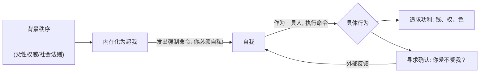
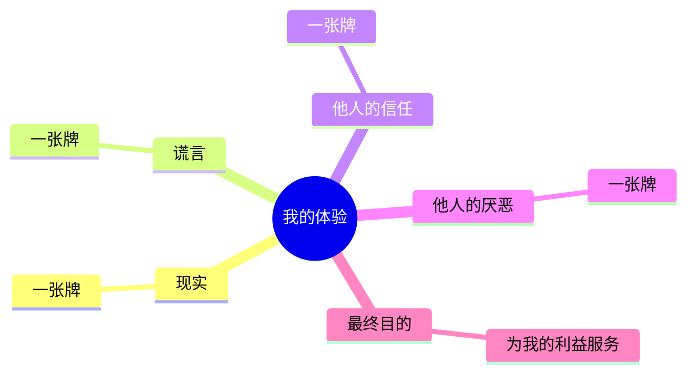

---
{"dg-publish":true,"permalink":"/1-3 唯我论/1-3-3 唯意志主义/1-3-3-1 自我中心主义/","created":"2025-09-19T20:52:29.508+08:00","updated":"2025-09-23T00:13:53.222+08:00"}
---

### **一、本章概览**
- **主义主义编码**: 1-3-3-1
- **意识形态命名**: [[自我中心主义\|自我中心主义]] / [[利己主义\|利己主义]]
- **核心论断**: 这是一种被背景秩序所操控的、伪装成个人意志的强制性自私。其核心矛盾在于，主体越是追求“为我”，就越是成为一个外在的、由[[父性权威\|父性权威]]设定的[[超我\|超我]]律令的奴隶，最终将真实人生降格为一场寻求外部确认的“修仙游戏”。
- **你能获得**: 你将掌握对[[自我中心主义\|自我中心主义]]（1-3-3-1）意识形态的“四格”诊断框架，理解其内在的[[9 未命名/精神分析\|精神分析]]结构（特别是[[自我\|自我]]与[[超我\|超我]]的短路），并能识别其在当代文化（如[[修仙小说\|修仙小说]]）中的具体表现和症候。

---
### **二、核心内容解析**

#### **“主义主义”四格分析**

1.  **场域之“1” (Ontology)**：该意识形态预设了一个统一、稳固且不容置疑的[[世界\|世界]]框架。这个框架通常是[[市民化\|市民化]]过程中的[[男权主义\|男权主义]]社会秩序，它被默认为天经地义的“理”。在这个场域中，所有规则都是预先设定的，主体不会也无力对其进行反思，除非遭遇巨大创伤。这个“1”的[[存在论\|存在论]]底色，确保了所有后续的挣扎和算计，都只是在这个预设棋盘内的游戏，而无法挑战棋盘本身。

2.  **本体之“3” (Body)**：在这个统一的世界舞台上，最真实、最核心的存在是一个中心化的“我”，讲稿中称之为[[本我\|本我]]或[[真我\|真我]]。这个“我”被想象成一个至高的仲裁者，能够调和世间万物（如“法相”与“万象”）的矛盾。所有存在物都必须围绕这个中心化的“我”来获得意义和位置。这种结构在[[修仙小说\|修仙小说]]中表现得尤为明显——主角的“我”是整个叙事宇宙的绝对中心，所有的人、事、物最终都服务于这个“我”的成长和确立。

3.  **现象之“3” (Phenomenon)**：主体的一切感知和经验都被一个强大的中心化引力所捕获，即“一切都是为我，一切都来自于我”。无论是现实、谎言，还是他人的情感，都被体验为可供“我”驱使的“手牌”。这种[[现象\|现象]]学结构导致主体无法与体验拉开距离，也无法做出真正的否定，只能表现为“厌恶”和“加害”。因此，[[主体性\|主体性]]被压缩为一个博弈论式的计算中心，失去了对真假、善恶进行价值判断的能力，呈现出一种[[癔症化\|癔症化]]的特征。

4.  **目的之“1” (Purpose)**：该意识形态的最终[[9 未命名/目的论\|目的论]]是导向一个封闭的、永恒循环的自我确证。其格言“[[人不为己天诛地灭\|人不为己天诛地灭]]”揭示了这一本质：整个世界的存在意义，就是为了让那个被设定的“我”不断获利、升级并最终巩固自身。这个“1”的目的与“1”的场域形成了致命的短路——世界的规则就是为了让我赢，而我赢了就证明了世界规则的正确性。这使得主体陷入一个无法逃脱的、为了自私而自私的无限循环之中。

#### **其他核心知识点**

##### 被“超我”绑架的“自私”
这种[[利己主义\|利己主义]]并非源于自由意志，而是一种被内化的[[父性权威\|父性权威]]所下达的[[超我\|超我]]命令。主体感受到的“我要自私”的冲动，实际上是背景秩序（如宗族、[[男权主义\|男权主义]]社会）对他的强制要求。这个“我”是一个虚假的、被过度投注的幻象，主体被迫像完成任务一样去“爱家庭”、“搞事业”，其行为的驱动力并非内在欲求，而是对完成这场“人生大考”并获得[[超我\|超我]]认可的焦虑。这种自私是一种沉重的负担，而非解放。

**举例阐释**：讲稿中提到，这类人会不停地问家人“你爱不爱我？”，这并非在寻求真实的爱，而是在检验自己“自私”的投资是否成功，即自己是否在这场由[[超我\|超我]]监考的“人生大考”中取得了高分。他人的爱成了他完成“自私”任务的成绩单。

##### 作为“游戏牌局”的认识论
在1-3-3-1的意识形态中，认识世界的方式被彻底工具化和游戏化。主体所经验到的一切——客观事实、自己的谎言、他人的信任或厌恶——都被剥离了其内在价值，降格为平等的、可供随时打出的“手牌”。真理与谬误的区别不再重要，唯一重要的是这张“牌”能否在当下的“牌局”中为“我”带来利益。这导致了一种彻底的犬儒主义和机会主义，因为在他们眼中，世界本就是一场围绕“我”展开的策略游戏。

**举例阐释**：讲稿中指出，这种人只在说真话对他有利时才说真话，这完美体现了“手牌”逻辑。真话本身没有价值，它的价值完全取决于它能否在特定情境下，作为一张好牌打出去，以实现[[自我\|自我]]的功利目的。

##### 修仙小说：1-3-3-1的文化症候
以《凡人修仙传》等为代表的男性向[[修仙小说\|修仙小说]]，是1-3-3-1意识形态最典型的文化样本。这类作品完美复刻了其四格结构：一个预设的、等级森严的[[世界观\|世界观]]（场域1）；一个以主角“我”为绝对中心的叙事（本体3）；所有情节、人物、宝物都沦为主角升级的资源和经验值（现象3）；最终目的则是主角超越一切法则，成为宇宙本身，达成永恒的自我闭环（目的1）。这种“修仙”叙事，实际上是[[市民化\|市民化]]过程中，个体面对巨大社会压力时，退行到一种极度[[功利\|功利]]和自私的幻想性补偿。

**举例阐释**：讲稿中提到的主角[[韩立\|韩立]]，其核心信条就是“[[人不为己天诛地灭\|人不为己天诛地灭]]”。他的一切行为，无论善恶，都以自我提升为唯一标准，这正是1-3-3-1意识形态在文艺作品中的直接投射。所谓的“雷劫”，则象征着来自背景秩序（[[超我\|超我]]）的终极考验，检验其“自私”的纯度和强度是否达标。

---
### **三、关键观点提取**
- “他们的格言就是[[人不为己天诛地灭\|人不为己天诛地灭]]。其实这种人是很可怜的，因为他的自私恰恰不是出于自己的自由意志，相反，他的自私已经变成了一种[[超我\|超我]]对他的道德律令。”
- “在这种人手里，他这个认识论的维度被...一个博弈论的维度给侵占了。他所体验到的一切都是被他看成是就是[[我\|我]]的牌。”
- “这种人...他们认为世界上的普遍的答案就应该是一个为他们量身定制的答案。很恶心的这种人。”
- “这个[[修仙小说\|修仙小说]]屁仙不仙？一点不仙，而且是[[功利\|功利]]至极，[[庸俗\|庸俗]]至极，而且就是社会丛林法则的一个...庸俗至极。”
- “他们（的子女）会觉得他的父亲的父爱是一种拘束的，不张扬的...含蓄的。其实这些子女他误认的一点就是，你的父亲归根结底他爱的也是一个他自己，但是他那个[[自我\|自我]]是一个外部社会灌输给他的自己。”

---
### **四、知识点问答**
#### Q: 为何说1-3-3-1的“自我中心主义”恰恰是“无法中心化”的？
A: 因为其所谓的“中心”——那个“我”，并非一个自主、自由的[[主体性\|主体性]]核心，而是一个由外部[[父性权威\|父性权威]]和[[社会\|社会]]秩序预先设定好的空壳或“[[心魔\|心魔]]”。主体的一切行为并非为了实现真正的自我，而是在扮演这个被设定的角色，并时刻焦虑地寻求外部确认（考试得了多少分）。因此，他看似在为“我”，实则是一个被[[超我\|超我]]遥控的工具人，真正的中心是那个他无法反思的背景秩序。

#### Q: 讲稿中提到的“癔症化”在1-3-3-1意识形态中具体如何体现？
A: 体现在[[自我\|自我]]与符号界（[[超我\|超我]]）的短路。[[癔症化\|癔症化]]的一个特征是身体或言语成为内在冲突的表达。在这里，主体将一切外部现实（符号秩序）都强行认同为“[[我\|我]]的体验”，拒绝任何真正的否定和分割。这导致他无法区分“真话”与“谎言”的价值，只看其功用，言语变得极其不稳定和机会主义。就像讲稿中说的，他可以随时改变规则，因为规则（[[超我\|超我]]）和他自己（[[自我\|自我]]）被混淆了，一切只为当下的“[[我\|我]]”服务。

#### Q: 为什么说1-3-3-1这种人缺乏真正的“自律”能力？
A: 因为真正的[[自律\|自律]]需要[[自我\|自我]]（Ego）与[[超我\|超我]]（Super-ego）之间存在一个清晰的界分。[[超我\|超我]]提供一个抽象的、普遍的律令，而[[自我\|自我]]则在现实中努力去遵循它。但在1-3-3-1中，[[超我\|超我]]的律令被扭曲为“你必须无条件地为‘我’好”，这使得律令与欲望冲动（为我好）直接短路。他不是在用理性约束冲动，而是用一个至高的理由（[[超我\|超我]]）来为自己的所有冲动正名，因此无法建立起超越直接利益的、稳定的内在法则。

---
### **五、知识延伸**
- **[[马基雅维利主义\|马基雅维利主义]]**: 作为一种政治哲学，它将权力获取和维持作为最高目的，主张君主可以为了国家利益（宏大的“自我”）而无视传统道德。这与1-3-3-1意识形态中，个体为了“我”的利益而将一切道德、真理工具化的思维模式高度相似。
- **[[5 主义/社会达尔文主义\|社会达尔文主义]]**: 它将“优胜劣汰”的丛林法则应用于人类社会，认为个人或群体的成功是其内在优越性的证明。这为1-3-3-1的[[功利\|功利]]至上和冷酷的[[利己主义\|利己主义]]提供了伪科学的辩护，将“自私”包装成一种自然且正当的生存策略。
- **游戏《[[鬼谷八荒\|鬼谷八荒]]》**: 讲稿中直接提及的例子。这款游戏是[[修仙小说\|修仙小说]]逻辑的完美互动化再现，玩家在游戏中体验的就是一个纯粹的1-3-3-1过程：在一个固定的世界规则下，以“我”为唯一中心，将一切人际关系、奇遇都化约为提升实力的资源，最终目标是成为全知全能的存在。

---
### **六、双链关联总结**
- **一级关联 (核心意识形态与概念)**: [[自我中心主义\|自我中心主义]]、[[利己主义\|利己主义]]、[[超我\|超我]]、[[本我\|本我]]、[[自我\|自我]]、[[心魔\|心魔]]、[[修仙小说\|修仙小说]]、[[功利\|功利]]、[[庸俗\|庸俗]]、[[人不为己天诛地灭\|人不为己天诛地灭]]
- **推测相关人物 (Speculated Figures)**: [[韩立\|韩立]]、[[石轩\|石轩]] (讲稿中提及的修仙小说主角)；在现实中，这一模式常与部分“凤凰男”或在[[市民化\|市民化]]进程中，急于通过占有符号资源来证明自身价值的第一代成功者形象相吻合。
- **二级关联 (上下文与背景)**: [[9 未命名/精神分析\|精神分析]]、[[弗洛伊德\|弗洛伊德]]、[[拉康\|拉康]]、[[存在论\|存在论]]、[[现象\|现象]]、[[9 未命名/目的论\|目的论]]、[[父性权威\|父性权威]]、[[市民化\|市民化]]、[[男权主义\|男权主义]]
- **三级关联 (推测与延展)**: [[唯意志主义\|唯意志主义]]、[[体验主义\|体验主义]] (作为1-3-x的对比形态被提及)、[[癔症化\|癔症化]]、[[5 主义/社会达尔文主义\|社会达尔文主义]]、[[马基雅维利主义\|马基雅维利主义]]、[[自律\|自律]]、[[世界观\|世界观]]、[[主体性\|主体性]]