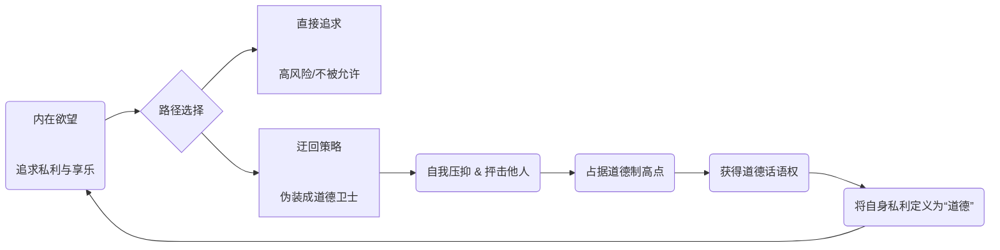
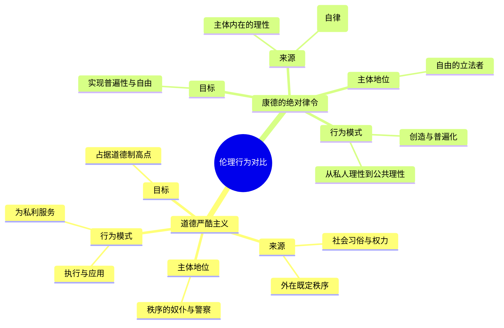
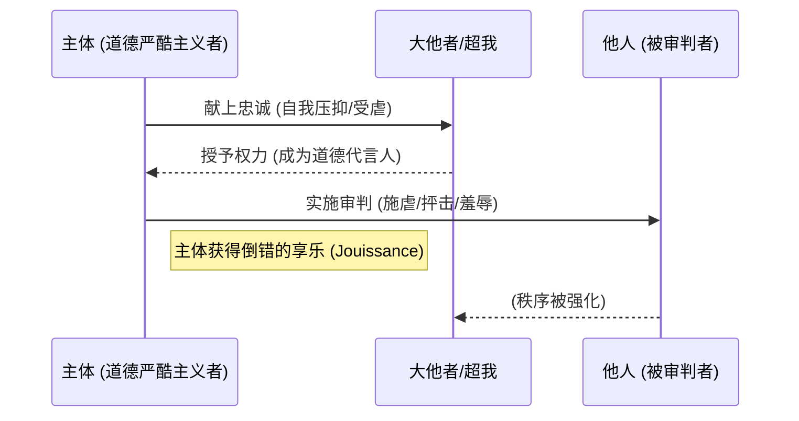

---
{"dg-publish":true,"permalink":"/1-3 唯我论/1-3-3 唯意志主义/1-3-3-2 道德严酷主义/","created":"2025-09-19T20:52:29.511+08:00","updated":"2025-09-23T00:13:54.038+08:00"}
---

### **一、本章概览**
- **主义主义编码**: 1-3-3-2
- **意识形态命名**: [[道德严酷主义\|道德严酷主义]] (Moral Rigorism) / 庸俗唯我论的变体
- **核心论断**: 这是一种伪君子式的意识形态，其主体通过扮演社会道德秩序的严酷捍卫者，占据[[道德制高点\|道德制高点]]，实则是为了掩盖并服务于自身的隐秘欲望。它是一种通过对他人的“施虐”来换取自身“享乐”的倒错机制，是[[9 未命名/大他者\|大他者]]秩序的忠实奴仆与享乐工具。
- **你能获得**: 你将掌握 1-3-3-2 编码的内在结构，理解[[道德严酷主义\|道德严酷主义]]者如何将“对自身有利”伪装成“道德”，并学会区分这种病态伦理与[[康德\|康德]]真正的[[自律\|自律]]伦理。同时，你将能从精神分析的视角，洞悉其“受虐-施虐”的享乐循环及其作为社会[[反动派\|反动派]]的本质。

---
### **二、核心内容解析**

#### **“主义主义”四格分析**

1.  **场域之“1” (Ontology)**：该意识形态预设了一个统一、整全且不言自明的[[世界\|世界]]图景。这个“1”代表了一个背景性的道德与社会秩序，它被视为绝对的、唯一的舞台。对于[[道德严酷主义\|道德严酷主义]]者而言，这个秩序就是现实本身，是所有评判的终极依据。他们并不反思这个秩序的起源或合法性，而是将其内化为一个完整的、实体化的背景，其所有行为都在这个封闭的框架内展开，旨在维护其表面的统一与纯洁。

2.  **本体之“3” (Body)**：在这个统一的舞台上，唯一真实且具有能动性的实体是一个中心化的“本我” (Ego)。这个“3”代表了[[庸俗唯我论\|庸俗唯我论]]的核心特征：整个世界被一个主宰性的自我所调和、裁决与操控。[[道德严酷主义\|道德严酷主义]]者狂妄地认为，自己就是这个世界的伦理中心，是道德法则的终极仲裁者。他的一切行为，无论是压抑自己还是抨击他人，都是为了巩固这个作为本体的“本我”的绝对主导地位。

3.  **现象之“3” (Phenomenon)**：主体通过一个中心化的“自我意志” (My Will) 来感知和体验世界。这里的“3”意味着一切现象都被理解为“我”的意志的表象或产物。世界被主动地划分为“我的”和“非我的”，或者说，“符合我意志的”和“违背我意志的”。这种体验模式使得主体成为一个积极的道德审判者，他不断地对外部世界进行价值评估和分类，将一切都纳入其意志的掌控范围之内，不存在中立或无关的现象。

4.  **目的之“2” (Purpose)**：该意识形态的[[9 未命名/目的论\|目的论]]呈现为一个鲜明的二元对立。这个“2”代表了世界被其意志划分为两种终极方向：[[高贵\|高贵]]的与[[下贱\|下贱]]的。所谓“高贵”，即是服从其道德意志、巩固其权力地位的行为；所谓“下贱”，则是挑战其意志、诱惑其欲望、且在道德话语权上处于弱势的存在。这种二元对立驱动着主体进行永恒的斗争：通过征服和抨击“下贱”之物，来确证自身的“高贵”与纯洁，从而在这种对抗中获得一种倒错的快感。

#### **其他核心知识点**

##### **伪君子的生成机制**
这种意识形态的核心是一种“利益-道德”的转化诡计。主体发现，直接追求自身利益（尤其是那些违背社会[[性禁忌\|性禁忌]]的肉欲享乐）风险极高，而将自身利益包装成普世道德则要容易得多。因此，他选择了一条迂回路线：首先，通过极端的自我压抑和对他人的严酷抨击，抢占[[道德制高点\|道德制高点]]，成为道德的化身。然后，利用这个至高无上的话语权，将一切对自己有利的行为定义为“道德的”，同时将一切对自己构成威胁或仅仅是“弱小”的他人打为“不道德的”。这就形成了一个“以抨击他人为药物，以掩盖私利为目的”的完整闭环，一个标准的[[伪君子\|伪君子]]由此诞生。

**举例阐释**：讲稿中提到的“维持会会长”就是一个典型。他表面上是地方秩序与传统的维护者，对民众进行严苛的道德说教，实则利用这个身份与侵略者勾结，为自己谋取金钱、权力和美色。他抨击他人“不忠不孝”，正是为了掩盖自己“卖国求荣”的最大不忠。

##### **与康德伦理学的分野**
讲稿着重澄清了对[[康德\|康德]]伦理的普遍误解，即将其视为一种1-3-3-2式的[[道德严酷主义\|道德严酷主义]]。二者的根本区别在于律令的来源和主体的地位。[[道德严酷主义\|道德严酷主义]]者所遵循的“道德”，是一个外在的、既定的、服务于特定利益的秩序（场域之“1”）。而[[康德\|康德]]的[[绝对律令\|绝对律令]]则要求主体通过理性的自我立法（[[自律\|自律]]）来行动，这个行为本身是创造性的，它要求主体勇敢地将自己特殊的、甚至是有瑕疵的私人准则，提升到普遍性的高度去检验。康德的伦理主体是自由的立法者，而道德严酷主义者则是现有秩序的警察和奴仆。

**举例阐释**：一个道德严酷主义者会说：“通奸是绝对错误的，因为我们的传统和法律都这么规定，必须严惩。”而一个康德主义者会进行这样的思考：“如果我把‘可以通奸’作为一条普遍法则，那么婚姻和承诺本身的概念就会自我瓦解，因此我不能这么做。”前者的依据是外部权威，后者的依据是理性自身的普遍化要求。

##### **作为大他者享乐的工具**
从精神分析角度看，[[道德严酷主义\|道德严酷主义]]者通过一种“交易”将自己变成了[[9 未命名/大他者\|大他者]]（社会象征秩序或[[超我\|超我]]）享乐的工具。这个交易过程如下：首先，主体通过极端的自我压抑（一种[[受虐\|受虐]]行为），向[[9 未命名/大他者\|大他者]]献上忠诚，将自己打造成其律令的完美代言人。作为回报，[[9 未命名/大他者\|大他者]]“授权”他去对他人进行[[施虐\|施虐]]——即以道德的名义审判、羞辱和惩罚他人。在这个过程中，主体获得的快感（Jouissance）并非来自道德本身，而是来自这种被授权的[[施虐\|施虐]]行为。他成了那个执行社会最残酷、最隐秘律令的代理人，他的严酷，正是[[9 未命名/大他者\|大他者]]自身的 perverse 享乐。

**举例阐释**：雨果《巴黎圣母院》中的副主教克洛德·弗罗洛。他对自己禁欲，严守教规（[[受虐\|受虐]]），这使他获得了宗教裁判的权力。他利用这份权力，对自己无法得到的爱斯梅拉达进行残酷的迫害（[[施虐\|施虐]]），这种迫害行为本身给他带来了极大的病态满足，他成为了教会压抑人性的律令最具体、最可怕的执行工具。

---
### **三、关键观点提取**
- “相反把一个对我有利的东西宣称为道德的这更容易。所以他会变成[[伪君子\|伪君子]]。”
- “他必须以抨击他人为药物...他的目的是要占据[[道德制高点\|道德制高点]]，然后掩盖他自己的那些利益，他要获得道德上的话语权。”
- “[[康德\|康德]]的道德[[绝对律令\|绝对律令]]应该理解成它是一种主体的[[自由意志\|自由意志]]...具有一种撕破这个既有的伦理矩阵的这种能力。”
- “向他人[[施虐\|施虐]]的话，他就是充当我们所说的充当[[大他者享乐的工具\|大他者享乐的工具]]，充当这个[[超我\|超我]]社会道德秩序的一个工具。”
- “真正恶心的，真正使得这一切变得恶心，变得肮脏的，是那个背景性的道德秩序本身。他自己恶心，他自己要利用依靠这种弱者的牺牲来养活他自己。”

---
### **四、知识点问答**
#### Q: 道德严酷主义（1-3-3-2）与犬儒主义（1-3-2-2）在“抨击他人”上有何本质区别？
A: 两者都以抨击他人为常态，但目的截然相反。[[道德严酷主义\|道德严酷主义]]者的目的是要**占据[[道德制高点\|道德制高点]]**，他相信存在一个高地，并通过把别人打下去来让自己站上去，本质上是权力游戏。而[[犬儒主义\|犬儒主义]]者的目的是要**证明一切都只是[[道德洼地\|道德洼地]]**，他通过抨击所有人（包括自己）来揭示道德话语本身的虚伪，其目的是拉平一切，让所有人都到泥潭里打滚。前者是伪善的权力攫取者，后者是虚无的解构者。

#### Q: 为什么说1-3-3-2意识形态下的主体，其“人性残存”恰恰体现在他“骨子里的下流下贱”之中？
A: 因为在该意识形态中，主体为了充当[[9 未命名/大他者\|大他者]]的工具，必须将自己的人性（尤其是爱欲和同情）彻底压抑，变成一台冷酷的道德审判机器。他骨子里的“下流下贱”——那些被他自己判定为卑劣的、无法根除的欲望和动摇——恰恰是他没有被那个统一的（“1”）秩序完全同化的证明。正是这一点点的“不纯粹”和“分裂”（“2”的残余），使他保留了被瓦解的可能性，保留了作为人的最后弱点，这反而是他获得拯救的唯一契机。

#### Q: 为什么说康德的伦理学是“三字头”而非“一字头”的？
A: 因为康德伦理的出发点不是一个现成的、统一的（“1”）道德秩序，而是一个能动的、进行自我立法的主体性中心（“3”）。[[康德\|康德]]的[[绝对律令\|绝对律令]]不是去顺从某个外部法典，而是要求主体将自身的行为准则普遍化，这一行为本身就具有创造世界秩序的本体论地位（Nominal）。它是一个从个别（私人理性）出发，激烈地、甚至狂妄地朝向普遍（公共理性）的运动，这个运动的中心是主体自身的理性决断，而非对一个封闭体系的服从。

---
### **五、知识延伸**
- **文学形象：克洛德·弗罗洛 (Claude Frollo)**: 雨果《巴黎圣母院》中的副主教。他是[[道德严酷主义\|道德严酷主义]]最经典的文学化身。他集神职人员的崇高地位与内心翻腾的黑暗欲望于一体，对爱斯梅拉达的爱欲无法被其信仰接纳，最终转化为一种毁灭性的迫害，完美诠释了1-3-3-2如何通过占据道德高地来实施最不道德的[[施虐\|施虐]]行为。
- **书籍：《我们心中的魔鬼》 (İçimizdeki Şeytan by Sabahattin Ali)**: 讲稿中直接推荐。这部小说深刻描绘了土耳其现代化进程中的知识分子群像，其中一些人物正是打着民族主义和传统道德的旗号，行个人野心和阴暗欲望之实，是理解[[道德严酷主义\|道德严酷主义]]如何与[[原生法西斯主义\|原生法西斯主义]]等[[反动派\|反动派]]意识形态相结合的绝佳文本。
- **哲学对勘：[[康德\|康德]]与[[萨德侯爵\|萨德侯爵]]**: 拉康和齐泽克等人常常将康德与萨德并置讨论。他们认为，萨德主义揭示了康德道德律令背后隐藏的残酷真相：当一个形式化的、普遍的善的律令被绝对执行时，它会转化为一种无情的、享受他人痛苦的[[施虐\|施虐]]机器。这为理解[[道德严酷主义\|道德严酷主义]]如何将一个看似崇高的道德体系，变成[[大他者享乐的工具\|大他者享乐的工具]]提供了深刻的理论参照。

---
## 双链关联总结
- **一级关联 (核心意识形态与概念)**: [[道德严酷主义\|道德严酷主义]]、[[庸俗唯我论\|庸俗唯我论]]、[[伪君子\|伪君子]]、[[道德制高点\|道德制高点]]、[[大他者享乐的工具\|大他者享乐的工具]]、[[超我\|超我]]、[[施虐\|施虐]]、[[受虐\|受虐]]、[[高贵\|高贵]]、[[下贱\|下贱]]
- **推测相关人物 (Speculated Figures)**: **克洛德·弗罗洛**（文学典型：神圣外衣下的欲望压抑与权力滥用）、**《我们心中的魔鬼》中的高级知识分子**（现实映射：利用宏大叙事服务个人阴暗目的）、**维持会会长**（历史原型：在敌我秩序下通过扮演道德仲裁者为自身牟利的投机者）
- **二级关联 (上下文与背景)**: [[主页\|主页]]、[[康德\|康德]]、[[叔本华\|叔本华]]、[[尼采\|尼采]]、[[唯意志主义\|唯意志主义]]、[[绝对律令\|绝对律令]]、[[自律\|自律]]、[[9 未命名/精神分析\|精神分析]]、[[萨德侯爵\|萨德侯爵]]、[[犬儒主义\|犬儒主义]]、[[场域论\|场域论]]、[[9 未命名/本体论\|本体论]]、[[9 未命名/现象学\|现象学]]、[[9 未命名/目的论\|目的论]]
- **三级关联 (推测与延展)**: [[极右翼男权主义\|极右翼男权主义]]、[[受害者有罪论\|受害者有罪论]]、[[反动派\|反动派]]、[[原生法西斯主义\|原生法西斯主义]]、[[性禁忌\|性禁忌]]、[[性化秩序\|性化秩序]]、[[9 未命名/伦理学\|伦理学]]、[[权力\|权力]]、[[欲望\|欲望]]