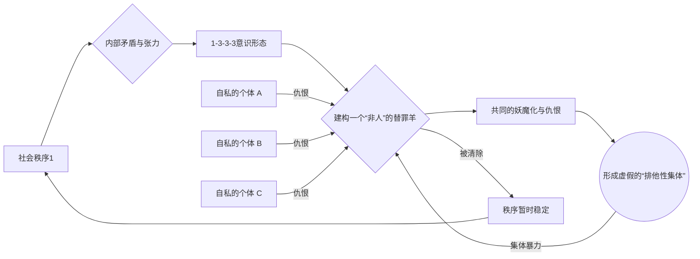
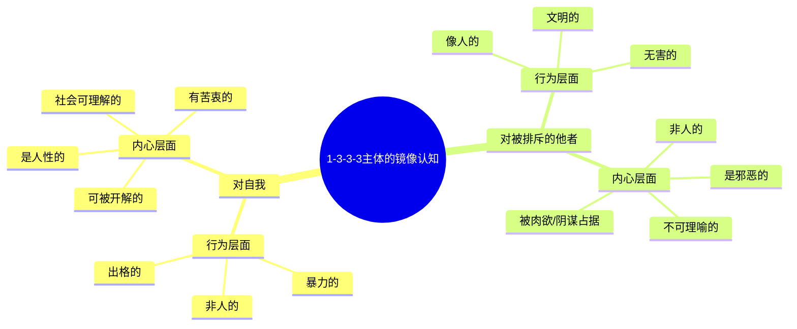
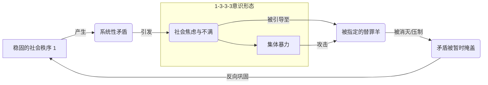

---
{"dg-publish":true,"permalink":"/1-3 唯我论/1-3-3 唯意志主义/1-3-3-3 排他性集体主义/","created":"2025-09-19T20:52:29.513+08:00","updated":"2025-09-23T00:13:54.750+08:00"}
---

### **一、本章概览**
- **主义主义编码**: 1-3-3-3
- **意识形态命名**: [[排他性集体主义\|排他性集体主义]] / [[伪集体主义\|伪集体主义]]
- **核心论断**: 该意识形态并非真正的集体主义，而是一种基于[[唯我论\|唯我论]]的自私个体集合。它通过共同妖魔化并排斥一个“他者”（替罪羊），来制造一种虚假的、反动性的集体认同，其最终目的是维护而非颠覆现存的[[权力\|权力]]秩序。
- **你能获得**:
    1.  **诊断框架**: 掌握 1-3-3-3 意识形态的“场域-本体-现象-目的”四格结构，理解其如何从一个稳固的世界观出发，通过三次“中心化”操作最终导向一种排他性的集体暴力。
    2.  **核心机制**: 洞悉[[替罪羊机制\|替罪羊机制]]在该意识形态中的运作方式，即如何通过建构一个“非人”的敌人来凝聚一个想象的共同体。
    3.  **心理画像**: 理解此意识形态信奉者独特的“[[镜像心理结构\|镜像心理结构]]”，即他们如何将自己的行为“非人化”，同时将受害者的内心“妖魔化”，并为自己的暴行进行“理性”辩护。
    4.  **现实识别**: 能够在现实生活（如校园霸凌、网络暴力、政治极化）中识别出[[排他性集体主义\|排他性集体主义]]的模式，并看穿其“集体”外衣下的自私与保守本质。

---
### **二、核心内容解析**

#### **“主义主义”四格分析**

1.  **场域之“1” (Ontology)**：该意识形态的世界观框架是一个统一、稳固且不被质疑的整体。这个“1”代表了一个被默认为理所当然的背景秩序，例如一个特定的[[5 主义/资本主义\|资本主义]]社会结构或文化传统。它是一个封闭的舞台，所有后续的冲突和暴力都发生在这个舞台*之内*，而不是为了颠覆舞台本身。这种[[存在论\|存在论]]上的整全性决定了该意识形态的根本保守性：其所有行动的最终目的都是为了清除系统内的“杂质”，以维持这个宏大框架的稳定与循环，而非挑战其存在的合法性。它就像一个自认为金瓯无缺的帝国，内部的清洗是为了让帝国更“纯粹”，而非质疑帝制本身。

2.  **本体之“3” (Body)**：在这个统一的世界舞台上，真实的存在被分裂为两个对立的维度（如普遍的、抽象的“存在”与具体的、凡俗的“存在者”），而一个强大的中心化原则——“[[自我\|自我]]”（Ego）——成为了调和这两者的中介。这个“3”意味着，世界的实在性不是客观的，而是由主体的主观意志所规定的。[[自我\|自我]]成为了衡量一切价值的中心，它将世界划分为符合我意的和不符合我意的两部分。这种[[唯我论\|唯我论]]式的本体论是[[排他性集体主义\|排他性集体主义]]的根基，因为它预设了“我”的利益和判断是定义现实的最终标准，为后续在现象和目的层面排除异己铺平了道路。

3.  **现象之“3” (Phenomenon)**：在感知层面，主体经验同样被一个中心化的[[自我\|自我]]所统御。这个“3”表现为，[[主体性\|主体性]]将世界简单地划分为“本真的”与“非本真的”，或更直白地说是“符合我利益的”（真）与“不符合我利益的”（假）。真理不再是客观的，而是服务于[[自我\|自我]]意志的工具。这种[[唯意志论\|唯意志论]]的认知模式导致其信奉者无法真正“拒斥”他们所厌恶的东西，因为从根本上说，这些“假”的、“坏”的现象也被视为由[[自我\|自我]]所创生世界的一部分。他们会感到厌烦，但不会选择分离，而是试图去征服、同化或消灭它，这为后续的暴力行动提供了心理动机。

4.  **目的之“3” (Purpose)**：该意识形态的[[9 未命名/目的论\|目的论]]同样呈现为一个中心化结构。原本分裂的伦理目标——“高贵的”行为与“低贱的”行为——被一个单一的、至高无上的集体目的所统一。这个中心化的“3”就是：**通过排斥、折磨、消灭被定义为“低贱”的群体，来实现一种“高贵”的集体净化**。这便是[[排他性集体主义\|排他性集体主义]]的核心行动纲领。所谓的“集体”正是在这个共同的、排他的暴力行动中形成的。这个终极目的本质上是反动的，它将社会内部的一切矛盾和问题都归咎于那个被妖魔化的[[替罪羊\|替罪羊]]，通过消灭它来达成一种虚假的和谐，从而巧妙地维护了场域“1”的稳定。

#### **其他核心知识点**

##### 被排斥的“非人”与想象的共同体
[[排他性集体主义\|排他性集体主义]]并非建立在共同的理想或积极的价值观之上，而是通过树立一个共同的敌人来捏合一群原本自私的个体。这个意识形态的核心操作是定义并排除一个“非人的人形动物”（inhuman human-like animal）。由于任何普遍的社会定义（如“人性”）都是抽象的，它需要通过排斥其反面来获得具体性。这个被排斥的“非人”就成了所有人确认自身“人性”的参照物。通过共同仇恨和攻击这个被建构出的[[替罪羊\|替罪羊]]（如特定的少数族裔、弱势群体），原本孤立的个体得以形成一个虚假的“我们”，一个没有真正共同利益、仅靠排外维系的[[想象的共同体\|想象的共同体]]。

**举例阐释**：一个高档小区里的业主们，无论贫富或职业差异，都可能通过共同妖魔化“在附近游荡的底层外来务工人员”来形成一种虚假的社区认同感。他们将社会不安全感全部归咎于这个群体，通过联合驱逐和鄙视，暂时忘记了业主之间因物业费、公共设施使用等产生的内部矛盾，形成了一个排他的“我们”。

##### 施暴者的镜像心理结构
1-3-3-3意识形态的信奉者拥有一种独特的、颠倒的心理认知结构。对于**自己**，他们倾向于将自己外在的、出格的暴力行为（行为上的非人）解释为是由内在可理解的、具有社会性的心理原因（如童年创伤、缺乏安全感）所导致的，因此内心深处“依然是人”。而对于他们所**妖魔化的对象**，情况则完全相反：即使对方在行为上表现得再文明、再像人，他们也坚信其内心深处是邪恶的、肮脏的、非人的、社会话语无法理解的。这种[[镜像心理结构\|镜像心理结构]]是一种强大的自我辩护机制，它通过将绝对的恶投射到他者身上，来为自己的暴行提供合法性，并让自己心安理得地处在“人性”的一边。

**举例阐释**：校园霸凌中，施暴者常常为自己的行为辩护，说“我只是开个玩笑”或“因为我家里出了事心情不好”，将自己的行为归结为可理解的内心状态。但对于被霸凌者，他们会坚称“他这个人很奇怪/很讨厌/骨子里就有问题”，将被霸凌者的内在本质定义为不可接受的、邪恶的，从而使其暴力行为显得“理所当然”。

##### 反动性的集体暴力
[[排他性集体主义\|排他性集体主义]]所催生的集体暴力，其本质是反动的（Reactionary），而非革命的。它的目标不是要推翻作为场域的宏大社会秩序（那个“1”），而是为了维护它。当系统内部的矛盾激化时，这种意识形态提供了一个便捷的出口：将所有问题归咎于一个被精心挑选出的内部敌人。通过发动一场针对这个[[替罪羊\|替罪羊]]的集体暴力，社会张力得以释放，大众的愤怒找到了发泄的渠道，而造成这些问题的根本性结构——那个“1”——却毫发无损，甚至因为“清除了害群之马”而显得更加巩固。因此，这种暴力是一种为虎作伥式的服务，是现有[[权力\|权力]]体系的清道夫，而非掘墓人。

**举例阐释**：讲稿中提到的，无论是小粉红认为清除“公知”就能解决一切问题，还是某些自由派认为清除“小粉红”就能万事大吉，都属于这种模式。他们都选择了一个内部群体作为所有社会弊病的替罪羊，通过对其进行攻击来发泄不满，而回避了对更深层次结构性问题的质询，客观上起到了维护现状的作用。

---
### **三、关键观点提取**
- “他们的[[9 未命名/目的论\|目的论]]...唯一的最高贵的行为...就是去消灭...那些低贱的人。 ”
- “133的人本质上是伥鬼，为虎作伥的伥鬼，而且这个伥鬼是误以为己虎，精神上以为自己是虎。”
- “在你这个精神上面，你要把握这个普遍性，你只有通过这种方式，只有通过一种排除一个东西，要一个抓手。”
- “所有人都默认没人性是不言自明的，那那些没人性的人，我们就要把他干掉，就把它排除在社会之外。”
- “他的行为很出格，像个妖魔...但是我的心灵是正常的...另外一方面，他所敌视的对象，无论行为上多么文明...内心深处这些人是没有人性的。”

---
### **四、知识点问答**
#### Q: 为什么讲稿将 1-3-3-3 称为“[[伪集体主义\|伪集体主义]]”，而非真正的[[5 主义/集体主义\|集体主义]]？
A: 因为真正的[[5 主义/集体主义\|集体主义]]通常基于共同的、积极的建设性目标和价值观。而 1-3-3-3 的“集体”则完全是消极定义的：它没有内在的、积极的共同点，其唯一的凝聚力来自于对一个外部“他者”的共同仇恨和排斥。其成员本质上仍是[[唯我论\|唯我论]]和自私的，他们只是暂时利用这个“集体”作为工具来发泄不满、转嫁矛盾并巩固自身（或所属阶层）的优势地位。一旦[[替罪羊\|替罪羊]]消失，这个虚假的集体便失去了存在的理由。

#### Q: 在 1-3-3-3 结构中，场域的“1”与后续三个“3”之间是什么关系？
A: 场域的“1”是整个意识形态得以运作的、不被言明的前提和背景。它是一个被默认的、稳定的[[权力\|权力]]秩序。后续的三个“3”（在本体、现象、目的上的中心化）都是在这个“1”的框架内进行的内部操作。它们通过[[自我\|自我]]的不断确证和对世界的分割，最终指向一个旨在“净化”和“维护”这个“1”的排他性行动。因此，“1”是“老虎”，而“3-3-3”结构下的人则是“为虎作伥的伥鬼”，他们的所有主观能动性最终都服务于这个宏大秩序的再生产。

#### Q: 为何信奉 1-3-3-3 的人，往往能为自己极为残暴的行为进行“清醒的自我辩护”？
A: 因为该意识形态为他们提供了一套完整的、看似理性的“庸俗社会分析”工具。这套分析总能“论证”出所有社会问题的根源在于某个特定的[[替罪羊\|替罪羊]]群体。同时，他们的[[镜像心理结构\|镜像心理结构]]允许他们将行为与内心分离：承认自己的行为出格（非人），但坚信自己的内心动机是正当的、可被社会理解的（是人）。这种心理机制使他们能够心安理得地实施暴力，因为他们相信自己是在执行一种必要的“净化”任务，是在为“正常社会”清除“病灶”。

---
### **五、知识延伸**
- **[[勒内·基拉尔\|勒内·基拉尔]]的[[模仿理论\|模仿理论]]与[[替罪羊机制\|替罪羊机制]]**: 基拉尔的理论是理解 1-3-3-3 的绝佳理论工具。他认为社会冲突源于欲望的模仿，而当冲突升级到危及社会存续时，社会会通过一次集体暴力，将所有罪责转移到一个任意选定的[[替罪羊\|替罪羊]]身上，从而恢复秩序。这与 1-3-3-3 通过排斥他者来形成虚假共同体的机制完全一致。
- **[[卡尔·施密特\|卡尔·施密特]]的[[敌我理论\|敌我理论]]**: 施密特认为，“政治”的本质在于划分敌我。1-3-3-3 可以被看作是这种[[敌我理论\|敌我理论]]在社会心理层面的一种极端化和庸俗化应用。它将一个群体定义为绝对的、必须被消灭的敌人，并通过与这个敌人的斗争来确立自身的政治与社会身份，这正是[[5 主义/法西斯主义\|法西斯主义]]的核心逻辑。
- **电影《[[浪潮\|浪潮]]》(Die Welle, 2008)**: 这部德国电影生动地展示了一个现代化的、受过良好教育的学生群体，如何在短短几天内形成一个排他性的、带有法西斯色彩的集体。电影细致地刻画了身份认同的渴望、对纪律的服从，以及如何通过排斥异见者和外部人员来迅速巩固内部团结，是 1-3-3-3 意识形态在现实中生成过程的完美寓言。

---
### **六、双链关联总结**
- **一级关联 (核心意识形态与概念)**: [[排他性集体主义\|排他性集体主义]]、[[伪集体主义\|伪集体主义]]、[[唯我论\|唯我论]]、[[唯意志论\|唯意志论]]、[[5 主义/法西斯主义\|法西斯主义]]、[[替罪羊机制\|替罪羊机制]]、[[妖魔化\|妖魔化]]、[[非人\|非人]]、[[想象的共同体\|想象的共同体]]、[[镜像心理结构\|镜像心理结构]]、[[反动性的集体暴力\|反动性的集体暴力]]
- **推测相关人物 (Speculated Figures)**:
    - **校园霸凌的施暴者**: 通过孤立和攻击某个同学，来形成小团体，获得虚假的权力和归属感。
    - **极端化的网络社群成员**: 无论是小粉红还是“神友”，他们都通过树立一个绝对的外部或内部敌人（如“公知”、“资本”、“境外势力”或“愚昧的大多数”）来凝聚社群认同，并对异见者进行网络暴力。
    - **历史上的[[5 主义/麦卡锡主义\|麦卡锡主义]]者**: 他们将美国社会的一切问题归咎于“共产主义渗透”，通过清洗和迫害所谓的“同情者”，来制造一种虚假的国家团结和安全感。
- **二级关联 (上下文与背景)**: [[主页\|主页]]、[[存在论\|存在论]]、[[9 未命名/现象学\|现象学]]、[[9 未命名/目的论\|目的论]]、[[主体性\|主体性]]、[[权力\|权力]]、[[5 主义/资本主义\|资本主义]]、[[反闪米特主义\|反闪米特主义]]
- **三级关联 (推测与延展)**: [[勒内·基拉尔\|勒内·基拉尔]]、[[卡尔·施密特\|卡尔·施密特]]、[[敌我理论\|敌我理论]]、[[模仿理论\|模仿理论]]、[[9 未命名/大他者\|大他者]]、[[拉康\|拉康]]、[[9 未命名/镜像阶段\|镜像阶段]]、[[集体无意识\|集体无意识]]、[[庸俗社会学\|庸俗社会学]]