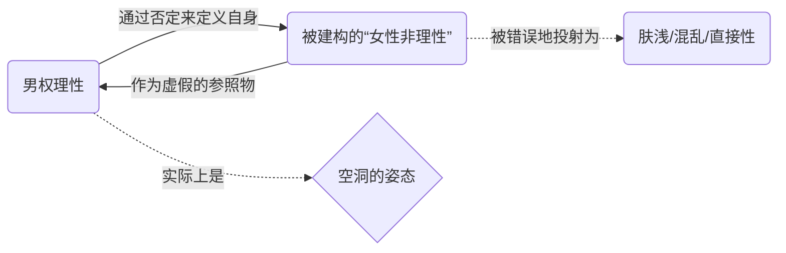
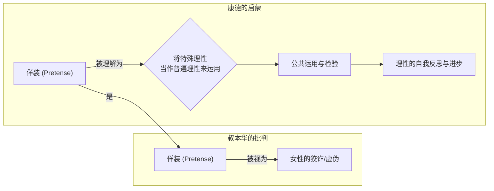
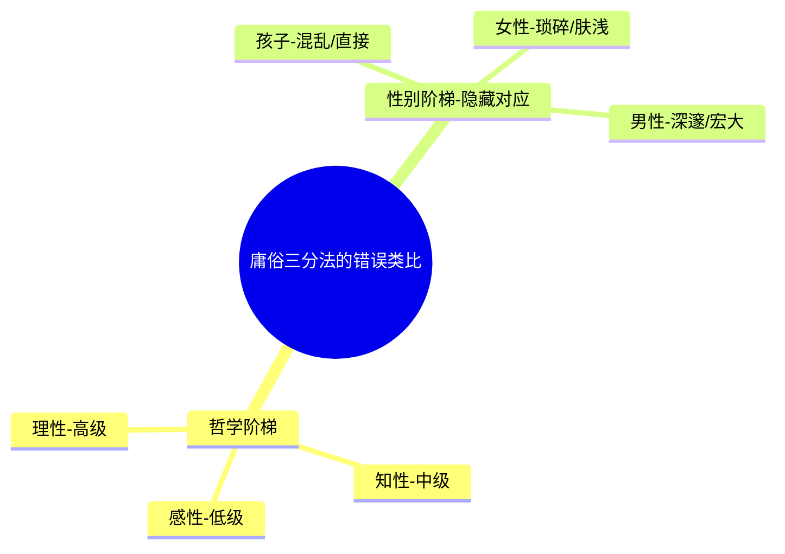

---
{"dg-publish":true,"permalink":"/1-3 唯我论/1-3-3 唯意志主义/1-3-3-4 厌女症-虚无主义/","created":"2025-09-19T20:52:29.517+08:00","updated":"2025-09-23T00:13:55.821+08:00"}
---

### **一、本章概览**
- **主义主义编码**: 1-3-3-4
- **意识形态命名**: [[厌女症-虚无主义\|厌女症-虚无主义]] / [[叔本华式唯意志主义\|叔本华式唯意志主义]]
- **核心论断**: 该意识形态通过将一个中心化的[[意志\|意志]]本体，聚焦于一个被建构和妖魔化的[[小他者\|小他者]]（即[[女性性\|女性性]])上进行现象学体验，最终通过否定这一核心靶子，导向一种封闭的、自我取消的[[虚无主义\|虚无主义]]。
- **你能获得**: 掌握 1-3-3-4 意识形态的内在运作机制；理解[[厌女症\|厌女症]]如何成为特定[[虚无主义\|虚无主义]]的技术性前提；洞悉[[叔本华\|叔本华]]哲学中被批判为“男权自恋”的逻辑结构，并学会运用[[康德\|康德]]的[[启蒙\|启蒙]]思想对其进行解构。

---
### **二、核心内容解析**

#### **“主义主义”四格分析**

1.  **场域之“1” (Ontology)**：该意识形态的[[存在论\|存在论]]框架是一个封闭、统一的整体。[[世界\|世界]]被预设为一个由单一原则（即[[意志\|意志]]）贯穿的、无缝的“[[作为意志和表象的世界\|作为意志和表象的世界]]”。这里的“1”意味着不存在外在于这个[[世界\|世界]]的根本性他者或断裂，万事万物都是这唯一本体的不同表现形式。它是一个自足的、循环的系统，[[意志\|意志]]既是舞台本身，也是舞台上唯一的演员，整个宇宙论是独断且整全的，不为任何外部原则所动摇。

2.  **本体之“3” (Body)**：在这个统一的舞台上，唯一真实且作为万物本源的[[本体\|本体]]，是一个中心化的[[意志\|意志]]（Will）。数字“3”的含义在此处至关重要：这个[[意志\|意志]]并非一种弥散的力量，而是被理解为一个核心的、具有中介性质的驱动力。它像一个中心黑洞，所有现象（表象）都围绕它旋转并被它所规定。它是一种原初的、盲目的、非理性的生命冲动，是[[世界\|世界]]所有冲突与痛苦的终极解释，一切都向这个中心汇集，并最终归因于它。

3.  **现象之“3” (Phenomenon)**：[[主体性\|主体性]]感知[[世界\|世界]]的方式，是通过一个中心化的中介，即被妖魔化的[[小他者\|小他者]]——[[女性性\|女性性]]。这里的“3”体现为一种认知上的聚焦和扭曲。所有不可理解的、矛盾的、混乱的经验，都被投射到“女性”这个被建构出的形象上。主体通过与这个“他者”的对立来确立自身的（伪）理性地位。因此，[[现象\|现象]][[世界\|世界]]的体验是高度中介化的，所有的喜怒哀乐、真假虚实，最终都被归因为这个被中心化的、既被爱欲投注又被厌恶的对象。

4.  **目的之“4” (Purpose)**：该意识形态最终导向的[[9 未命名/目的论\|目的论]]是彻底的[[虚无\|虚无]]。数字“4”在此代表了系统内部的矛盾与不可能性所导致的最终崩解。在否定了作为现象中介的[[女性性\|女性性]]，并揭示了[[意志\|意志]]本体的盲目与无意义之后，整个系统失去了任何前进的动力和方向。它的终点不是达成某个目标，而是揭示目标本身的缺席。这种[[虚无主义\|虚无主义]]是一种内在的坍缩，是系统无法维持其自身谎言后的必然结局，代表了一种开放性的失败，最终走向封闭和死寂。

#### **其他核心知识点**

##### 男权理性的虚假建构
这种意识形态所吹嘘的所谓“男性理性”或“深邃理性”，其本质是一种空的、不具有任何积极规定性的姿态。它完全依赖于将[[女性性\|女性性]]建构为一个“非理性”、“肤浅”、“只看眼前”的对立面，并通过持续地否定这个对立面来获得自身的定义。这种[[理性\|理性]]就像一个笑话里定义“猴子”为“不是马的生物”一样，除了一个否定的姿态外空无一物。它是一种自恋的幻觉，必须通过贬低和排斥一个[[小他者\|小他者]]，才能虚构出一个所谓的“男性共同体”秩序和深度。

**举例阐释**：讲稿中提到，当男人说自己能看到“深远”的东西时，这个“深远”的定义仅仅是“女人看不到的东西”。它没有独立的、积极的衡量标准，其全部内容就是对女性视野的否定，这是一种典型的、通过制造外部敌人来巩固内部认同的低级策略。

##### 作为启蒙核心的“佯装” (Pretense)
[[叔本华\|叔本华]]指责女性的核心武器是“狡诈”与“佯装”（Pretense），认为这是一种天生的、虚伪的本能。然而，讲稿巧妙地将其与[[康德\|康德]]在《[[何谓启蒙？\|何谓启蒙？]]》中的核心论点联系起来。[[康德\|康德]]所说的“要有勇气运用你自己的理智”，恰恰要求主体“佯装”自己的特殊理性具有普遍性，并勇敢地将其投入公共领域进行检验。这种“假装”并非虚伪，而是一种推动[[理性\|理性]]发展的必要姿态，是在不确定中进行普遍化尝试的勇气。因此，[[叔本华\|叔本华]]所鄙夷的，恰恰是[[启蒙\|启蒙]]精神中最具活力和开放性的核心。

**举例阐释**：一个人在公共论坛上就社会议题发表看法，他就是在“佯装”自己的个人见解能够作为一种普遍原则被讨论。正是这种行动，才可能暴露其思想的局限性并促成更深刻的共识，这就是[[启蒙\|启蒙]]的实践。

##### 庸俗化的“感性-知性-理性”三分法
该意识形态的持有者，通常会将[[康德\|康德]]哲学的“感性-知性-理性”三分法，庸俗地理解为一个从低级到高级的线性鄙视链。他们会轻易地将这套哲学框架与社会性别等级进行类比：感性是混乱的、直接的（等同于“孩子”或原始状态）；知性是琐碎的、单纯的、缺乏反思的（等同于“女性”）；而理性则是深邃的、格局宏大的、把握本质的（等同于“男性”）。这种机械的对应关系，不仅完全曲解了[[康德\|康德]]与[[黑格尔\|黑格尔]]哲学的复杂性，更暴露了其背后为[[男权自恋\|男权自恋]]服务的意识形态动机。

**举例阐释**：[[叔本华\|叔本华]]认为女性“成熟得早，所以理性不成熟”，并将她们的思想归为“浮于表面”，这正是将女性强行塞入“知性”这一被他理解为低级阶段的典型操作，从而为“男性”占据“理性”的顶端制造合法性。

---
### **三、关键观点提取**
- “[[男权理性\|男权理性]]……它的规定性全在于男性的一种自恋的一种视线。这种自恋的视线撇是女性把女性瞥视成没有非理性的，然后他就什么都和女人对着干，和女人对着干，那我就有[[理性\|理性]]了。”
- “[[女性本质不存在\|女性本质不存在]]。不存在女性本质这种东西，这种东西就是男人用来建构他男性共同体秩序的所投射出来所幻想出来的那个东西。”
- “当这个致命的症结松开的时候，我们就能感受到某种理性的交集。所以在这个意义上讲，我们回过头去就能理解[[理性\|理性]]的本质就是一种[[假装\|假装]]。”
- “你如果认为这是一个从低级到高级的这么一个序列的话，我告诉你，你学的哲学就是最庸俗的、最垃圾的哲学……是自恋男权共同体自恋的恶臭哲学。”
- “他把这个[[女性性\|女性性]]给他消解掉，实际上就是把他自己的[[主体性\|主体性]]给消解掉了。消解掉了之后，他又把整个哲学的场域，感性、知性、[[理性\|理性]]三种可能性全部否定掉的那他剩下只剩[[虚无\|虚无]]。”

---
### **四、知识点问答**
#### Q: 为何说 1-3-3-4 这种结构的[[虚无主义\|虚无主义]]必然是“[[厌女症\|厌女症]]”的？
A: 因为它的结构依赖于一个中心化的中介来组织现象和体验。在第3格（现象）的位置上，它选择将[[女性性\|女性性]]这个[[小他者\|小他者]]作为所有矛盾、欲望和非理性的投射对象。整个[[主体性\|主体性]]的（伪）理性是通过否定这个靶子来确立的。因此，当它最终走向第4格的[[虚无\|虚无]]时，这个[[虚无\|虚无]]是通过彻底否定和取消那个作为核心中介的“女性”来实现的。没有“[[厌女症\|厌女症]]”作为操作手段，它就无法完成从中心化（3）到虚无（4）这最后一跃，其[[虚无主义\|虚无主义]]的闭环就无法形成。

#### Q: 讲稿如何论证[[叔本华\|叔本华]]自身的哲学思想，恰恰体现了他所鄙视的“女性化”特质？
A: 讲稿指出，[[叔本华\|叔本华]]形容的女性特质是“多愁善感、悲观主义、摇曳不定”，而他自己的哲学——充满阴郁的悲观论调，对[[世界\|世界]]意志的描绘充满非理性的冲动和混乱——恰恰是这些特质的理论化身。他的[[理性\|理性]]并非建构性的，而是一种不断否定的、充满情绪的姿态。他所妖魔化的那个[[小他者\|小他者]]，实际上是他自身主体性的镜像反映。他通过厌恶“女性”，实则是在厌恶和压抑自己主体中无法被“男权秩序”收编的部分。

#### Q: 如何理解“佯装”（Pretense）既是[[叔本华\|叔本华]]攻击女性的武器，又是[[康德\|康德]]式[[启蒙\|启蒙]]理性的核心？
A: [[叔本华\|叔本华]]将“[[佯装\|佯装]]”理解为一种弱者的、本质性的虚伪和狡诈。而从[[康德\|康德]]的[[启蒙\|启蒙]]视角看，“[[佯装\|佯装]]”是一种方法论上的勇气：即敢于将自己特殊的、有限的理性，“假装”它具有普遍有效性并拿到公共领域去检验。这种“假装”是[[理性\|理性]]走出私有领域、迈向普遍化的第一步，是承担风险、开放自身的姿态。因此，同一个行为，在[[叔本华\|叔本华]]的封闭体系里是道德缺陷，在[[康德\|康德]]的开放体系里却是[[理性\|理性]]自由的体现。

---
### **五、知识延伸**
- **[[西蒙娜·德·波伏娃\|西蒙娜·德·波伏娃]]《[[第二性\|第二性]]》**: 此书是批判[[厌女症\|厌女症]]和“[[女性本质不存在\|女性本质不存在]]”这一思想的奠基之作。波伏娃系统地阐述了女性是如何在历史和文化中被建构成男性的“他者”，这为理解 1-3-3-4 意识形态中“现象之3”的运作机制提供了最经典的理论支持。
- **[[拉康\|拉康]]关于“女人不存在 (La femme n'existe pas)”的论述**: 拉康的精神分析理论深刻揭示了“女人”作为一个能指，是男性话语体系为了填补自身欲望的空洞而建构的幻想对象。这直接呼应了讲稿中“[[女性本质不存在\|女性本质不存在]]，只是男人投射的幻想”这一核心观点，为解构[[男权理性\|男权理性]]提供了精神分析的视角。
- **[[叔本华\|叔本华]]《[[论女人\|论女人]]》**: 直接阅读[[叔本华\|叔本华]]本人的这篇文章，可以最直观地感受其[[厌女症\|厌女症]]思想的系统性与偏执性。将其作为一手材料与本讲稿的分析进行对读，可以更深刻地理解“主义主义”框架作为一种诊断工具的有效性。

---
### **六、双链关联总结**
- **一级关联 (核心意识形态与概念)**: [[厌女症-虚无主义\|厌女症-虚无主义]]、[[叔本华式唯意志主义\|叔本华式唯意志主义]]、[[意志\|意志]]、[[虚无主义\|虚无主义]]、[[女性性\|女性性]]、[[男权理性\|男权理性]]、[[假装\|假装]]
- **推测相关人物 (Speculated Figures)**: [[叔本华\|叔本华]] (直接分析对象)、[[海子\|海子]] (被讲稿提及的例子)、酸臭文人 (讲稿中描述的一类符合该意识形态模式的群体)
- **二级关联 (上下文与背景)**: [[欧陆哲学\|欧陆哲学]]、[[9 未命名/精神分析\|精神分析]]、[[康德\|康德]]、[[黑格尔\|黑格尔]]、[[拉康\|拉康]]、[[启蒙\|启蒙]]、[[狂飙主义\|狂飙主义]]
- **三级关联 (推测与延展)**: [[小他者\|小他者]]、[[主体性\|主体性]]、[[9 未命名/目的论\|目的论]]、[[存在论\|存在论]]、[[现象\|现象]]、[[女性本质不存在\|女性本质不存在]]、[[第二性\|第二性]]、[[作为意志和表象的世界\|作为意志和表象的世界]]