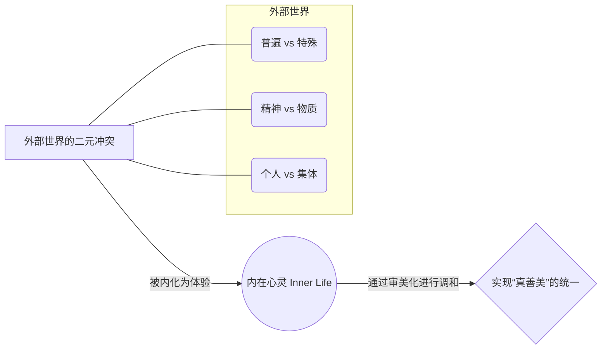
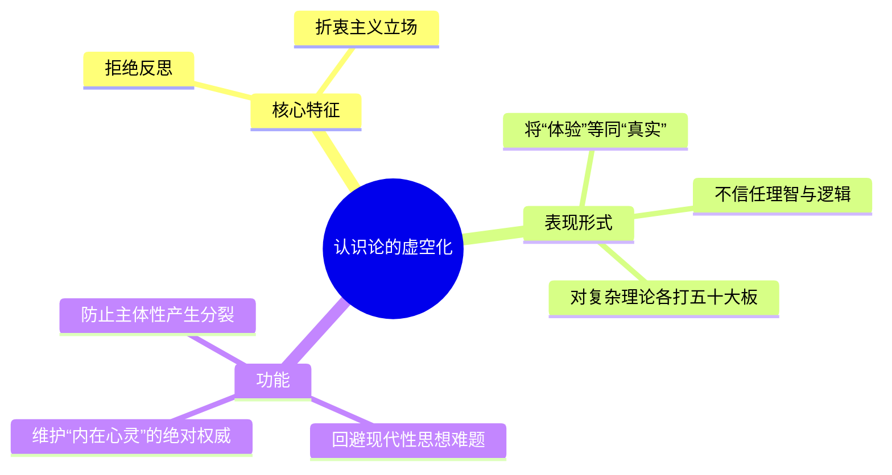
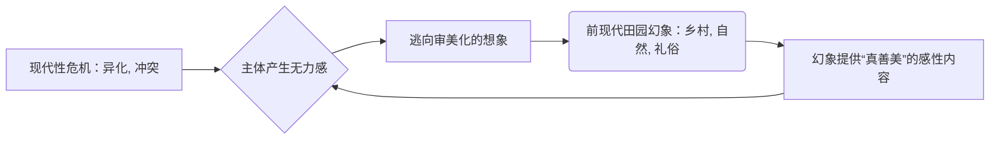

---
{"dg-publish":true,"permalink":"/1-3 唯我论/1-3-4 直觉主义/1-3-4-1 伦理行动主义/","created":"2025-09-19T20:52:29.524+08:00","updated":"2025-09-23T00:13:57.189+08:00"}
---

### **一、本章概览**
- **主义主义编码**: 1-3-4-1
- **意识形态命名**: [[伦理行动主义\|伦理行动主义]] / [[内在理想主义\|内在理想主义]]
- **核心论断**: 该意识形态通过将一个中心化的“[[内在心灵\|内在心灵]]”设定为调和一切矛盾的场域，并悬置（虚无化）认识论的反思能力，最终导向一个静态的、前现代式的“[[真善美\|真善美]]”统一理想。其本质是一种针对现代性冲突的、带有反智倾向的审美化自我安慰机制。
- **你能获得**: 你将掌握 1-3-4-1 意识形态的内在结构，理解其如何通过虚化[[9 未命名/认识论\|认识论]]来巩固一个看似美好的内在世界；学会识别并批判现实中（尤其在某些教育和文化领域）以“耕耘内心”为名的反思能力退化现象；并了解其与[[审美阶段\|审美阶段]]、[[新柏拉图主义\|新柏拉图主义]]等思想的深层关联。

---
### **二、核心内容解析**

#### **“主义主义”四格分析**

1.  **场域之“1” (Ontology)**：该意识形态的[[存在论\|存在论]]背景是一个前反思的、统一且无矛盾的整体世界，即“[[存有\|存有]]” (Being)。数字“1”在这里意味着世界作为一个舞台，其本身是和谐与完整的，不包含内在的断裂或根本性的冲突。所有后续出现的矛盾都被视为在这个整全背景下的次级现象，而非世界本身的结构性分裂。这种设定为后续通过“[[内在心灵\|内在心灵]]”实现最终的和谐统一提供了可能性，因为它默认了一个可以回归的、本源性的和谐整体。

2.  **本体之“3” (Body)**：在统一的[[世界\|世界]]场域中，现实内容被把握为一种二元对立，但这种对立由一个强大的中心所调和。数字“3”代表了这个中介结构。讲稿指出，这种对立具体表现为普遍/超越的[[存有\|存有]]（如理想、精神）与特殊/沉沦的存在（如世俗、物质）之间的矛盾。而调和这一切的中心，正是被极度抬高的“[[内在心灵\|内在心灵]]”（Inner Life）。这个[[内在心灵\|内在心灵]]成为了一个万能的容器，所有外部世界的冲突都被内化为心灵内部的体验，并在此处得到抚慰、整合与“升华”，从而维持了主体的统一感。

3.  **现象之“4” (Phenomenon)**：该意识形态在[[9 未命名/认识论\|认识论]]上采取了一种虚无化或[[折衷主义\|折衷主义]]的立场。数字“4”在此处不代表积极的内在分裂，而代表一个被悬置、被掏空的“空位”。主体放弃了对自身感知和经验进行严格的[[反思\|反思]]与追问（例如“我体验到的是真实的吗？”），不信任理智，也不深究感性。这种认识论上的“不作为”或“怎么都行”的态度，使其能够回避现代思想的核心难题，直接将“体验”等同于“真实”，从而为“[[内在心灵\|内在心灵]]”的绝对权威扫清了障碍。

4.  **目的之“1” (Purpose)**：该意识形态的[[9 未命名/目的论\|目的论]]是回归到一个封闭、静态的终极和谐状态。数字“1”在此处代表着最终的统一。这个终极目标被表述为“[[真善美\|真善美]]”的完全融合。在这种理想状态下，心灵的真实体验（真）、伦理的和谐无冲突（善）与审美的愉悦感受（美）三者合一，构成一个不再需要前进和发展的完美闭环。这个目的的本质是循环往复地维持内在的和谐，以此来抵抗外部世界的变动与分裂，是一种静态的、自我满足的终结。

#### **其他核心知识点**

##### 内在心灵：作为矛盾的终极调和者
“[[内在心灵\|内在心灵]]”（Inner Life）是 1-3-4-1 意识形态的核心引擎。它并非一个进行批判性反思的[[主体性\|主体性]]空间，而是一个被赋予了神秘调和能力的中心场域。该意识形态将所有外部的、无法解决的现代性冲突（如个人与集体、自然与理智、精神与物质）全部内化到这个“心灵”之中。在这里，这些冲突不再是需要被分析和解决的社会或哲学问题，而被转化为一种可供“体验”和“感悟”的内在风景。通过这种转化，主体获得了一种虚假的掌控感：虽然无力改变外部世界，但似乎可以在内心世界里将一切抚平，达到一种和谐的、自洽的完满状态。这使其成为一种强大的自我安慰和自我标榜的工具，尤其对于在现实权力结构中被边缘化的“小知识分子”而言。

**举例阐释**：一位乡村教师面对城乡差距、教育资源不公等尖锐的社会矛盾时，可能会放弃从结构上分析和批判这些问题，转而阅读《人生的价值与意义》这类书籍。他/她会认为，最重要的不是改变外部环境，而是在自己的“[[内在心灵\|内在心灵]]”中耕耘一片“理想园地”，通过教学和阅读艺术作品，达到一种超越现实矛盾的“[[真善美\|真善美]]”和谐状态。

##### 认识论的虚空化：反智的防御机制
1-3-4-1 编码中的“4”代表着[[9 未命名/认识论\|认识论]]维度的缺席，讲稿称之为“[[折衷主义\|折衷主义]]”或“不反思”。这种“虚空化”是该意识形态得以成立的关键前提。它主动回避了自[[笛卡尔\|笛卡尔]]和[[康德\|康德]]以来西方哲学的核心问题：我们的认识是如何可能的？我们如何区分现象与实在？通过放弃这些批判性问题，主体得以维持一种天真（naïve）的立场，即“我体验到的就是真实的”。这种反智倾向，使其对任何复杂的理论体系都采取一种“各打五十大板”然后不了了之的态度。这种认识论上的懒惰，本质上是一种防御机制，因为它避免了任何可能刺痛主体、使其现有和谐状态崩解的深刻反思。

**举例阐释**：在讨论“自然主义”与“理智主义”的对立时，[[伦理行动主义\|伦理行动主义]]者不会深入分析各自的哲学预设和逻辑困境，而是会说“两者都有可取之处，也都有其局限性”，然后迅速将议题转向“我们应当在‘[[内在心灵\|内在心灵]]’中将二者加以调和”，从而用一个模糊的中心概念掩盖了真正的思想交锋。

##### 前现代田园幻象：真善美的感性载体
该意识形态所追求的“[[真善美\|真善美]]”统一，并非一个纯粹抽象的理念，它往往需要一个具体的、感性的寄托，而这个寄托就是一种被美化了的“[[前现代田园幻象\|前现代田园幻象]]”。这种幻象将乡村、自然风光、淳朴的礼俗、农业生活等元素理想化，视其为“真实”、“善良”和“美好”的源泉。它刻意过滤掉了[[前现代\|前现代]]生活中的残酷、压迫与艰辛，只保留其符合审美想象的一面。这种幻象之所以必要，是因为它为“[[内在心灵\|内在心灵]]”提供了一个可供沉浸和感动的具体场景，让那种内在的和谐感显得“真实可触”。它实质上是对充满冲突和异化的现代都市文明的一种消极抵抗和审美式逃避。

**举例阐释**：一些散文作品热衷于描绘山间的清泉、老农的谚语、田野的宁静，并从中提炼出所谓“人生的智慧”和“心灵的慰藉”。这种描绘往往忽略了现实农村的经济困境与社会问题，而只是将其当作一个能让作者和读者投射其“[[内在心灵\|内在心灵]]”和谐理想的背景板。

---
### **三、关键观点提取**
- “这个维度是一个什么？万物皆备于心，那种感觉是一种万物交汇之处...这个时候渺小的人特别[[小知识分子\|小知识分子]]就不自卑了。”
- “这种[[前现代\|前现代]]幻想一般就是说什么就是田园风光...他会觉得这些老农的一番谚语当中包含了什么什么深邃的智慧。”
- “这种理想状态下，[[真善美\|真善美]]是达到统一的，这既是真的也是善的，也是美的。”
- “它（内在生活）一定是虚伪的，他一定是肤浅的，他是被这个防御系统结构好了的。”

---
### **四、知识点问答**
#### Q: 为什么说 1-3-4-1 意识形态的核心症结在于其现象维度的“4”？
A: 因为现象维度的“4”代表了[[9 未命名/认识论\|认识论]]的虚空化。这相当于拆除了整个思想体系的“防火墙”或“质检系统”。一个健康的[[主体性\|主体性]]需要不断地反思“我所感知的是否为真？”，但 1-3-4-1 意识形态通过悬置这一问题，使得作为核心的“[[内在心灵\|内在心灵]]”（本体之“3”）可以不受任何批判和检验地运作。它将一切“体验”都默认为真实有效的，从而让主体沉浸在自我营造的和谐感中，失去了发现自身被意识形态欺瞒的可能性，最终导致智识上的停滞和固步自封。

#### Q: 该意识形态中的“[[真善美\|真善美]]”统一，与古典哲学（如柏拉图）中的“真善美”有何本质区别？
A: 古典哲学中的“[[真善美\|真善美]]”统一，通常指向一个超越性的、客观的理念世界，需要通过艰苦的理性思辨和哲学训练才能达致。它是一个客观的、普遍的[[9 未命名/目的论\|目的论]]。而 1-3-4-1 意识形态中的“[[真善美\|真善美]]”则是一个主观化的、内在化的、审美化的状态。它不依赖于对外部[[世界\|世界]]的客观认识，而是通过在“[[内在心灵\|内在心灵]]”中调和情感冲突来实现。它的本质是主体的一种“感觉良好”的自洽状态，而非对宇宙真理的把握，因此更接近于一种心理防御机制。

#### Q: 为何讲稿认为这种意识形态是“反现代化”的？
A: 因为现代性的核心特征之一就是分化与冲突，包括理性与感性的分离、事实与价值的分离、个体与社会的分裂等。现代思想的核心任务正是直面这些分裂。而[[伦理行动主义\|伦理行动主义]]则采取了回避和倒退的策略：它不试图去理解和解决这些现代性矛盾，而是幻想通过退回到一个“[[内在心灵\|内在心灵]]”的避难所，来重新实现一种[[前现代\|前现代]]式的、未经分化的和谐统一。它用一种田园牧歌式的幻象来抵抗现代文明的复杂性，因此在本质上是反现代的。

---
### **五、知识延伸**
- **[[克尔凯郭尔\|克尔凯郭尔]]的“[[审美阶段\|审美阶段]]”**: 克尔凯郭尔在其“生存三阶段”理论中描述的“[[审美阶段\|审美阶段]]”，与 1-3-4-1 的特征高度吻合。处于审美阶段的人以瞬时的、感性的“有趣”或“美”作为生活准则，逃避做出伦理的抉择和承担责任，这与[[伦理行动主义\|伦理行动主义]]通过内在审美体验来回避现实矛盾的做法如出一辙。
- **[[新柏拉图主义\|新柏拉图主义]]**: 讲稿中提及，可作为参照。[[新柏拉图主义\|新柏拉图主义]]认为世界是从完美的“太一”流溢而出，分为不同等级，而人的目标是通过灵性修行回归“太一”。这与 1-3-4-1 中“从普遍到特殊”的本体设定，以及最终要回归“[[真善美\|真善美]]”统一的[[9 未命名/目的论\|目的论]]，在结构上有一定的相似性，尽管前者是体系严谨的古典哲学，而后者是一种现代性的病症。
- **[[柏格森\|柏格森]]的生命哲学**: 讲稿将[[柏格森\|柏格森]]与[[鲁道夫·沃肯\|鲁道夫·沃肯]]相提并论，因为二者都强调直觉、体验和“生命”（Life）本身，而对分析性的、概念化的理智持批判态度。[[柏格森\|柏格森]]的“生命冲动”（élan vital）虽然比“[[内在心灵\|内在心灵]]”概念更具哲学深度，但其反智识主义的倾向，为[[伦理行动主义\|伦理行动主义]]这类轻视[[9 未命名/认识论\|认识论]]反思的意识形态提供了某种哲学上的远亲。

---
### **六、双链关联总结**
- **一级关联 (核心意识形态与概念)**: [[伦理行动主义\|伦理行动主义]]、[[内在理想主义\|内在理想主义]]、[[内在心灵\|内在心灵]]、[[真善美\|真善美]]、[[折衷主义\|折衷主义]]、[[小知识分子\|小知识分子]]
- **推测相关人物 (Speculated Figures)**: [[鲁道夫·沃肯\|鲁道夫·沃肯]] (该意识形态的典型代表)、[[乡村教师\|乡村教师]] (该意识形态的目标受众与实践者社会身份画像)、[[苏轼\|苏轼]] (被讲稿提及，作为1-3-4-1类型者可能爱上的1-3-1-4 [[唯梦论\|唯梦论]]者)
- **二级关联 (上下文与背景)**: [[主页\|主页]]、[[存在论\|存在论]]、[[9 未命名/目的论\|目的论]]、[[主体性\|主体性]]、[[现象\|现象]]、[[9 未命名/认识论\|认识论]]、[[反思\|反思]]、[[无意识\|无意识]]、[[前现代\|前现代]]、[[9 未命名/现代性\|现代性]]
- **三级关联 (推测与延展)**: [[克尔凯郭尔\|克尔凯郭尔]]、[[审美阶段\|审美阶段]]、[[新柏拉图主义\|新柏拉图主义]]、[[柏格森\|柏格森]]、[[唯梦论\|唯梦论]]、[[笛卡尔\|笛卡尔]]、[[康德\|康德]]