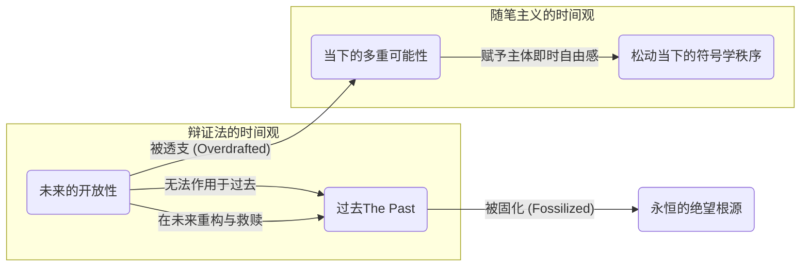
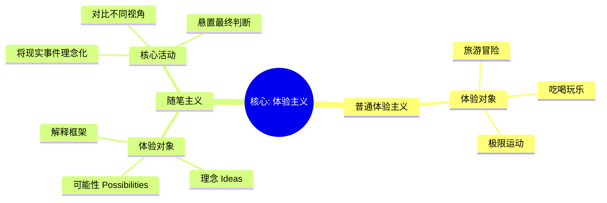
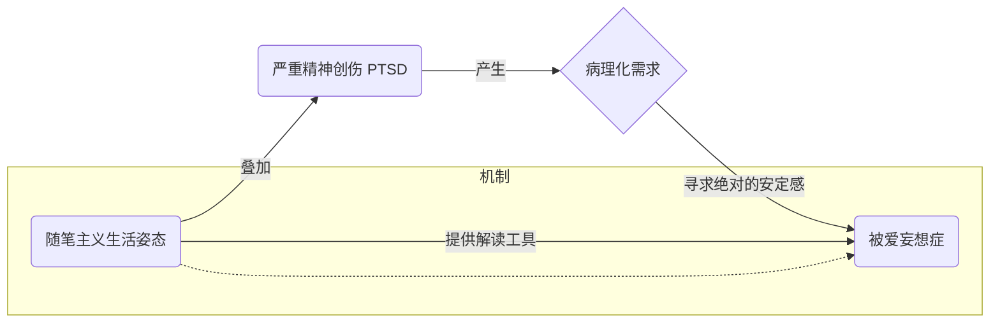

---
{"dg-publish":true,"permalink":"/1-3 唯我论/1-3-4 直觉主义/1-3-4-2 随笔主义/","created":"2025-09-19T20:52:29.526+08:00","updated":"2025-09-23T00:13:58.078+08:00"}
---

### **一、本章概览**
- **主义主义编码**: 1-3-4-2
- **意识形态命名**: [[随笔主义\|随笔主义]] / [[尝试主义\|尝试主义]] (Essayism)
- **核心论断**: [[随笔主义\|随笔主义]]是一种通过悬置对现实的最终判断，来体验理念多样性的意识形态。它以牺牲未来的解放性潜力为代价，换取当下的可能性自由，却因此将过去凝固为无法被救赎的永恒牢笼，最终导向一种智识上的自由与存在性的绝望并存的局面。
- **你能获得**:
    1.  **诊断框架**: 掌握 1-3-4-2 编码的内在结构，理解其场域、本体、现象、目的四个维度的运作逻辑。
    2.  **核心概念**: 深入理解“[[理念的体验\|理念的体验]]”、“[[时间的错误处理\|时间的错误处理]]”以及“[[悬置与自由的中介\|悬置与自由的中介]]”等关键概念。
    3.  **现实应用**: 辨识现实生活中（尤其是现代情感关系与自我表达中）“[[随笔主义\|随笔主义]]”的生活姿态及其潜在的[[精神病理化风险\|精神病理化风险]]。

---
### **二、核心内容解析**

#### **“主义主义”四格分析**

1.  **场域之“1” (Ontology)**：[[随笔主义\|随笔主义]]将世界预设为一个统一且充满内在可能性的“随笔式”[[世界\|世界]]。这个[[存在论\|存在论]]框架虽然不是封闭的决定论，但依然是一个融贯的整体（“1”）。它不像[[5 主义/物理主义\|物理主义]]那样被铁律所支配，而是像一篇不断被尝试、被书写的文章，其整体性体现在所有可能性都共存于这唯一的世界舞台上。这个世界本身充满了可供探索的“ideas”，但它终究是一个场域，为[[主体性\|主体性]]的体验活动提供了一个统一的背景。

2.  **本体之“3” (Body)**：在该意识形态中，真实存在的[[本体\|本体]]并非客观物质或绝对精神，而是一个中心化的“[[理念的体验\|理念的体验]]”（Experience of Ideas）。这个“3”代表了中介与核心。现实的意义不是由事物本身决定，而是由主体如何体验、阐释和尝试不同的理念来赋予的。所有客观事件（如一次偶遇、一句无心之言）都必须通过这个体验中心的中介作用，才能显现为充满多种可能性的实在。因此，[[主体性\|主体性]]的体验，尤其是对理念的体验，成为了调和[[世界\|世界]]与感知的中心枢纽。

3.  **现象之“4” (Phenomenon)**：[[现象\|现象]]层面体现为一种主动的“[[悬置\|悬置]]”（Suspension），这正是“4”所代表的内在分裂与开放性。主体刻意不去追问“什么是真相？”，而是将主导的[[符号学秩序\|符号学秩序]]赋予现实的唯一解释悬置起来，从而在认识论上打开一个缺口。这个缺口或虚空（“4”）使得多种解释、多种可能性得以并存。[[主体性\|主体性]]在此不是去把握一个确定的现实，而是在现实与其确定意义之间的裂隙中游弋，这种不自洽的状态恰恰是其自由感的来源。

4.  **目的之“2” (Purpose)**：[[随笔主义\|随笔主义]]的[[9 未命名/目的论\|目的论]]最终导向一种持续的对抗（“2”），即“[[因果性现实\|因果性现实]]”与“[[理念性可能性\|理念性可能性]]”之间的二元对立。它不寻求最终的和解或统一，而是维持这种张力本身。它的目的就是不断地用理念的可能性去挑战、松动现实的因果链条，让两者永远处于对峙状态。这种对抗不是为了分出胜负，而是为了在这个对抗的过程中，为主体开辟出一个可以自由扮演“全能解释者”的中间地带，从而不断地体验自由。

#### **其他核心知识点**

##### 对时间的错误处理
[[随笔主义\|随笔主义]]最核心的症结在于其对时间性的独特处理方式，它本质上是一种“透支未来，固化过去”的策略。为了在当下获得对抗[[符号学秩序\|符号学秩序]]的解放性力量，它将本应属于未来的开放性与多种可能性“透支”到当下，使得每一个瞬间都充满了可供解读的丰富意涵。然而，这种操作的代价是巨大的：由于未来的意向性被耗尽，过去便失去了被未来重构和救赎的机会。它不再是可以在未来被重新理解的鲜活记忆，而被固化成一个永恒、不变、无法撼动的纪念碑，成为绝望与抑郁的根源。

**举例阐释**：一个[[随笔主义\|随笔主义]]者失恋后，会立刻在日记中写下“整个世界都为我悲伤”，这是在当下用一种文学性的理念松动了“天气变化”这一因果现实。但她过于频繁地记录，会让她深信“日记里的就是真相”。二十年后，当她有了新的人生体验，她也很难再将那段过去解读为“一次幼稚但宝贵的成长”，因为那个“被世界伤害”的过去已经被她的即时记录给彻底钉死了。

##### 理念的体验
与追求感官刺激或高峰体验的普通体验主义不同，[[随笔主义\|随笔主义]]的核心活动是体验“理念”（Ideas）本身。它并非逃避现实去进行幻想，而是将现实中的具体事件（一次谈话、一个眼神、一个社会新闻）作为原材料，来测试和品味附着其上的各种可能性解释框架。体验的快感不来自于事件本身，而来自于发现并把玩这些不同理念（如：心理学解释、文学解释、阴谋论解释）的能力。这种姿态让主体感觉自己超越了庸俗的现实，进入了一个更为高级、更具智识趣味的理念世界。

**举例阐释**：看到心仪的男生在走廊上没和自己打招呼就匆匆走过。普通人可能会想“他没看见我”或“他不喜欢我”。但一个[[随笔主义\|随笔主义]]者会开启“[[理念的体验\|理念的体验]]”模式：1. 他是不是因为喜欢我而害羞，不敢直视？（浪漫主义理念） 2. 他是否在思考一个深刻的哲学问题，没注意到外界？（知识分子理念） 3. 这是否是他故意冷落我的一种权力游戏？（权力关系理念）。她享受的是在这些可能性之间切换的自由感。

##### 精神病理化风险：被爱妄想症
[[随笔主义\|随笔主义]]虽然在日常状态下对现代主体（尤其是女性）而言是一种良性的、具有解放力量的姿态，但在遭遇严重精神创伤（如 [[PTSD\|PTSD]]）后，其内在机制可能被病理化地放大，演变为[[被爱妄想症\|被爱妄想症]]（Erotomania）。创伤后的主体会抓住[[随笔主义\|随笔主义]]提供的“现实可被多重解释”这一特性作为救命稻草，并将其推向极端。这时，对可能性的开放探索，会窄化为一种偏执的、自我中心的解读——即坚信外界（尤其是某个特定对象，如偶像）的一切行为都是在向自己传递爱意。

**举例阐释**：一个追星的女孩，如果本身有[[随笔主义\|随笔主义]]倾向，在经历重大挫折后，可能会将偶像在社交媒体上发布的一句歌词、一个模糊的表情，都解读为专门说给自己听的秘密情话。这种解读为她提供了巨大的情感慰藉，但也使她脱离了现实检验，将一种解放性的思维工具变成了一个封闭的妄想系统。

---
### **三、关键观点提取**
- “他要体验的是可能性。这种可能性是什么？是现实被结构出来的那种多种多样的[[理念\|理念]]ideas。”
- “他把一种主导的[[符号学秩序\|符号学秩序]]...它的效率，给它悬置了，给它悬置起来了。”
- “对于这些[[随笔主义\|随笔主义]]者，他过去发生的事情对于他就是[[永恒\|永恒]]...永远不会变的。”
- “拯救过去的代价就是使得过去...只能在[[未来\|未来]]...再次成为现实。”
- “你当时所把握的日记记下来的那个当下是一个[[虚假的当下\|虚假的当下]]，你在进行多重可能性的解读，那个多重可能性也是当时的那种街边的这个小书摊...给你的...廉价的多重可能性。”

---
### **四、知识点问答**
#### Q: 为何说“[[随笔主义\|随笔主义]]”是一种“聪明的”但最终失败的意识形态？
A: 它“聪明”之处在于，它没有简单地否定现实，而是通过“[[悬置\|悬置]]”这一精巧操作，在不破坏[[世界\|世界]]整体性的前提下（场域为“1”），为主体开辟了体验理念多样性的自由空间（现象为“4”）。但它的失败在于其对时间的处理是短视的。它通过透支[[未来\|未来]]的可能性来美化当下，却导致[[过去\|过去]]被彻底凝固，无法通过[[9 未命名/回溯性建构\|回溯性建构]]获得救赎，最终使主体陷入一种无法与自身历史和解的绝望之中。

#### Q: [[随笔主义\|随笔主义]]中的“自由”与[[9 未命名/辩证法\|辩证法]]所追求的“自由”有何根本不同？
A: [[随笔主义\|随笔主义]]的自由是一种在“廉价选项”中进行选择的自由，它通过松动当下的[[符号学秩序\|符号学秩序]]来获得即时的、消费性的快感。这种自由的根基是脆弱的，因为它从未真正超越符号系统，只是在其提供的几个备选项之间游走。而[[9 未命名/辩证法\|辩证法]]的自由，是通过在[[未来\|未来]]对[[过去\|过去]]进行彻底的重构，从而颠覆性地改变当下的[[符号学秩序\|符号学秩序]]本身。这是一种更艰难、更具创造性也更彻底的自由，它改变的是规则，而非在规则内玩游戏。

#### Q: 讲稿为何强调“不要写日记写得太勤”？这背后反映了何种哲学思想？
A: 这背后反映了对[[9 未命名/回溯性建构\|回溯性建构]]重要性的认识。写得太勤的日记会创造一种“失真即为真实”的假象，将当下被肤浅符号系统篡改过的体验，错误地固化为客观历史。这阻碍了[[主体性\|主体性]]在心智成熟后，以更深刻的理解去重塑和拯救过去的可能。哲理上，它强调了[[记忆\|记忆]]并非简单的复现，而是一种在[[未来\|未来]]中展开的、具有解放力量的创造性活动。真正的[[过去\|过去]]，只能在[[未来\|未来]]被发现。

---
### **五、知识延伸**
- **[[罗伯特·穆齐尔\|罗伯特·穆齐尔]]《[[没有个性的人\|没有个性的人]]》**: 本讲稿的核心文本来源。这部小说是[[随笔主义\|随笔主义]]的文学圣经，其主人公乌尔里希就是1-3-4-2意识形态的完美化身，他生活在“[[可能性感觉\|可能性感觉]]”中，不断用理念悬置和解构现实，体现了这种姿态的智识魅力与存在困境。
- **[[9 未命名/精神分析\|精神分析]]中的[[9 未命名/回溯性建构\|回溯性建构]] (Nachträglichkeit)**: 这是理解讲稿对[[随笔主义\|随笔主义]]批判的关键理论参照。弗洛伊德和拉康都强调，创伤和[[过去\|过去]]的意义并非一成不变，而是由主体在[[未来\|未来]]的发展阶段被“回溯性”地赋予的。这与[[随笔主义\|随笔主义]]将过去永恒化的倾向形成尖锐的批判性对比。
- **[[克尔凯郭尔\|克尔凯郭尔]]的“诗意生存”**: 丹麦哲学家[[克尔凯郭尔\|克尔凯郭尔]]在《非此即彼》中描绘的“审美生存阶段”，与[[随笔主义\|随笔主义]]有很强的相似性。审美主体同样沉浸于可能性的海洋，逃避做出决定性的选择，享受着思想实验的乐趣。这可以视为对1-3-4-2意识形态的一种哲学上的参照与前身。

---
## 双链关联总结
- **一级关联 (核心意识形态与概念)**: [[随笔主义\|随笔主义]]、[[尝试主义\|尝试主义]]、[[理念的体验\|理念的体验]]、[[时间的错误处理\|时间的错误处理]]、[[悬置与自由的中介\|悬置与自由的中介]]、[[精神病理化风险\|精神病理化风险]]
- **推测相关人物 (Speculated Figures)**: **写日记的矜持少女** (讲稿核心原型，代表了在情感关系中过度解读、沉溺于可能性分析而缺乏行动的个体)、**沉迷于解读偶像的粉丝** (将[[随...主义\|随...主义]]病理化，在单向关系中构建被爱妄想的个体)
- **二级关联 (上下文与背景)**: [[主页\|主页]]、[[存在论\|存在论]]、[[9 未命名/本体论\|本体论]]、[[9 未命名/现象学\|现象学]]、[[9 未命名/目的论\|目的论]]、[[罗伯特·穆齐尔\|罗伯特·穆齐尔]]、[[没有个性的人\|没有个性的人]]、[[符号学秩序\|符号学秩序]]、[[9 未命名/精神分析\|精神分析]]
- **三级关联 (推测与延展)**: [[可能性感觉\|可能性感觉]]、[[9 未命名/回溯性建构\|回溯性建构]]、[[PTSD\|PTSD]]、[[被爱妄想症\|被爱妄想症]]、[[克尔凯郭尔\|克尔凯郭尔]]、[[9 未命名/辩证法\|辩证法]]、[[5 主义/新康德主义\|新康德主义]]、[[虚假的当下\|虚假的当下]]、[[永恒\|永恒]]