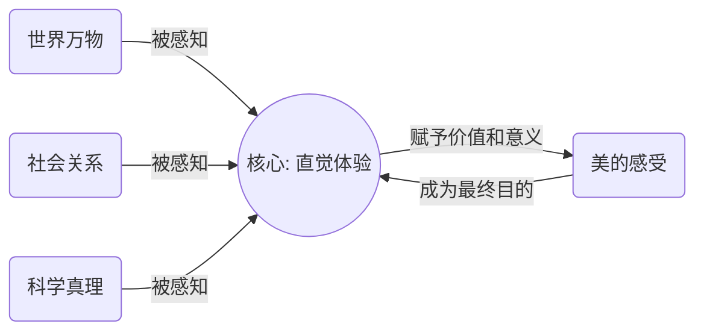
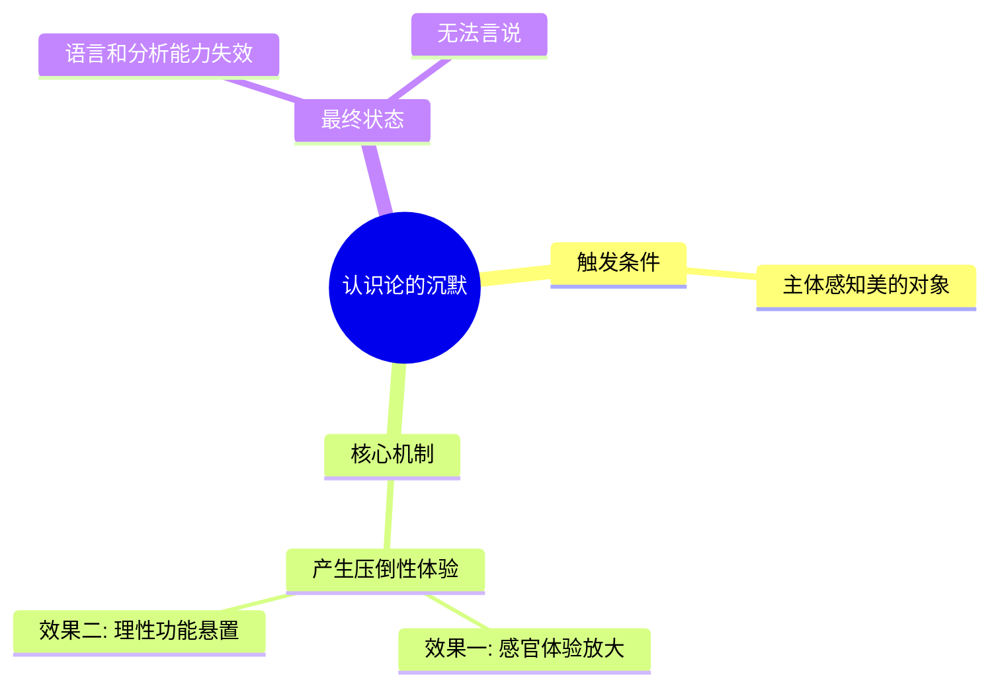
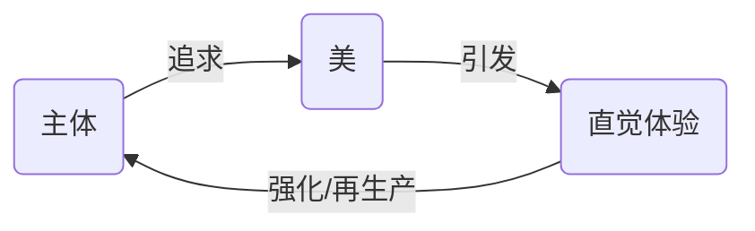

---
{"dg-publish":true,"permalink":"/1-3 唯我论/1-3-4 直觉主义/1-3-4-3 唯美主义/","created":"2025-09-19T20:52:29.529+08:00","updated":"2025-09-23T00:13:58.822+08:00"}
---

### **一、本章概览**
- **主义主义编码**: 1-3-4-3
- **意识形态命名**: [[5 主义/唯美主义\|唯美主义]] / [[Aestheticism\|Aestheticism]]
- **核心论断**: [[5 主义/唯美主义\|唯美主义]]是一种将主观的[[直觉体验\|直觉体验]]绝对中心化，通过悬置和“沉默”化一切理性反思与认识论建构，最终将对[[美\|美]]的直接、非反思性感受奉为唯一目的的意识形态。它的根本问题在于构建了一个封闭的、自我循环的享乐回路，并以此回避了世界真实的矛盾。
- **你能获得**: 读完本笔记，你将能掌握 1-3-4-3 这一意识形态编码的内在运作逻辑，理解[[直觉体验\|直觉体验]]如何成为本体论中心，并认识到“认识论的[[沉默\|沉默]]”这一特殊现象。你还能将其与[[8 作家/王尔德\|王尔德]]等代表人物联系起来，并从哲学层面（如[[克尔凯郭尔\|克尔凯郭尔]]的生存三阶段）对其进行批判性审视。

---
### **二、核心内容解析**
#### **“主义主义”四格分析**

1.  **场域之“1” (Ontology)**：此处的“1”代表该意识形态预设了一个统一、稳固且不容置疑的[[世界\|世界]]框架。这个世界（The World）是一个背景化的、整全的舞台，其自身的合理性与结构并不被追问。它如同一个提供了所有素材的画廊，本身是静止和完整的。[[5 主义/唯美主义\|唯美主义]]者不对这个舞台的来源、历史或内在矛盾进行探究，而是直接接受其[[整-全性\|整-全性]]，并在此基础上展开其核心活动——体验。这个[[存在论\|存在论]]上的“1”是后续一切体验得以发生的、不被反思的坚实地基。

2.  **本体之“3” (Body)**：在此场域中，真正实在的“本体”是“3”，即被[[中心化\|中心化]]的、第一人称的[[直觉体验\|直觉体验]]（Intuitional Experience）。它并非指代客观物质或抽象理念，而是指那种直接的、浅反思的、身体性的感受，如讲稿中提到的“做SPA的舒服感”。这个“3”扮演了中介者的角色，调和了世界中所有潜在的矛盾与分裂。万事万物，无论其客观属性如何，最终都被还原为、统摄为一种可被“体验”的材料。这种体验是世界的中心和最终的实在，一切存在物的价值都由其能否引发特定体验来衡量。

3.  **现象之“4” (Phenomenon)**：此处的“4”是整个结构中最精妙的一环，它不表现为外在的二元冲突，而是表现为[[主体性\|主体性]]在认知层面的[[内在分裂\|内在分裂]]或自我悬置，讲稿中将其精准地定义为“[[沉默\|沉默]]”（Silence）。当主体面对极致的[[美\|美]]时，其认识论功能（分析、判断、言说）被压倒性的直觉体验所“静默”了。此时，主体无法、也不愿去建构关于[[现象\|现象]]的知识。这种“无法言说”的状态，正是系统内部的不可能性（the Impossible）的体现——即体验无法被完全符号化和理性化。这种认知上的“短路”或“虚无”，恰恰被[[5 主义/唯美主义\|唯美主义]]者视为最高级的体验状态。

4.  **目的之“3” (Purpose)**：该意识形态的[[9 未命名/目的论\|目的论]]是返回到另一个“3”，即作为终极目标的[[美\|美]]（Beauty）本身。这构成了一个完美的闭环。整个系统的运作，从在一个稳固世界中，以[[直觉体验\|直觉体验]]为本体，再到悬置认知功能，其最终目的就是为了再次获得并沉浸于作为[[中心化\|中心化]]体验的[[美\|美]]。这里的[[9 未命名/目的论\|目的论]]不是为了改造世界、达成真理或实现解放，而是一种内向的、自我满足的循环：为了体验而去体验。世界的存在（1）是为了体验（3），而体验的方式是放弃思考（4），最终目的又是为了回到体验（3）本身。

#### **其他核心知识点**

##### 直觉体验的中心化
在 1-3-4-3 的结构中，“[[直觉体验\|直觉体验]]”被提升到了[[9 未命名/本体论\|本体论]]的核心地位，扮演着“3”号位的[[中心化\|中心化]]角色。这意味着，世界不再由客观的物质实体或超验的理念构成，而是由主体的直接感受所编织。所有外部的存在物，无论是自然风景、艺术品还是他人，其“真实性”都必须通过能否被主体所“体验”来确认。这种体验是浅反思的，它拒绝深入的逻辑分析和概念抽象，强调“爽就是了”的直接性。它如同一个引力中心，将世界上纷繁复杂的一切都吸附过来，并将其转化为同质化的、可供消费的“感受”，从而调和了所有潜在的矛盾。

**举例阐释**：讲稿中提到的“人家给你做SPA应该很舒服”的体验，就是典型的[[直觉体验\|直觉体验]]。在这种情境下，你不会去分析按摩师的生理学知识、精油的化学成分或是这种服务的社会经济学意义。所有这些复杂的外部现实都被悬置，唯一真实且重要的，就是你身体感受到的那种直接的、无需言说的舒适感。

##### 认识论的沉默
“认识论的[[沉默\|沉默]]”是 1-3-4-3 结构中“现象之4”的独特表达。它指的是在面对压倒性的[[美\|美]]或[[直觉体验\|直觉体验]]时，主体的认知、分析和语言功能被悬置或“静默”的状态。这是一种特殊的[[内在分裂\|内在分裂]]：[[主体性\|主体性]]的一部分（感官体验）极度膨胀，压垮了另一部分（理性反思）。讲稿中引用的山口百惠歌曲《This is my trial》中的歌词“be silent”，以及“别说话，大哥别说话。感受就是”的场景，都生动地描绘了这种状态。它不是不知道，而是体验本身拒绝被言说、被知识化。这种“[[沉默\|沉默]]”被[[5 主义/唯美主义\|唯美主义]]者浪漫化为一种神圣的、不可言传的境界，但从批判角度看，它是一种放弃思考、拒绝介入现实的姿态。

**举例阐释**：当你站在一幅如罗斯科的巨幅画作前，或面对壮丽的日落时，可能会感到“失语”，任何语言都显得苍白无力。你放弃了去分析其构图、色彩或天文学原理，只是沉浸在那种纯粹的视觉和情感冲击中。这个瞬间，认识论就被“[[沉默\|沉默]]”了，这正是[[5 主义/唯美主义\|唯美主义]]所追求的巅峰体验。

##### 作为目的的美
在[[5 主义/唯美主义\|唯美主义]]的[[9 未命名/目的论\|目的论]]中，[[美\|美]]（Beauty）自身就是最终目的，占据了“3”号位的[[中心化\|中心化]]位置。这形成了一个自我封闭、自我指涉的循环。与那些追求外部目标（如社会改造、道德完善、知识积累）的意识形态不同，1-3-4-3 的全部动力都指向内部，即不断复制和强化那种核心的“美的体验”。这个系统的[[9 未命名/目的论\|目的论]]是“为艺术而艺术”（l'art pour l'art）的极端体现：追求[[美\|美]]的唯一理由就是[[美\|美]]本身能够带来愉悦的[[直觉体验\|直觉体验]]。这种循环性使得该意识形态显得非常稳定，但也使其丧失了任何超越性的维度，最终沦为一种精致的享乐主义。

**举例阐释**：[[8 作家/王尔德\|王尔德]]是这一理念的旗手。他宣称“一切艺术都是相当无用的”（All art is quite useless）。这句话的深层含义是，艺术的价值不在于它的道德教化、社会功能或实用价值，而在于它作为[[美\|美]]的载体，能为我们提供独特的审美体验。评价一件艺术品的标准，就是它是否“美”，而不是它是否“有用”或“真实”。

---
### **三、关键观点提取**
- “这种体验主义或者叫做直觉主义，他就认为这种体验就是在调和整个世界里面的内在矛盾，所有一切东西最终都可以说成是[[体验\|体验]]，中心化成[[体验\|体验]]。”
- “这个四就代表某种[[沉默\|沉默]] silence…你在面对 beauty 的时候，面对[[美\|美]]的时候，你是没有认识论的维度。那个认识论维度是被静默的。”
- “这个普攻是什么东西呢？[[9 未命名/目的论\|目的论]]这个[[9 未命名/目的论\|目的论]]是啥呢？就是[[美\|美]]。Beauty。”
- “所以胆子小的人...或者你对于这个[[世界\|世界]]的贪爱还很重的人，你很爱这个[[世界\|世界]]，很眷恋这个[[世界\|世界]]，很想继续享受的人，我建议不要看这一期。”

---
### **四、知识点问答**
#### Q: 在1-3-4-3结构中，“现象之4”为何表现为“沉默”，而非更常见的“对抗”或“矛盾”？
A: 因为[[5 主义/唯美主义\|唯美主义]]的核心机制是通过一个极度强大的[[中心化\|中心化]]体验（本体之3）来运作的。当这种[[直觉体验\|直觉体验]]被推向极致时，它并非与理性或知识形成一种二元对立的“对抗”，而是直接将其“淹没”或“悬置”。因此，这里的[[内在分裂\|内在分裂]]（4）不是两种力量的斗争，而是[[主体性\|主体性]]内部一种功能的彻底失效。它是一种认知层面的“虚无”，即理性反思能力的暂时性死亡，表现为“[[沉默\|沉默]]”。这种“[[沉默\|沉默]]”恰恰是该意识形态用以证明其体验之深刻与超越性的证据。

#### Q: 本结构中的两个“3”（本体之体验 vs 目的之美）有何区别与联系？
A: 它们是同一枚硬币的两面，共同构建了一个封闭循环。**本体之“3”**（[[直觉体验\|直觉体验]]）是机制和过程，是世界的“真实内容”，是用来感知和衡量一切的中介。**目的之“3”**（[[美\|美]]）则是这个机制所追求的目标和对象。可以说，[[直觉体验\|直觉体验]]是“发动机”，而[[美\|美]]是“燃料”和“目的地”。二者相互定义、相互生成：没有[[美\|美]]作为对象，[[直觉体验\|直觉体验]]就无从发生；而[[美\|美]]的价值，也只有通过[[直觉体验\|直觉体验]]才能被确认。它们共同确保了这套意识形态的内向性和自我满足性。

#### Q：讲稿开篇的警告——“这节课会戏剧化地改变你的生活”——其深层含义是什么？
A: 这个警告暗示，1-3-4-3的[[5 主义/唯美主义\|唯美主义]]不仅仅是一种文学流派，更是一种深刻嵌入在现代人日常生活中的、不易察觉的底层操作系统（“源代码”）。揭示它，就等于揭示了我们许多看似自然的行为——如追求“小确幸”、沉浸式体验、消费主义快感——背后那套悬置思考、以直接感受为王的逻辑。这种揭示是“危险”的，因为它会打破我们对这些享乐的“贪爱”和“眷恋”，迫使我们直面一个问题：如果这些美好的体验只是一种自我循环的意识形态机制，那么我们生活的意义和方向又在何方？这会动摇人们安于现状的根基。

---
### **五、知识延伸**
- **[[克尔凯郭尔\|克尔凯郭尔]]的“审美生存阶段”**: 在其著作《或此或彼》中，[[克尔凯郭尔\|克尔凯郭尔]]描述了人生的三个阶段：审美、伦理、宗教。审美阶段完全由感性、欲望和[[直觉体验\|直觉体验]]主导，追求新奇和享乐，这与1-3-4-3的结构高度吻合。克尔凯郭尔认为，这一阶段最终会因厌倦和绝望而走向内在崩溃，必须被超越。这为我们提供了一个强有力的批判[[5 主义/唯美主义\|唯美主义]]的哲学框架。
- **[[8 作家/王尔德\|王尔德]] (Oscar Wilde)**: 他是19世纪英国[[5 主义/唯美主义\|唯美主义]]运动的代表人物，其“为艺术而艺术”的主张是1-3-4-3意识形态的完美宣言。阅读他的作品，如《道林·格雷的画像》，可以直观地感受到这种将[[美\|美]]和感官体验置于一切道德与社会准则之上的思想，及其最终可能导致的悲剧性后果。
- **[[居伊·德波\|居伊·德波]]的《景观社会》**: 这本书可以视为对1-t3-4-3意识形态在当代资本主义社会中泛滥的宏大批判。德波所说的“景观”（Spectacle）——即被表象和图像所统治的社会关系——与[[5 主义/唯美主义\|唯美主义]]的逻辑有共通之处：二者都用一种中介化的、被动的观赏/体验，替代了真实的、主动的社会实践。景观社会就是一个将全体民众转化为审美主义者的社会。

---
## 双链关联总结
- **一级关联 (核心意识形态与概念)**: [[5 主义/唯美主义\|唯美主义]]、[[Aestheticism\|Aestheticism]]、[[直觉体验\|直觉体验]]、[[沉默\|沉默]]、[[美\|美]]
- **推测相关人物 (Speculated Figures)**: [[8 作家/王尔德\|王尔德]]（讲稿明确提及，是该意识形态的典型代表，将美的体验作为人生的最高准则）。
- **二级关联 (上下文与背景)**: [[主页\|主页]]、[[存在论\|存在论]]、[[9 未命名/本体论\|本体论]]、[[现象\|现象]]、[[9 未命名/目的论\|目的论]]、[[主体性\|主体性]]、[[克尔凯郭尔\|克尔凯郭尔]]、[[世界\|世界]]
- **三级关联 (推测与延展)**: [[整-全性\|整-全性]]、[[中心化\|中心化]]、[[内在分裂\|内在分裂]]、[[居伊·德波\|居伊·德波]]、[[景观社会\|景观社会]]、[[康德\|康德]]、[[崇高\|崇高]]