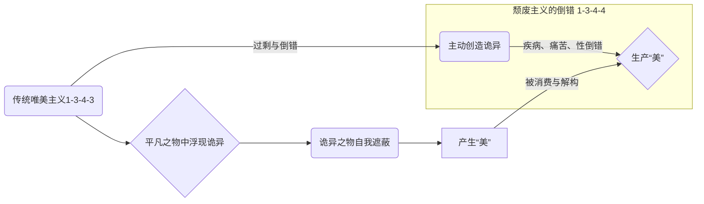
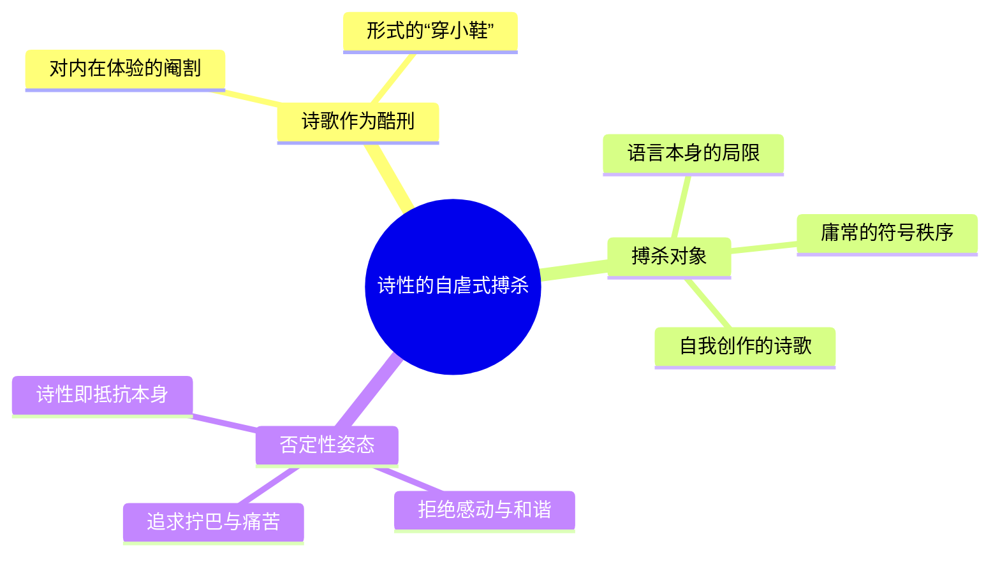
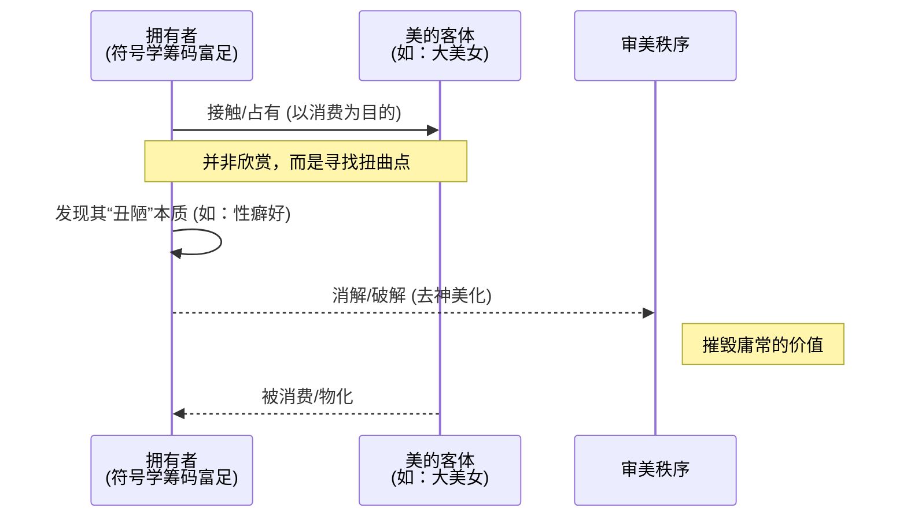

---
{"dg-publish":true,"permalink":"/1-3 唯我论/1-3-4 直觉主义/1-3-4-4 颓废主义/","created":"2025-09-19T20:52:29.531+08:00","updated":"2025-09-23T00:13:59.862+08:00"}
---

### **一、本章概览**
- **主义主义编码**: 1-3-4-4
- **意识形态命名**: [[5 主义/颓废主义\|颓废主义]] (Decadentism)
- **核心论断**: [[5 主义/颓废主义\|颓废主义]]是[[5 主义/唯美主义\|唯美主义]]的过剩与倒错形态，它不再被动地从诡异中发现美，而是主动地、游戏性地创造[[诡异之物\|诡异之物]]（如疾病、痛苦、性倒错）来生产美，最终因其对一切价值的消费式消解而导向[[虚无主义\|虚无主义]]。
- **你能获得**: 你将理解[[5 主义/颓废主义\|颓废主义]]作为一种晚期审美意识形态的内在结构，掌握其从“发现美”到“生产美”的[[9 未命名/倒错\|倒错]]逻辑，并能识别现实中那些拥有丰厚[[符号学筹码\|符号学筹码]]的个体，如何通过消费和解构庸常审美来表现其颓废姿态。

---
### **二、核心内容解析**
#### **“主义主义”四格分析**

1.  **场域之“1” ([[存在论\|存在论]])**: [[5 主义/颓废主义\|颓废主义]]者预设的世界是一个稳定、统一且循环的背景舞台。这个[[世界\|世界]]被视为一个不会崩塌的“舒适圈”或某种愚笨的自然自动机。它的秩序是稳固且不容置疑的，从而为[[5 主义/颓废主义\|颓废主义]]者在其中进行各种扭曲和倒错的审美游戏提供了坚实的托底。他们可以尽情“颓废”，但世界本身绝不能颓废。这种整全性的场域保障了他们的游戏不会导致真正的灾难，其反抗姿态也因此永远是安全的、被限定在符号系统内部的。

2.  **本体之“3” ([[直观体验\|直观体验]])**: 在这个稳定的世界舞台上，作为核心本体的是一种中心化的、中介性的[[直观体验\|直观体验]]或审美直觉。然而，与[[5 主义/唯美主义\|唯美主义]]不同，[[5 主义/颓废主义\|颓废主义]]的这个“3”号位内核是“肮脏的”（dirty）、被污染的。它不再是纯粹地感受美，而是主动将扭曲、病态、阴郁的元素作为中介来组织和体验世界。这个中心化的[[体验\|体验]]本身就带有一种[[原罪\|原罪]]般的瑕疵，它会主动污染其所接触的一切，无论是自然要素还是精神要素，使得一切实在之物都经由这个扭曲的内核而被重新编码。

3.  **现象之“4” ([[主体性\|主体性]])**: 主体对世界的感知和体验建立在一种内在分裂和不可能性之上。此处的“4”体现为“一切皆是谎言”的[[9 未命名/认识论\|认识论]]。[[5 主义/颓废主义\|颓废主义]]者不相信存在一个能道出终极真理的[[元语言\|元语言]]，语言本身就是多重、扭曲且无法抵达事物真相的。诗歌在此不再是通往崇高的桥梁，反而成为了展现语言内在矛盾、施行自我折磨的酷刑。[[主体性\|主体性]]体验到的不是和谐或真理，而是符号系统内部无法被整合的裂隙、无意义的巧合与持续的内在搏杀。

4.  **目的之“4” ([[9 未命名/目的论\|目的论]])**: 该意识形态最终导向的是意义的崩解和价值的虚无。结尾的“4”意味着它没有任何建设性的终极目标，其运动的终点就是系统自身的[[不可能性\|不可能性]]。通过不断地制造诡异、消费庸常、解构价值，[[5 主义/颓废主义\|颓废主义]]最终会耗尽所有符号学秩序赋予的意义，导向一种彻底的[[价值虚无主义\|价值虚无主义]]和[[人生意义的虚无主义\|人生意义的虚无主义]]。它的“目的”就是展示一切目的的无效性，最终沉溺于一种消极、倔强但毫无出路的姿态之中。

#### **其他核心知识点**

##### 美的倒错与诡异的生产
[[5 主义/颓废主义\|颓废主义]]的核心机制是对[[5 主义/唯美主义\|唯美主义]]逻辑的彻底颠倒。传统[[5 主义/唯美主义\|唯美主义]]认为，美是从平凡之物中浮现的[[诡异之物\|诡异之物]]通过符号化遮蔽自身诡异性而产生的。而[[5 主义/颓废主义\|颓废主义]]则将此过程变为一种主动的游戏：它不再等待美的显现，而是直接从“创造诡异”入手，坚信只要制造出足够扭曲、病态、痛苦的体验，就必然能生产出一种更高级、更刺激的“美”。这是一种美学上的内卷，标志着审美体验从被动接受转向了主动生产，其本质是一种[[9 未命名/倒错\|倒错]]（perversion），即以美的名义，行追求痛苦与崩坏之实。

**举例阐释**：讲稿中提到，19世纪的颓废派艺术家痴迷于疾病（sickness）、性倒错（sexual perversion）、濒死体验等，他们并非单纯描绘这些现象，而是将这些现象本身当作生产美的工厂。他们认为，一个健康的、符合常规逻辑的美是肤浅的，只有通过拥抱这些被正常符号系统排斥的“诡异”内容，才能触及美的真正根源。

##### 诗性的否定性与自虐式搏杀
在[[5 主义/颓废主义\|颓废主义]]看来，诗歌并非一种超越日常语言的[[元语言\|元语言]]，恰恰相反，诗的本质在于一种否定性的姿态和与符号秩序的搏杀。写诗的过程被体验为一种“酷刑”和“自虐”。诗人通过格律、韵脚等形式（穿小鞋）来折磨、阉割原初的内在体验。但更进一步，[[5 主义/颓废主义\|颓废主义]]认为连“原初体验”本身都是扭曲的。因此，写诗变成了一场与自我、与语言、与诗歌形式本身的无休止的搏斗。如果一首诗让作者感到感动或慰藉，那它就是失败的；只有当创作过程充满了执拗、压抑和痛苦，作品才获得了真正的“诗性”。

**举例阐释**：一个颓废主义诗人在选择韵脚时，不是为了音韵和谐，而是在一种“等待戈多”式的绝望中随机挑选。他会故意选择最不顺眼的组合，发表后如果这首最令自己痛苦的作品反而受到赞誉，则恰好印证了这种创作逻辑的“正确性”——即美的产生是偶然且充满恶意的，而痛苦的创作过程本身才是唯一真实的东西。

##### 符号学筹码的富足与消费式厌女
[[5 主义/颓废主义\|颓废主义]]并非底层意识形态，它往往在那些拥有富足[[符号学筹码\|符号学筹码]]的群体中滋生，如上层贵族、富有的艺术家或在某些领域（如性魅力、才智、权力）拥有过剩资本的个体。当这些人对常规的享乐和美感到厌倦时，他们便转向颓废。他们对待[[庸常的审美\|庸常的审美]]（如符合大众标准的“大美女”）的态度不是占有或欣赏，而是一种纯粹的“消费”和“消解”。他们通过与这些美的客体互动，来揭示其背后的“丑陋”或“扭曲”，从而获得一种智识上和审美上的优越感。这种行为模式本质上是一种深刻的[[厌女症\|厌女症]]和[[虚无主义\|虚无主义]]，因为它将作为美之载体的他者（尤其是女性）物化为一次性的消费品，其目的在于摧毁美本身所维系的价值秩序。

**举例阐阐释**：讲稿中描述的“浪子”形象，他们可能凭借过剩的性魅力或艺术才华吸引异性，但其目的并非建立亲密关系，而是要“破解”对方，把对方的神圣光环剥掉，将其还原为纯粹的“物”来消费。这种行为支撑了现代资本主义的[[力比多经济学\|力比多经济学]]，即当自身的爱欲经济破产后，通过消费和摧毁他者的美来获得一种代偿性的满足。

---
### **三、关键观点提取**
- “[[5 主义/颓废主义\|颓废主义]]本质是一种[[9 未命名/倒错\|倒错]]，it's a perversion。”
- “只要我创造一种诡异，我就能够产生一种美。我把这个看成美学上的[[内卷\|内卷]]。”
- “[[诗\|诗]]是一种酷刑...意味着对这种内在[[体验\|体验]]进行阉割，进行穿小鞋。”
- “他们最后因为他是[[唯物论\|唯物论]]的，他会把他人都当成物...Other people is just thing, 对他来说都是thing，都是消费的。”
- “本质上[[5 主义/颓废主义\|颓废主义]]也是一种[[厌女症\|厌女症]]，所以它本质上它也是一种[[虚无主义\|虚无主义]]。”

---
### **四、知识点问答**
#### Q: 为什么说[[5 主义/颓废主义\|颓废主义]]的内核（本体之“3”）是“肮脏的”？
A: 因为在[[5 主义/颓废主义\|颓废主义]]（1-3-4-4）的结构中，作为万物中介的[[直观体验\|直观体验]]不再是追求纯粹与和谐的审美直觉。相反，它主动拥抱并生产扭曲、病态和痛苦，并将这些“肮脏”的元素作为其感知和组织[[世界\|世界]]的核心。这个中心化的[[体验\|体验]]就像一个被病毒感染的芯片，它在调节精神与自然时，会持续地污染它们，使得一切经由它呈现的[[实在\|实在]]都带上了病理化的色彩。因此，这个“3”号位的内核本身就带有[[原罪\|原罪]]般的缺陷。

#### Q: [[5 主义/颓废主义\|颓废主义]]者看似反抗一切，为何其世界观（场域之“1”）却是稳定和统一的？
A: 这正是[[5 主义/颓废主义\|颓废主义]]姿态的虚伪性所在。他们的反抗是一种在“舒适圈”内的安全游戏。他们需要一个绝对稳定、循环往复的[[世界\|世界]]（场域之“1”）作为其表演颓废的舞台和背景板。这个统一的世界秩序保证了他们的任何审美实验和[[9 未命名/倒错\|倒错]]行为都不会真正颠覆现实，不会让他们丧失基本的生存保障。他们可以颓废，但世界不能。这种依赖性揭示了其反抗并非革命性的，而是一种寄生性的姿态。

#### Q: 如何区分[[5 主义/颓废主义\|颓废主义]]的“消费”与普通意义上的享乐主义消费？
A: 享乐主义的消费是为了获得快乐和满足。而[[5 主义/颓废主义\|颓废主义]]的“消费”则以“消解”和“破解”为目的。当一个[[5 主义/颓废主义\|颓废主义]]者消费一个美的对象时，他的快感来源于揭示和摧毁这个对象所承载的[[庸常的审美\|庸常的审美]]价值的过程。他不是在享受美，而是在享受美被瓦解的瞬间，通过将神圣之物“去神美化”，将其还原为可鄙的、扭曲的“物”，从而确认自身的优越感和[[虚无主义\|虚无主义]]立场。这是一种带有攻击性和否定性的消费。

---
### **五、知识延伸**
- **书籍《[[逆流\|逆流]]》（À rebours） by [[于斯曼\|于斯曼]]**: 这本小说被誉为“颓废主义的圣经”。主角德·埃森特是一位对现实世界彻底失望的贵族，他退隐到一座精心布置的居所，通过各种人造的、反自然的感官体验（如宝石花、香水风琴）来追求极致的审美。这完美体现了1-3-4-4意识形态中，在稳固背景（1）下，以扭曲的中心体验（3）来对抗庸常，并最终走向感官耗尽与虚无（4）的过程。
- **思想家 [[波德莱尔\|波德莱尔]]**: 尤其是他的诗集《[[恶之花\|恶之花]]》，是[[5 主义/颓废主义\|颓废主义]]的先声。波德莱尔从巴黎的丑陋、病态甚至邪恶中提炼出一种惊心动魄的美，颠覆了传统美与善的关联。他正是将“诡异”和“丑”作为美之源头的实践者，为后来的颓废派提供了理论和范本，构成了对[[5 主义/颓废主义\|颓废主义]]逻辑的诗意支持。
- **精神分析概念 [[9 未命名/死亡驱力\|死亡驱力]] (Death Drive)**: 弗洛伊德晚期提出的概念，指一种趋向于瓦解、回归无机状态的内在冲动。[[5 主义/颓废主义\|颓废主义]]对痛苦、疾病和自我折磨的迷恋，以及其最终导向[[虚无主义\|虚无主义]]的倾向，可以被看作是[[9 未命名/死亡驱力\|死亡驱力]]在文化和审美层面的体现。它不是追求生命力的扩张，而是追求一种在紧张和刺激中耗尽生命能量、回归寂静的[[9 未命名/倒错\|倒错]]式快感。

---
### **六、双链关联总结**
- **一级关联 (核心意识形态与概念)**: [[5 主义/颓废主义\|颓废主义]]、[[1-3 唯我论/1-3-4 直觉主义/1-3-4-4 颓废主义\|1-3-4-4 颓废主义]]、[[9 未命名/倒错\|倒错]]、[[诡异之物\|诡异之物]]、[[5 主义/唯美主义\|唯美主义]]、[[诗性\|诗性]]、[[符号学筹码\|符号学筹码]]、[[内卷\|内卷]]、[[庸常的审美\|庸常的审美]]、[[消费\|消费]]、[[去神美化\|去神美化]]
- **推测相关人物 (Speculated Figures)**: [[8 作家/王尔德\|王尔德]] (讲稿提及)、[[波德莱尔\|波德莱尔]]、[[于斯曼\|于斯曼]]、现代社会中某些亚文化圈（如民谣、摄影圈）的“浪子”形象、拥有过剩符号资本并以玩世不恭为姿态的富裕阶层。
- **二级关联 (上下文与背景)**: [[9 未命名/精神分析\|精神分析]]、[[9 未命名/符号学\|符号学]]、[[存在论\|存在论]]、[[9 未命名/认识论\|认识论]]、[[9 未命名/目的论\|目的论]]、[[19世纪末欧洲\|19世纪末欧洲]]、[[5 主义/现代主义\|现代主义]]、[[5 主义/后现代主义\|后现代主义]]
- **三级关联 (推测与延展)**: [[虚无主义\|虚无主义]]、[[厌女症\|厌女症]]、[[9 未命名/死亡驱力\|死亡驱力]]、[[原罪\|原罪]]、[[力比多经济学\|力比多经济学]]、[[9 未命名/主体间性\|主体间性]]、[[元语言\|元语言]]、[[拉康\|拉康]]