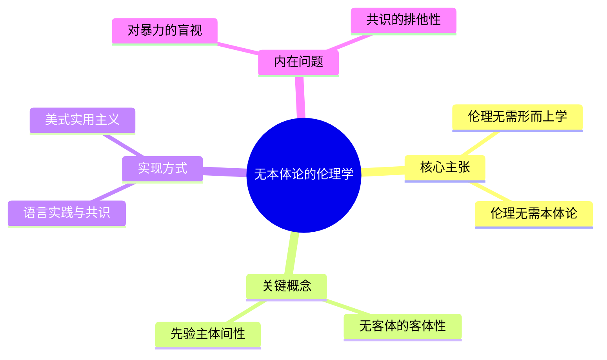
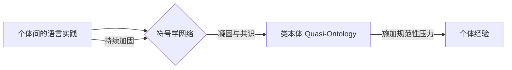
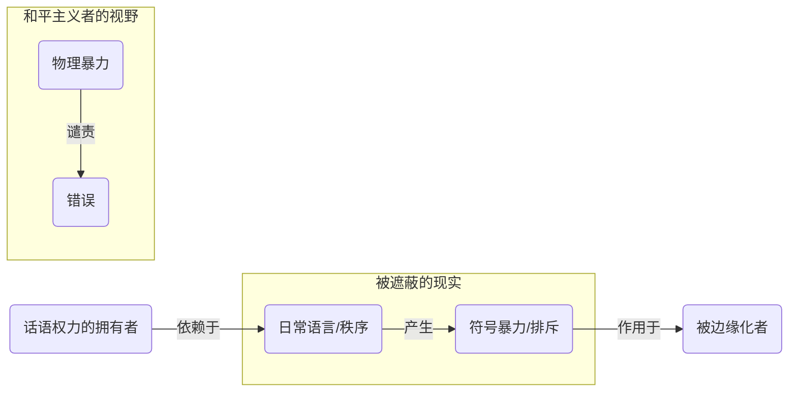

---
{"dg-publish":true,"permalink":"/1-4 平庸主义/1-4-1 当代自然主义/1-4-1-1 和平主义/","created":"2025-09-19T20:52:29.542+08:00","updated":"2025-09-22T22:10:15.750+08:00"}
---

### **一、本章概览**
- **主义主义编码**: 1-4-1-1
- **意识形态命名**: [[5 主义/和平主义\|和平主义]]
- **核心论断**: “和平主义”是一种通过预设一个整全、和谐的世界秩序（1），来拒斥和阉割掉“暴力”这一核心本体（4）的意识形态。它将一切现象都还原为统一的自然/科学过程（1），并以无限循环这种“和平”状态为最终目的（1），其本质是一种拒绝反思自身赖以存在的暴力根基的虚伪姿态。
- **你能获得**:
    1.  **诊断框架**: 掌握使用 1-4-1-1 编码分析“和平主义”及其变体（如部分学术立场）的内在结构。
    2.  **核心批判**: 理解为何“拒斥一切暴力”的立场，恰恰是对支撑其自身的系统性暴力与符号暴力的盲视。
    3.  **思想关联**: 了解该意识形态与[[普特南\|普特南]]的[[无本体论的伦理学\|无本体论的伦理学]]、[[卡西尔\|卡西尔]]的符号理论，以及分析哲学中某些倾向的深层联系。

---
### **二、核心内容解析**

#### **“主义主义”四格分析**

1.  **场域之“1” (Ontology)**：该意识形态在[[存在论\|存在论]]上预设了一个统一、整全、和平且善良的[[世界\|世界]]图景。这个世界观框架是封闭且无矛盾的，它先验地认定“One World, One Dream”不仅是理想，更是[[世界\|世界]]的本来面貌。这种整全性通过主动忽略或压抑那些无法被和谐秩序整合的创伤性元素（如流浪汉的绝望、底层女性的屈辱）来维持自身的完整幻象。任何撕裂性的事件都会被迅速用一种宏大的、和谐的叙事（如流行歌曲、节日烟火）进行缝合，从而确保这个作为舞台的[[世界\|世界]]始终是“1”——一个没有根本性裂痕的整体。

2.  **本体之“4” (Body)**：在和平、整全的[[世界\|世界]]舞台上，真正的核心[[本体\|本体]]——[[暴力\|暴力]]（Violence）——被系统性地虚无化了。这里的“4”代表一种“阉割”或“空缺”，即意识形态的构建恰恰是通过拒斥一个核心要素来实现的。“和平主义”宣称无条件地拒斥一切[[暴力\|暴力]]，这使得[[暴力\|暴力]]成为了一个“不能称其为本体的本体”。它并非不存在，而是被剥夺了任何正面、积极的本体论地位，被视为纯粹的外部异常或有待消除的杂质。这种对[[暴力\|暴力]]的虚无化处理，使得该意识形态无法正视秩序本身就是一种凝固的[[暴力\|暴力]]这一事实。

3.  **现象之“1” (Phenomenon)**：在感知层面，该意识形态将所有[[现象\|现象]]都还原为单一、同质的“自然现象”或科学过程。[[主体性\|主体性]]的独特经验和创伤被一个统一的、客观化的认知框架所抹平。例如，[[暴力\|暴力]]行为不被理解为具有意志和历史维度的对抗，而被消解为“物理过程”或“神经生理学过程”。这种认识论上的“1”由[[科学共同体\|科学共同体]]等权威机构来背书，确保了任何经验都能被纳入一个统一、无差别的解释体系中。个体的痛苦和抗争因此失去了其特殊性，被普遍的、中立的“科学”话语所收编和去政治化。

4.  **目的之“1” (Purpose)**：该意识形态的[[9 未命名/目的论\|目的论]]是导向一种永恒的、循环的“和平生活”。这个“1”代表着无限的重复与空转。其终极目标并非创造一个全新的[[世界\|世界]]，而是维持现有“正直、善良、和平”的秩序千秋万代地延续下去。它追求的不是一种通过斗争达成的、具有历史性的和平，而是一种抹除了一切对抗与张力的、静态的、前反思的“慈世平”状态。这种目的论的本质是守序的，其最终诉求就是让整个系统永远保持在启动时的那个整全、和谐的“1”的状态，无尽地循环下去。

#### **其他核心知识点**

##### 无本体论的伦理学
这种由哲学家[[普特南\|普特南]]提出的学术立场，是1-4-1-1意识形态在学院内的完美映照。它主张我们可以在不需要[[9 未命名/本体论\|本体论]]和[[形而上学\|形而上学]]基础（对应本体之“4”的虚无化）的前提下，建立起一套有效的伦理规范。这种规范性的来源被归于一种“无客体的客体性”（Objectivity without Objects），即通过主体间的语言实践和交往共识来达成。这实质上是用一个由话语构成的统一场（对应现象之“1”）来替代被悬置的[[9 未命名/本体论\|本体论]]，最终目的也是为了维持一个稳定、可交流的社群生活（对应目的之“1”）。

**举例阐释**：讲稿中提到的游戏皮肤插件的比喻。一个本地插件皮肤，物理上（服务器端）并不“存在”，没有一个客观实体。但如果通过某种方式（如病毒传播）让所有玩家的客户端都能看到这个皮肤，那么它就在“主体间”获得了客观性，产生了和真实皮肤一样的效果。这就是“无客体的客体性”，一种由共识创造的、功能性的“实在”。

##### 符号学网络与类本体
这个概念源于[[5 主义/新康德主义\|新康德主义]]者[[卡西尔\|卡西尔]]等人，并在与[[海德格尔\|海德格尔]]的辩论中凸显。它指的是，即使我们承认无法直接触及物质性的[[本体\|本体]]，但由语言、文化、符号构成的网络本身可以变得极其强大和稳固，以至于对个体而言，它就像[[本体\|本体]]一样坚硬、难以撼动。这个由主体间交往构成的“符号学网络”成为了规范性的源泉，形成了一种“类本体”或“近似本体”。这正是1-4-1-1意识形态得以运作的机制：它用一个严密的符号秩序（1）填补了被它自己虚无化的[[暴力\|暴力]]本体（4）的位置。

**举例阐释**：讲稿中提到的虚构人物[[贾宝玉\|贾宝玉]]或[[孙悟空\|孙悟空]]。他们在物理[[世界\|世界]]中完全不存在，但围绕他们的文化符号网络（小说、戏剧、讨论）是如此强大，以至于他们在我们的文化中获得了近乎客观的地位，能够影响人们的情感、思考和行为，这就是一个由符号构成的“类本体”。

##### 日常语言的暴力
这是对“和平主义”及其学院变体（如部分[[9 未命名/分析哲学\|分析哲学]]）的核心批判。该观点指出，被和平主义者奉为圭臬的“文明交谈”或“日常语言”本身就是一种深刻的[[暴力\|暴力]]。这种[[暴力\|暴力]]体现为排斥：不会说某种语言、不掌握特定话语权、不具备相应社会身份的人，会被系统性地排除在“和平”的交往之外，遭受无声的压迫。因此，无条件地谴责物理[[暴力\|暴力]]，而对这种内在于语言和秩序中的“符号暴力”视而不见，是一种典型的意识形态操作，它服务于那些已经占据话语权制高点的胜利者。

**举例阐释**：电影《唐人街探案3》中因语言不通而备受欺凌的母女。她们的悲惨处境并非源于直接的物理攻击，而是源于被排除在当地[[日常语言\|日常语言]]沟通体系之外，这是一种无声但致命的[[暴力\|暴力]]。

---
### **三、关键观点提取**
- “[[5 主义/和平主义\|和平主义]]对于[[暴力\|暴力]]本身就是无条件的拒斥，无条件拒斥。不反思，绝不反思。”
- “[[普特南\|普特南]]...他写过一本书叫做跟这个是非常贴合的，叫[[无本体论的伦理学\|无本体论的伦理学]]...我们可以完全不需要[[9 未命名/本体论\|本体论]]，然后也可以无[[形而上学\|形而上学]]。”
- “[[日常语言\|日常语言]]本身也是一种[[暴力\|暴力]]。就你不会说这种语言，排除在[[日常语言\|日常语言]]的体系之外，对不对？或者你即便你会说这些语言，你没有那个身份，你没有办法进入去和他们博弈。”
- “他们的安宁享乐还有体面，还可以站在一个安全的地方指责所有[[暴力\|暴力]]。什么原因？因为他们最[[暴力\|暴力]]，或者说最暴力的那些人需要他们来抢这个[[道德制高点\|道德制高点]]。”

---
### **四、知识点问答**
#### Q: 为何说“无本体论的伦理学”是 1-4-1-1 意识形态最精致的学术表达？
A: 因为它在理论上完美复刻了1-4-1-1的四格结构：它明确主张放弃对[[9 未命名/本体论\|本体论]]的探讨（对应本体之“4”的虚无化），转而诉诸于一个由主体间语言共识构成的统一交往场域（对应现象之“1”），并以此为基础建立伦理规范，其目标是维持一个可沟通、和谐的社群生活（对应目的之“1”），这一切都发生在一个预设的、可以理性沟通的[[世界\|世界]]框架（对应场域之“1”）之内。它用学术语言将对[[暴力\|暴力]]这一真实[[本体\|本体]]的阉割行为正当化了。

#### Q: 和平主义者如何处理“暴力”的存在？它为何不能承认暴力的本体地位？
A: 和平主义者通过将[[暴力\|暴力]]“自然化”或“科学化”来处理它。他们将[[暴力\|暴力]]还原为没有主体意志的物理过程或神经冲动，从而剥夺其作为根本性对抗的意义。它不能承认[[暴力\|暴力]]的[[本体\|本体]]地位，因为一旦承认[[暴力\|暴力]]是构成[[世界\|世界]]的内在且不可根除的力量，其预设的“场域之‘1’”——那个整全、和谐、无矛盾的[[世界\|世界]]图景——就会瞬间崩溃。承认[[暴力\|暴力]]就等于承认[[世界\|世界]]存在着无法被和谐秩序所缝合的根本性裂痕。

#### Q: 讲稿中提到的“胜利者”（the winner）心态与 1-4-1-1 的“和平主义”有何关联？
A: “胜利者”心态是“和平主义”的社会心理基础。因为胜利者本身就是现有秩序（一种凝固的[[暴力\|暴力]]）的受益者，所以他们最希望这个秩序能够永恒持续下去（目的之“1”）。他们通过占据[[道德制高点\|道德制高点]]，将一切试图挑战该秩序的物理[[暴力\|暴力]]都定义为非法的、不道德的，同时对自己所依赖的系统性[[暴力\|暴力]]和符号[[暴力\|暴力]]保持沉默。因此，“和平主义”就成了胜利者将自身特殊利益普遍化为普世道德的最佳工具。

---
### **五、知识延伸**
- **[[6 哲学家/斯拉沃热·齐泽克\|斯拉沃热·齐泽克]]论暴力**: 齐泽克在其著作中明确区分了三种[[暴力\|暴力]]：主观暴力（可见的犯罪、恐怖活动）、客观的系统性暴力（资本主义等社会经济系统造成的灾难性后果）和符号暴力（内嵌于语言中的歧视与规训）。阅读齐泽克有助于深刻理解本讲稿的核心论点，即[[5 主义/和平主义\|和平主义]]只关注第一种暴力，却系统性地盲视后两种更为根本的[[暴力\|暴力]]。
- **[[卡西尔与海德格尔之辩\|卡西尔与海德格尔之辩]]**: 深入了解1929年达沃斯论坛上这两位思想家的著名辩论，可以更好地理解“符号学网络”与“存在本身”之间的张力。[[卡西尔\|卡西尔]]代表了人类通过创造符号文化来构建意义世界的立场（接近1-4-1-1的运作方式），而[[海德格尔\|海德格尔]]则坚持要穿透符号，直面有限、被抛的此在（Dasein）处境，这本身就蕴含着一种对和谐秩序的根本性质疑。
- **[[希拉里·普特南\|希拉里·普特南]]《无本体论的伦理学》**: 直接阅读这本被讲稿重点提及的著作，可以一手了解该学术立场的具体论证。通过阅读原文，可以更精确地把握其如何试图在悬置[[形而上学\|形而上学]]承诺的情况下，通过“内在实在论”和交往理性来重建伦理规范，并与讲稿中的批判性分析进行对照。

---
### **六、双链关联总结**
- **一级关联 (核心意识形态与概念)**: [[5 主义/和平主义\|和平主义]]、[[1-4-1-1\|1-4-1-1]]、[[当代自然主义\|当代自然主义]]、[[无本体论的伦理学\|无本体论的伦理学]]、[[暴力\|暴力]]、[[符号学网络\|符号学网络]]、[[日常语言\|日常语言]]、[[类本体\|类本体]]
- **推测相关人物 (Speculated Figures)**: [[希拉里·普特南\|希拉里·普特南]] (该意识形态的学术代言人)、[[伯特兰·罗素\|伯特兰·罗素]] (讲稿提及的资产阶级反战思想源头之一)、[[慈世平\|慈世平]] (作为该意识形态朴素心态的流行文化符号)、当代的“胜利者”/优渥的小资分子 (该意识形态的社会阶层载体)
- **二级关联 (上下文与背景)**: [[主页\|主页]]、[[存在论\|存在论]]、[[9 未命名/本体论\|本体论]]、[[现象\|现象]]、[[9 未命名/目的论\|目的论]]、[[形而上学\|形而上学]]、[[9 未命名/分析哲学\|分析哲学]]、[[实用主义\|实用主义]]、[[5 主义/新康德主义\|新康德主义]]、[[道德制高点\|道德制高点]]、[[科学共同体\|科学共同体]]
- **三级关联 (推测与延展)**: [[6 哲学家/斯拉沃热·齐泽克\|斯拉沃热·齐泽克]]、[[系统性暴力\|系统性暴力]]、[[符号暴力\|符号暴力]]、[[卡西尔与海德格尔之辩\|卡西尔与海德格尔之辩]]、[[9 未命名/主体间性\|主体间性]]、[[创伤\|创伤]]、[[唐人街探案3\|唐人街探案3]]