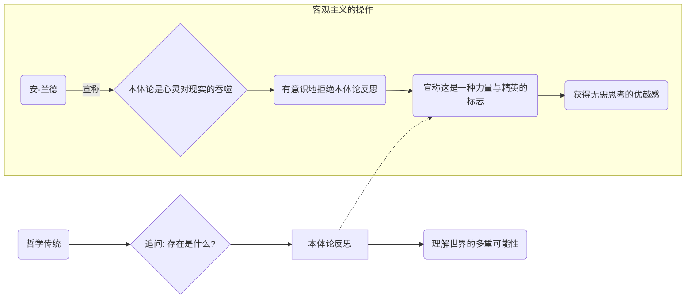
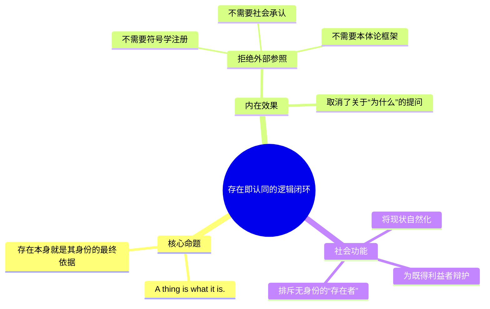
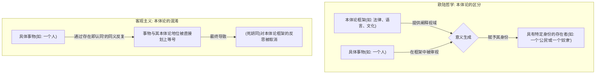

---
{"dg-publish":true,"permalink":"/1-4 平庸主义/1-4-1 当代自然主义/1-4-1-2 客观主义/","created":"2025-09-19T20:52:29.545+08:00","updated":"2025-09-23T01:32:24.222+08:00"}
---

### **一、本章概览**
- **主义主义编码**: 1-4-1-2
- **意识形态命名**: [[客观主义\|客观主义]] (Objectivism) / [[安·兰德主义\|安·兰德主义]]
- **核心论断**: [[客观主义\|客观主义]]是一种赤裸裸的[[精英主义\|精英主义]]，它通过刻意**拒绝**[[9 未命名/本体论\|本体论]]层面的反思，将一种未经审视的[[自然主义\|自然主义]]立场包装为少数精英才具备的、能够直接把握“客观实在”的优越能力，从而为现存秩序和精英地位进行辩护。
- **你能获得**: 你将掌握 1-4-1-2 这一意识形态编码的具体运作方式，理解[[安·兰德\|安·兰德]]的[[客观主义\|客观主义]]是如何通过混淆[[本体\|本体]]与[[9 未命名/本体论\|本体论]]来取消哲学反思的，并学会运用“[[存在即认同\|存在即认同]]”这一核心命题去剖析其内在的政治保守性与排他性。

---
### **二、核心内容解析**

#### **“主义主义”四格分析**

1.  **场域之“1” (Ontology)**：该意识形态预设了一个统一、整全且不言自明的[[世界\|世界]]图景。这个[[世界\|世界]]是一个由物理法则或自然秩序构成的、单一的、客观的实在场域。它就像一个已经设定好所有规则的舞台，稳定、可靠且不容置疑。这个“1”代表着一种前反思的[[自然主义\|自然主义]]和[[9 未命名/实在论\|实在论]]立场，认为[[世界\|世界]]的根本框架是唯一且给定的，不存在多元的[[存在论\|存在论]]可能性，所有事物都在这个统一的框架中有其固定的位置。

2.  **本体之“4” (Body)**：在这个统一的[[世界\|世界]]舞台上，事物的“[[本体\|本体]]”是什么？这里的“4”代表着一种**悬置与虚无化**。[[客观主义\|客观主义]]通过“存在就存在，不用多废话”的态度，实际上是**拒绝回答**本体论问题。它将“事物究竟是什么”这个问题视为空洞、无意义的，从而回避了对事物本质的任何深度探究。这个“4”并非指[[世界\|世界]]本身是虚无的，而是指“[[9 未命名/本体论\|本体论]]”这个维度本身被掏空了。事物的存在被当作一个无需解释的“蛮横事实”，其背后没有任何更深的结构或根据，这是一种智力上的捷径，也是一种对哲学探问的彻底拒绝。

3.  **现象之“1” (Phenomenon)**：在[[现象\|现象]]层面，主体的感知被理解为对那个单一客观[[世界\|世界]]的直接、透明的反映。这里的“1”意味着[[主体性\|主体性]]被极度压缩，理想的认知是像镜子一样，毫无扭曲地映照外部现实。任何复杂的[[9 未命名/现象学\|现象学]]还原、主体建构或无意识影响都被视为对“客观”的污染。因此，所有人都应该看到同一个[[世界\|世界]]，如果你的感知与“客观事实”不符，那只能说明你是有缺陷的、非理性的。这种观点取消了认识的复杂性，将所有分歧都归结为个体认知能力的优劣。

4.  **目的之“2” (Purpose)**：该意识形态最终导向一个尖锐的二元对立的[[9 未命名/目的论\|目的论]]。这个[[世界\|世界]]的终极[[目的\|目的]]就是一场永恒的斗争：一方是能够清晰认识并顺应客观实在的**精英、高贵者、创造者**；另一方则是无法认识客观实在、依赖他人、愚蠢的**大众、寄生者、低劣者**。这个“2”将[[世界\|世界]]划分为两个不可调和的阵营。该体系存在的意义，就是为了让前者战胜并统治后者。这种赤裸裸的对抗性目的，将前三个格子里的“无思状态”合理化为一种高级、有力的生存姿态。

#### **其他核心知识点**

##### 拒绝本体论的精英主义
[[客观主义\|客观主义]]的核心操作在于，它将哲学上对[[9 未命名/本体论\|本体论]]的**放弃**，巧妙地转化为一种社会地位上的**优越**。它声称，深度追问“存在是什么”的哲学（如[[5 主义/存在主义\|存在主义]]）会用心灵“吞噬”客观现实，是一种病态。反之，一个高贵、有力的个体应该直接承认并面对“存在就在那里”的简单事实。这种“拒绝反思”因此不再是智力上的懒惰，而被美化为一种直面现实的勇气和力量，是精英的标志。普通人虽也不反思[[9 未命名/本体论\|本体论]]，但他们是无意识的；而客观主义者是**有意识地选择不反思**，并以此为荣，从而完成了从“普通”到“精英”的自我加冕。

**举例阐释**：讲稿中提到，这种意识形态是“任何历史背景下的文化精英的前反思的、自我认同的底色”。一个成功的商人可能会说：“我没时间搞那些虚头巴脑的哲学，我只相信现实和数据。” 在[[客观主义\|客观主义]]的框架下，这句话被解释为他拥有超凡的、直面现实的能力，而那些思考“意义”和“存在”的人则被视为软弱无能的空想家。

##### “存在即认同”(Existence is Identity)的独断论
这是[[安·兰德\|安·兰德]]提出的核心命题之一，意指一个事物的存在本身就构成了它的全部同一性（Identity）。它不需要任何外部的符号学系统、社会契约或[[9 未命名/本体论\|本体论]]框架来为其“注册”位置。这种观点形成了一个完美的逻辑闭环：一个东西是什么？就是它本身。它为什么在这里？因为它就在这里。这种同义反复式的论证，旨在消除一切关于身份、地位和合法性来源的追问。它将现存的一切都天然合理化，认为所有存在之物都自动拥有其不容置疑的身份和位置。

**举例阐释**：讲稿最后用非法难民的例子对此进行了毁灭性打击。一个难民可以说：“I am existing”（我存在着），但根据这个社会的规则，他/她可能没有任何合法的身份（Identity）。这个例子尖锐地揭示了“存在”与“认同”之间的巨大裂痕，后者恰恰是由一个复杂的、人为的[[9 未命名/本体论\|本体论]]框架（法律、国籍、社会符号系统）所授予的，而非天然拥有。

##### 本体与本体论的混淆
这是[[客观主义\|客观主义]]在哲学层面犯下的最根本错误。在欧陆哲学传统中（尤其是[[海德格尔\|海德格尔]]之后），“[[本体\|本体]]的”（ontic）和“[[9 未命名/本体论\|本体论]]的”（ontological）是两个严格区分的层面。前者指具体存在着的事物（桌子、石头），后者指这些事物得以“存在”的框架、视域或意义结构。[[安·兰德\|安·兰德]]则故意将两者混为一谈，即`ontic = ontological`。她认为，事物的简单存在本身就自带其[[9 未命名/本体论\|本体论]]地位，我们无需再去反思那个更深层的框架。这种混淆的直接后果，就是让人们丧失了批判和反思现有存在秩序的能力。

**举例阐释**：一个奴隶在种植园里存在着（[[本体\|本体]]的），但我们必须追问，是什么样的[[9 未命名/本体论\|本体论]]框架（如奴隶制法律、种族主义意识形态）让他/她的“存在”被定义为“奴隶”？[[客观主义\|客观主义]]则会说，他就是一个奴隶，这就是他的现实，讨论背后的框架是多此一举，这恰恰掩盖了该框架的不义性。

---
### **三、关键观点提取**
- “`existence exists`… `consciousness exists`… `existence is identity`。这三个东西加起来，实际上就是一个前本体论、前反思的一个立场，只不过他把它包装成精英的高级形态。”
- “他（[[安·兰德\|安·兰德]]）做的这一套操作就是纯粹就是把…`ontic`等于`ontological`，就是存在的和存在论的，在他看来是一码事…这就导致了[[存在论\|存在论]]的自我取消。”
- “[[客观主义\|客观主义]]说穿了，就是普通人未反思[[9 未命名/本体论\|本体论]]的状态…他为何与普通人不同？因为[[客观主义\|客观主义]]就是自称与普通人不一样的普通人的前反思状态。”
- “`Existence is identity`。你还有好多美国的非法偷渡的难民就问了，`I am existing`, 我存在着，为什么？`Where is my identity?`”

---
### **四、知识点问答**
#### Q: 为什么说“客观主义”是对哲学的取消，而非一种哲学流派？
A: 因为哲学的核心任务之一是进行[[9 未命名/本体论\|本体论]]反思，即追问“存在”得以可能的条件和框架。[[客观主义\|客观主义]]通过将[[本体\|本体]]与[[9 未命名/本体论\|本体论]]混为一谈，并断言“存在即认同”，从根本上取消了这个反思的维度。它声称研究[[9 未命名/本体论\|本体论]]是“多此一举”，这实际上是在**禁止哲学核心问题的提出**。因此，它更像是一种以哲学名义来反对和终结哲学的意识形态。

#### Q: 在1-4-1-2编码中，为何“本体”位置是“4”（虚无/内在分裂），而非“1”（统一）？
A: 这里的“4”并非指[[世界\|世界]]的物质构成是虚无的，而是指[[客观主义\|客观主义]]在**理论层面**将“[[9 未命名/本体论\|本体论]]问题”本身**虚无化**了。它用“存在就在那”的同义反复来回避对事物本质的回答，使得“[[本体\|本体]]是什么”这个问题变成了一个空洞的、被悬置的问题。这种对核心问题的理论性掏空，正是“4”在这个位置上的体现——它不是一种肯定的回答，而是一种拒绝回答所造成的理论空位。

#### Q: “客观主义”的精英主义与传统的贵族精英主义有何不同？
A: 传统的贵族精英主义通常基于血统、神授或特定的文化教养，其优越性有明确的（尽管是虚构的）来源。而[[客观主义\|客观主义]]的[[精英主义\|精英主义]]则是一种更为现代的、赤裸裸的**自我授权**。它的精英地位不来自任何外部标准，而恰恰来自**对标准的拒绝**——即拒绝哲学反思。这是一种“因为我更现实、更不思考虚无缥缈的问题，所以我更优越”的逻辑，是一种将智识上的“前反思”包装为行动上“强大”的现代精英话术。

---
### **五、知识延伸**
- **[[自由放任资本主义\|自由放任资本主义]]**: 这是[[安·兰德\|安·兰德]]在政治经济学上的核心主张，也是其[[客观主义\|客观主义]]哲学的直接应用。她认为，一个完全不受干预的市场就是“客观实在”在经济领域的体现，而理性的、自私的个人（精英）在其中追求利益最大化是最高道德。1-4-1-2中的“目的之2”（精英对抗大众）在此体现得淋漓尽致。
- **[[5 主义/存在主义\|存在主义]] (特别是[[海德格尔\|海德格尔]]和[[萨特\|萨特]])**: 这是[[客观主义\|客观主义]]的直接批判对象。[[5 主义/存在主义\|存在主义]]强调“存在先于本质”，认为人的身份（Identity）不是给定的，而是通过自由选择和行动创造的，这与“[[存在即认同\|存在即认同]]”的论断完全对立。讲稿中提到，[[安·兰德\|安·兰德]]甚至想抢占“存在主义”这个名字，足见其对立关系。
- **[[5 主义/社会达尔文主义\|社会达尔文主义]]**: [[客观主义\|客观主义]]在目的论上表现出的精英与大众的斗争，与[[5 主义/社会达尔文主义\|社会达尔文主义]]中“适者生存”的社会应用逻辑高度相似。两者都将社会竞争的残酷性自然化和合理化，并认为成功者（精英）的优越地位是自然秩序的体现，而对失败者（大众）的同情则被视为一种道德软弱。

---
### **六、双链关联总结**
- **一级关联 (核心意识形态与概念)**: [[客观主义\|客观主义]]、[[安·兰德\|安·兰德]]、[[安·兰德主义\|安·兰德主义]]、[[精英主义\|精英主义]]、[[存在即认同\|存在即认同]]、[[本体与本体论的区分\|本体与本体论的区分]]
- **推测相关人物 (Speculated Figures)**: [[安·兰德\|安·兰德]] (创始人)、约翰·高尔特 (小说《阿特拉斯耸耸肩》中的理想化身)、部分信奉极端自由市场和个人主义的硅谷企业家或金融家。
- **二级关联 (上下文与背景)**: [[5 主义/存在主义\|存在主义]]、[[9 未命名/本体论\|本体论]]、[[海德格尔\|海德格尔]]、[[萨特\|萨特]]、[[自然主义\|自然主义]]、[[9 未命名/实在论\|实在论]]、[[9 未命名/现象学\|现象学]]、[[9 未命名/符号学\|符号学]]
- **三级关联 (推测与延展)**: [[自由放任资本主义\|自由放任资本主义]]、[[5 主义/社会达尔文主义\|社会达尔文主义]]、[[9 未命名/身份政治\|身份政治]]、[[难民\|难民]]、[[合法性\|合法性]]、[[前反思状态\|前反思状态]]